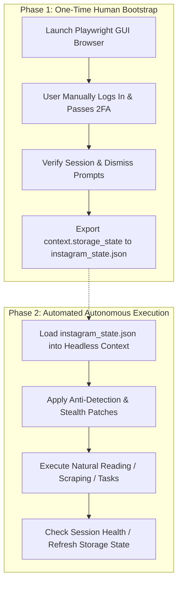

# Playwright Automation for Instagram: Engineering Best Practices

This document outlines architectural patterns, anti-detection techniques, session persistence mechanisms, and operational safety budgets for automating Instagram web interactions using [Playwright](https://playwright.dev/) under an existing, authenticated user profile.

---

## 1. Architectural Philosophy: The "Human-in-the-Loop Bootstrap"

Automating interactions on Meta platforms (Instagram, Facebook) with hardcoded credentials in headless scripts is an immediate anti-pattern. Meta's behavioral and risk analysis models instantaneously flag datacenter IPs, headless browser fingerprints, and automated credential submissions, triggering SMS/2FA checkpoint loops or account locks.

The canonical, sustainable architecture uses a **two-phase workflow**:



1. **Phase 1 (One-Time Human Bootstrap):** Launch a non-headless browser session. Log in manually, solve any 2FA/SMS/passkey challenges, handle "Save Login Info" prompts, and dump all authenticated cookies, tokens, and `localStorage` to a local session file (`instagram_state.json`).
2. **Phase 2 (Automated Execution):** Spin up Playwright instances in headless mode using `storage_state="instagram_state.json"`. The browser starts already authenticated as you, avoiding credential endpoints completely.

---

## 2. Session Management & Storage State Persistence

Playwright natively supports serializing and restoring the complete browser state (cookies, sessionStorage, and localStorage) via `BrowserContext.storage_state()`.

### 2.1 One-Time Bootstrap Script (`bootstrap_login.py`)

```python
"""One-time interactive login script to capture authenticated Instagram session state."""

import asyncio
from pathlib import Path
from playwright.async_api import async_playwright

STATE_FILE = Path("instagram_state.json")


async def bootstrap_instagram_session() -> None:
    async with async_playwright() as p:
        # Launch real Chromium in visible (non-headless) mode
        browser = await p.chromium.launch(
            headless=False,
            args=[
                "--disable-blink-features=AutomationControlled",
                "--start-maximized",
            ],
        )

        context = await browser.new_context(
            viewport=None,  # Inherit maximized window
            user_agent=(
                "Mozilla/5.0 (Windows NT 10.0; Win64; x64) "
                "AppleWebKit/537.36 (KHTML, like Gecko) "
                "Chrome/134.0.0.0 Safari/537.36"
            ),
            locale="en-US",
            timezone_id="Europe/Warsaw",
        )

        page = await context.new_page()
        await page.goto("https://www.instagram.com/", wait_until="networkidle")

        print("========================================================")
        print("ACTION REQUIRED:")
        print("1. Log in manually using your credentials and 2FA.")
        print("2. Navigate until you reach the main Instagram feed.")
        print("3. Return to this console and press ENTER to save session.")
        print("========================================================")

        # Wait for user confirmation in terminal after completing login
        await asyncio.to_thread(input, "Press ENTER after your feed has fully loaded...")

        # Save session cookies and storage
        await context.storage_state(path=str(STATE_FILE))
        print(f"[SUCCESS] Session state securely persisted to {STATE_FILE.resolve()}")

        await browser.close()


if __name__ == "__main__":
    asyncio.run(bootstrap_instagram_session())
```

### 2.2 Security of `instagram_state.json`
- `instagram_state.json` contains full session tokens (including `sessionid` and `csrftoken`).
- **CRITICAL:** Add `instagram_state.json` to `.gitignore` immediately.
- In production cloud deployments (e.g. Cloud Run, GCP VMs), store the file in **Google Secret Manager** or mount it from an encrypted, IAM-restricted private storage volume.

---

## 3. Anti-Detection & Fingerprint Defense

Instagram deploys sophisticated JavaScript fingerprinting scanners that inspect runtime browser objects. Default Playwright installations trigger several well-known red flags:

### 3.1 Primary Detection Vectors

| Signature | Default Playwright Value | Human Browser Expected Value | Evasion Technique |
| :--- | :--- | :--- | :--- |
| `navigator.webdriver` | `true` | `false` or `undefined` | Delete/override property in prototype chain |
| `navigator.plugins` | Empty list `[]` | Populated array with PDF viewer, etc. | Mock plugin prototypes |
| WebGL / Canvas | Generic SwiftShader / Gallium | Real GPU vendor (NVIDIA / Intel / Apple) | WebGL spoofing |
| Screen Dimensions | `800x600` default viewport | `1920x1080`, `2560x1440`, etc. | Specify realistic viewport and screen bounds |
| Missing Audio/Video Codecs | Basic AAC only | Full H.264, VP9, AV1, MP3 support | Use standard Google Chrome channel (`channel="chrome"`) |

### 3.2 Production Stealth Configuration

Install `playwright-stealth`:
```powershell
uv add playwright-stealth
```

Inject stealth scripts during context initialization:

```python
from playwright.async_api import Browser, BrowserContext
from playwright_stealth import stealth_async


async def create_stealth_context(browser: Browser, state_file: str) -> BrowserContext:
    context = await browser.new_context(
        storage_state=state_file,
        viewport={"width": 1920, "height": 1080},
        user_agent=(
            "Mozilla/5.0 (Windows NT 10.0; Win64; x64) "
            "AppleWebKit/537.36 (KHTML, like Gecko) "
            "Chrome/134.0.0.0 Safari/537.36"
        ),
        locale="en-US",
        timezone_id="Europe/Warsaw",
        device_scale_factor=1,
        has_touch=False,
        is_mobile=False,
    )

    # Apply stealth overrides to every page spawned in this context
    page = await context.new_page()
    await stealth_async(page)
    return context
```

---

## 4. Behavioral Humanization & Natural Interactions

Anti-bot machine learning models analyze behavioral biometric markers: click coordinates, time distributions, and scroll dynamics.

### 4.1 Non-Uniform Delays (Gaussian Jitter)
Never use fixed `asyncio.sleep(2.0)`. Humans operate with stochastic variance. Use randomized distributions:

```python
import asyncio
import random


async def human_delay(min_sec: float = 1.5, max_sec: float = 4.0) -> None:
    """Simulates realistic human pause between browsing actions."""
    delay = random.uniform(min_sec, max_sec)
    await asyncio.sleep(delay)
```

### 4.2 Natural Smooth Scrolling
Instant jumps (`window.scrollTo(0, 5000)`) trigger heuristic flags. Instead, scroll in small increments with variable pauses to simulate reading:

```python
async def human_scroll(page, steps: int = 5) -> None:
    """Scrolls down a page incrementally like a human scrolling a mouse wheel."""
    for _ in range(steps):
        scroll_amount = random.randint(300, 750)
        await page.mouse.wheel(0, scroll_amount)
        await human_delay(0.8, 2.2)
```

### 4.3 Coordinate-Based Element Interaction
Instead of instant DOM element invocation (`element.click()`), use Playwright's built-in pointer physics:
- Hover over the element first (`await element.hover()`).
- Add a brief natural micro-pause (`await asyncio.sleep(random.uniform(0.1, 0.3))`).
- Execute click at an offset near the center, not coordinate `(0, 0)`.

---

## 5. Rate Limits & Operational Safety Budgets

Instagram enforces account-level rate limits based on account age, trust score, and interaction history.

### 5.1 Safe Operating Thresholds (Per Account)

| Operation | Conservative Limit (Safe) | Moderate Limit | High Risk (Triggers Action Block) |
| :--- | :--- | :--- | :--- |
| **Profile / Feed Views** | 60 - 100 per hour | 150 - 250 per hour | > 400 per hour |
| **Post Likes** | 15 - 25 per hour | 40 - 50 per hour | > 80 per hour |
| **Comments** | 5 - 10 per hour | 15 - 25 per hour | > 40 per hour |
| **Follow / Unfollow** | 10 - 15 per hour | 25 - 35 per hour | > 60 per hour |
| **Direct Messages (DMs)** | 5 - 10 per hour | 15 - 20 per hour | > 30 per hour |

### 5.2 Network Egress Hygiene: Proxies
- **Datacenter IPs (AWS, GCP, DigitalOcean, Azure):** Instantly detected by Cloudflare and Meta edge servers. If running Playwright on Cloud Run or compute engines, routing through a **residential proxy** or **4G/5G mobile proxy** is mandatory.
- **Home/Office IP (Local Machine):** Naturally trusted by Meta. Running Playwright locally on your own Windows 11 machine via PowerShell has the lowest detection rate.

---

## 6. End-to-End Production Runner Example

```python
"""Production script running authenticated, stealthy Instagram automation."""

import asyncio
import logging
from pathlib import Path
from playwright.async_api import async_playwright
from playwright_stealth import stealth_async

logging.basicConfig(level=logging.INFO, format="%(asctime)s [%(levelname)s] %(message)s")
logger = logging.getLogger("insta_bot")

STATE_FILE = Path("instagram_state.json")


async def run_instagram_session() -> None:
    if not STATE_FILE.exists():
        logger.error("Session file %s not found! Run bootstrap_login.py first.", STATE_FILE)
        return

    async with async_playwright() as p:
        # Launch browser (can be headless=True once bootstrapped)
        browser = await p.chromium.launch(
            headless=True,
            args=["--disable-blink-features=AutomationControlled"],
        )

        context = await browser.new_context(
            storage_state=str(STATE_FILE),
            viewport={"width": 1920, "height": 1080},
            user_agent=(
                "Mozilla/5.0 (Windows NT 10.0; Win64; x64) "
                "AppleWebKit/537.36 (KHTML, like Gecko) "
                "Chrome/134.0.0.0 Safari/537.36"
            ),
        )

        page = await context.new_page()
        await stealth_async(page)

        logger.info("Navigating to Instagram...")
        await page.goto("https://www.instagram.com/", wait_until="domcontentloaded")
        await asyncio.sleep(3.0)

        # Verify whether session is active or checkpoint appeared
        current_url = page.url
        if "accounts/login" in current_url or "challenge" in current_url:
            logger.warning("Session expired or challenge triggered: %s", current_url)
            return

        logger.info("Successfully connected to authenticated feed as user.")

        # Simulate natural browsing: scroll through feed 3 times
        for step in range(1, 4):
            logger.info("Viewing feed batch %d/3...", step)
            await page.mouse.wheel(0, 600)
            await asyncio.sleep(2.5)

        # Update saved session state to keep cookies fresh
        await context.storage_state(path=str(STATE_FILE))
        logger.info("Session state refreshed successfully.")

        await browser.close()


if __name__ == "__main__":
    asyncio.run(run_instagram_session())
```

---

## 7. Operational Troubleshooting

| Symptom | Probable Cause | Action |
| :--- | :--- | :--- |
| **Redirected to `/accounts/login/`** | Expired session or invalid `storage_state`. | Re-run `bootstrap_login.py` to refresh tokens. |
| **Redirected to `/challenge/`** | IP reputation check or suspicious automation cadence. | Log in manually on the challenge page to approve device. Switch to residential/mobile IP. |
| **Action Blocked modal** | Exceeded hourly likes, follows, or comments threshold. | Immediately halt automation for 24–48 hours. Lower operating budgets by 50%. |
| **Blank White Screen in Headless** | Missing GPU hardware acceleration or canvas fingerprint blocker. | Add `--enable-webgl` and `--use-gl=angle` to Chromium launch args. |
