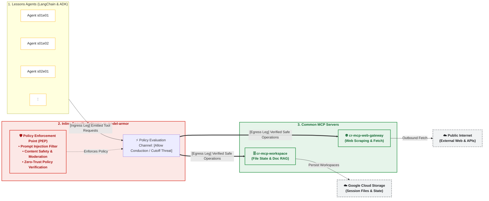

# Enterprise Multi-Agent & MCP Cloud Platform

[](https://www.aidevs.pl/)
[](https://www.python.org/)
[](https://cloud.google.com/)
[](https://cloud.google.com/vertex-ai/docs)
[](https://python.langchain.com/)
[](https://smith.langchain.com/)
[](https://github.com/jlowin/fastmcp)
[](https://www.terraform.io/)

A production-grade, enterprise-ready multi-agent AI ecosystem built for the [AI_Devs](https://www.aidevs.pl/) advanced AI engineering curriculum. The platform demonstrates zero-trust security governance, a dual-framework agent execution engine (LangChain + Google GenAI SDK / Google ADK on Vertex AI), remote tool invocation via the **Model Context Protocol (MCP)**, full-lifecycle LLM observability with **LangSmith**, and real-time analytical auditing in BigQuery.

---

## 🏛️ System Architecture

The ecosystem is engineered as a strictly decoupled, linear execution pipeline featuring a **Zero-Trust Policy Enforcement Point (PEP)** protecting downstream tool services:



---

### 🛡️ Zero-Trust Security Gateway & Mental Model

To guarantee end-to-end security governance between autonomous LLM reasoning and cloud execution, the platform implements an inline **Policy Enforcement Point (PEP)** aligned with NIST SP 800-207 Zero Trust standards.

> [!TIP]
> **🔌 Electronics Mental Model (FET Circuit Analogy):**  
> For engineers with a hardware or electronics background, this architecture mirrors a **Field-Effect Transistor (FET)**:
> - **Source ($S$)** $\rightarrow$ **Lessons Agents**: Generates and emits the flow of intent and raw tool calls.
> - **Gate ($G$)** $\rightarrow$ **Model Armor (`cr-model-armor`)**: Applied control potential that continuously inspects payloads; safe inputs open the channel for conduction, while prompt injection threats immediately cut off conduction.
> - **Drain ($D$)** $\rightarrow$ **Common MCP Servers**: The load destination where verified, safe operations execute and sink into cloud storage or external networks.

| Pipeline Stage | NIST / Enterprise Standard Role | Role & Conduction Logic |
| :--- | :--- | :--- |
| **Origin (Source)** | **Agent Reasoning Core** | Emits intent, reasoning chains, raw prompts, and desired tool invocations. |
| **Security Gate (PEP)** | **Inline LLM Security Proxy (`cr-model-armor`)** | Real-time security gatekeeper. Inspects payloads for prompt injections, data leakage, and malicious instructions. Grants execution access only when verified safe. |
| **Egress (Drain)** | **Standardized MCP Tool Execution Layer** | The shared execution layer where verified, safe calls drain into concrete backend operations (`cr-mcp-workspace`, `cr-mcp-web-gateway`). |

---

## 🚀 Core Architectural Pillars

### 1. Zero-Trust Security & Identity Governance
- **Google Cloud OIDC Service-to-Service IAM**: Direct Cloud Run service invocation authenticated via OIDC identity tokens, cached dynamically through custom HTTPX authentication handlers.
- **Role-Based Token Impersonation**: Fine-grained access using `roles/iam.serviceAccountTokenCreator` without persistent, static service account keys.
- **Model Armor Firewall**: Dedicated microservice (`cr-model-armor`) serving as an active defense layer against direct and indirect prompt injection attacks.
- **Zero Credential Hardcoding**: Strict isolation of secrets and external platform URLs using GCP Secret Manager in production and `.env` files locally.

### 2. Dual-Engine Agent Core
- **Interchangeable Runtime**: Standardized architecture supporting two state-of-the-art backends:
  - **LangChain 1.2.15**: Structured orchestration using `create_agent` with dynamic runtime MCP tool discovery via `langchain-mcp-adapters`.
  - **Google GenAI SDK / Vertex AI ADK**: High-performance, native SDK integration with Gemini 3 Flash Preview (`gemini-3-flash-preview` / `gemini-3.1-flash-lite-preview`).
- **Externalized Prompt Engineering**: System instructions managed in `system_prompt.md` files featuring YAML frontmatter for metadata, temperature, and region configuration.
- **Deterministic Temporal Context**: Dynamic `get_current_date()` tool calls preserve Vertex AI Prompt Context Caching rather than hardcoding timestamps in prompts.

### 3. Standardized Remote Tooling via MCP (FastMCP)
- **`cr-mcp-workspace`**: FastMCP 3.2.4 microservice deployed on Cloud Run:
  - **Filesystem Tools**: Atomic `read_file`, `write_file`, and `list_files` bound to isolated session workspaces.
  - **Document RAG & Chunking Tools**: Structural markdown intelligence (`list_markdown_sections`, `read_markdown_section`, `grep`, `head`, `tail`) preventing context window overflow.
- **`cr-mcp-web-gateway`**: FastMCP microservice providing secured outbound HTTP fetching and web interaction.
- **Contract-First API Design (AIP Standard)**: Strict Pydantic v2 schemas in `schemas.py` with mandatory `reasoning` in all tool inputs and `hint` fields in responses.

### 4. Lean Auditing & High-Throughput Observability
- **LangSmith Tracing & Evaluation**: Centralized agent trajectory inspection, token spend tracking, prompt version lineage, and evaluation runs via unified `LANGSMITH_PROJECT` integration.
- **End-to-End Distributed Tracing**: Mandatory propagation of the `X-Session-ID` HTTP header across clients, agents, Model Armor, and MCP services.
- **ELT Lean Logging**: Container services emit structured JSON directly to `stdout`. Google Cloud Logging Sinks pipe logs asynchronously to **BigQuery** (`audit` tables and analytical views), guaranteeing zero latency impact on agent response times.
- **Persistent Outcome Summary**: Agents record execution metrics, timestamps, and verification flags to `run_notes.txt` in their session workspace.

---

## 📁 Repository Structure

```text
af-aidevs/
├── cloud_run/                  # Centralized Cloud Run microservices
│   ├── cr-mcp-workspace/       # FastMCP filesystem & RAG service
│   ├── cr-mcp-web-gateway/     # FastMCP web interaction gateway
│   └── cr-model-armor/         # Prompt injection & safety inspection proxy
├── lessons/                    # Lesson tasks & agent implementations
│   ├── s01e01-.../             # Lesson-specific agent workspaces
│   ├── s01e02-.../
│   ├── s01e05-.../             # cr-s01e05-agent implementation
│   └── s02e02-.../             # RAG & external document context
├── python_packages/            # Shared internal Python packages
│   └── af_aidevs/              # Published to Google Artifact Registry (GAR)
│       ├── model_armor.py      # Client wrapper for Model Armor
│       └── utils/              # Lean BigQuery audit streaming & prompt loaders
├── terraform/                  # Centralized Infrastructure as Code (GCP Provider ~> 7.0)
│   ├── modules/                # GCS, Cloud Run, GCF, BigQuery, IAM, Pub/Sub
│   ├── bq-schemas/             # BigQuery schema definitions
│   ├── main.tf                 # Core infrastructure orchestration
│   └── variables.tf            # Centralized infrastructure variables & configuration
└── README.md                   # Platform documentation
```

---

## 🛠️ Development & Environment Setup

### Prerequisites
- **Python**: `== 3.13.5` managed via [`uv`](https://github.com/astral-sh/uv)
- **Google Cloud SDK (`gcloud`)**: Authenticated with appropriate IAM permissions
- **Terraform**: `~> 1.5+` with Google Provider `~> 7.0`

### Local Private Package Setup
To resolve dependencies from the private Artifact Registry repository:
```powershell
# Authenticate uv with Google Artifact Registry
$env:UV_INDEX_GAR_USERNAME="oauth2accesstoken"
$env:UV_INDEX_GAR_PASSWORD=$(gcloud auth print-access-token)

# Sync environment dependencies
uv sync
```

---

## 👨‍💻 Author

**Artur Fejklowicz**
- Data Engineer at AXA Switzerland
- Google Cloud Certified Professional Data Engineer
- Google Cloud Certified Professional Machine Learning Engineer
- [LinkedIn Profile](https://www.linkedin.com/in/arturr/) | [Medium Publications](https://medium.com/@artur.fejklowicz)

