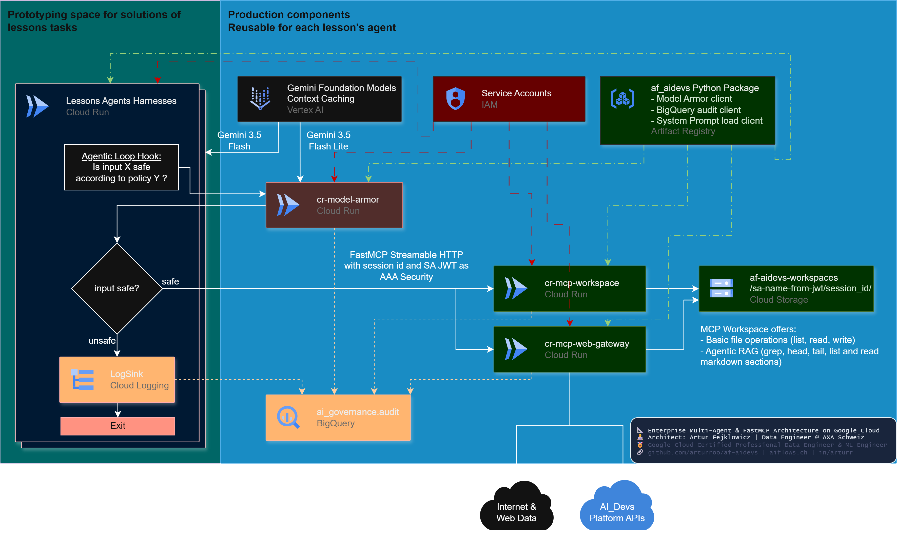
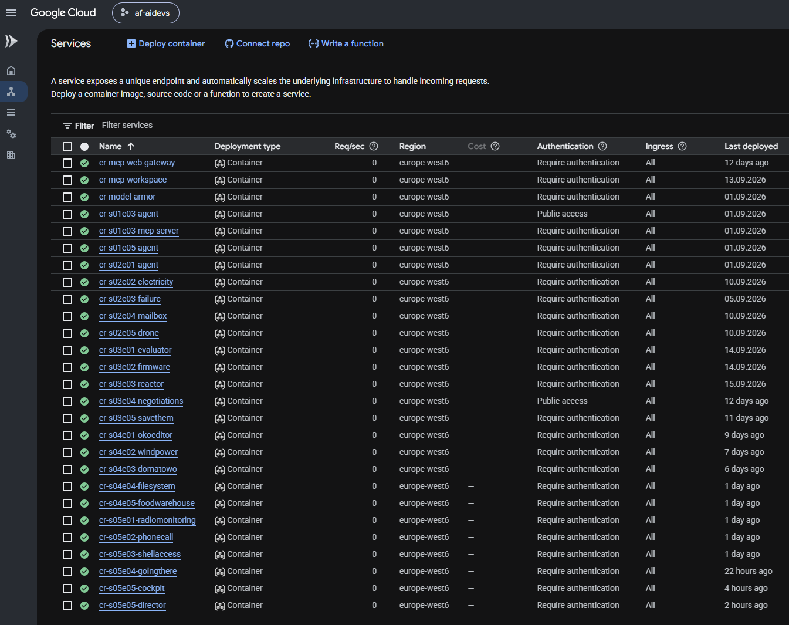
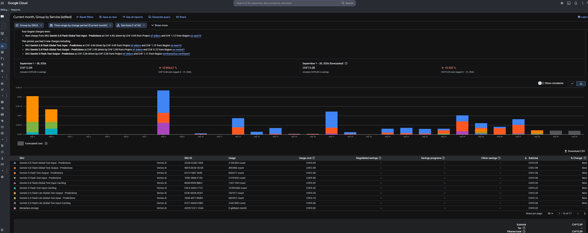
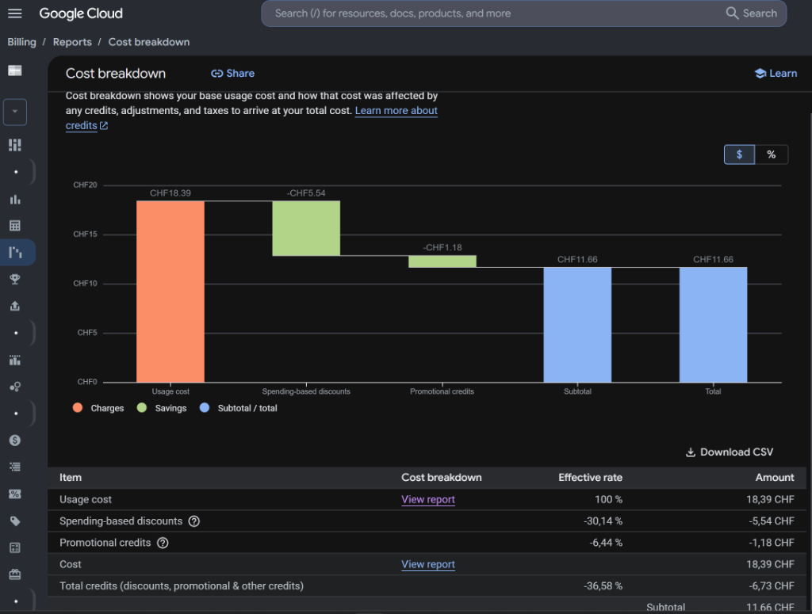

# Enterprise Multi-Agent & MCP Cloud Platform

[](https://www.aidevs.pl/)
[](https://www.python.org/)
[](https://cloud.google.com/)
[](https://cloud.google.com/vertex-ai/docs)
[](https://python.langchain.com/)
[](https://smith.langchain.com/)
[](https://github.com/jlowin/fastmcp)
[](https://www.terraform.io/)

A production-grade, enterprise-ready multi-agent AI ecosystem built for the [AI_Devs](https://www.aidevs.pl/) advanced AI engineering curriculum. The platform demonstrates zero-trust security governance, a dual-framework agent execution engine (LangChain + Google GenAI SDK / Google ADK on Vertex AI), remote tool invocation via the **Model Context Protocol (MCP)**, full-lifecycle LLM observability with **LangSmith**, and real-time analytical auditing in BigQuery.

---

## 🏛️ System Architecture



---

### 🛡️ The Model Armor "Gate" Logic

The security architecture operates as an active **runtime gate** controlling agent-tool interactions:

> [!TIP]
> **🔌 Electronics Mental Model (FET Gate Control):**  
> Just like the **Gate ($G$)** in a Field-Effect Transistor controls whether current can conduct between **Source ($S$)** and **Drain ($D$)**:
> - **Source ($S$)** $\rightarrow$ **`cr-s02e01-agent`**: Emits raw thoughts and requested tool calls.
> - **Gate ($G$)** $\rightarrow$ **`cr-model-armor`**: Measures threat potential. If `is_safe == True`, it applies positive potential to allow execution. If malicious prompt injection is detected, it cuts off the channel immediately.
> - **Drain ($D$)** $\rightarrow$ **MCP Servers (`cr-mcp-workspace`, `cr-mcp-web-gateway`)**: Target load executing only verified, safe operations into Google Cloud Storage and external networks.

| Pipeline Stage | Component | Enterprise Architecture Role |
| :--- | :--- | :--- |
| **Origin (Source)** | **`cr-s02e01-agent`** | Orchestrates reasoning, evaluates context, and formulates candidate tool invocations. |
| **Security Gate (PEP)** | **`cr-model-armor`** | Evaluates payloads before execution. Emits a binary decision (`safe` vs. `unsafe`) controlling agent execution branches. |
| **Egress (Drain)** | **Common MCP Servers** | Deployed FastMCP services executing authorized filesystem, RAG, and web actions. |

---

## 🌐 Production Fleet: 26 Serverless Microservices on GCP

All agent workloads, tooling gateways, and security filters are containerized using `python:3.13.5-slim`, provisioned via Terraform, and deployed as serverless microservices to **Google Cloud Run** in the **`europe-west6` (Zurich)** region. 



### Fleet Overview & Architectural Roles

| Category | Microservices | Architecture Role & Capabilities |
| :--- | :--- | :--- |
| **Core MCP & Security Gateways** | `cr-mcp-workspace`<br>`cr-mcp-web-gateway`<br>`cr-model-armor` | Central FastMCP server for session-isolated GCS file operations and document RAG; outbound HTTP proxy gateway; active prompt-injection firewall (PEP). |
| **Season 1: Foundation & Interaction** | `cr-s01e03-agent`<br>`cr-s01e03-mcp-server`<br>`cr-s01e05-agent` | Calibration and data validation agents; local MCP server integration; production agent interaction pipelines. |
| **Season 2: Tools, Autonomy & Routing** | `cr-s02e01-agent`<br>`cr-s02e02-electricity`<br>`cr-s02e03-failure`<br>`cr-s02e04-mailbox`<br>`cr-s02e05-drone` | Zero-trust Model Armor orchestration; spatial power grid reasoning; automated fault diagnosis; multimodal mailbox and audio analysis; autonomous grid routing. |
| **Season 3: Evaluation & Active Feedback** | `cr-s03e01-evaluator`<br>`cr-s03e02-firmware`<br>`cr-s03e03-reactor`<br>`cr-s03e04-negotiations`<br>`cr-s03e05-savethem` | Automated dataset evaluation & calibration; binary firmware verification; closed-loop reactor thermal control; multi-party protocol negotiation; autonomous rescue graph search. |
| **Season 4: Multimodal & Dynamic RAG** | `cr-s04e01-okoeditor`<br>`cr-s04e02-windpower`<br>`cr-s04e03-domatowo`<br>`cr-s04e04-filesystem`<br>`cr-s04e05-foodwarehouse` | Image OCR & coordinate reasoning; spatial wind farm optimization; vector & graph-based corporate knowledge base; filesystem structure traversal; complex supply chain logistics. |
| **Season 5: Distributed Multi-Agent Systems** | `cr-s05e01-radiomonitoring`<br>`cr-s05e02-phonecall`<br>`cr-s05e03-shellaccess`<br>`cr-s05e04-goingthere`<br>`cr-s05e05-cockpit`<br>`cr-s05e05-director` | Multi-channel radio signal synthesis; conversational audio stream intelligence; autonomous reverse engineering & shell actuation; trajectory pathfinding; headless browser cockpit & multi-agent director orchestration. |

> [!NOTE]
> **Zero Idle Compute Overhead:** Every microservice is configured with `min-instances = 0` and auto-scaling to absorb spikes without incurring persistent compute charges during idle periods.

---

## 💰 Enterprise FinOps & Token Economics Benchmark

A cornerstone of modern AI engineering is building robust, high-performance systems while enforcing strict **financial predictability (FinOps)**. Across the entire 5-season curriculum—spanning dozens of complex autonomous loops, multimodal analysis, high-concurrency tool calls, and automated evaluation—the entire platform operated on Google Cloud for a net monthly cost of **CHF 11.66** (~$13.50 USD).

<div align="center">


*Figure: Vertex AI Gemini consumption by SKU, demonstrating large-scale Prompt Context Caching utilization.*


*Figure: GCP Billing Cost Breakdown waterfall showing base usage cost, spending-based discounts (-30.14%), and net total.*

</div>

### 📊 Real-World Cost Breakdown (GCP Billing)

| Metric | Amount (CHF) | Effective Rate | Architectural Note |
| :--- | :--- | :--- | :--- |
| **Gross Usage Cost** | **CHF 18.39** | 100.00% | Total unadjusted consumption across all Vertex AI models, storage, and networking. |
| **Spending-Based Discounts** | **-CHF 5.54** | -30.14% | Sustained and tiered cloud platform usage discounts. |
| **Promotional Credits** | **-CHF 1.18** | -6.44% | Additional cloud credits applied to API usage. |
| **Net Out-of-Pocket Spend** | **CHF 11.66** | **36.58% Total Savings** | **Net final cost for the entire end-to-end multi-agent platform.** |

### ⚡ The Power of Prompt Context Caching (20.6M+ Cached Tokens)

By structuring agent system prompts, OpenAPI schemas, and immutable operational context to leverage **Vertex AI Prompt Context Caching**, the platform avoided redundant token processing across agent reflection turns.

In the billing records, cached input tokens are billed under dedicated `Text Input Caching` SKUs at an approximate **75%–80% discount** compared to standard input token prediction:

| Vertex AI Model SKU | Cached Tokens (Count) | Actual Cost (With Cache) | Standard Input Cost (Estimated) | FinOps Savings |
| :--- | :--- | :--- | :--- | :--- |
| **`Gemini 3.8 Flash Text Input Caching`** | 7,627,199 | CHF 0.92 | ~CHF 9.15 | **~CHF 8.23** |
| **`Gemini 3 Flash Text Input Caching`** | 10,393,660 | CHF 0.42 | ~CHF 4.16 | **~CHF 3.74** |
| **`Gemini 3.5 Flash Lite Text Input Caching`** | 2,642,900 | CHF 0.06 | ~CHF 0.63 | **~CHF 0.57** |
| **TOTAL** | **20,663,759** | **CHF 1.40** | **~CHF 13.94** | **~CHF 12.54 (~90% Cache Savings)** |

> [!TIP]
> **Key Architectural Takeaways:**
> 1. **Prompt Context Caching as a First-Class Citizen:** Dynamic temporal context (`get_current_date()`) is exposed via tools rather than injected into system prompts, maintaining frozen prompt prefixes and maximizing cache hit rates.
> 2. **Cognitive Tiering / Right-Sizing:** Heavy multi-step trajectory planning is delegated to **Gemini 3.8 Flash**, while high-frequency parsing and tool parameter transformation are offloaded to **Gemini 3.5 Flash Lite**.
> 3. **Serverless Scale-to-Zero (`min-instances = 0`):** 26 microservices hosted on Cloud Run incurred $0.00 idle compute charges throughout the development lifecycle.

---

## 🚀 Core Architectural Pillars

### 1. Zero-Trust Security & Identity Governance
- **Pre-Flight Agent Readiness & Security Checklist**: Strict pre-deployment governance framework ([agent-readiness-checklist.md](docs/af-aidevs/patterns/agent-readiness-checklist.md)) enforcing threat modeling (*Blast Radius*), reversibility / disaster recovery, auditing, GDPR/AI Act compliance, and least-privilege scoping.
- **Google Cloud OIDC Service-to-Service IAM**: Direct Cloud Run service invocation authenticated via OIDC identity tokens, cached dynamically through custom HTTPX authentication handlers.
- **Role-Based Token Impersonation**: Fine-grained access using `roles/iam.serviceAccountTokenCreator` without persistent, static service account keys.
- **Model Armor Firewall**: Dedicated microservice (`cr-model-armor`) serving as an active defense layer against direct and indirect prompt injection attacks.
- **Zero Credential Hardcoding**: Strict isolation of secrets and external platform URLs using GCP Secret Manager in production and `.env` files locally.

### 2. Dual-Engine Agent Core
- **Interchangeable Runtime**: Standardized architecture supporting two state-of-the-art backends:
  - **LangChain 1.2.15**: Structured orchestration using `create_agent` with dynamic runtime MCP tool discovery via `langchain-mcp-adapters`.
  - **Google GenAI SDK / Vertex AI ADK**: High-performance, native SDK integration with Gemini 3.8 Flash and Gemini 3.5 Flash Lite (`gemini-3.8-flash`, `gemini-3.5-flash-lite`, `gemini-3-flash-preview`).
- **Externalized Prompt Engineering**: System instructions managed in `system_prompt.md` files featuring YAML frontmatter for metadata, temperature, and region configuration.
- **Deterministic Temporal Context**: Dynamic `get_current_date()` tool calls preserve Vertex AI Prompt Context Caching rather than hardcoding timestamps in prompts.

### 3. Standardized Remote Tooling via MCP (FastMCP)
- **`cr-mcp-workspace`**: FastMCP 3.2.4 microservice deployed on Cloud Run:
  - **Filesystem Tools**: Atomic `read_file`, `write_file`, and `list_files` bound to isolated session workspaces.
  - **Document RAG & Chunking Tools**: Structural markdown intelligence (`list_markdown_sections`, `read_markdown_section`, `grep`, `head`, `tail`) preventing context window overflow.
- **`cr-mcp-web-gateway`**: FastMCP microservice providing secured outbound HTTP fetching and web interaction.
- **Contract-First API Design (AIP Standard)**: Strict Pydantic v2 schemas in `schemas.py` with mandatory `reasoning` in all tool inputs and `hint` fields in responses.

### 4. Lean Auditing & High-Throughput Observability
- **LangSmith Tracing & Evaluation**: Centralized agent trajectory inspection, token spend tracking, prompt version lineage, and evaluation runs via unified `LANGSMITH_PROJECT` integration.
- **End-to-End Distributed Tracing**: Mandatory propagation of the `X-Session-ID` HTTP header across clients, agents, Model Armor, and MCP services.
- **ELT Lean Logging**: Container services emit structured JSON directly to `stdout`. Google Cloud Logging Sinks pipe logs asynchronously to **BigQuery** (`audit` tables and analytical views), guaranteeing zero latency impact on agent response times.
- **Persistent Outcome Summary**: Agents record execution metrics, timestamps, and verification flags to `run_notes.txt` in their session workspace.

---

## 🏆 Full Curriculum Journey Recap (S01–S05)

| Season | Focus Area | Architectural Milestones & Key Implementations |
| :--- | :--- | :--- |
| **Season 1** | **Foundations & Tool Integration** | Basic prompt engineering, validation pipelines, automated calibration, and remote MCP tool servers. |
| **Season 2** | **Autonomous Operations & Security** | Model Armor prompt injection firewalls, autonomous grid reasoning, spatial pathfinding, and multimodal audio/visual analysis. |
| **Season 3** | **Evaluation & Closed-Loop Control** | Systematic LLM-as-a-Judge evaluation, binary firmware validation, real-time reactor PID-like temperature feedback, and multi-agent negotiation protocols. |
| **Season 4** | **Multimodal Systems & Enterprise RAG** | Vector embeddings, structural document chunking, graph-based knowledge traversal, image coordinate OCR reasoning, and supply chain dispatchers. |
| **Season 5** | **Distributed Multi-Agent Ecosystems** | Multi-channel radio spectrum decoders, speech-to-text intelligence, shell reverse engineering, mathematical trajectory planners, and browser actuator cockpits with autonomous directors. |

---

## 📁 Repository Structure

```text
af-aidevs/
├── cloud_run/                  # Centralized shared microservices
│   ├── cr-mcp-workspace/       # FastMCP session-isolated filesystem & RAG
│   ├── cr-mcp-web-gateway/     # FastMCP secured web interaction gateway
│   └── cr-model-armor/         # Active prompt injection firewall proxy
├── docs/                       # Architecture diagrams, patterns & FinOps assets
│   └── af-aidevs/              # Schematics, production screenshots & benchmarks
│       └── patterns/           # Agent readiness checklist & design patterns
├── lessons/                    # Microservices implementing curriculum tasks (S01–S05)
│   ├── s01e01-.../             # Season 1: Foundations & interaction
│   │   └── ...
│   ├── s02e01-.../             # Season 2: Tooling, Model Armor & autonomy
│   │   └── ...
│   ├── s03e01-.../             # Season 3: Evaluation, feedback loops & negotiation
│   │   └── ...
│   ├── s04e01-.../             # Season 4: Multimodal RAG & knowledge graphs
│   │   └── ...
│   └── s05e01-.../             # Season 5: Distributed multi-agent systems
│       └── s05e05-nowa-rzeczywistosc/
├── python_packages/            # Shared internal Python packages
│   └── af_aidevs/              # Published to Google Artifact Registry (GAR)
│       ├── model_armor.py      # Client wrapper for Model Armor
│       └── utils/              # Lean BigQuery audit streaming & prompt loaders
├── terraform/                  # Centralized Infrastructure as Code (GCP Provider ~> 7.0)
│   ├── modules/                # GCS, Cloud Run, BigQuery, IAM, Pub/Sub
│   ├── bq-schemas/             # BigQuery schema definitions
│   ├── main.tf                 # Core infrastructure orchestration
│   └── variables.tf            # Service declarations & environment configuration
└── README.md                   # Platform documentation & FinOps showcase
```

---

## 🛠️ Development & Environment Setup

### Prerequisites
- **Python**: `== 3.13.5` managed via [`uv`](https://github.com/astral-sh/uv)
- **Google Cloud SDK (`gcloud`)**: Authenticated with appropriate IAM permissions
- **Terraform**: `~> 1.5+` with Google Provider `~> 7.0`

### Local Private Package Setup
To resolve dependencies from the private Artifact Registry repository:
```powershell
# Authenticate uv with Google Artifact Registry
$env:UV_INDEX_GAR_USERNAME="oauth2accesstoken"
$env:UV_INDEX_GAR_PASSWORD=$(gcloud auth print-access-token)

# Sync environment dependencies
uv sync
```

---

## 👨‍💻 Author

**Artur Fejklowicz**
- Data Engineer at AXA Switzerland
- Google Cloud Certified Professional Data Engineer
- Google Cloud Certified Professional Machine Learning Engineer
- [LinkedIn Profile](https://www.linkedin.com/in/arturr/) | [Medium Publications](https://medium.com/@artur.fejklowicz)
