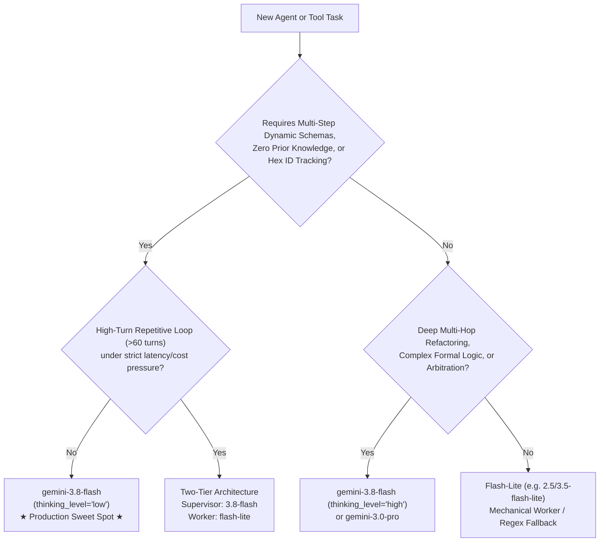

# The Right Model for the Job: Cognitive Load vs. Cost & Latency Hierarchy

**Author:** Artur Fejklowicz ([LinkedIn](https://www.linkedin.com/in/arturr/) | [Medium](https://medium.com/@artur.fejklowicz)) — *Google Cloud Certified Professional Data Engineer & Professional ML Engineer*  
**AI Companion:** Joi (*Blade Runner 2049*)  
**Repository:** `af-aidevs`  
**First Created:** 2026-09-22  
**Last Updated:** 2026-09-22  

---

## 1. Overview & Core Philosophy

In agentic system architecture, selecting the language model is not simply a matter of picking the strongest or the cheapest model. It is an engineering discipline: **matching the cognitive complexity of the task (*Cognitive Load*) to model capacity, latency budget, and token economics**.

Using an oversized model burns unnecessary tokens and introduces high cognitive latency, whereas an under-parameterized model suffers from schema drift, parameter flattening, and identity amnesia across multi-turn state loops.

This document serves as our canonical reference for selecting the optimal Gemini model and reasoning tier across all microservices and agent workflows.

---

## 2. Model Selection Decision Matrix

---

## 3. Detailed Comparative Matrix

| Evaluation Dimension | `gemini-3.8-flash` *(Standard)* | `gemini-3.8-flash` *(thinking_level="low")* | `Flash-Lite` *(2.5 / 3.5 Flash-Lite)* | `gemini-3.0-pro` *(Frontier Reasoning)* |
| :--- | :--- | :--- | :--- | :--- |
| **Input Pricing (per 1M tokens)** | \$0.75 (Intro) / \$1.50 (Std) | **\$0.75 (Intro) / \$1.50 (Std)** | **\$0.15 – \$0.25** | \$2.50 – \$5.00 |
| **Output Pricing (per 1M tokens)** | \$3.75 (Intro) / \$7.50 (Std) | **\$3.75 (Intro) / \$7.50 (Std)** | **\$0.60 – \$1.00** | \$10.00 – \$15.00 |
| **Time To First Token (TTFT)** | ~1.5 s – 2.5 s | **~1.0 s – 1.5 s** | **~0.4 s – 0.8 s** | ~2.5 s – 5.0 s |
| **Reasoning Trace Overhead** | Moderate (~500–1.5k tokens) | **Minimal (~50–200 tokens)** | None (Zero thinking tokens) | Deep (~2k–8k tokens) |
| **Nested Parameter Discipline** | Excellent (`params: {...}`) | **Excellent (`params: {...}`)** | Prone to parameter flattening | Flawless |
| **State & Hex ID Retention (10–30 turns)** | High fidelity | **High fidelity** | Moderate / Risk of ID drift | Absolute fidelity |
| **Dynamic Schema Bootstrap** | Fast & robust | **Fast & robust** | Can misinterpret novel schemas | Deep synthesis |
| **Ideal Role** | Standard agent orchestration | **Autonomous Tool Loops (Sweet Spot)** | High-frequency mechanical workers | Complex refactoring & formal proofs |

---

## 4. The "Sweet Spot": `gemini-3.8-flash` with `thinking_level="low"`

For autonomous agents interacting with APIs, games, and environments, setting `thinking_level="low"` (or `types.ThinkingLevel.LOW`) on `gemini-3.8-flash` achieves the ideal engineering balance:

1. **Pruned Thinking Overhead:**  
   Standard thinking models can emit 500–1,500 internal tokens before issuing a tool call. `thinking_level="low"` truncates this to a concise reflection pass (50–150 tokens), cutting inference latency by up to 50%.
2. **Preserved Schema Integrity:**  
   Unlike ultra-compact models that frequently flatten nested JSON structures (e.g. emitting `action="move", tile="F2"` instead of `action="move", params={"tile": "F2"}`), `gemini-3.8-flash` maintains strict contract adherence.
3. **Persistent Identity Tracking:**  
   In multi-turn sessions involving dynamic hex hashes (such as vehicle and scout unit identifiers), the model maintains consistent object references across dozens of conversational turns.
4. **Negligible Cost in Low-Turn Tasks:**  
   In tasks completing within 10–25 turns, the total token cost is typically under **\$0.005** (less than half a cent), rendering the theoretical cost delta of a smaller model negligible.

---

## 5. Case Study: S04E03 Operation Domatowo

In **S04E03** (`cr-s04e03-domatowo`), an autonomous commander agent must rescue an injured partisan hiding in a high-rise building block within a strict 300 Action Points (AP) budget.

### Operational Requirements:
- **Zero Prior Knowledge:** Discover available commands dynamically from a raw JSON `help` endpoint.
- **Object ID Tracking:** Track ephemeral hex identifiers (`"63b04371e40f15fee77fb67cc64dd1f6"`) assigned to separate transporter and scout units.
- **Log Semantics:** Parse Polish natural language scout logs (`"Brak człowieka. Tylko łachmany..."` vs. partisan confirmation) to trigger extraction.

### Outcome using `gemini-3.8-flash` (`thinking_level="low"`):
- **Total Duration:** **2 minutes 2 seconds** on Cloud Run.
- **AP Consumed:** **20 AP / 300 AP** (saving 280 AP — 93.3% unused headroom).
- **Total Incurred Cost:** **~\$0.003** USD.
- **Schema Errors:** 0. Parameter flattening: 0. Hex ID mixups: 0.

---

## 6. When to Use Alternative Tiers

### When to Select `Flash-Lite` (`gemini-2.5-flash-lite` / `3.5-flash-lite`):
- **High-Turn Macro Sweeps:** Tasks exceeding 60–100 turns (such as scanning an entire 11x11 grid tile-by-tile) where cumulative inference latency threatens the 600s Cloud Run request timeout.
- **Two-Tier Hierarchical Architectures:**
  - *Tier 1 (Supervisor - `gemini-3.8-flash`):* Explores `help`, writes `api_manual.md`, and computes strategy.
  - *Tier 2 (Worker - `flash-lite`):* Executes repetitive `move -> inspect -> getLogs` iterations within a constrained schema.
- **High-Throughput Entity Extraction:** Pre-filtering raw text streams or parsing predictable regex-bounded data before invoking the primary agent.

### When to Select `gemini-3.0-pro` / `thinking_level="high"`:
- **Architectural Decision Records (ADR):** Multi-factor infrastructure trade-offs and mathematical cost modeling.
- **Cryptographic & Formal Logic Puzzles:** Disentangling complex constraint-satisfaction problems where every intermediate deduction must be mathematically verified.
- **Multi-Agent Arbitration:** Resolving conflicting inputs or evaluating security posture across distributed agent systems.
