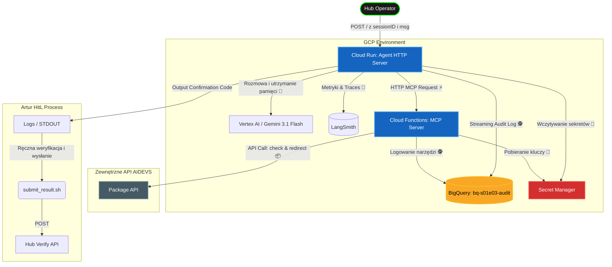

# Product Requirements Document (PRD): S01E03 - Projektowanie API dla efektywnej pracy z modelem

## 1. Cel Misji i Architektury (Mission Goal)
Zbudowanie publicznie dostępnego endpointu HTTP na usługach Google Cloud Run obsługującego wiadomości od operatora logistycznego. Agent AI musi inteligentnie przekierować paczkę z elementami reaktora z wykorzystaniem zewnętrznego serwera narzędzi (MCP), prowadząc z operatorem płynną rozmowę. System musi implementować dobre praktyki monitoringu (BigQuery), zarządzania kluczami (Google Secret Manager) oraz audytowalności działań AI (HitL).

---

## 2. Architektura (Architecture)

Poniżej znajduje się diagram opisujący naszą rozproszoną architekturę. Aplikacja agenta zostanie odizolowana od narzędzi (MCP) zgodnie z najlepszymi praktykami z lekcji.

---

## 3. Komponenty Techniczne (Technical Components)

### 3.1 Zarządzanie Sesją w Cloud Run (KISS Approach)
Usługa HTTP na Cloud Run będzie zarządzać tożsamością każdego operatora używając zmiennej `sessionID` podawanej w payloadzie.
- **Problem Cloud Run**: Skalowanie instancji `> 1` sprawia, że część żądań ląduje na innych serwerach, które nie współdzielą pamięci węzła, uszkadzając tym samym pamięć rozmów LangChain (Memory).
- **Rozwiązanie (KISS)**: Aby zachować prostotę bez korzystania z instancji Firestore lub bazy Redis, uruchomimy usługę Cloud Run z ostrym **`max-instances=1`**. To zagwarantuje, że ten sam obraz w pamięci Python obsłuży wszystkie następujące po sobie wiadomości. Użyjemy wbudowanego w Python stacjonarnego słownika `sessions = {}`.

### 3.2 Oprogramowanie Agent-Server (Cloud Run)
Główna logika aplikacji przyjmująca zapytania REST. 
- Aplikacja **FastAPI** lub zwykły serwer uvicorn.
- **Implementacja dwóch bibliotek (Framework Switch):**
  - **LangChain:** Domyślny backend spinający konwersację; automatycznie strumieniujący trace'y do LangSmith. Obsługuje pętlę agenta (LangSmith agent loop) - pozwoli na przypomnienie i prześledzenie pełnego obiegu akcji i obserwacji agenta.
  - **ADK (Vertex AI SDK / Google GenAI SDK):** Zastosowanie profesjonalnego standardu Google. Implementacja musi wykorzystywać dostępne "out of the box" mechanizmy observability i monitoringu (np. natywne integracje z Google Cloud Logging, Cloud Monitoring, Vertex AI Tracing), aby umożliwić rzetelne porównanie z możliwościami LangSmith.
  - Oczekuje się zaimplementowania logiki, w której backend używany do obsługi wiadomości może być przełączony flagą `--backend langchain|adk`.

### 3.3 Serwer MCP (Cloud Functions)
Wyizolowany serwer narzędzi wdrażany jako usługa z wejściem publicznym (z ograniczonym dostępem do IAM/Token). Wykorzysta bibliotekę `fastmcp`.
Zarejestruje procedury:
- `check_package(packageid: str)`
- `redirect_package(packageid: str, destination: str, code: str)` - Zwraca sekretny "Confirmation".

### 3.4 Monitoring Bezpieczeństwa (Security & Audit Trail)
Aby wdrożyć praktyki Blast Radius i Disaster Recovery opisywane na kursie:
- Wszystkie wejścia, decyzje o użyciu narzędzi oraz modyfikacje stanu wysyłane są strumieniowo przez klienta `google-cloud-bigquery` do utworzonej instancji tabeli: `bq-s01e03-audit`.
- Próby oszustwa przez agenta będą jasno wylistowane w tej tabeli, a także będzie można je przejrzeć bez wpływania bezpośrednio na przepływ klienta.

### 3.5 Sekret Manager i Menedżer Danych (Secret Manager)
Wszystkie konfiguracje poufne usunięto z plików. Artur musi stworzyć następujące sekrety w GCP (w UI lub gcloud):
- `secret-s01e03-aidevs-apikey` - Klucz `AIDEVS_API_KEY` do działania z zewnętrznym API. Pozostałe URL (np. `AIDEVS_API_VERIFY`) będą ładowane ze zmiennych środowiskowych.
- `secret-s01e03-langsmith-apikey` - Twój API Key do platformy LangChain (jeśli LangSmith ma być używany).
- Ewentualny klucz OpenAI, jeśli zdecydujesz się na testowe proxy modelowe, natomiast zostajemy domyślnie przy wbudowanym autoryzowaniu ADC (Vertex AI Gemini).

### 3.6 Weryfikator Końcowy (HitL - Human in the Loop)
Agent nie wyśle automatycznie gotowego skryptu do endpointu weryfikacyjnego (zdefiniowanego w `AIDEVS_API_VERIFY`). 
Po wygenerowaniu kodu `Confirmation`:
1. Agent wyrzuci go widocznie do flagowanego `STDOUT`/Logs.
2. Zastosujemy prosty i bezpośredni skrypt bash `submit_result.sh`, w którym Artur potwierdza i triggeruje proces cURL na serwery walidacyjne.

---

## 4. Plan Plików w Katalogu Task 📂 / Boilerplate

W folderze `lessons\s01e03-projektowanie-api-dla-efektywnej-pracy-z-modelem\task\` powstaną następujące pliki tworzące strukturalny **boilerplate do eksperymentowania i nauki**:

> [!IMPORTANT]
> **Deployment odbywa się wyłącznie przez Terraform.** Cloud Run (`cr-s01e03-agent`) i Cloud Functions (`cf-s01e03-mcp`) konfigurowane są przez zmienne `cr_names` i `cf_names` w `/terraform/variables.tf`. Brak ręcznych skryptów `gcloud`.

| Plik                      | Opis                         |
|---------------------------|------------------------------|
| `pyproject.toml`          | Plik zależności UV (uv only). Będzie zawierał pakiety dla LangChain oraz dla ADK/Vertex AI. |
| `main.py`                 | Usługa Cloud Run. Musi zawierać przełącznik `--backend` i przygotowaną strukturę metod pod LangChain (z podpiętym LangSmith) oraz pod ADK (z profesjonalnym monitoringiem Google Cloud "out of the box"). |
| `agent_langchain.py`      | Boilerplate pętli agenta w LangChain, aby można było łatwo połączyć to z LangSmith i prześledzić agent loop. |
| `agent_adk.py`            | Boilerplate dla Agenta z wykorzystaniem ADK, z zachowaniem standardów monitorowania w logach i traces. |
| `main_mcp.py`             | Osobna aplikacja FastMCP gotowa pod wdrażanie jako usługa na Cloud Functions lub Cloud Run. Musi zawierać `main()`. |
| `system_message.md`       | Konfiguracja modelu (Frontmatter) oraz szczegółowa instrukcja systemowa dla agenta logistycznego. Popraw jesli trzeba. |
| `submit_result.sh`        | Ręczny trigger wysyłający kod ukończenia na serwery walidacyjne (HitL). |

**Główne cele edukacyjne podczas pracy z boilerplate:**
1. Przyswojenie materiału z lekcji poprzez uzupełnianie brakujących logik biznesowych aplikacji.
2. Poznanie podstaw biblioteki ADK z ekosystemu Google.
3. Rzeczywiste porównanie na dashboardach rozwiązań obserwowalności i monitoringu oferowanych przez ADK vs LangSmith.
4. Utrwalenie działania pętli decyzyjnej agenta LangChain i jej wizualizacji w LangSmith.

*Wszystkie polecenia `npm` nie mają tu zastosowania.*
