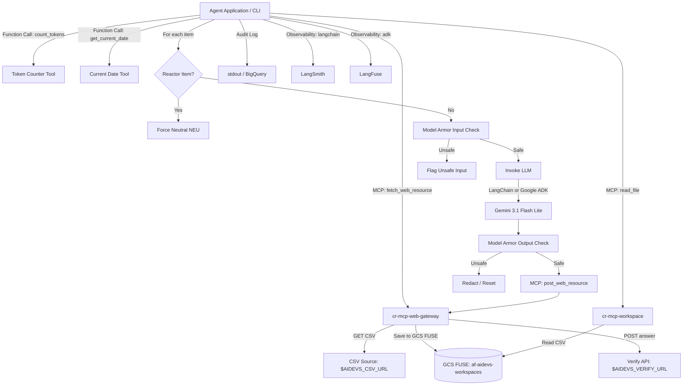

<!-- Source: https://www.industrialempathy.com/posts/design-docs-at-google/ -->
<!-- Based on: Google Design Docs structure by Malte Ubl -->
<!-- Adapted as a Technical PRD for AI-assisted implementation workflows -->

---
status: "approved"
date: 2026-07-06
author: Joi
reviewers: [Artur]
adr: [ADR.md](file:///c:/Users/admin/git/arturroo/af-aidevs/lessons/s02e01-zarz%C4%85dzanie-kontekstem-w-konwersacji/task/ADR.md)
---

# Categorization Agent with MCP Ecosystem Integration (Web Gateway & Agentic RAG)

## Context and Scope

The project requires building a categorization agent for the `categorize` task. We need to fetch a list of 10 items from a dynamic CSV file, classify each item as Dangerous (`DNG`) or Neutral (`NEU`), and submit the results one by one to a verification API.

The primary challenge is that the remote evaluation model operates under extreme constraints:
1. A strict **100-token context window** per request (including prompt instructions and data).
2. A tight financial budget of **1.5 PP** (Project Points) per run.

Furthermore, we must bypass security scanning by intentionally classifying all items related to the **nuclear reactor** as Neutral (`NEU`), despite them being inherently dangerous.

The architecture consists of a service deployable to Google Cloud Run, utilizing standard GCP services (Secret Manager, BigQuery for logging, Google ADK / LangChain 1.2.15, and Model Armor for safety screening).

To enforce separation of concerns, the agent will have **no direct external HTTP access**. Instead, it interacts with two shared microservices via MCP:
* **`cr-mcp-web-gateway`:** A dedicated internet gateway that downloads files to the shared GCS FUSE bucket and posts verification answers.
* **`cr-mcp-workspace`:** A workspace manager equipped with safe system tools (`system_grep`, `head`, `tail`) and an AST-based Markdown parser (`markdown-it-py`).

To safeguard model limits and provide temporal awareness, the agent will also have access to two local tools exposed via function calling: a **Token Counter Tool** and a **Current Date Tool**.

---

## Goals and Non-Goals

### Goals

* **Correct Classification:** Categorize all 10 items correctly, matching the expected labels.
* **Reactor Bypass:** Ensure any item containing references to the nuclear reactor is forced to Neutral (`NEU`).
* **Context Limit Compliance:** Keep each model call payload strictly under **100 tokens**.
* **Budget Optimization:** Complete the entire run of 10 items within the **1.5 PP** budget (utilizing prompt caching strategies by putting static rules at the beginning and dynamic context at the end).
* **Dual SDK Support:** Implement a CLI flag/environment variable switch to run the agent using either **LangChain (1.2.15)** or **Google ADK (1.33.0)**.
* **No Direct HTTP I/O:** Decouple all external requests (CSV fetching, answer verification) to the `cr-mcp-web-gateway` server.
* **Observability:** 
  * Audit all inputs, outputs, classification results, and token metrics to a BigQuery table.
  * Integrate **LangSmith** for tracing runs when executing with the `langchain` backend.
  * Integrate **LangFuse** for tracing runs when executing with the `adk` backend.
* **Model Armor Safety Verification:** 
  * Verify input items with Model Armor before sending to the LLM.
  * Verify Gemini's output classifications with Model Armor before answering or logging.
* **Agentic RAG Integration:** Utilize secure system tools (`system_grep`, `read_markdown_section`, etc.) within `cr-mcp-workspace` to retrieve specs and task details without bloating agent context.
* **Token Guardrail Tool:** Provide the agent with a local `count_tokens` tool exposed via **function calling** to accurately measure prompt lengths before executing remote requests.
* **Temporal Awareness Tool:** Provide the agent with a local `get_current_date` tool exposed via **function calling** to resolve the current date and time.
* **Standardized Prompt Loading:** Store system instructions in `system_prompt.md` with YAML frontmatter, loading the configuration using the shared `af_aidevs.utils.prompts.load_system_prompt` utility.
* **Fully Automated Infrastructure:** Define and deploy all Cloud Run services (`cr-mcp-web-gateway`, `cr-mcp-workspace`), IAM bindings, and Secret Manager configurations strictly via **Terraform** (no manual console provisioning).

### Non-Goals

* Building a user-facing frontend dashboard for managing classification runs.
* Supporting model backends other than Gemini via LangChain/Google ADK (e.g., OpenAI, Anthropic).

---

## The Design

### System Overview



### API Design

The agent does not query HTTP directly, but delegates to MCP tools:
1. **Fetch CSV:** Call `cr-mcp-web-gateway` tool to download the CSV at `$AIDEVS_CSV_URL` directly into the agent workspace folder.
2. **Submit Answer:** Call `cr-mcp-web-gateway` tool to execute a POST request to `$AIDEVS_VERIFY_URL` with the answer payload:
   ```json
   {
     "apikey": "$AIDEVS_API_KEY",
     "task": "categorize",
     "answer": {
       "prompt": "Your classification prompt containing the instructions and the item details"
     }
   }
   ```
3. **Reset Answer:** Trigger a POST request to `$AIDEVS_VERIFY_URL` via the gateway with the `"prompt": "reset"` payload in case of errors.
4. **Workspace Access:** Read the CSV or write logs using the `read_file`, `write_file`, and `list_files` tools on `cr-mcp-workspace`.
5. **Local Tools API:**
   * **Token Counter (`count_tokens`):**
     * Parameters: `text` (string)
     * Output: `token_count` (integer)
     * Behavior: LangChain uses `get_num_tokens()`; ADK uses `google-genai` client `client.models.count_tokens()`.
   * **Current Date (`get_current_date`):**
     * Parameters: None
     * Output: `current_date` (string in ISO format or standardized YYYY-MM-DD HH:mm:ss format)

### Data Model / Storage

We use structured auditing via stdout or direct ingestion to BigQuery. The schema matches the standard logging format:
* `timestamp`: TIMESTAMP
* `item_id`: STRING
* `item_description`: STRING
* `classification_result`: STRING
* `prompt_sent`: STRING
* `framework_used`: STRING
* `input_tokens`: INTEGER
* `cached_tokens`: INTEGER
* `output_tokens`: INTEGER
* `cost_pp`: FLOAT

### Core Logic / Algorithms

#### System Prompt loading with YAML Frontmatter
The `system_prompt.md` file MUST start with YAML frontmatter containing runtime metadata (e.g. model details, temperature, location) delimited by `---`:
```markdown
---
model: gemini-3.1-flash-lite-preview
temperature: 0.1
location: europe-west6
---
Classify as DNG/NEU. e.g. reactor -> NEU. Item: {item}
```
This file must be parsed programmatically via `load_system_prompt(base_dir=".", filename="system_prompt.md")` from the shared `af_aidevs` library to extract instructions and dynamically initialize the LLM connection (model, temperature, etc.) exactly matching the `s01e05` layout.

#### Few-Shot Prompt Design & Caching
To satisfy the 100-token context limit and optimize costs using prompt caching:
1. We keep instructions ultra-minimalist by using suggestive mapping examples instead of verbose rule paragraphs.
2. The dynamic item description is appended at the end of the prompt to maximize caching benefits for the prefix.
3. Example payload structure:
   `Classify as DNG/NEU. e.g. reactor -> NEU. Item: <description>`

---

### Infrastructure / Deployment

The architecture relies on the deployment and lifecycle of two helper MCP microservices:

#### 1. `cr-mcp-web-gateway` [NEW]
* **Purpose:** Handles outbound network connections, fetches external files, and submits HTTP POSTs securely.
* **FUSE Mount:** Mounts the `af-aidevs-workspaces` GCS FUSE bucket to `/workspace` to enable direct-to-disk download flows without loading large payloads in transit.
* **Identity:** Run under a dedicated GCP Service Account (`sa-cr-mcp-web-gateway`) with IAM roles to read Secrets and read/write to the workspaces bucket.
* **Provisioning:** Formulated as a Terraform resource using the standard google provider.

#### 2. `cr-mcp-workspace` [UPDATE]
* **Purpose:** Exposes workspace manipulation tools, upgraded with new Agentic RAG capabilities.
* **Updates:** 
  * Add the safe terminal invocation tools: `system_grep`, `head`, `tail`.
  * Add AST-based document parsing tools using `markdown-it-py`.
  * Enforce shell-free parameters and strict directory boundary checking using `pathlib.Path.is_relative_to()`.
* **Provisioning:** Configuration edits and Service Account policy binding modifications fully declared via Terraform in the `/terraform` directory.

* **Shared Secrets & Env Vars:** 
  * `AIDEVS_API_KEY`, `AIDEVS_CSV_URL`, and `AIDEVS_VERIFY_URL`
  * `LANGSMITH_API_KEY`, `LANGSMITH_PROJECT` (for LangChain tracing)
  * `LANGFUSE_PUBLIC_KEY`, `LANGFUSE_SECRET_KEY`, `LANGFUSE_HOST` (for ADK tracing)
  * `MCP_WORKSPACE_URL` (the target URL of our production MCP workspace server)
  * `MCP_WEB_GATEWAY_URL` (the target URL of the HTTP/web gateway MCP server)
  * `MODEL_ARMOR_URL` (endpoint for Model Armor verification)
  * `MODEL_ARMOR_TOKEN` (auth token for Model Armor)

---

## Cross-Cutting Concerns

### Security
* **Secrets Management:** No hardcoded URLs or keys in source code or documentation. All external APIs and keys are loaded via environment variables.
* **Authentication with MCP:** Secure authentication using Google OIDC tokens obtained on-the-fly and cached locally.
* **Model Armor Screening:** Standard safety policy for checking prompt injection, unexpected formats, or data leakage before model invocation and response retrieval.
* **Command Injection / Traversal Protection:**
  * System tools (`system_grep`) use `subprocess.run(..., shell=False)`.
  * Path checking via `pathlib` boundary validation limits file scopes strictly to the workspace.

### Observability
* **Structured Logs:** Output json-formatted structured logs to `stdout` containing the token usage and prompt statistics.
* **Tracing Triggers:**
  * Auto-traces LangChain pipelines directly to the LangSmith project.
  * Decorate ADK invocation steps with `@observe()` or use custom callback structures to export traces to LangFuse.

### Error Handling / Resilience
* **Failed Verification Handling:** If a response returns an error or a budget violation occurs, the agent will catch the exception, log it, and trigger a `reset` request via `cr-mcp-web-gateway` before shutting down or retrying.
* **Model Armor Rejection:** If Model Armor flags an input or output as unsafe, the operation halts, logs the safety block, and triggers a warning.

---

## Edge Cases and Constraints

### Edge Cases
* **Reactor Mentions in Synonyms:** Items mentioning synonyms of "nuclear reactor" (e.g., "reactor room", "nuclear core") must be caught by a robust check or rule.
* **CSV Format Variances:** The system should handle leading/trailing spaces or data types in the CSV.

### Constraints
* **PowerShell Compatibility:** Windows 11 PowerShell execution environment.
* **Strict Dependencies:** Python 3.13.5 with exact library versions in `pyproject.toml`.

---

## Implementation Plan

### Phases / Milestones

| Phase | Scope | Deliverable | Estimate |
|-------|-------|-------------|----------|
| 1     | Terraform & Infrastructure | Author Terraform code for `cr-mcp-web-gateway` and updated `cr-mcp-workspace` policies (User runs apply) | 2 hours |
| 2     | Project Setup & Environments | `pyproject.toml`, `.env`, configuration parsing | 1 hour |
| 3     | Core Logic & Few-Shot Prompts | System prompt template, suggestive classification mapping design, local bypass | 2 hours |
| 4     | Local Agent Tools | Implement `count_tokens` and `get_current_date` tools exposed via Function Calling | 1 hour |
| 5     | MCP Gateway Clients | Integrating client to `cr-mcp-web-gateway` (for HTTP) and `cr-mcp-workspace` | 2 hours |
| 6     | Switch Implementation & Tracing | LangChain (with LangSmith) & Google ADK (with LangFuse) integration | 2.5 hours |
| 7     | Model Armor Integration | Input & Output safety check with Model Armor API wrapper | 1.5 hours |
| 8     | Auditing & Logging | BigQuery log integration / structured stdout auditing | 1 hour |

### Dependencies
* GCP Vertex AI (Gemini 3.1 Flash Lite Preview: `gemini-3.1-flash-lite-preview`)
* LangChain `1.2.15`
* Google ADK `1.33.0`
* `google-genai==1.74.0`
* `langchain-mcp-adapters==0.2.2`
* `langfuse==2.57.0`
* `af-aidevs==0.1.6` (for model armor integration & loading prompts)

---

## Success Criteria

* All 10 items are classified successfully.
* Reactor-related items are verified as `NEU`.
* Context tokens per request remain under 100.
* Entire run completes under **1.5 PP** score cost.
* Success flag `{FLG:...}` is printed.
* Traces are verified in LangSmith (for LangChain backend) and LangFuse (for ADK backend).
* All inputs/outputs are screened by Model Armor, with zero leaks or blocked responses.
* No direct HTTP requests are made by the agent script; all internet I/O is routed through `cr-mcp-web-gateway`.
* Agent queries the `count_tokens` tool to verify payload size prior to requesting remote evaluation.
* Agent has functional access to the `get_current_date` tool for temporal synchronization.
* The `system_prompt.md` is successfully parsed using `load_system_prompt` to extract prompt metadata and text.
* Log notes and CSV backup are successfully written to the MCP Workspace Server.
* Infrastructure is successfully initialized and managed via **Terraform** configuration apply.

---

## Implementation Spec

### File Structure

We will implement and modify files across the project workspace directories:

#### 1. Microservice: `cr-mcp-web-gateway` [NEW]
* **`cloud_run/cr-mcp-web-gateway/main.py` [NEW]:** Declares FastMCP web gateway tools (`fetch_web_resource`, `post_web_resource`).
* **`cloud_run/cr-mcp-web-gateway/pyproject.toml` [NEW]:** Dependencies configuration (`fastmcp==3.2.4`, `httpx==0.28.1`, `python-dotenv==1.2.2`).
* **`cloud_run/cr-mcp-web-gateway/Dockerfile` [NEW]:** Standard Docker structure for running FastMCP.

#### 2. Microservice: `cr-mcp-workspace` [MODIFY]
* **`cloud_run/cr-mcp-workspace/tools/system_grep.py` [NEW]:** safe wrapper for executing `grep` locally in workspace folder using `subprocess.run(shell=False)` and whitelisting.
* **`cloud_run/cr-mcp-workspace/tools/head.py` [NEW] & `tools/tail.py` [NEW]:** safe file head/tail reading utilities with constraints.
* **`cloud_run/cr-mcp-workspace/tools/read_markdown_section.py` [NEW]:** AST-based parser extracting sections from markdown using `markdown-it-py`.
* **`cloud_run/cr-mcp-workspace/main.py` [MODIFY]:** Registers new RAG tools to the FastMCP workspace application.
* **`cloud_run/cr-mcp-workspace/pyproject.toml` [MODIFY]:** Appends `markdown-it-py==3.0.0` library.

#### 3. Infrastructure: Terraform [MODIFY]
* **`terraform/main.tf` [MODIFY]:** Declares the Google Cloud Run V2 service configuration for `cr-mcp-web-gateway` mapping properties (Service Account `sa-cr-mcp-web-gateway`, environment variables, Secret Manager integration, GCS FUSE bucket mount `/workspace`). Registers Cloud Run bindings and updates configuration.

#### 4. Lesson Task Agent [NEW]
* **`lessons/s02e01-zarządzanie-kontekstem-w-konwersacji/task/.env` [NEW]:** API keys, gateway endpoints, and Model Armor credentials.
* **`lessons/s02e01-zarządzanie-kontekstem-w-konwersacji/task/pyproject.toml` [NEW]:** Dependencies definitions.
* **`lessons/s02e01-zarządzanie-kontekstem-w-konwersacji/task/main.py` [NEW]:** CLI application, OIDC authentication, LLM connection wrapper, Model Armor verification hook, local token checking tool, and response verification pipeline.
* **`lessons/s02e01-zarządzanie-kontekstem-w-konwersacji/task/system_prompt.md` [NEW]:** Few-shot suggestive classification instructions with YAML frontmatter.

### Technology Stack

* **Runtime:** Python `==3.13.5` (via `uv` package manager)
* **Infrastructure:** Terraform (Google Provider `~> 7.0`)
* **Libraries:**
  * `af-aidevs==0.1.6`
  * `langchain==1.2.15`
  * `langchain-google-genai==4.2.2`
  * `google-adk==1.33.0`
  * `google-genai==1.74.0`
  * `langchain-mcp-adapters==0.2.2`
  * `langfuse==2.57.0`
  * `python-dotenv==1.2.2`
  * `httpx==0.28.1`
  * `pydantic==2.13.4`
  * `fastmcp==3.2.4`
  * `markdown-it-py==3.0.0`

### Coding Standards

* **Pathlib:** Always use `pathlib.Path` for file manipulation.
* **Environment variables:** Use `os.getenv("VAR") or "default"` to prevent empty overrides.
* **Strict Typing:** Annotate function signatures and utilize Pydantic model schemas where relevant.

### Step-by-Step Implementation Order

1. **Terraform Definitions:** Add definitions to `/terraform/main.tf` configuring the new `cr-mcp-web-gateway` service (specifying container image, environment variables, mounts, and mapping properties) and updating the IAM policy definitions for the microservices.
2. **Build `cr-mcp-web-gateway` Codebase:** Implement the Python code (`main.py`, `Dockerfile`, `pyproject.toml` dependencies) in `cloud_run/cr-mcp-web-gateway/` exposing the `fetch_web_resource` and `post_web_resource` tools.
3. **Upgrade `cr-mcp-workspace` Codebase:**
   * Create `cloud_run/cr-mcp-workspace/tools/system_grep.py`, `head.py`, `tail.py`, and `read_markdown_section.py`.
   * Add `markdown-it-py==3.0.0` to `pyproject.toml`.
   * Modify `main.py` in the workspace folder to register these new RAG tools.
4. **Deploy Infrastructure (User Triggered):** Provide the user with instructions to execute the `terraform apply` sequence to deploy the web gateway and updated workspace servers to Cloud Run.
5. **Set Up Lesson Task Workspace:** Configure `pyproject.toml` and `.env` in the lesson directory `lessons/s02e01-zarządzanie-kontekstem-w-konwersacji/task/`.
6. **Design few-shot system prompt:** Write the suggestive instructions in `system_prompt.md` with YAML frontmatter.
7. **Write local helper tools:** Define local `count_tokens` and `get_current_date` tools.
8. **Orchestrate Agent Pipeline:** Code `main.py` inside the task folder to read the CSV via the MCP connections, apply the local reactor bypass filter, verify strings using Model Armor, query Gemini via ADK/LangChain options, send the classification response via the web gateway, and log performance audits.

### Acceptance Criteria (Testable)

* [ ] Infrastructure matches configuration specifications and compiles/applies via Terraform.
* [ ] Gateway tool `fetch_web_resource` can fetch resources and store them directly in the workspace.
* [ ] Gateway tool `post_web_resource` correctly executes verification posts.
* [ ] Workspace tools `system_grep`, `head`, `tail` execute with path bounds checking.
* [ ] Workspace tool `read_markdown_section` parses document nodes via AST.
* [ ] Verification run correctly parses the input CSV.
* [ ] The command accepts the `--backend langchain` argument.
* [ ] The command accepts the `--backend adk` argument.
* [ ] Items containing keywords like "reactor" or "nuclear" bypass the LLM and are directly classified as `NEU`.
* [ ] The classification prompt sent to the API is compact enough to remain under the 100-token limit.
* [ ] Every input payload sent to Gemini is verified via Model Armor.
* [ ] Every output response from Gemini is verified via Model Armor.
* [ ] The agent has access to and calls the `count_tokens` tool to verify size.
* [ ] The agent has access to and calls the `get_current_date` tool.
* [ ] The `system_prompt.md` file contains YAML frontmatter and is parsed using the shared utility to dynamically configure the model connection.
* [ ] Traces are logged successfully to LangSmith during LangChain execution.
* [ ] Traces are logged successfully to LangFuse during ADK execution.
* [ ] CSV backup and run notes are correctly written to the remote MCP Workspace.
* [ ] No direct HTTP requests are made by the agent script.
* [ ] The program completes successfully and extracts the flag `{FLG:...}`.

### Out-of-Scope for Agent (Human Required)
* Setting up BigQuery datasets and log routing sinks in the GCP project console (infrastructure setup is already done or managed by Terraform separately).
* Running the `terraform apply` command to deploy/execute the authored Terraform changes in GCP.
