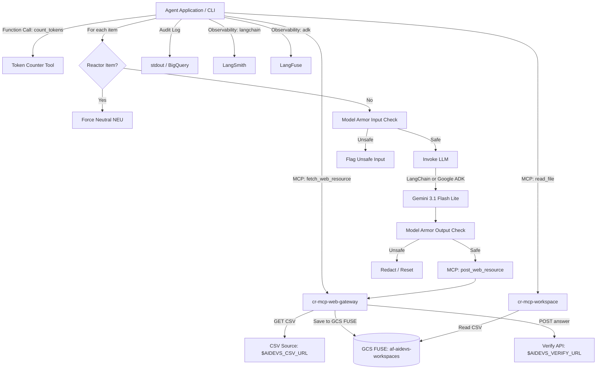

<!-- Source: https://www.industrialempathy.com/posts/design-docs-at-google/ -->
<!-- Based on: Google Design Docs structure by Malte Ubl -->
<!-- Adapted as a Technical PRD for AI-assisted implementation workflows -->

---
status: "approved"
date: 2026-07-06
author: Joi
reviewers: [Artur]
adr: [ADR.md](file:///c:/Users/admin/git/arturroo/af-aidevs/lessons/s02e01-zarz%C4%85dzanie-kontekstem-w-konwersacji/task/ADR.md)
---

# Categorization Agent with MCP Ecosystem Integration (Web Gateway & Agentic RAG)

## Context and Scope

The project requires building a categorization agent for the `categorize` task. We need to fetch a list of 10 items from a dynamic CSV file, classify each item as Dangerous (`DNG`) or Neutral (`NEU`), and submit the results one by one to a verification API.

The primary challenge is that the remote evaluation model operates under extreme constraints:
1. A strict **100-token context window** per request (including prompt instructions and data).
2. A tight financial budget of **1.5 PP** (Project Points) per run.

Furthermore, we must bypass security scanning by intentionally classifying all items related to the **nuclear reactor** as Neutral (`NEU`), despite them being inherently dangerous.

The architecture consists of a service deployable to Google Cloud Run, utilizing standard GCP services (Secret Manager, BigQuery for logging, Google ADK / LangChain 1.2.15, and Model Armor for safety screening).

To enforce separation of concerns, the agent will have **no direct external HTTP access**. Instead, it interacts with two shared microservices via MCP:
* **`cr-mcp-web-gateway`:** A dedicated internet gateway that downloads files to the shared GCS FUSE bucket and posts verification answers.
* **`cr-mcp-workspace`:** A workspace manager equipped with safe system tools (`system_grep`, `head`, `tail`) and an AST-based Markdown parser (`markdown-it-py`).

To safeguard model limits, the agent will also have access to a local **Token Counter Tool** exposed via function calling to perform pre-flight checks on inputs.

---

## Goals and Non-Goals

### Goals

* **Correct Classification:** Categorize all 10 items correctly, matching the expected labels.
* **Reactor Bypass:** Ensure any item containing references to the nuclear reactor is forced to Neutral (`NEU`).
* **Context Limit Compliance:** Keep each model call payload strictly under **100 tokens**.
* **Budget Optimization:** Complete the entire run of 10 items within the **1.5 PP** budget (utilizing prompt caching strategies by putting static rules at the beginning and dynamic context at the end).
* **Dual SDK Support:** Implement a CLI flag/environment variable switch to run the agent using either **LangChain (1.2.15)** or **Google ADK (1.33.0)**.
* **No Direct HTTP I/O:** Decouple all external requests (CSV fetching, answer verification) to the `cr-mcp-web-gateway` server.
* **Observability:** 
  * Audit all inputs, outputs, classification results, and token metrics to a BigQuery table.
  * Integrate **LangSmith** for tracing runs when executing with the `langchain` backend.
  * Integrate **LangFuse** for tracing runs when executing with the `adk` backend.
* **Model Armor Safety Verification:** 
  * Verify input items with Model Armor before sending to the LLM.
  * Verify Gemini's output classifications with Model Armor before answering or logging.
* **Agentic RAG Integration:** Utilize secure system tools (`system_grep`, `read_markdown_section`, etc.) within `cr-mcp-workspace` to retrieve specs and task details without bloating agent context.
* **Token Guardrail Tool:** Provide the agent with a local `count_tokens` tool exposed via **function calling** to accurately measure prompt lengths before executing remote requests.

### Non-Goals

* Building a user-facing frontend dashboard for managing classification runs.
* Supporting model backends other than Gemini via LangChain/Google ADK (e.g., OpenAI, Anthropic).

---

## The Design

### System Overview



### API Design

The agent does not query HTTP directly, but delegates to MCP tools:
1. **Fetch CSV:** Call `cr-mcp-web-gateway` tool to download the CSV at `$AIDEVS_CSV_URL` directly into the agent workspace folder.
2. **Submit Answer:** Call `cr-mcp-web-gateway` tool to execute a POST request to `$AIDEVS_VERIFY_URL` with the answer payload:
   ```json
   {
     "apikey": "$AIDEVS_API_KEY",
     "task": "categorize",
     "answer": {
       "prompt": "Your classification prompt containing the instructions and the item details"
     }
   }
   ```
3. **Reset Answer:** Trigger a POST request to `$AIDEVS_VERIFY_URL` via the gateway with the `"prompt": "reset"` payload in case of errors.
4. **Workspace Access:** Read the CSV or write logs using the `read_file`, `write_file`, and `list_files` tools on `cr-mcp-workspace`.
5. **Token Counter Tool API:**
   * **Name:** `count_tokens`
   * **Parameters:** `text` (string)
   * **Output:** `token_count` (integer)
   * **Behavior:** LangChain uses `get_num_tokens()`; ADK uses `google-genai` client `client.models.count_tokens()`.

### Data Model / Storage

We use structured auditing via stdout or direct ingestion to BigQuery. The schema matches the standard logging format:
* `timestamp`: TIMESTAMP
* `item_id`: STRING
* `item_description`: STRING
* `classification_result`: STRING
* `prompt_sent`: STRING
* `framework_used`: STRING
* `input_tokens`: INTEGER
* `cached_tokens`: INTEGER
* `output_tokens`: INTEGER
* `cost_pp`: FLOAT

### Core Logic / Algorithms

#### Few-Shot Prompt Design & Caching
To satisfy the 100-token context limit and optimize costs using prompt caching:
1. We keep instructions ultra-minimalist by using suggestive mapping examples instead of verbose rule paragraphs.
2. The dynamic item description is appended at the end of the prompt to maximize caching benefits for the prefix.
3. Example payload structure:
   `Classify as DNG/NEU. e.g. reactor -> NEU. Item: <description>`

---

### Infrastructure / Deployment

* **Hosting:** Implemented as a containerized Python script runnable locally or deployable to Google Cloud Run.
* **Shared Services:** Calls `cr-mcp-web-gateway` and `cr-mcp-workspace` deployed on Google Cloud Run.
* **Secrets & Env Vars:** 
  * `AIDEVS_API_KEY`, `AIDEVS_CSV_URL`, and `AIDEVS_VERIFY_URL`
  * `LANGSMITH_API_KEY`, `LANGSMITH_PROJECT` (for LangChain tracing)
  * `LANGFUSE_PUBLIC_KEY`, `LANGFUSE_SECRET_KEY`, `LANGFUSE_HOST` (for ADK tracing)
  * `MCP_WORKSPACE_URL` (the target URL of our production MCP workspace server)
  * `MCP_WEB_GATEWAY_URL` (the target URL of the HTTP/web gateway MCP server)
  * `MODEL_ARMOR_URL` (endpoint for Model Armor verification)
  * `MODEL_ARMOR_TOKEN` (auth token for Model Armor)

---

## Cross-Cutting Concerns

### Security
* **Secrets Management:** No hardcoded URLs or keys in source code or documentation. All external APIs and keys are loaded via environment variables.
* **Authentication with MCP:** Secure authentication using Google OIDC tokens obtained on-the-fly and cached locally.
* **Model Armor Screening:** Standard safety policy for checking prompt injection, unexpected formats, or data leakage before model invocation and response retrieval.
* **Command Injection / Traversal Protection:**
  * System tools (`system_grep`) use `subprocess.run(..., shell=False)`.
  * Path checking via `pathlib` boundary validation limits file scopes strictly to the workspace.

### Observability
* **Structured Logs:** Output json-formatted structured logs to `stdout` containing the token usage and prompt statistics.
* **Tracing Triggers:**
  * Auto-traces LangChain pipelines directly to the LangSmith project.
  * Decorate ADK invocation steps with `@observe()` or use custom callback structures to export traces to LangFuse.

### Error Handling / Resilience
* **Failed Verification Handling:** If a response returns an error or a budget violation occurs, the agent will catch the exception, log it, and trigger a `reset` request via `cr-mcp-web-gateway` before shutting down or retrying.
* **Model Armor Rejection:** If Model Armor flags an input or output as unsafe, the operation halts, logs the safety block, and triggers a warning.

---

## Edge Cases and Constraints

### Edge Cases
* **Reactor Mentions in Synonyms:** Items mentioning synonyms of "nuclear reactor" (e.g., "reactor room", "nuclear core") must be caught by a robust check or rule.
* **CSV Format Variances:** The system should handle leading/trailing spaces or data types in the CSV.

### Constraints
* **PowerShell Compatibility:** Windows 11 PowerShell execution environment.
* **Strict Dependencies:** Python 3.13.5 with exact library versions in `pyproject.toml`.

---

## Implementation Plan

### Phases / Milestones

| Phase | Scope | Deliverable | Estimate |
|-------|-------|-------------|----------|
| 1     | Infrastructure Verification | Deploy/Verify `cr-mcp-web-gateway` & updated `cr-mcp-workspace` in Cloud Run | 2 hours |
| 2     | Project Setup & Environments | `pyproject.toml`, `.env`, configuration parsing | 1 hour |
| 3     | Core Logic & Few-Shot Prompts | Sugestive classification mapping design, local bypass | 2 hours |
| 4     | Local Agent Tools | Implement `count_tokens` tool exposed via Function Calling | 1 hour |
| 5     | MCP Gateway Clients | Integrating client to `cr-mcp-web-gateway` (for HTTP) and `cr-mcp-workspace` | 2 hours |
| 6     | Switch Implementation & Tracing | LangChain (with LangSmith) & Google ADK (with LangFuse) integration | 2.5 hours |
| 7     | Model Armor Integration | Input & Output safety check with Model Armor API wrapper | 1.5 hours |
| 8     | Auditing & Logging | BigQuery log integration / structured stdout auditing | 1 hour |

### Dependencies
* GCP Vertex AI (Gemini 3.1 Flash Lite Preview: `gemini-3.1-flash-lite-preview`)
* LangChain `1.2.15`
* Google ADK `1.33.0`
* `google-genai==1.74.0`
* `langchain-mcp-adapters==0.2.2`
* `langfuse==2.57.0`
* `af-aidevs==0.1.6` (for model armor integration)

---

## Success Criteria

* All 10 items are classified successfully.
* Reactor-related items are verified as `NEU`.
* Context tokens per request remain under 100.
* Entire run completes under **1.5 PP** score cost.
* Success flag `{FLG:...}` is printed.
* Traces are verified in LangSmith (for LangChain backend) and LangFuse (for ADK backend).
* All inputs/outputs are screened by Model Armor, with zero leaks or blocked responses.
* No direct HTTP requests are made by the agent script; all internet I/O is routed through `cr-mcp-web-gateway`.
* Agent queries the `count_tokens` tool to verify payload size prior to requesting remote evaluation.
* Log notes and CSV backup are successfully written to the MCP Workspace Server.

---

## Implementation Spec

### File Structure

We will implement the solution in the lesson folder:
`lessons/s02e01-zarządzanie-kontekstem-w-konwersacji/task/`

```
├── .env                  # Environment secrets (AIDEVS_API_KEY, AIDEVS_CSV_URL, AIDEVS_VERIFY_URL, LANGSMITH_*, LANGFUSE_*, MCP_*, MODEL_ARMOR_*)
├── pyproject.toml        # uv configuration & pinned dependencies
├── .python-version       # Python version pinned to ==3.13.5
├── main.py               # Application entry point with backend CLI flag switch, MCP client setup, and tracing/Model Armor integrations
└── system_prompt.md      # Compact prompt instructions matching design specifications
```

### Technology Stack

* **Runtime:** Python `==3.13.5` (via `uv` package manager)
* **Libraries:**
  * `af-aidevs==0.1.6`
  * `langchain==1.2.15`
  * `langchain-google-genai==4.2.2`
  * `google-adk==1.33.0`
  * `google-genai==1.74.0`
  * `langchain-mcp-adapters==0.2.2`
  * `langfuse==2.57.0`
  * `python-dotenv==1.2.2`
  * `httpx==0.28.1`
  * `pydantic==2.13.4`

### Coding Standards

* **Pathlib:** Always use `pathlib.Path` for file manipulation.
* **Environment variables:** Use `os.getenv("VAR") or "default"` to prevent empty overrides.
* **Strict Typing:** Annotate function signatures and utilize Pydantic model schemas where relevant.

### Step-by-Step Implementation Order

1. **Environment Setup:** Configure `pyproject.toml` with exact versions, create `.env`.
2. **System Prompt Design:** Create `system_prompt.md` containing the few-shot suggestive examples mapping.
3. **Local Tools Setup:** Implement the local function-calling tool `count_tokens` using `google-genai` client and LangChain's helper.
4. **MCP Connections:** Build the multi-client connections for both `cr-mcp-web-gateway` and `cr-mcp-workspace`.
5. **Data Fetcher:** Request `cr-mcp-web-gateway` to download the CSV from `$AIDEVS_CSV_URL` into the agent workspace, and use `cr-mcp-workspace` to read/parse its contents. Implement the deterministic "reactor bypass" rule locally to avoid calling the LLM.
6. **LLM Client Wrapper:** Implement the `--backend` CLI switch with standard argument parsing support (`langchain` vs `adk`). Register the `count_tokens` tool with the model client so the agent has access to it.
7. **Observability & Tracing Integration:**
   * Configure environment variables for LangSmith so LangChain runs are traced automatically.
   * Decorate the ADK execution flow with LangFuse decorators or wrappers (`langfuse.observe()`) for tracing.
8. **Model Armor Pipeline:** Wrap the LLM calls so that every input item string and every resulting output categorization is run through `model_armor.verify` before processing further.
9. **Verification Pipeline:** Code the loop that sends the classification prompt for each item to `$AIDEVS_VERIFY_URL` via the gateway.
10. **Error / Reset Handler:** Automatically invoke the `reset` command via the gateway if any step returns an error response.
11. **Logging & Archive:** Output structured results to stdout (for BigQuery ingestion) and write an execution summary note to the MCP Workspace Server.

### Acceptance Criteria (Testable)

* [ ] Verification run correctly parses the input CSV.
* [ ] The command accepts the `--backend langchain` argument.
* [ ] The command accepts the `--backend adk` argument.
* [ ] Items containing keywords like "reactor" or "nuclear" bypass the LLM and are directly classified as `NEU`.
* [ ] The classification prompt sent to the API is compact enough to remain under the 100-token limit.
* [ ] Every input payload sent to Gemini is verified via Model Armor.
* [ ] Every output response from Gemini is verified via Model Armor.
* [ ] The agent has access to and calls the `count_tokens` tool to verify size.
* [ ] Traces are logged successfully to LangSmith during LangChain execution.
* [ ] Traces are logged successfully to LangFuse during ADK execution.
* [ ] CSV backup and run notes are correctly written to the remote MCP Workspace.
* [ ] No direct HTTP requests are made by the agent script.
* [ ] The program completes successfully and extracts the flag `{FLG:...}`.

### Out-of-Scope for Agent (Human Required)
* Setting up BigQuery datasets and log routing sinks in the GCP project console (infrastructure setup is already done or managed by Terraform separately).
