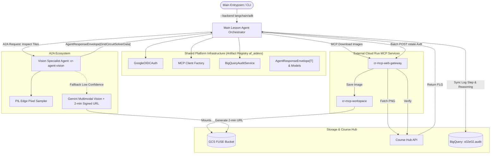

<!-- Source: https://www.industrialempathy.com/posts/design-docs-at-google/ -->
<!-- Based on: Google Design Docs structure by Malte Ubl -->
<!-- Adapted as a Technical PRD for AI-assisted implementation workflows -->

---
status: approved
date: 2026-08-23
author: Artur
reviewers: Artur
adr: ./ADR.md
---

# S02E02: Electrical Circuit Solver with A2A Vision Specialist, Artifact Registry Schema Registry, and Modular Clean Architecture

## Context and Scope

In lesson S02E02 (`electricity`), an automated system must solve a $3 \times 3$ electrical circuit routing puzzle to power three nuclear reactor units (`PWR6132PL`, `PWR1593PL`, `PWR7264PL`) from an emergency power source located at tile `3x1` (bottom-left). The board layout is provided dynamically as a PNG image (`$AIDEVS_ELECTRICITY_DATA_URL`), and the reference target layout is also a static PNG (`$AIDEVS_ELECTRICITY_SOLVED_URL`). Each 90° clockwise rotation of a tile requires a discrete HTTP POST call to `$AIDEVS_VERIFY_URL`.

To prevent monolithic code debt observed in previous lessons (e.g. 424-line `main.py` in `s02e01`), eliminate copy-pasted boilerplate (OIDC auth and MCP setup), and strictly isolate visual perception from puzzle solving, this document specifies an **Agent-to-Agent (A2A)** architecture. The system introduces a dedicated **Vision Specialist Agent**, refactors shared infrastructure into the private `af_aidevs` package in Google Artifact Registry, and enforces Clean Code / SOLID design patterns across dual LLM backends (LangChain 1.2.15 vs. Google ADK).

---

## Goals and Non-Goals

### Goals
* **Automated Electrical Circuit Resolution:** Restore closed-loop power connections to all 3 nuclear plant units on the $3 \times 3$ grid and retrieve the course completion flag `{FLG:...}`.
* **A2A Decoupled Vision Perception:** Encapsulate image slicing and pinout detection inside a specialized Vision Agent (`cr-agent-vision`) accessible over HTTP via A2A protocol.
* **Hybrid Multimodal Vision Strategy:** Implement fast deterministic Computer Vision (PIL Edge Pixel Sampling, 0 token cost, <1ms) with dynamic fallback to Vertex AI Gemini multimodal inference.
* **Zero-Trust Ephemeral Link Security:** Ensure agents communicate using session-relative paths only; external model APIs receive strictly time-bounded (2-minute) Signed URLs generated from GCS.
* **Shared Library Refactoring (`af_aidevs` v0.2.0):** Centralize OIDC auth caching, MCP client factory, BigQuery audit service, and Generic Pydantic response envelopes into Artifact Registry.
* **Modular Clean Architecture & Dual Backend:** Support `--backend langchain` (LangSmith) and `--backend adk` (Langfuse) via an `AgentFactory`, keeping every file under ~150 lines and `main.py` under 80 lines.

### Non-Goals
* **Full-Image End-to-End LLM Prompting:** We do not pass full $3 \times 3$ boards to LLMs without segmentation due to high spatial hallucination rates.
* **Direct GCS Access from Lesson Agents:** Lesson agents have zero direct access to Google Cloud Storage buckets or direct storage links; all their file interactions are strictly mediated through session-sandboxed MCP tools (`cr-mcp-workspace`). In contrast, the reusable production Vision Agent (`cr-agent-vision`) operates in the trusted production zone with scoped access to the Cloud Storage bucket to generate ephemeral 2-minute Signed URLs for specific image files in the caller's session workspace, allowing its multimodal LLM to inspect them securely without exposing permanent storage permissions to lesson agents.
* **General-purpose Grid Games:** Solver logic is strictly tailored to $3 \times 3$ rotational electrical tiles.

---

## The Design

### System Overview



---

### API Design

#### 1. A2A Vision Specialist Protocol (HTTP POST `/inspect`)
* **Headers:**
  * `Authorization: Bearer <GCP_OIDC_TOKEN>`
  * `X-Session-ID: <session_id>`
  * `Content-Type: application/json`
* **Request Payload (`VisionInspectRequest`):**
  ```json
  {
    "task_type": "grid_circuit_solver",
    "image_path": "electricity.png",
    "target_image_path": "solved_electricity.png",
    "grid_size": [3, 3],
    "reasoning": "Inspecting current board against solved circuit to determine 90-degree CW rotations."
  }
  ```
* **Response Payload (`AgentResponseEnvelope[GridCircuitSolverData]`):**
  ```json
  {
    "status": "success",
    "reasoning": "All 9 tiles inspected. Tiles 1x2, 2x1, 2x3 require rotation. Verified with 100% confidence.",
    "data": {
      "rotations": [
        [0, 1, 0],
        [2, 0, 3],
        [0, 0, 1]
      ],
      "confidence": 0.98,
      "tile_confidence": [
        [1.0, 1.0, 1.0],
        [1.0, 1.0, 0.95],
        [1.0, 1.0, 1.0]
      ]
    },
    "hint": null,
    "error": null
  }
  ```

#### 2. Course Hub Verification API
* **Endpoint:** `$AIDEVS_VERIFY_URL`
* **Method:** `POST`
* **Payload:**
  ```json
  {
    "apikey": "$AIDEVS_API_KEY",
    "task": "electricity",
    "answer": {
      "rotate": "2x3"
    }
  }
  ```

---

### Data Model & Storage

#### 1. Pydantic Schemas (`af_aidevs.schemas`)
```python
from typing import Generic, TypeVar, Optional, List
from pydantic import BaseModel, Field

T = TypeVar("T")

class AgentResponseEnvelope(BaseModel, Generic[T]):
    status: str = Field(description="Operation status: 'success' or 'error'", json_schema_extra={"example": "success"})
    reasoning: str = Field(description="Audit reasoning explaining the decision", json_schema_extra={"example": "Detected tile rotations."})
    data: Optional[T] = Field(default=None, description="Typed payload specific to requested task")
    hint: Optional[str] = Field(default=None, description="Progressive disclosure hint")
    error: Optional[str] = Field(default=None, description="Error message if failed")

class GridCircuitSolverData(BaseModel):
    rotations: List[List[int]] = Field(
        description="3x3 matrix where rotations[row][col] is the number of 90° CW rotations (0-3)",
        json_schema_extra={"example": [[0, 1, 0], [2, 0, 3], [0, 0, 1]]}
    )
    confidence: float = Field(
        ge=0.0, le=1.0,
        description="Overall confidence score (0.0 to 1.0)",
        json_schema_extra={"example": 0.98}
    )
    tile_confidence: List[List[float]] = Field(
        description="3x3 matrix of confidence scores per individual tile",
        json_schema_extra={"example": [[1.0, 1.0, 1.0], [1.0, 1.0, 1.0], [1.0, 1.0, 1.0]]}
    )
```

#### 2. BigQuery Audit Table (`s02e02.audit`)
* `timestamp`: TIMESTAMP (Europe/Zurich)
* `session_id`: STRING (`X-Session-ID`)
* `actor`: STRING (`main_agent`, `vision_agent`, `hub_api`)
* `step_type`: STRING (`download_board`, `a2a_vision_inspection`, `rotate_tile`, `solution_verified`)
* `reasoning`: STRING (Mandatory reasoning string)
* `payload`: JSON / STRING (Masked input/output data)
* `flag`: STRING (Captured `{FLG:...}`)

#### 3. Multi-Layered Workspace Virtual File System (OverlayFS / UnionFS)
To enforce strict Zero-Trust isolation and prevent asset duplication:
* **Lower Layer (Read-Only Shared Blueprints):** `gs://af-aidevs-workspaces/shared/s02e02/` holding static immutable reference assets (e.g. `solved_electricity.png`).
* **Upper Layer (Read-Write Ephemeral Session):** `gs://af-aidevs-workspaces/{caller_identity}/{x_session_id}/` holding runtime board states and generated reports (`electricity.png`, `run_notes.txt`).
* **Lookup Resolution:** File reads check the upper session layer first, cascading to the lower shared layer if missing. File writes strictly mutate the session layer.

---

### Core Logic & Algorithms

#### 1. Edge Pixel Sampling (Deterministic CV)
For each cropped tile of dimensions $W \times H$:
* Sample 4 edge midpoints:
  * Top: $(W/2, 2)$
  * Right: $(W - 2, H/2)$
  * Bottom: $(W/2, H - 2)$
  * Left: $(2, H/2)$
* Determine pin presence: `pin = True` if color intensity $> \text{threshold}$.
* Pinout representation: `pins = (top, right, bottom, left)`.

#### 2. Modulo-4 Rotation Delta & Confidence Scoring
To calculate clockwise rotations from `current_pins` to `target_pins`:
$$\Delta_{\text{rot}} = \arg\min_{k \in \{0, 1, 2, 3\}} \left( \text{rotate\_cw}(current\_pins, k) == target\_pins \right)$$

* **Confidence Scoring:** `tile_confidence` is computed based on edge pixel contrast margin and rotation match uniqueness (ranging from $0.0$ to $1.0$).
* **High-Confidence Decision Rule:** Any score `tile_confidence >= 0.9` is treated as a deterministic success and accepted directly.

#### 3. Ephemeral Signed URL Fallback (Gemini Multimodal)
If `tile_confidence < 0.9` for any tile (e.g., ambiguous contrast or no rotation $k$ matches the target layout):
1. Vision Agent generates an ephemeral 2-minute Signed URL for that specific tile image from GCS.
2. Invokes Vertex AI Gemini Multimodal with `response_schema=TilePinoutSchema` to inspect the visual wiring directly.
3. Recomputes $\Delta_{\text{rot}}$ and updates `tile_confidence`.

---

### Infrastructure & Deployment
* **GCP Services:** Cloud Run, Google Artifact Registry, BigQuery, Cloud Storage FUSE, Vertex AI.
* **Package Management:** `uv` with `requires-python = "==3.13.5"`.
* **Private Artifact Registry URL:** `https://europe-west6-python.pkg.dev/af-aidevs/python-packages/simple/`.

---

## Cross-Cutting Concerns

### Security
* **Authentication:** Google Cloud IAM Service Accounts with OIDC Identity Tokens.
* **Secrets:** All URLs and API keys loaded strictly from `.env` or Secret Manager.
* **Zero-Trust Ephemeral Links:** GCS buckets remain private; Signed URLs expire after 120 seconds.
* **Input Sanitization:** Session boundaries enforced by `cr-mcp-workspace` preventing path traversal.

### Observability
* **LangChain:** LangSmith tracing via `LANGSMITH_PROJECT`.
* **Google ADK:** Langfuse tracing via `LANGFUSE_PUBLIC_KEY` / `LANGFUSE_SECRET_KEY`.
* **Auditing:** Structured BigQuery sync logging in `s02e02.audit`.

### Error Handling & Resilience
* **Tenacity Retries:** Network requests retry on 503/429 with exponential backoff.
* **Fail-Fast Prototyping & Diagnostic Logging:** If the final rotation batch does not return `{FLG:...}`, the agent halts immediately (preventing runaway execution loops and unnecessary token/compute costs), logs complete diagnostic details to BigQuery `s02e02.audit`, and writes an error report to `run_notes.txt` for human analysis.

---

## Edge Cases and Constraints

* **Ambiguous Symmetric Tiles:** Tiles with straight lines ($180^\circ$ symmetric) require only $0$ or $1$ rotation modulo 2. Delta math accounts for symmetric pin matching.
* **Hub API Rate Limits:** Rotations executed sequentially with 100ms pacing.
* **Token Expiration:** Google OIDC cached token refreshed proactively if lifetime $< 5\text{ minutes}$.

---

## Implementation Plan

### Phases / Milestones

| Phase | Scope | Deliverable |
|---|---|---|
| 1 | Shared Library Refactoring | `af_aidevs` v0.2.0 published to Artifact Registry with OIDC, MCP, BQ, and Schemas |
| 2 | Vision Specialist Agent | `services/vision_service.py` with PIL Edge Sampling, Signed URL generator, and Gemini fallback |
| 3 | Domain Logic & Agent Factory | `puzzle_service.py`, `agents/langchain_agent.py`, `agents/adk_agent.py`, `agents/factory.py` |
| 4 | Orchestration & Verification | `main.py` CLI solver, BigQuery table `s02e02.audit`, and flag extraction |

---

## Success Criteria

* [ ] `af_aidevs` v0.2.0 successfully built and installed via `uv`.
* [ ] BigQuery dataset `s02e02` and table `s02e02.audit` created.
* [ ] Deterministic CV accurately extracts 9-tile pinouts from `electricity.png` and `solved_electricity.png`.
* [ ] Both `--backend langchain` and `--backend adk` successfully resolve the puzzle.
* [ ] Verification API returns `{FLG:...}` and execution notes are saved to `run_notes.txt`.

---

## Implementation Spec

> This section is consumed by the AI coding agent executing `/implement` against this PRD.

### File Structure

```text
c:\Users\admin\git\arturroo\af-aidevs\
├── python_packages/af_aidevs/
│   ├── pyproject.toml                     # Bumped to version == "0.2.0"
│   ├── af_aidevs/
│   │   ├── __init__.py
│   │   ├── auth/
│   │   │   ├── __init__.py
│   │   │   └── oidc.py                    # GoogleOIDCAuth class
│   │   ├── clients/
│   │   │   ├── __init__.py
│   │   │   └── mcp.py                     # create_mcp_client helper
│   │   ├── audit/
│   │   │   ├── __init__.py
│   │   │   └── bigquery.py                # BigQueryAuditService
│   │   ├── schemas/
│   │   │   ├── __init__.py
│   │   │   ├── common.py                  # AgentResponseEnvelope[T]
│   │   │   └── vision.py                  # GridCircuitSolverData, TilePinout
│   │   └── utils/
│   │       ├── __init__.py
│   │       └── prompts.py                 # load_system_prompt
└── lessons/s02e02-zewnetrzny-kontekst-narzedzi-i-dokumentow/task/
    ├── BRD.md
    ├── ADR.md
    ├── PRD.md
    └── cr-s02e02-electricity-solver/
        ├── .python-version                # 3.13.5
        ├── pyproject.toml                 # dependencies with precise versions
        ├── system_prompt.md               # Prompt with frontmatter
        ├── config.py                      # Environment and constants
        ├── schemas.py                     # Task-specific I/O models
        ├── services/
        │   ├── __init__.py
        │   ├── image_service.py           # PIL Grid cropping, edge sampling, Signed URL
        │   └── puzzle_service.py          # Modulo-4 delta math & closed circuit logic
        ├── agents/
        │   ├── __init__.py
        │   ├── base.py                    # BaseSolverAgent Protocol
        │   ├── factory.py                 # AgentFactory for langchain / adk
        │   ├── langchain_agent.py         # LangChain 1.2.15 (create_agent + LangSmith)
        │   └── adk_agent.py               # Google ADK + Langfuse
        ├── tests/
        │   ├── __init__.py
        │   ├── test_image_service.py      # Synthetic tile slicing & rotated edge sampling tests
        │   ├── test_puzzle_service.py     # Modulo-4 delta & matrix math tests
        │   └── test_schemas.py            # Generic[T] envelope and Pydantic validation tests
        └── main.py                        # Entrypoint (< 80 lines)
```

### Technology Stack

* **Python:** `3.13.5` (`requires-python = "==3.13.5"`)
* **Libraries:**
  * `af-aidevs==0.2.0` (from private GAR)
  * `fastapi==0.136.1`
  * `fastmcp==3.2.4`
  * `google-cloud-bigquery==3.41.0`
  * `google-genai==1.74.0`
  * `httpx==0.28.1`
  * `langchain==1.2.15`
  * `langchain-google-genai==4.2.2`
  * `langchain-mcp-adapters==0.2.2`
  * `langfuse==2.57.0`
  * `pillow==11.1.0`
  * `pydantic==2.13.4`
  * `pytest==8.3.5`
  * `pytest-asyncio==0.25.3`
  * `python-dotenv==1.2.2`
  * `python-frontmatter==1.1.0`
  * `tenacity==9.0.0`
  * `uvicorn==0.46.0`

### Step-by-Step Implementation Order

1. **Refactor `python_packages/af_aidevs`:** Add `auth/oidc.py`, `clients/mcp.py`, `audit/bigquery.py`, and `schemas/`. Build and publish `v0.2.0` to Artifact Registry.
2. **Setup Task Directory:** Create `cr-s02e02-electricity-solver` with `pyproject.toml`, `.python-version`, and `config.py`.
3. **Implement Services Layer & Unit Tests (TDD):**
   - `services/image_service.py`: PIL 3x3 crop and edge pixel pin detection.
   - `services/puzzle_service.py`: Modulo 4 rotation calculations.
   - `tests/test_image_service.py`: Slice `solved_electricity.png`, artificially rotate tiles by $90^\circ, 180^\circ, 270^\circ$, and assert that `detect_rotations()` accurately recovers the exact rotation delta with `confidence >= 0.9`.
   - `tests/test_puzzle_service.py`: Verify grid arithmetic and matrix coordinate mapping.
   - Run `pytest` locally to confirm 100% test pass before cloud deployment.
4. **Implement Agent Factory & Frameworks:**
   - `agents/langchain_agent.py` using `langchain.agents.create_agent` with LangSmith.
   - `agents/adk_agent.py` using Google ADK with Langfuse.
   - `agents/factory.py` dispatcher.
5. **Implement `main.py` Entrypoint:** Load env vars, invoke factory, execute batch rotations via `cr-mcp-web-gateway`, log to BigQuery, and save flag to `run_notes.txt`.
6. **Verification & Audit Check:** Run `--backend langchain` and `--backend adk`, verify BigQuery rows, and ensure `{FLG:...}` is captured.

### Acceptance Criteria

* [ ] `af_aidevs==0.2.0` installs cleanly via `uv sync`.
* [ ] No monolithic file exceeds ~150 lines.
* [ ] `main.py` is under 80 lines and uses `AgentFactory`.
* [ ] Unit test suite (`pytest`) passes 100% on synthetic rotated tiles created from `solved_electricity.png`.
* [ ] Edge pixel sampling correctly identifies all 9 tile rotations from `electricity.png` and `solved_electricity.png`.
* [ ] Rotations successfully sent to `$AIDEVS_VERIFY_URL` and `{FLG:...}` received.
* [ ] Audit records logged to BigQuery dataset `s02e02`.
* [ ] `run_notes.txt` written to session workspace with flag and execution details.

### Out-of-Scope for Agent (Human Required)

* Artur will provide `$AIDEVS_API_KEY` and specific URLs in local `.env`.
* Artur will approve BigQuery dataset creation if GCP permissions require interactive confirmation.
