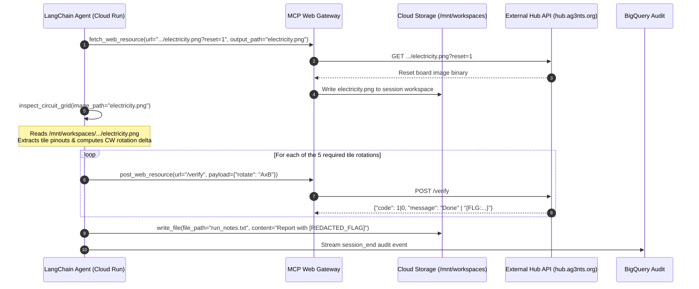

# S02E02: Autonomous Electrical Circuit Solver (`cr-s02e02-electricity`)

## 1. Overview & Objective
This service autonomously solves the 3x3 electrical grid circuit puzzle from AI_Devs S02E02 to route electrical power from the emergency source at tile `3x1` to the three power plant units (`PWR6132PL`, `PWR1593PL`, `PWR7264PL`).

The workflow is orchestrated using **LangChain 1.2.15** / **Google ADK** and interacts strictly through:
1. **`cr-mcp-web-gateway`**: External network isolation for file downloads (`fetch_web_resource`) and REST verification dispatches (`post_web_resource`).
2. **`cr-mcp-workspace` & GCS FUSE (`/mnt/workspaces`)**: Session-isolated file storage for storing downloaded board images and writing execution summaries (`run_notes.txt`).
3. **Real-Time BigQuery Auditing (`af-aidevs.s02e02.audit`)**: Zero-latency async callback streaming for full traceability.

---

## 2. Architecture & Execution Flow

---

## 3. Key Calibration & Engineering Discoveries

### 3.1 Live Grid Slicing Geometry
The live board served from `https://hub.ag3nts.org/data/{API_KEY}/electricity.png` is **800x450 px**, while the solved schematic is **598x422 px**.
* **Precise $800 \times 450$ coordinates**: $(X_0=238, Y_0=100, \text{tile\_w}=95, \text{tile\_h}=95)$.
* **Safe Margin Edge Sampling**: Sampling margins must be centered away from tile borders (`arr[10:25, 40:55]` for top, `arr[70:85, 40:55]` for bottom, `arr[40:55, 10:25]` for left, `arr[40:55, 70:85]` for right) to prevent outer grid divider lines from bleeding into tile pinouts.

### 3.2 Ground Truth Solution (5 Operations)
From a clean reset state (`?reset=1`), the true circuit requires exactly 5 sequential 90-degree CW operations:
1. `1x2`: 1 rotation
2. `1x3`: 1 rotation
3. `2x1`: 1 rotation
4. `2x2`: 3 rotations
5. `3x1`: 1 rotation

Upon the 5th rotation, the verification server returns `{"code": 0, "message": "{FLG:...}"}`.

---

## 4. Lessons Learned & Future Refactoring (In-Process Multi-Agent Architecture)

### 4.1 Pragmatic Decision Context
* **Decision**: We consolidated the vision analysis into a hermetic function-calling tool (`inspect_circuit_grid`) inside `cr-s02e02-electricity` reading directly from the mounted GCS workspace (`/mnt/workspaces`), rather than deploying a separate `cr-agent-vision` microservice.
* **Rationale**: Strict timeline constraint to complete **Season 2, Season 3, and Season 4 by the end of September 2026**. Shipping a working, fully auditable, and secure implementation was prioritized over building an extra standalone microservice for this single task.

### 4.2 Recommended Target Pattern: In-Process Multi-Agent (Single Cloud Run)
Rather than splitting specialists into separate Cloud Run services communicating over HTTP A2A (which adds network latency, cold starts, and infrastructure complexity), the **recommended pattern is an In-Process Multi-Agent Architecture hosted inside a single Cloud Run container**:

1. **LangSmith / LangGraph In-Process Pattern**:
   * **Supervisor Node**: High-level reasoning, web dispatching via MCP Web Gateway, report writing.
   * **Vision Subagent Node**: Specialized in-process agent handling pinout analysis and circuit delta calculation.
   * **Observability**: Automatically traced as hierarchical parent-child runs in **LangSmith** with nested spans (`Orchestrator -> Vision Subagent -> Tool Calls`).
2. **Google ADK In-Process Pattern**:
   * **Root Agent**: Drives the primary loop.
   * **Hierarchical Subagent**: Specialized subagent instance invoked as a tool/coroutine within the parent process.
   * **Observability**: Structured telemetry events streamed to BigQuery `audit` table.

### 4.3 Key Advantages of In-Process Multi-Agent
* **Zero Network Overhead**: Eliminates extra HTTP request hops and cold starts.
* **Direct RAM Sharing**: High-resolution image buffers stay in memory or local `/mnt/workspaces` without generating external network traffic.
* **Unified Cloud Run Footprint**: Single Terraform service definition and single IAM identity (`sa-cr-s02e02-electricity`).
* **Clean Separation of Concerns**: Specialist prompts and toolsets remain isolated without microservice sprawl.

