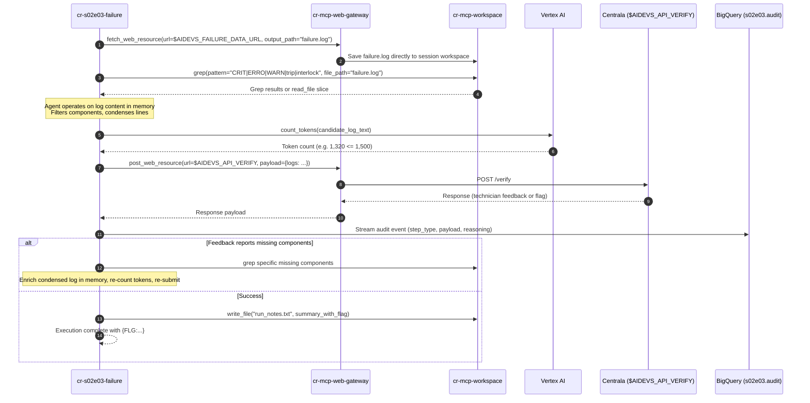

<!-- Source: https://github.com/adr/madr/blob/4.0.0/template/adr-template.md -->
<!-- MADR project: https://adr.github.io/madr/ -->

---
status: "accepted"
date: 2026-09-04
decision-makers: Artur
consulted: [Joi]
informed: []
---

# Architecture Decision Record (ADR) - Task: `failure`

## Context and Problem Statement

A critical operational failure occurred yesterday at the power plant: startup commenced at ~06:00, and an unexpected automatic shutdown occurred just before 22:00. The full raw telemetry log file (`failure.log`) is massive and exceeds the analysis context limits of Centrala. The objective is to produce an accurate, condensed event summary covering the root cause (power, cooling, water pumps, software, and trip interlocks) that strictly complies with Centrala's hard limit of **1,500 tokens**, multiline format (one event per line), and preserved timestamps, severities, and component identifiers. Centrala provides granular feedback upon submission when key components are missing or unclear.

How should we architect an autonomous system to ingest, explore, compress, validate, and iteratively refine these failure logs within the 1,500-token constraint while strictly adhering to the project's zero-trust microservice boundary standards?

## Decision Drivers

* **Zero-Trust Network Isolation (cr-mcp-web-gateway):** All external internet calls (downloading raw logs, submitting verification answers) MUST be routed strictly through the `cr-mcp-web-gateway` microservice rather than direct outbound requests from the task agent.
* **Unified Remote File Management (cr-mcp-workspace):** All file persistence and staging operations MUST strictly use `cr-mcp-workspace` (GCS OverlayFS). Local container disk usage is avoided.
* **In-Memory Telemetry Processing:** The agent loads file slices into memory via `read_file` (or queries via `grep`) and performs high-speed in-memory parsing, token calculation, and paraphrasing.
* **Strict Token Ceiling Enforcement:** Guarantee that candidate payloads are validated under the 1,500-token ceiling prior to submission using Vertex AI `count_tokens` to prevent immediate rejection.
* **Autonomous Feedback Remediation:** Dynamically consume technician feedback from Centrala, identify referenced missing components, extract relevant lines from the log, and re-verify without human intervention (up to 5 attempts).
* **Observability & Auditing:** Full real-time auditability in BigQuery (`s02e03.audit`) and structured stdout logging for complete execution tracing.
* **Clean Architecture & Enterprise Standards:** Unified Cloud Run microservice (`cr-s02e03-failure`) with FastAPI HTTP endpoints and CLI parity, dual backend (LangChain 1.2.15 vs. `google-genai` SDK), and zero hardcoded external URLs.

## Considered Options

* **Option 1:** Pure Agentic Tool-Use on Cloud Run (`cr-s02e03-failure`) with `cr-mcp-web-gateway` for all external I/O, `cr-mcp-workspace` for all file management, in-memory log processing after `read_file`, Vertex AI `count_tokens`, and BigQuery Auditing.
* **Option 2:** Direct outbound HTTP requests from task container with local disk caching and regex filtering.
* **Option 3:** Map-Reduce Recursive Summarization with Vertex AI Batch Inference.

## Decision Outcome

Chosen option: **Option 1**, because:
1. Routing all external HTTP traffic through `cr-mcp-web-gateway` (`fetch_web_resource`, `post_web_resource`) guarantees centralized security auditing, egress control, and uniform logging.
2. Managing all files exclusively through `cr-mcp-workspace` preserves Zero-Trust statelessness in the task container and integrates with GCS OverlayFS (`gs://af-aidevs-workspaces/`).
3. In-memory processing after `read_file` (combined with `cr-mcp-workspace` tools like `grep`, `head`, `tail`) provides high-speed parsing, filtering, and token estimation without local disk dependencies.
4. Validating token limits directly against Vertex AI `count_tokens` guarantees zero rejections from Centrala due to token overrun.
5. Dual backend architecture (LangChain 1.2.15 with `create_agent` as default and `google-genai` on Vertex AI) satisfies learning requirements and maintains flexibility.

### Consequences

* **Good:** Strict adherence to microservice segregation: `cr-s02e03-failure` has no direct external internet access permissions or local persistent storage, using `cr-mcp-web-gateway` and `cr-mcp-workspace` for all I/O.
* **Good:** Autonomous exploration allows the LLM to inspect only relevant telemetry lines, keeping prompt tokens low and reasoning precise.
* **Good:** High performance in-memory data processing once the file or grepped sections are loaded via `read_file`.
* **Good:** Vertex AI `count_tokens` API verification ensures deterministic token compliance before making external POST calls to `$AIDEVS_API_VERIFY`.
* **Good:** Automated feedback loop handles up to 5 technician refinement iterations autonomously.
* **Good:** Seamless auditability with structured logs and real-time BigQuery streaming (`s02e03.audit`).
* **Bad:** Multi-service dependency chain (`cr-s02e03-failure` $\rightarrow$ `cr-mcp-web-gateway` + `cr-mcp-workspace`) requires valid OIDC identity tokens and increases cold start latency.

### Confirmation

Compliance will be confirmed through:
1. Verification that no direct outbound HTTP calls to external hosts occur from `cr-s02e03-failure` (all route through `cr-mcp-web-gateway`).
2. Verification that all staged assets (`failure.log`, `run_notes.txt`) reside strictly in `cr-mcp-workspace`.
3. Unit and integration tests covering the log exploration tools, token counting validator, and payload formatter.
4. End-to-end execution yielding HTTP 200 from `$AIDEVS_API_VERIFY` and retrieving the valid `{FLG:...}` token.
5. Verification of audit entries in BigQuery dataset `s02e03`, table `audit`.

---

## Pros and Cons of the Options

### Option 1: Agentic Orchestration with cr-mcp-web-gateway and cr-mcp-workspace

An autonomous agent deployed as Cloud Run microservice `cr-s02e03-failure`. External internet access is delegated entirely to `cr-mcp-web-gateway` (`fetch_web_resource` to download `failure.log` directly into session workspace; `post_web_resource` to submit `/verify` payloads). File management is strictly delegated to `cr-mcp-workspace` (`read_file`, `write_file`, `list_files`, `grep`, `head`, `tail`). High-speed parsing and condensation are executed in memory after reading file chunks.

* **Good, because** it strictly implements Zero-Trust network and storage isolation.
* **Good, because** files are stored centrally in GCS OverlayFS via `cr-mcp-workspace` without polluting local container state.
* **Good, because** in-memory processing provides instantaneous regex filtering and token verification without repetitive disk round-trips.
* **Good, because** Vertex AI `count_tokens` provides official model-aligned token calculations before submission.
* **Good, because** all reasoning steps, tool calls, and API responses stream directly into BigQuery (`s02e03.audit`).
* **Neutral, because** requires OIDC token generation for service-to-service communication with both MCP servers.
* **Bad, because** multi-turn tool loops can increase end-to-end execution time toward 60–180 seconds.

### Option 2: Direct Outbound HTTP Requests with Local Container Storage

The container downloads `failure.log` directly to `/tmp` via `httpx` and sends verification POST directly to Centrala.

* **Good, because** simpler local setup without inter-service MCP dependencies.
* **Bad, because** violates project rule requiring `cr-mcp-web-gateway` for internet calls.
* **Bad, because** violates project rule requiring `cr-mcp-workspace` for persistent session assets.
* **Bad, because** local container ephemeral storage is lost upon container preemption or scale-down.

### Option 3: Map-Reduce Recursive Summarization with Vertex AI Batch Inference

Chunking the entire `failure.log` into equal-sized blocks, summarizing each block in parallel, and hierarchically merging the summaries into a final 1,500-token document.

* **Good, because** no part of the log file is skipped during the first pass.
* **Bad, because** summarizing thousands of routine `INFO` lines incurs massive unnecessary LLM token costs.
* **Bad, because** recursive map-reduce frequently dilutes specific alphanumeric component tags and precise timestamps, causing technician rejection.
* **Bad, because** it does not provide an interactive feedback loop to investigate specific components highlighted by Centrala.

---

## Detailed Architectural Specifications

### 1. Infrastructure & Deployment (Terraform)
* **Service:** Cloud Run service `cr-s02e03-failure`.
* **Service Account:** `sa-cr-s02e03-failure` (21 characters, well within GCP 30-char limit).
* **Roles:**
  * `roles/bigquery.dataEditor` on dataset `s02e03`.
  * `roles/aiplatform.user` for Vertex AI Gemini and token counting.
  * `roles/run.invoker` on `cr-mcp-workspace` and `cr-mcp-web-gateway`.
* **Configuration:**
  * Memory: 1GiB.
  * CPU: 1.
  * Request Timeout: `600s` (per gold standard for multi-turn agentic loops).
  * Environment Variables: `AIDEVS_API_KEY`, `AIDEVS_API_VERIFY`, `AIDEVS_FAILURE_DATA_URL`, `MCP_WORKSPACE_URL`, `MCP_WEB_GATEWAY_URL`, `GCP_PROJECT`, `GOOGLE_CLOUD_LOCATION`.

### 2. External I/O & File Operations Lifecycle


### 3. Microservice Layout & Application Entrypoints
```
lessons/s02e03-dokumenty-oraz-pamiec-dlugoterminowa-jako-narzedzia/task/cr-s02e03-failure/
├── Dockerfile
├── Procfile
├── cloudbuild.yaml
├── .dockerignore
├── .gcloudignore
├── .python-version
├── pyproject.toml
├── main.py                     # FastAPI app + CLI entrypoint
├── config.py                   # Environment & settings with resilient fallbacks
├── schemas.py                  # Contract-first Pydantic models for all tools & responses
├── system_prompt.md            # Prompt frontmatter & agent guidelines
├── agents/
│   ├── __init__.py
│   ├── base.py                 # Abstract agent interface
│   ├── factory.py              # Backend factory (langchain vs genai)
│   ├── langchain_agent.py      # LangChain 1.2.15 implementation (create_agent)
│   └── adk_agent.py            # Vertex AI google-genai implementation
├── services/
│   ├── __init__.py
│   ├── audit_service.py        # BigQuery streaming audit client
│   ├── token_service.py        # Vertex AI count_tokens integration
│   ├── mcp_service.py          # Unified client wrapper for cr-mcp-web-gateway & cr-mcp-workspace
│   └── failure_service.py      # In-memory log parsing, filtering, and refinement engine
└── tests/
    ├── __init__.py
    ├── test_schemas.py
    └── test_token_service.py
```

### 4. Tool Architecture (Contract-First Pydantic Schemas)
Tools exposed to the agent adhere to strict Google AIP standards (`args_schema`, required `reasoning`, dedicated response models, `handle_tool_error = True`):
1. `download_log`: Calls `fetch_web_resource` on `cr-mcp-web-gateway` to stage `failure.log` directly into `cr-mcp-workspace`.
2. `grep_workspace_log`: Calls `grep` on `cr-mcp-workspace` for targeted exploration of subsystems, error tags, or timestamps.
3. `read_workspace_log`: Calls `read_file` on `cr-mcp-workspace` to retrieve slices or files into memory.
4. `count_tokens`: Calls Vertex AI token counting on candidate condensed log text to verify token count $\le 1,500$.
5. `submit_verification`: Calls `post_web_resource` on `cr-mcp-web-gateway` targeting `$AIDEVS_API_VERIFY`.

### 5. Observability & BigQuery Schema
* **Dataset:** `s02e03`
* **Table:** `audit`
* **Session ID Standard:** `s02e03_{backend}_{YYYYMMDD_HHMMSS}` in `Europe/Zurich` timezone.
* **Dual-Schema Fields:**
  * `session_id`: STRING
  * `step_type`: STRING (`llm_thought`, `tool_call`, `tool_result`, `verification`, `final_answer`)
  * `reasoning`: STRING
  * `payload`: JSON / STRING
  * `flag`: STRING (captured flag or null)
  * `timestamp`: TIMESTAMP
  * `content` / `metadata`: Fallback JSON compatibility fields

---

## More Information

* **Language & Runtime:** Python 3.13.5 (`requires-python = "==3.13.5"`).
* **Package Management:** `uv` with strict, pinned versions without caret (`^`) operators.
* **Status:** `accepted` by Artur on 2026-09-04. Ready for PRD generation via `/create-prd`.
