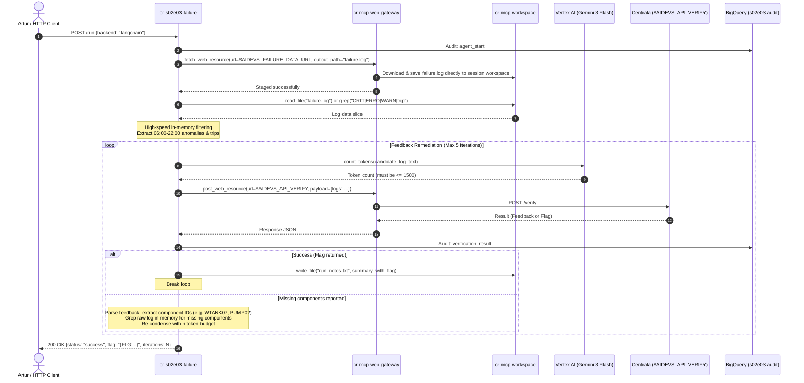

<!-- Source: https://www.industrialempathy.com/posts/design-docs-at-google/ -->
<!-- Based on: Google Design Docs structure by Malte Ubl -->
<!-- Adapted as a Technical PRD for AI-assisted implementation workflows -->

---
status: "approved"
date: 2026-09-04
author: Artur, Joi
reviewers: Artur
adr: "[ADR.md](file:///c:/Users/admin/git/arturroo/af-aidevs/lessons/s02e03-dokumenty-oraz-pamiec-dlugoterminowa-jako-narzedzia/task/ADR.md)"
---

# Technical PRD: Failure Log Compression & Autonomous Remediation (`failure`)

## Context and Scope

At the power plant, yesterday's operational cycle began at ~06:00 and ended abruptly with an automatic emergency shutdown right before 22:00. The raw operational log file (`failure.log`) contains hundreds of thousands of lines covering all sensor updates, background telemetry, warnings, errors, and system interlocks. The Centrala diagnostic platform cannot ingest the entire raw file due to a strict context limit of **1,500 tokens**.

This system builds an autonomous Cloud Run service (`cr-s02e03-failure`) that downloads `failure.log` via the secure internet gateway (`cr-mcp-web-gateway`), persists it in the shared session workspace (`cr-mcp-workspace`), explores the telemetry through targeted in-memory filtering and workspace queries, strictly verifies the token budget using Vertex AI's `count_tokens` API, and submits the condensed log to Centrala (`$AIDEVS_API_VERIFY`). If Centrala returns technician feedback specifying missing components (e.g., cooling pumps, water tanks, electrical buses), the service autonomously ingests the feedback, extracts the relevant lines from the log in memory, re-synthesizes the payload within 1,500 tokens, and re-submits until the flag `{FLG:...}` is obtained.

---

## Goals and Non-Goals

### Goals
* **Zero-Trust Network Isolation:** Route 100% of outbound external HTTP requests through `cr-mcp-web-gateway` (`fetch_web_resource` and `post_web_resource`).
* **Remote File Management:** Manage all task files (`failure.log`, `run_notes.txt`) strictly through `cr-mcp-workspace` (backed by GCS OverlayFS `gs://af-aidevs-workspaces/`).
* **In-Memory Telemetry Exploration & Compaction:** Load slices into memory via `read_file` (or inspect via `grep`), parse timestamps, severities (`[CRIT]`, `[WARN]`, `[ERRO]`), and component tags, and condense verbose text into a multi-line format (one event per line).
* **Deterministic Token Budget Enforcement:** Validate candidate payloads using Vertex AI's `count_tokens` API to guarantee the text is strictly $\le 1,500$ tokens (with a safe target of $\le 1,400$ tokens).
* **Autonomous Feedback Remediation Loop:** Parse technician feedback returned by Centrala regarding missing or vague components, extract the missing telemetry from `failure.log`, rebuild the condensed log, and re-verify iteratively (up to 5 attempts).
* **Dual Backend Parity:** Provide complete implementation support for LangChain 1.2.15 (`create_agent`) as default and modern `google-genai` SDK on Vertex AI (`gemini-3-flash-preview`), toggleable via `--backend`.
* **Complete Real-Time Traceability:** Stream structured audit events (`session_id`, `step_type`, `reasoning`, `payload`, `flag`, `timestamp`) into BigQuery dataset `s02e03.audit` with dual-schema compatibility.

### Non-Goals
* **No Direct Outbound Internet Calls:** The task container must not make direct HTTP requests to `$AIDEVS_FAILURE_DATA_URL` or `$AIDEVS_API_VERIFY`.
* **No Local Disk File Persistence:** No files may be created or depended on in the local container filesystem; all persistence resides in `cr-mcp-workspace`.
* **No Full-File Prompt Ingestion:** The agent will not attempt to feed the entire unparsed raw `failure.log` directly into LLM prompts.
* **No Manual Intervention During Refinement:** The feedback loop must run autonomously without human prompting between verification iterations.

---

## The Design

### System Overview

The solution consists of the `cr-s02e03-failure` microservice deployed on Cloud Run, interacting with two existing platform microservices (`cr-mcp-web-gateway` and `cr-mcp-workspace`), Vertex AI, and BigQuery.



---

### API Design

#### 1. Public Service Endpoints (`cr-s02e03-failure`)

* **`GET /health`**
  * Description: Health check and readiness probe.
  * Response: `{"status": "ok", "service": "cr-s02e03-failure", "version": "0.1.0"}`

* **`POST /run`**
  * Description: Triggers end-to-end failure log analysis, compression, and verification.
  * Request Body:
    ```json
    {
      "backend": "langchain",
      "session_id": "optional_override_session_id",
      "max_iterations": 5
    }
    ```
  * Response Body:
    ```json
    {
      "status": "success",
      "session_id": "s02e03_langchain_20260904_221500",
      "flag": "{FLG:...}",
      "token_count": 1380,
      "iterations": 2,
      "condensed_logs_sample": "[2026-02-26 06:04] [CRIT] ECCS8 runaway outlet temp...",
      "notes_file": "run_notes.txt"
    }
    ```

#### 2. MCP Tools Invoked by the Agent

* **`web.fetch_web_resource`** (via `cr-mcp-web-gateway`):
  * Inputs: `url: str`, `output_path: str`
  * Action: Statically fetches `$AIDEVS_FAILURE_DATA_URL` and writes directly to session workspace at `failure.log`.

* **`web.post_web_resource`** (via `cr-mcp-web-gateway`):
  * Inputs: `url: str`, `payload: Dict[str, Any]`
  * Action: POSTs candidate answer payload to `$AIDEVS_API_VERIFY`.

* **`workspace.read_file`** (via `cr-mcp-workspace`):
  * Inputs: `reasoning: str`, `file_path: str`
  * Action: Retrieves raw log slices into memory for high-speed local processing.

* **`workspace.grep`** (via `cr-mcp-workspace`):
  * Inputs: `reasoning: str`, `pattern: str`, `file_path: str`, `flags: Optional[List[str]]`
  * Action: Targeted regex search across `failure.log`.

* **`workspace.write_file`** (via `cr-mcp-workspace`):
  * Inputs: `reasoning: str`, `file_path: str`, `content: str`
  * Action: Writes `run_notes.txt` execution summary containing the captured flag.

* **`internal.count_tokens`**:
  * Inputs: `text: str`
  * Action: Calls Vertex AI `count_tokens` API using model `gemini-3-flash-preview` to verify candidate string size.

---

### Data Model & Storage

#### 1. BigQuery Audit Table (`s02e03.audit`)
* `session_id` (STRING, REQUIRED): e.g. `s02e03_langchain_20260904_221500`
* `step_type` (STRING, REQUIRED): `agent_start`, `tool_call`, `tool_result`, `llm_thought`, `verification`, `feedback_remediation`, `final_answer`
* `reasoning` (STRING, NULLABLE): LLM reasoning or component justification
* `payload` (JSON / STRING, NULLABLE): Structured event details, API payloads, or feedback
* `flag` (STRING, NULLABLE): Redacted or captured course flag
* `timestamp` (TIMESTAMP, REQUIRED): UTC timestamp of event
* `content` (STRING, NULLABLE): Standard dual-schema fallback field
* `metadata` (JSON, NULLABLE): Standard dual-schema fallback field

#### 2. Workspace File Assets (`cr-mcp-workspace`)
* `failure.log`: The raw downloaded log file.
* `run_notes.txt`: Execution log and summary written upon completion:
  ```
  Task: failure (S02E03)
  Backend: langchain
  Session ID: s02e03_langchain_20260904_221500
  Timestamp: 2026-09-04 22:18:45 CEST
  Token Count: 1385 / 1500
  Iterations: 2
  Status: SUCCESS
  Flag: {FLG:...}
  ```

---

### Core Logic & Algorithms

#### 1. In-Memory Telemetry Filtering & Compaction Engine
1. **Timestamp Normalization & Boundary:** Filter logs between 06:00 (startup) and 22:00 (shutdown).
2. **Deterministic Severity Extraction:**
   - Always extract lines containing `[CRIT]`, `[ERRO]`, `[WARN]`, `trip`, `scram`, `interlock`, `override`, `threshold`.
3. **Core Subsystem Filtering:**
   - Power supply / grid (`PWR`, voltage, ripple, bus).
   - Cooling & emergency cooling (`ECCS`, `COOL`, loop, temp).
   - Water tanks & pumps (`WTANK`, `PUMP`, pressure, coolant level).
   - Automation & controller logic (`CTRL`, `SYS`, trip).
4. **Log Line Compression & Paraphrasing:**
   - Format: `[YYYY-MM-DD HH:MM] [SEVERITY] COMPONENT_ID Concise summary`
   - Strips repetitive formatting noise while retaining the exact alphanumeric ID, timestamp, and core physical event (e.g. `coolant below critical threshold, hard trip initiated`).
5. **Token Count Verification:**
   - Candidate payload is checked against Vertex AI `count_tokens`.
   - If $> 1,400$ tokens, apply progressive reduction (summarize multiple warnings for identical component into a single range, trim minor warnings, prioritize CRIT/ERRO).

#### 2. Feedback-Driven Remediation Loop
1. Submit payload via `post_web_resource` to `$AIDEVS_API_VERIFY`.
2. Inspect response:
   - If `code == 0` or response contains `{FLG:...}`: Save flag and exit loop.
   - If response contains feedback (e.g., `"Brakuje informacji o pompie PUMP02"` or `"Brak szczegółów dotyczących zasilania WTANK07"`):
     - Extract entity names and keywords using regex or LLM structured extraction.
     - Query `failure.log` in memory specifically for those entities.
     - Merge the missing events into the condensed log list while strictly observing chronological order.
     - Re-validate token count $\le 1,500$.
     - Increment iteration count and re-submit (up to 5 attempts).

---

### Infrastructure & Deployment

* **IaC Engine:** Terraform with Google Provider `~> 7.0`.
* **Compute:** Cloud Run service `cr-s02e03-failure`.
  * CPU: 1 vCPU, Memory: 1 GiB.
  * Request Timeout: `600s` (to support multi-hop agentic exploration and iterative verification).
  * Concurrency: 80.
* **Service Account:** `sa-cr-s02e03-failure` (21 characters):
  * `roles/bigquery.dataEditor` on dataset `s02e03`.
  * `roles/aiplatform.user` for Vertex AI model and token counting.
  * `roles/run.invoker` on `cr-mcp-web-gateway` and `cr-mcp-workspace`.
* **Environment Variables:**
  * `AIDEVS_API_KEY`: Secret Manager / `.env`
  * `AIDEVS_API_VERIFY`: Secret Manager / `.env`
  * `AIDEVS_FAILURE_DATA_URL`: Secret Manager / `.env`
  * `MCP_WEB_GATEWAY_URL`: Cloud Run URL for `cr-mcp-web-gateway`
  * `MCP_WORKSPACE_URL`: Cloud Run URL for `cr-mcp-workspace`
  * `GCP_PROJECT`: `af-aidevs`
  * `GOOGLE_CLOUD_LOCATION`: `europe-west6` (or `global`)

---

## Cross-Cutting Concerns

### Security
* **No Raw URL Exposure:** No platform or course URLs are committed; all resolved via environment variables.
* **No Public Flag Exposure:** Course flags are never committed or logged in plaintext to git or public docs.
* **Zero-Trust Egress:** The service container has no direct external access; all outbound calls go through `cr-mcp-web-gateway` with OIDC authentication.
* **IAM Least Privilege:** The service account has only invoker roles on necessary Cloud Run services and editor roles on its specific BigQuery dataset.

### Observability
* **BigQuery Telemetry:** Every execution step is written to `s02e03.audit` with `ignore_unknown_values=True`.
* **Structured Stdout:** Container logs are emitted to stdout as structured JSON matching Google Cloud Logging standards.
* **X-Session-ID Header:** Propagated across all MCP and internal service calls.

### Error Handling & Resilience
* **MCP Connection Resiliency:** Uses `tenacity` retry with exponential backoff on OIDC token retrieval and MCP tool invocations.
* **LangChain Tool Fault Tolerance:** Every tool has `handle_tool_error = True` to catch runtime tool exceptions and return self-correcting error messages to the model instead of halting execution.
* **Token Margin of Safety:** Uses a conservative threshold ($\le 1,400$ tokens) against the 1,500 ceiling to account for potential tokenizer variance.

---

## Edge Cases and Constraints

### Edge Cases
1. **Technician feedback specifies an ambiguous component:** The feedback mentions a vague subsystem (e.g. "zasilanie awaryjne") without an explicit ID. The remediation engine searches for keywords (`emergency`, `battery`, `ups`, `aux`, `bus`) across the log.
2. **Missing events push token count over 1,500:** The engine prioritizes CRIT over WARN and compresses description strings to keep the total token count under the threshold.
3. **Empty or malformed feedback from Centrala:** Fallback to standard agent re-evaluation and detailed log inspection.

### Constraints
* Hard token limit: $\le 1,500$ tokens.
* Python version: strictly `3.13.5` (`requires-python = "==3.13.5"`).
* Cloud Run SA length limit: $\le 30$ chars (`sa-cr-s02e03-failure` is 21 chars).
* Cloud Run timeout: configured to `600s`.

---

## Implementation Plan

### Phases / Milestones

| Phase | Scope | Deliverable |
|---|---|---|
| 1 | Schemas & Config | `schemas.py`, `config.py`, `system_prompt.md`, `pyproject.toml` |
| 2 | Telemetry & Token Services | `token_service.py`, `failure_service.py`, `mcp_service.py`, `audit_service.py` |
| 3 | Agent Implementations | `agents/base.py`, `agents/langchain_agent.py`, `agents/adk_agent.py`, `agents/factory.py` |
| 4 | Entrypoints & CLI | `main.py` (FastAPI app + CLI argparse), Docker assets |
| 5 | Infrastructure & Tests | Terraform updates (`bq-s02e03`, `cr-s02e03-failure`), unit tests |
| 6 | Verification & Execution | Run end-to-end execution, retrieve flag, and commit clean code |

---

## Success Criteria

* [ ] Full `failure.log` is successfully staged into `cr-mcp-workspace` using `cr-mcp-web-gateway.fetch_web_resource`.
* [ ] Candidate condensed log is generated and verified with Vertex AI `count_tokens` to be $\le 1,500$ tokens.
* [ ] Verification payload is submitted to `$AIDEVS_API_VERIFY` using `cr-mcp-web-gateway.post_web_resource`.
* [ ] Technician feedback regarding missing components is parsed and automatically resolved via in-memory log lookup.
* [ ] Final completion flag `{FLG:...}` is captured, written to `run_notes.txt`, and returned in the HTTP/CLI response.
* [ ] All execution steps are recorded in BigQuery table `s02e03.audit`.

---

## Open Questions

* None. Architectural and operational decisions have been finalized and accepted in ADR.md.

---

## Implementation Spec

### File Structure

```
lessons/s02e03-dokumenty-oraz-pamiec-dlugoterminowa-jako-narzedzia/task/cr-s02e03-failure/
├── .dockerignore
├── .gcloudignore
├── .python-version
├── Dockerfile
├── Procfile
├── cloudbuild.yaml
├── pyproject.toml
├── config.py
├── schemas.py
├── system_prompt.md
├── main.py
├── agents/
│   ├── __init__.py
│   ├── base.py
│   ├── factory.py
│   ├── langchain_agent.py
│   └── adk_agent.py
├── services/
│   ├── __init__.py
│   ├── audit_service.py
│   ├── token_service.py
│   ├── mcp_service.py
│   └── failure_service.py
└── tests/
    ├── __init__.py
    ├── test_schemas.py
    ├── test_failure_service.py
    └── test_token_service.py
```

### Technology Stack & Exact Versions
* `python = "3.13.5"`
* `fastapi == 0.136.1`
* `uvicorn == 0.46.0`
* `pydantic == 2.13.4`
* `httpx == 0.28.1`
* `google-cloud-bigquery == 3.41.0`
* `google-genai == 1.74.0`
* `langchain == 1.2.15`
* `langchain-google-genai == 4.2.2`
* `langchain-mcp-adapters == 0.1.0`
* `python-dotenv == 1.2.2`
* `python-frontmatter == 1.1.0`
* `tenacity == 9.0.0`
* `tzdata == 2026.2`
* `pytest == 9.0.3`
* `pytest-asyncio == 1.3.0`
* `af-aidevs == 0.1.0` (from private GAR repository)

### Step-by-Step Implementation Order
1. **Config, Schemas & System Prompt:** Build `config.py`, `schemas.py`, and `system_prompt.md`.
2. **Services Layer:**
   - `mcp_service.py`: Wraps `cr-mcp-web-gateway` and `cr-mcp-workspace`.
   - `token_service.py`: Implements Vertex AI `count_tokens`.
   - `audit_service.py`: BigQuery streaming logger with session ID generator.
   - `failure_service.py`: In-memory log parser, deterministic filtering, and technician feedback remediation.
3. **Agent Layer:**
   - `agents/base.py`: Abstract agent base class.
   - `agents/langchain_agent.py`: LangChain 1.2.15 `create_agent` with registered tools and `BigQueryCallbackHandler`.
   - `agents/adk_agent.py`: Google GenAI SDK implementation.
   - `agents/factory.py`: Instantiates the requested agent backend.
4. **Application Entrypoint:**
   - `main.py`: FastAPI server (`/health`, `/run`) and standalone CLI runner.
5. **Container & Deployment Configuration:**
   - `Dockerfile`, `Procfile`, `cloudbuild.yaml`, `.dockerignore`, `.gcloudignore`.
6. **Terraform & Infrastructure:**
   - Define dataset `s02e03` and table `audit` in Terraform.
   - Configure `cr-s02e03-failure` module and IAM role bindings.
7. **Testing & Execution:**
   - Execute test suite and run CLI to capture the flag `{FLG:...}`.

### Acceptance Criteria
* [ ] Service directory `cr-s02e03-failure` compiles cleanly with `uv sync`.
* [ ] Unit tests pass for schemas, log parsing, token counting, and feedback extraction.
* [ ] No raw external URLs or secrets are hardcoded in code or configuration.
* [ ] Log downloading routes strictly through `cr-mcp-web-gateway.fetch_web_resource` to `cr-mcp-workspace`.
* [ ] Verification requests route strictly through `cr-mcp-web-gateway.post_web_resource`.
* [ ] Candidate log token count is validated $\le 1,500$ tokens before submission.
* [ ] Feedback remediation loop correctly resolves missing components.
* [ ] Execution finishes successfully with a valid course flag `{FLG:...}`.
* [ ] Real-time execution logs are persisted to BigQuery dataset `s02e03.audit`.
* [ ] Run notes are saved to `run_notes.txt` in the session workspace.

### Out-of-Scope for Agent (Human Required)
* None. Cloud Run service accounts and IAM bindings are fully automated through Terraform and gcloud.
