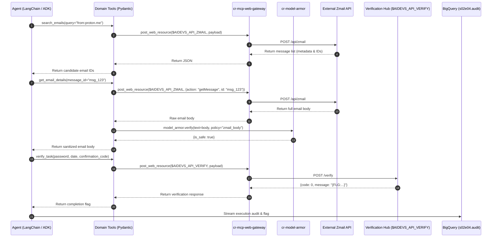

# Architectural Decision Record: Zero-Trust Autonomous Mailbox Investigation Agent (`cr-s02e04-mailbox`)

## Context and Problem Statement

In task `mailbox` (lesson `s02e04`), an operative has secured access to an operator's email inbox on the System network. A resistance defector named Wiktor (`proton.me`) has reported our team and the power plant to the System. Our objective is to search the inbox via the specialized Zmail API and extract three critical attributes:
1. `date`: Scheduled date of the security department's assault on our power plant (`YYYY-MM-DD`).
2. `password`: Internal employee system password located in mailbox history.
3. `confirmation_code`: Security ticket confirmation code (`SEC-` + 28 characters = 32 characters total).

Crucially, the mailbox is live and dynamic: new security tickets or replies may land during agent execution. Furthermore, external emails from hostile actors pose an indirect prompt injection risk. 

How should we design, package, secure, and orchestrate the mailbox inspection agent so that:
- The agent has **zero direct outbound internet access**, delegating all external requests through `cr-mcp-web-gateway`?
- All ingested email bodies are sanitized against prompt injections via `cr-model-armor` and our shared `af_aidevs.model_armor` SDK?
- Both **LangChain (1.2.15)** and **Google ADK (Agent Development Kit)** are supported with **Gemini 3.8 Flash** (`gemini-3.8-flash`) and `thinking_level="low"`?
- The agent autonomously handles live polling and streams comprehensive telemetry to BigQuery dataset `s02e04`?

---

## Decision Drivers

* **Zero-Trust Egress Isolation (`cr-mcp-web-gateway`)**: Enforce absolute network isolation for the container; no direct sockets or HTTP clients to external hosts. All calls to `$AIDEVS_API_ZMAIL` and `$AIDEVS_API_VERIFY` must pass through the `cr-mcp-web-gateway` microservice.
* **Adversarial Ingestion Defense (`cr-model-armor`)**: Third-party emails from unverified senders (Wiktor, system broadcasts) must be screened via `af_aidevs.model_armor` before passing content to the LLM context.
* **Dual-Framework Mastery (LangChain 1.2.15 & Google ADK)**: Support both modern agent frameworks with a clean `--backend` CLI flag (defaulting to `langchain`), adhering to Google Cloud best practices.
* **Model Optimization**: Default to **Gemini 3.8 Flash** (`gemini-3.8-flash`) with `thinking_level="low"` to minimize latency and token consumption while maintaining high extraction accuracy.
* **Active Mailbox Polling**: Resilient retry loop with backoff and a bounded iteration budget (5-10 iterations) to discover asynchronously arriving tickets.
* **Observability & Auditing**: Stream real-time structured telemetry to BigQuery dataset `s02e04` (table `audit`) with standardized `X-Session-ID` propagation.

---

## Considered Options

### Architectural Paradigm: Tool Stacking vs. Service Layer Facade

* **Option 1A (Chosen - Service Layer Facade with `@traceable`)**:
  Domain tools exposed to the agent (`zmail_api_call`, `get_email_details`, `verify_task`) call ordinary Python methods on `MCPService`. Network egress is delegated to `cr-mcp-web-gateway.post_web_resource` over OIDC, while email bodies are passed through `af_aidevs.model_armor.verify`. To achieve 100% observability in LangSmith, service methods are decorated with LangSmith's `@traceable(run_type="tool", name="mcp.post_web_resource")`, creating explicit child tool spans in the LangSmith trace without any tool-nesting runtime hacks.
* **Option 1B (Tool Stacking - `@tool` calling `@tool.ainvoke()`)**:
  The agent's high-level tools internally invoke registered LangChain `BaseTool` instances for MCP. Considered an **anti-pattern** in production agentic engineering because nested tool invocations bypass LangChain's standard state transition graph, risk orphaned `tool_call_id` pairings, complicate async loop handling in LangGraph/ADK, and impede unit testing.
* **Option 2 (Direct Outbound HTTP Calls)**:
  Agent uses standard `httpx` directly to external endpoints, bypassing `cr-mcp-web-gateway` and `cr-model-armor`.
* **Option 3 (Raw Low-Level MCP Passthrough)**:
  Directly exposing `fetch_web_resource` and `post_web_resource` to the LLM without domain wrappers or inline Model Armor screening.

---

## Decision Outcome

Chosen option: **Option 1A (Service Layer Facade with `@traceable` & Dynamic Zmail Discovery)**, because:
1. **Zero-Trust Network Isolation**: The agent container has no direct internet access; all outbound calls route through `cr-mcp-web-gateway`.
2. **Dynamic API Discovery & Two-Stage Retrieval**: Because Zmail actions and parameters are explicitly published by the `action: "help"` endpoint, the tool layer supports dynamic parameter execution (`zmail_api_call` with actions like `help`, `getInbox`, and search queries), avoiding fragile assumptions about endpoint parameter naming.
3. **In-Flight Model Armor Screening**: When full email bodies are fetched (stage 2), `get_email_details` automatically triggers `af_aidevs.model_armor.verify(body, policy_context="zmail_body", session_id=session_id)` before returning text to the LLM.
4. **LangSmith Observability without Anti-Patterns**: Decorating `MCPService` methods with `@traceable(run_type="tool")` generates clean child tool spans in LangSmith, providing full visibility into gateway latency, request payloads, and status codes without brittle tool stacking.
5. **Dual-Framework Implementation**: Seamlessly shared between LangChain 1.2.15 (`create_agent`) and Google ADK (`google-adk==1.33.0`) using `gemini-3.8-flash` and `thinking_level="low"`.
6. **Workspace & In-Memory Efficiency**: `post_web_resource` returns parsed JSON directly in-memory to the tool for fast agent consumption, while optionally archiving raw responses into `cr-mcp-workspace` for persistent auditing.

### Consequences

* **Good**: Simple, robust implementation and straightforward debugging. No nested `@tool` side-effects.
* **Good**: Full observability in LangSmith (`@traceable`) and BigQuery (`dataset: s02e04`).
* **Good**: Ingestion protection: LLM never sees unverified email bodies.
* **Good**: Resilient to API schema discovery: agent first queries `help`, then crafts valid search queries.
* **Neutral**: Multi-hop microservice calls require valid OIDC tokens (`roles/run.invoker` on `cr-mcp-web-gateway` and `cr-model-armor`).
* **Bad**: Slight latency overhead due to multi-hop calls (Agent $\rightarrow$ Gateway $\rightarrow$ Zmail API, and Agent $\rightarrow$ Model Armor). Mitigated by `thinking_level="low"` and efficient caching.

### Confirmation

Compliance will be confirmed via:
1. Automated unit tests verifying that tool implementations route outbound HTTP exclusively through `cr-mcp-web-gateway`.
2. Unit tests confirming that `get_email_details` invokes `model_armor.verify` and quarantines flagged text.
3. Successful execution of both `--backend langchain` and `--backend adk` returning the final course flag `{FLG:...}`.
4. Verification of BigQuery rows in dataset `s02e04`, table `audit`.

---

## Pros and Cons of the Options

### Option 1: Zero-Trust Orchestration with Gateway, Model Armor & Dual Frameworks

An autonomous Cloud Run microservice (`cr-s02e04-mailbox`) exposing `/run` and `/health`, alongside a local CLI. High-level domain tools are provided to the agent (`get_api_help`, `search_emails`, `get_email_details`, `verify_task`). All outbound HTTP traffic is dispatched through `cr-mcp-web-gateway`. Email bodies are pre-screened with `af_aidevs.model_armor.verify`. Both LangChain 1.2.15 and Google ADK are fully implemented with `gemini-3.8-flash`.

* **Good, because** enforces Zero-Trust network isolation (container cannot make direct external internet calls).
* **Good, because** protects against indirect prompt injections hidden inside compromised mailbox emails.
* **Good, because** provides type-safe Pydantic contracts with mandatory `reasoning` and progressive `hint` disclosure.
* **Good, because** fully supports both LangChain 1.2.15 and Google ADK with unified configuration.
* **Neutral, because** requires service account IAM permissions (`roles/run.invoker` on `cr-mcp-web-gateway` and `cr-model-armor`).
* **Bad, because** introduces additional microservice dependencies.

### Option 2: Direct Outbound HTTP Calls with LangChain Only

The agent uses `httpx` or `requests` directly inside Python tool functions to talk to `$AIDEVS_API_ZMAIL` and `$AIDEVS_API_VERIFY`. Model Armor is bypassed.

* **Good, because** simpler codebase with fewer service hops and slightly lower latency.
* **Bad, because** violates core architectural rule: zero direct outbound internet access from agent containers.
* **Bad, because** leaves the agent vulnerable to prompt injections and data exfiltration from untrusted emails.
* **Bad, because** lacks Google ADK implementation, missing course learning objectives.

### Option 3: Exposing Raw Low-Level MCP Tools (`fetch_web_resource`, `post_web_resource`)

Instead of domain-specific tools, the raw tools from `cr-mcp-web-gateway` are exposed directly to the LLM agent.

* **Good, because** no custom Python tool wrappers need to be written.
* **Bad, because** exposes raw internal URLs and complex JSON payloads directly to the LLM, dramatically increasing prompt hallucinations and token overhead.
* **Bad, because** Model Armor inspection cannot be transparently inserted between retrieval and prompt ingestion.
* **Bad, because** fails Contract-First API Design standards (AIP compliance).

---

## Technical Specifications & Architecture

### Service Topology



### Component Directory Layout

```
lessons/s02e04-organizowanie-kontekstu-dla-wielu-watkow/task/
├── BRD.md
├── ADR.md
├── PRD.md
└── cr-s02e04-mailbox/
    ├── Dockerfile
    ├── Procfile
    ├── cloudbuild.yaml
    ├── .dockerignore
    ├── .gcloudignore
    ├── .python-version
    ├── pyproject.toml
    ├── config.py
    ├── main.py
    ├── system_prompt.md
    ├── schemas.py
    ├── agents/
    │   ├── __init__.py
    │   ├── base.py
    │   ├── factory.py
    │   ├── langchain_agent.py
    │   └── adk_agent.py
    ├── services/
    │   ├── __init__.py
    │   ├── audit_service.py
    │   ├── mcp_service.py
    │   └── mailbox_service.py
    └── tests/
        ├── __init__.py
        ├── test_schemas.py
        └── test_mailbox_service.py
```

### Tool Contracts (`schemas.py`)

1. **`HelpRequest` / `HelpResponse`**:
   - Discovers available actions and supported parameters on Zmail API.
2. **`SearchEmailsRequest` / `SearchEmailsResponse`**:
   - Executes targeted queries using Gmail operators (`from:`, `to:`, `subject:`, `OR`, `AND`) with mandatory `reasoning` and progressive `hint`.
3. **`GetEmailDetailsRequest` / `GetEmailDetailsResponse`**:
   - Fetches full email text by message ID, automatically screening through `af_aidevs.model_armor.verify`.
4. **`VerifyTaskRequest` / `VerifyTaskResponse`**:
   - Submits `date`, `password`, and `confirmation_code` to `$AIDEVS_API_VERIFY` via `cr-mcp-web-gateway`.

### Dependencies & Exact Versions (`pyproject.toml`)

Consistent with established repository standards (`cr-s01e05-agent`, `cr-s02e01-context-categorizer`, `cr-s02e02-electricity`):
- `requires-python = "==3.13.5"`
- Dependencies (strictly pinned & alphabetically sorted):
  - `af-aidevs==0.2.1` (private Artifact Registry index)
  - `fastapi==0.136.1`
  - `fastmcp==3.2.4`
  - `google-adk==1.33.0`
  - `google-cloud-bigquery==3.41.0`
  - `google-genai==1.74.0`
  - `httpx==0.28.1`
  - `langchain==1.2.15`
  - `langchain-google-genai==4.2.2`
  - `langfuse==2.57.0`
  - `pydantic==2.13.4`
  - `pytest==8.3.5`
  - `pytest-asyncio==0.25.3`
  - `python-dotenv==1.2.2`
  - `python-frontmatter==1.1.0`
  - `tenacity==9.0.0`
  - `tzdata==2026.2`
  - `uvicorn==0.46.0`
