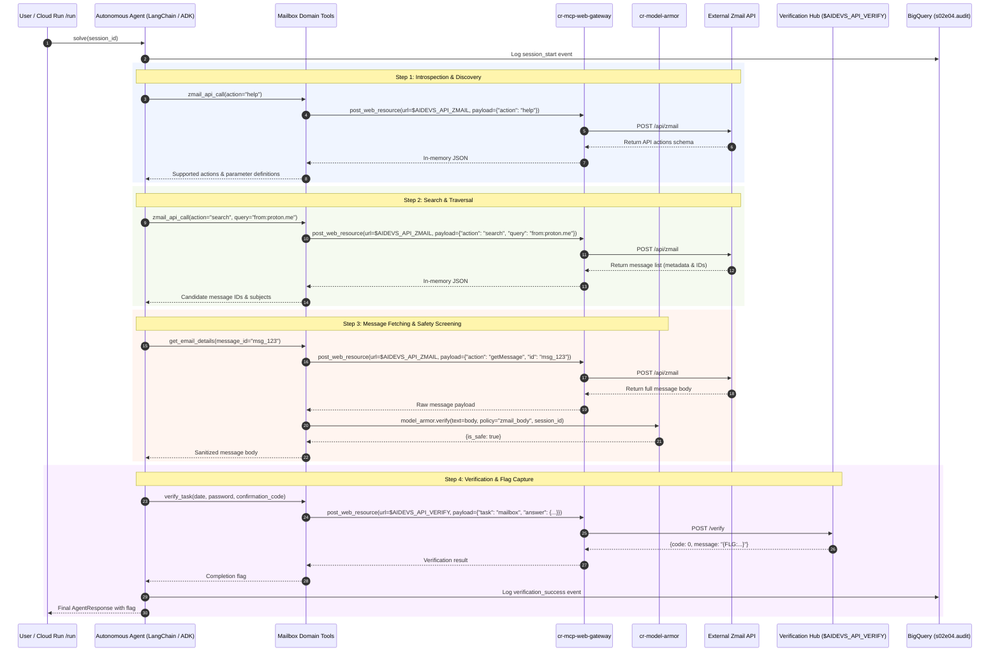

# Technical Design Document: Zero-Trust Mailbox Investigation Agent (`cr-s02e04-mailbox`)

## Context and Scope

In lesson `s02e04` (Task: `mailbox`), an operative within the resistance compromised access to an email inbox belonging to an operator of the hostile System. Intelligence reports indicate that a defector within the resistance named **Wiktor** (operating from an anonymous address on the `proton.me` domain) has betrayed the resistance and sent a formal denunciation to the System regarding our team, our ongoing restoration of the power plant, and our operational objectives.

The objective of this service is to autonomously inspect, search, and extract three critical data points from the target mailbox via the specialized `zmail` JSON API:
1. **`date`**: Scheduled date of the security department's attack on the power plant (strictly in `YYYY-MM-DD` format).
2. **`password`**: Internal employee system password located within historical mailbox correspondence.
3. **`confirmation_code`**: Security ticket confirmation code issued by the security department (strictly matching regex `^SEC-[A-Za-z0-9]{28}$`, totaling exactly 32 characters).

The environment features two defining technical challenges:
* **Active, Asynchronous Mailbox**: The mailbox is actively in use; new tickets, replies, and security department broadcasts land asynchronously during execution. The service must employ an autonomous polling loop with backoff to capture newly arriving items.
* **Adversarial Ingestion Risk**: Ingesting raw, untrusted email bodies from third-party or hostile actors introduces indirect prompt injection and jailbreak threats.

Architectural decisions finalized in [ADR.md](file:///c:/Users/admin/git/arturroo/af-aidevs/lessons/s02e04-organizowanie-kontekstu-dla-wielu-watkow/task/ADR.md) govern this implementation:
- **Zero Direct Egress**: The agent container has no direct outbound public internet access; all requests to `$AIDEVS_API_ZMAIL` and `$AIDEVS_API_VERIFY` route through `cr-mcp-web-gateway.post_web_resource` via OIDC identity tokens.
- **Service Layer Facade with `@traceable`**: Domain tools call ordinary methods on `MCPService`. Service methods are decorated with LangSmith's `@traceable(run_type="tool", name="mcp.post_web_resource")` to produce first-class child spans in LangSmith traces, strictly avoiding the tool-stacking anti-pattern.
- **In-Flight Model Armor Screening**: When full email bodies are retrieved, the system screens them via `af_aidevs.model_armor.verify` (`cr-model-armor`) before passing text to the LLM context.
- **Dual Framework Support**: Full support for both **LangChain 1.2.15** (`create_agent`) and **Google ADK** (`google-adk==1.33.0`) with `--backend` selection (defaulting to `langchain`).
- **Primary LLM**: **Gemini 3.8 Flash** (`gemini-3.8-flash`) on Vertex AI with `thinking_level="low"` (or `types.ThinkingLevel.LOW`) to minimize latency and token overhead.

---

## Goals and Non-Goals

### Goals
* **Automated Two-Stage Mailbox Traversal**: Dynamically query `action: "help"` on Zmail API, execute structured Gmail-style search queries (`from:proton.me`, `hasło`, `security`, `ticket`), and fetch candidate email bodies by message ID.
* **Zero-Trust Network Isolation**: Route 100% of outbound HTTP requests through `cr-mcp-web-gateway` (`post_web_resource`).
* **Prompt Injection Defense**: Validate all untrusted email contents against `cr-model-armor` (`af_aidevs.model_armor.verify`) prior to LLM analysis.
* **Autonomous Polling**: Implement backoff retries with an iteration ceiling (up to 10 iterations) to discover asynchronously arriving security tickets.
* **Dual Framework Parity**: Provide identical capabilities, schemas, and telemetry across both LangChain 1.2.15 and Google ADK 1.33.0.
* **Comprehensive Observability**: Stream every thought, tool call, query, and verification attempt to BigQuery dataset `s02e04` (`audit` table) and generate first-class child tool spans in LangSmith.

### Non-Goals
* Exposing low-level HTTP parameters (raw URLs, auth tokens, custom headers) directly to the LLM agent.
* Stacking LangChain `@tool` objects inside other `@tool` objects (avoided as an architectural anti-pattern).
* Building custom web scrapers or handling non-JSON protocols (Zmail and Verify APIs are strictly JSON-RPC/REST).

---

## The Design

### System Overview



---

### API Design

#### Cloud Run Endpoints (`main.py`)
1. **`GET /health`**:
   - Response: `{"status": "ok", "service": "cr-s02e04-mailbox", "timestamp": "..."}`
2. **`POST /run`**:
   - Request Body:
     ```json
     {
       "backend": "langchain",
       "max_iterations": 10
     }
     ```
   - Response Body:
     ```json
     {
       "status": "success",
       "session_id": "s02e04_langchain_20260908_153000",
       "flag": "{FLG:...}",
       "answer": {
         "date": "YYYY-MM-DD",
         "password": "...",
         "confirmation_code": "SEC-..."
       },
       "iterations": 3,
       "backend": "langchain"
     }
     ```

#### CLI Interface (`main.py`)
```bash
python main.py --backend langchain --max-iterations 10
python main.py --backend adk --max-iterations 10
```

---

### Tool Contracts & Schemas (`schemas.py`)

All schemas inherit from Pydantic `BaseModel` with explicit descriptions and examples:

1. **`ZmailCallRequest`**:
   ```python
   class ZmailCallRequest(BaseModel):
       action: str = Field(description="Zmail API action (e.g., 'help', 'getInbox', 'search', 'getMessage')", example="help")
       params: Dict[str, Any] = Field(default_factory=dict, description="Optional parameters for the action (e.g. {'query': 'from:proton.me', 'page': 1})", example={"query": "from:proton.me"})
       reasoning: str = Field(description="Mandatory justification for invoking this action", example="Querying mailbox for emails from Wiktor (proton.me) to find power plant attack plans.")
   ```

2. **`ZmailCallResponse`**:
   ```python
   class ZmailCallResponse(BaseModel):
       action: str
       result: Dict[str, Any]
       hint: Optional[str] = Field(default=None, description="Progressive instruction on next investigation steps")
   ```

3. **`GetEmailDetailsRequest`**:
   ```python
   class GetEmailDetailsRequest(BaseModel):
       message_id: str = Field(description="Unique identifier of the email message to fetch", example="msg_84920")
       reasoning: str = Field(description="Why this specific message needs full body inspection", example="Inspecting body of email from security department for ticket confirmation code.")
   ```

4. **`GetEmailDetailsResponse`**:
   ```python
   class GetEmailDetailsResponse(BaseModel):
       message_id: str
       subject: str
       sender: str
       body: str
       is_sanitized: bool = Field(description="Indicates whether content was screened and passed by Model Armor")
       hint: Optional[str] = None
   ```

5. **`VerifyTaskRequest`**:
   ```python
   class VerifyTaskRequest(BaseModel):
       date: str = Field(description="Attack date in YYYY-MM-DD format", example="2026-02-28")
       password: str = Field(description="Employee system password found in mailbox", example="secretPass123")
       confirmation_code: str = Field(description="Security ticket code matching ^SEC-[A-Za-z0-9]{28}$", example="SEC-A1B2C3D4E5F6G7H8I9J0K1L2M3N4")
       reasoning: str = Field(description="Justification verifying all three values are collected and validated", example="Extracted date from Wiktor's email, password from welcome mail, and code from security ticket.")
   ```

6. **`VerifyTaskResponse`**:
   ```python
   class VerifyTaskResponse(BaseModel):
       status: str
       flag: Optional[str] = None
       feedback: Optional[str] = None
       hint: Optional[str] = None
   ```

---

### Data Model & Observability

#### BigQuery Telemetry Table (`s02e04.audit`)
* Schema:
  - `session_id` (STRING, format: `s02e04_{backend}_{YYYYMMDD_HHMMSS}`)
  - `timestamp` (TIMESTAMP)
  - `actor` (STRING: `agent`, `system`, `mcp`, `model-armor`, `user`)
  - `step_type` (STRING: `session_start`, `api_call`, `message_fetch`, `safety_verification`, `verify_attempt`, `task_complete`)
  - `content` (STRING: Summary of action or thought)
  - `metadata` (JSON / STRING: Detailed payloads, status codes, query strings)
  - `flag` (STRING: Redacted or captured flag)

#### LangSmith Tracing
* Service client methods (`post_web_resource`) decorated with `@traceable(run_type="tool", name="mcp.post_web_resource")`.
* Child spans capture:
  - Gateway URL, target URL (`$AIDEVS_API_ZMAIL`), payload, latency, and HTTP status.
  - Model Armor verification latency and verdict.

---

### Core Logic & Execution Loop

1. **Session Bootstrap**:
   - Generate session ID: `s02e04_{backend}_{datetime.now(ZoneInfo('Europe/Zurich')).strftime('%Y%m%d_%H%M%S')}`.
   - Initialize `AuditService` and stream `session_start` to BigQuery.
2. **API Discovery**:
   - Invoke `action: "help"` to discover supported actions.
3. **Iterative Search & Extraction (with Polling)**:
   - For `iteration` in `1..max_iterations`:
     - Search emails matching `from:proton.me` (Wiktor's denunciation $\rightarrow$ extracts scheduled attack `date`).
     - Search emails matching `password` / `hasło` / `dostęp` (extracts employee system `password`).
     - Search emails matching `ticket` / `security` / `bezpieczeństwo` / `SEC-` (extracts `confirmation_code`).
     - For candidate message IDs, call `get_email_details`:
       - Gateway fetches raw message body.
       - Hook calls `await model_armor.verify(body, policy_context="zmail_body", session_id=session_id)`.
       - If safe, returns body; if flagged, quarantines and logs alert.
     - Validate extracted fields against formats (`date`: `YYYY-MM-DD`, `confirmation_code`: `^SEC-[A-Za-z0-9]{28}$`).
     - If all three values are found $\rightarrow$ proceed to Step 4.
     - If any value is missing $\rightarrow$ sleep with linear/exponential backoff (e.g., 3-5 seconds) and retry search query to catch newly arrived emails.
4. **Verification Submission**:
   - Dispatch POST request to `$AIDEVS_API_VERIFY` with `{"task": "mailbox", "answer": {"date": ..., "password": ..., "confirmation_code": ...}}` via `cr-mcp-web-gateway.post_web_resource`.
   - If hub returns completion flag `{FLG:...}`, log `task_complete` to BigQuery, record summary to `run_notes.txt`, and return `RunTaskResponse`.
   - If hub returns error/rejection feedback, ingest feedback into prompt, refine search, and loop.

---

### Infrastructure & Deployment

* **Target Compute**: Google Cloud Run (`cr-s02e04-mailbox`).
* **Service Account**: `sa-cr-s02e04-mailbox` with roles:
  - `roles/run.invoker` on `cr-mcp-web-gateway` and `cr-model-armor`.
  - `roles/bigquery.dataEditor` and `roles/bigquery.jobUser` on dataset `s02e04`.
  - `roles/aiplatform.user` on Google Cloud project `af-aidevs`.
* **Execution Timeout**: Configured for `timeout = "600s"`.
* **Environment Variables & Secrets**:
  - `AIDEVS_API_KEY`: Secret Manager binding
  - `AIDEVS_API_VERIFY`: Secret Manager binding
  - `AIDEVS_API_ZMAIL`: Secret Manager binding
  - `MCP_WEB_GATEWAY_URL`: Secret Manager binding
  - `MODEL_ARMOR_URL`: Secret Manager binding
  - `BQ_DATASET`: `s02e04`
  - `GOOGLE_CLOUD_PROJECT`: `af-aidevs`
  - `GOOGLE_CLOUD_LOCATION`: `global`

---

## Cross-Cutting Concerns

### Security
* **Zero-Trust Egress**: Agent container has no outbound internet route; all external calls pass through `cr-mcp-web-gateway` with authenticated Google Cloud OIDC tokens.
* **Model Armor Screening**: Zero untrusted text enters the LLM context without passing `cr-model-armor`.
* **Credential Hygiene**: API keys and external endpoints are resolved strictly from environment variables; course flags are redacted from git commits.

### Observability
* Dual-pipeline telemetry: BigQuery structured rows (`af_aidevs.audit.bigquery`) and LangSmith distributed traces with `@traceable` child tool spans.
* Structured JSON emitted to `stdout` for Cloud Logging ingestion.

### Resilience & Error Handling
* In LangChain, all tools have `tool.handle_tool_error = True` to prevent unhandled exceptions from terminating the agent execution graph.
* Network timeouts with `tenacity` retry logic (exponential backoff, 3 retries max per MCP call).

---

## Implementation Spec

### File Structure

```
lessons/s02e04-organizowanie-kontekstu-dla-wielu-watkow/task/
├── BRD.md
├── ADR.md
├── PRD.md
└── cr-s02e04-mailbox/
    ├── .dockerignore
    ├── .gcloudignore
    ├── .python-version
    ├── Dockerfile
    ├── Procfile
    ├── cloudbuild.yaml
    ├── pyproject.toml
    ├── config.py
    ├── main.py
    ├── system_prompt.md
    ├── schemas.py
    ├── agents/
    │   ├── __init__.py
    │   ├── base.py
    │   ├── factory.py
    │   ├── langchain_agent.py
    │   └── adk_agent.py
    ├── services/
    │   ├── __init__.py
    │   ├── audit_service.py
    │   ├── mcp_service.py
    │   └── mailbox_service.py
    └── tests/
        ├── __init__.py
        ├── test_schemas.py
        └── test_mailbox_service.py
```

### Technology Stack & Exact Versions (`pyproject.toml`)

```toml
[project]
name = "cr-s02e04-mailbox"
version = "0.1.0"
description = "S02E04: Zero-Trust Mailbox Investigation Agent with Gateway and Model Armor"
requires-python = "==3.13.5"
dependencies = [
    "af-aidevs==0.2.1",
    "fastapi==0.136.1",
    "fastmcp==3.2.4",
    "google-adk==1.33.0",
    "google-cloud-bigquery==3.41.0",
    "google-genai==1.74.0",
    "httpx==0.28.1",
    "langchain==1.2.15",
    "langchain-google-genai==4.2.2",
    "langfuse==2.57.0",
    "pydantic==2.13.4",
    "pytest==8.3.5",
    "pytest-asyncio==0.25.3",
    "python-dotenv==1.2.2",
    "python-frontmatter==1.1.0",
    "tenacity==9.0.0",
    "tzdata==2026.2",
    "uvicorn==0.46.0",
]

[[tool.uv.index]]
name = "gar"
url = "https://europe-west6-python.pkg.dev/af-aidevs/python-packages/simple/"
explicit = true

[tool.uv.sources]
af-aidevs = { index = "gar" }

[build-system]
requires = ["hatchling"]
build-backend = "hatchling.build"
```

### Coding Standards
* **Python**: Python 3.13.5, managed exclusively via `uv`.
* **Paths**: Strict usage of `pathlib.Path` across all modules.
* **Schemas**: Contract-First Pydantic models with mandatory `Field(description=..., example=...)`, required `reasoning`, and optional progressive disclosure `hint`.
* **Tool Resilience**: All tools must set `handle_tool_error = True`.
* **No Tool Stacking**: Tools call `mcp_service.py` decorated with `@traceable(run_type="tool")`.

---

### Step-by-Step Implementation Order

1. **Phase 1: Project Skeleton & Configuration**:
   - Create directory `lessons/s02e04-organizowanie-kontekstu-dla-wielu-watkow/task/cr-s02e04-mailbox`.
   - Setup `.python-version` (`3.13.5`), `pyproject.toml`, `.dockerignore`, `.gcloudignore`, `Dockerfile`, `Procfile`, `cloudbuild.yaml`.
   - Implement `config.py` with fallback resolution for all environment variables.
2. **Phase 2: Schemas & Contracts**:
   - Implement `schemas.py` defining `ZmailCallRequest`, `ZmailCallResponse`, `GetEmailDetailsRequest`, `GetEmailDetailsResponse`, `VerifyTaskRequest`, `VerifyTaskResponse`, and `RunTaskResponse`.
   - Add unit tests in `tests/test_schemas.py`.
3. **Phase 3: Core Service Layer**:
   - Implement `services/audit_service.py` wrapping `af_aidevs.audit.bigquery`.
   - Implement `services/mcp_service.py` interfacing with `cr-mcp-web-gateway` (`post_web_resource`) using `GoogleOIDCAuth` and LangSmith `@traceable(run_type="tool")`.
   - Implement `services/mailbox_service.py` orchestrating dynamic Zmail calls and Model Armor screening (`af_aidevs.model_armor.verify`).
   - Add unit tests in `tests/test_mailbox_service.py`.
4. **Phase 4: System Prompt & Instructions**:
   - Create `system_prompt.md` with YAML frontmatter specifying `model: gemini-3.8-flash`, `thinking_level: low`, and `location: global`.
5. **Phase 5: Agent Implementations (Dual Framework)**:
   - Create `agents/base.py` defining `BaseMailboxAgent` abstract base class.
   - Implement `agents/langchain_agent.py` using `langchain.agents.create_agent` with Gemini 3.8 Flash, `thinking_level="low"`, and `handle_tool_error=True`.
   - Implement `agents/adk_agent.py` using `google.adk.Agent` and `Runner` with `google-adk==1.33.0`.
   - Implement `agents/factory.py` for dynamic instantiation based on `--backend`.
6. **Phase 6: Entrypoint & Execution**:
   - Implement `main.py` supporting CLI flags (`--backend langchain|adk`, `--max-iterations 10`) and FastAPI HTTP endpoints (`GET /health`, `POST /run`).
7. **Phase 7: End-to-End Verification & Flag Capture**:
   - Run task locally against Zmail API and Verification Hub.
   - Verify that Model Armor screens emails, BigQuery logs telemetry, and flag `{FLG:...}` is captured in `run_notes.txt`.

---

### Acceptance Criteria (Testable)

* [ ] `pyproject.toml` pins exact dependencies (sorted alphabetically) and passes `uv sync`.
* [ ] Unit tests pass via `uv run pytest`.
* [ ] Agent container makes ZERO direct outbound HTTP calls to the public internet (all traffic routes through `cr-mcp-web-gateway`).
* [ ] All fetched email bodies pass through `af_aidevs.model_armor.verify` before being presented to the model context.
* [ ] In LangSmith traces, MCP gateway calls appear as distinct child tool spans via `@traceable`.
* [ ] The agent dynamically discovers Zmail actions via `action: "help"` without failing on unverified parameter assumptions.
* [ ] Both `--backend langchain` and `--backend adk` successfully execute and extract the 3 required fields (`date`, `password`, `confirmation_code`).
* [ ] The verification payload is accepted by `$AIDEVS_API_VERIFY` and returns HTTP 200 with the course flag `{FLG:...}`.
* [ ] Complete execution telemetry is logged to BigQuery dataset `s02e04` (table `audit`).
* [ ] The flag and execution summary are written to `run_notes.txt`.

---

### Out-of-Scope for Agent (Human Required)

* Deploying and creating IAM bindings in GCP production environment (delegated to Terraform / Artur).
* Modifying production firewall rules or VPC service perimeters.
