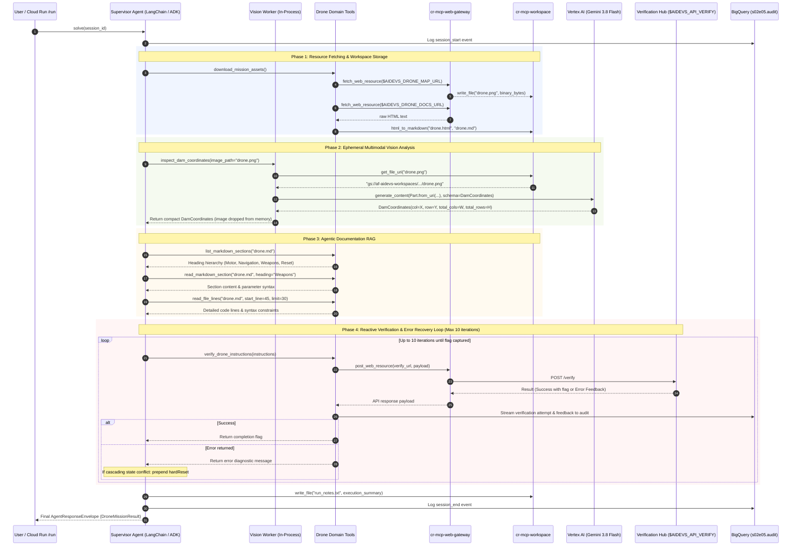

# Technical Design Document: Zero-Trust Preemptive Strike Drone Agent (`cr-s02e05-drone`)

## Context and Scope

In lesson `s02e05` (Task: `drone`), the resistance has intercepted remote control over an armed military strike drone equipped with an explosive payload. The hostile System is preparing an imminent bombardment of the resistance's temporary base and nuclear power plant located in Żarnowiec (Power Plant Identifier: **`PWR6132PL`**). The plant's reactor core cooling is failing rapidly because Lake Żarnowieckie has lost 80% of its water volume and is dammed off by a concrete weir.

The operational objective is to execute a preemptive deception strike:
1. Program the drone's official flight mission registry to target `PWR6132PL`, satisfying automated System mission logs so the facility is marked as destroyed on System tactical maps.
2. Divert the physical flight trajectory and explosive payload delivery directly onto the nearby **dam** on Lake Żarnowieckie to breach it, flooding the cooling canals with reservoir water and averting core meltdown while staging the illusion of the power plant's annihilation.

The agent must accomplish this by:
* Performing multimodal visual grid analysis on a high-resolution map of Żarnowiec (`drone.png`) to identify grid dimensions and determine the exact 1-indexed `(column, row)` coordinates of the dam sector (distinguished by intensified water saturation).
* Ingesting and navigating the drone API technical documentation (`drone.html`), which contains conflicting function names, parameter traps, and decoy commands, to synthesize the valid minimal command sequence.
* Interacting iteratively with Centrala's `/verify` endpoint, consuming diagnostic error feedback, dynamically refining command arguments, and autonomously invoking `hardReset` when state conflicts arise.
* Capturing the course completion flag `{FLG:...}` and recording full-fidelity, unaggregated execution telemetry to BigQuery dataset `s02e05`.

Architectural decisions finalized in [ADR.md](file:///c:/Users/admin/git/arturroo/af-aidevs/lessons/s02e05-projektowanie-agentow/task/ADR.md) govern this implementation:
- **In-Process Multi-Agent Topology**: Supervisor (orchestrator with delegation and tool access) and Vision Worker (multimodal coordinate extractor) execute within the same Cloud Run Python process.
- **Lean Context & Ephemeral Image Ingestion**: The high-resolution map is retrieved once by the Supervisor and stored in `cr-mcp-workspace`. Workspace resolves the canonical GCS URI via `get_file_uri()`. The Vision Worker submits `Part.from_uri()` to Gemini 3.8 Flash, extracts `DamCoordinates`, and returns only this compact Pydantic text to the Supervisor. Raw image data never enters the Supervisor's prompt history.
- **Zero Direct Egress**: The container has no public internet access; all requests to `$AIDEVS_DRONE_MAP_URL`, `$AIDEVS_DRONE_DOCS_URL`, and `$AIDEVS_API_VERIFY` route through `cr-mcp-web-gateway` over OIDC identity tokens cached via `cachetools` (50-min TTL).
- **Deterministic Workspace RAG**: Raw documentation is converted to clean Markdown in workspace via `markdownify`, and analyzed using targeted RAG tools (`list_markdown_sections`, `read_markdown_section`, `read_file_lines`, `grep`).
- **Autonomous Recovery & Loop Ceiling**: The agent is aware of `hardReset` via `system_prompt.md` and prepends it autonomously when state conflicts persist, bounded by a strict circuit breaker ceiling of 10 verification retries.
- **Dual Framework Parity**: Both **LangChain 1.2.15** (`create_agent`) and **Google ADK** (`google-adk==1.33.0`) are supported via `--backend` (defaulting to `langchain`), powered by **Gemini 3.8 Flash** (`gemini-3.8-flash`) with `thinking_level="low"`.

---

## Goals and Non-Goals

### Goals
* **Precise Multimodal Localization**: Accurately extract the 1-indexed `(column, row)` coordinates of the dam sector from `drone.png` via Vertex AI Gemini 3.8 Flash without leaking image bytes into multi-turn context.
* **Targeted Agentic RAG**: Ingest `drone.html`, convert to structured Markdown in `cr-mcp-workspace`, and use section/line inspection tools to extract required flight and strike instructions while ignoring decoy functions.
* **Autonomous Feedback & Self-Correction**: Formulate flight instructions, submit to Centrala `/verify`, parse error responses, adapt parameters, and autonomously invoke `hardReset` if cumulative state corruption occurs.
* **Zero-Trust Network Isolation**: Route 100% of outbound HTTP fetches and verification requests through `cr-mcp-web-gateway`.
* **Zero Direct Bucket Storage Access**: Client agent relies on `cr-mcp-workspace.get_file_uri` to resolve `gs://` paths, upholding the Principle of Least Privilege.
* **Dual-Framework Parity**: Deliver identical operational behavior, Pydantic schemas, and telemetry across both LangChain 1.2.15 and Google ADK 1.33.0 backends.
* **Full-Fidelity Unaggregated Auditing**: Stream complete thought traces, tool invocations, error loops, and the retrieved course flag `{FLG:...}` to BigQuery dataset `s02e05` (`audit` table) with masked `AIDEVS_API_KEY`.

### Non-Goals
* Hardcoding drone instruction names or parameter sequences directly in Python code or system prompts (the agent must discover them dynamically via documentation RAG).
* Implementing distributed A2A HTTP microservices for the Vision Worker (both agents remain in-process).
* Granting broad `roles/storage.objectAdmin` or `roles/storage.objectViewer` directly to the client agent's Service Account.
* Exposing raw external URLs, tokens, or credentials in public logs or version-controlled documents.

---

## The Design

### System Overview



---

### API Design & Schemas

All schemas are contract-first Pydantic v2 models defined in `schemas.py`.

1. **`DamCoordinates`**:
   ```python
   class DamCoordinates(BaseModel):
       total_columns: int = Field(..., ge=1, description="Total number of vertical columns", example=10)
       total_rows: int = Field(..., ge=1, description="Total number of horizontal rows", example=10)
       dam_column: int = Field(..., ge=1, description="1-indexed column coordinate of dam", example=3)
       dam_row: int = Field(..., ge=1, description="1-indexed row coordinate of dam", example=7)
       visual_evidence: str = Field(..., description="Visual cues confirming dam location")
       reasoning: str = Field(..., description="Reasoning explaining grid calculation")
   ```

2. **`DroneInstructionsSubmission`**:
   ```python
   class DroneInstructionsSubmission(BaseModel):
       instructions: list[str] = Field(..., min_length=1, description="Ordered sequence of commands", example=["start", "setTarget PWR6132PL", "flyTo 3,7", "detonate"])
       reasoning: str = Field(..., description="Operational rationale explaining command ordering")
   ```

3. **`DroneVerificationResponse`**:
   ```python
   class DroneVerificationResponse(BaseModel):
       code: int = Field(..., description="HTTP status code or response status integer", example=0)
       message: str = Field(..., description="Status message, diagnostic feedback, or flag confirmation")
       flag: str | None = Field(default=None, description="Course flag token {FLG:...}")
       is_success: bool = Field(default=False, description="True if flag captured")
       hint: str | None = Field(default=None, description="Suggested adjustment based on API feedback")
   ```

4. **`DroneMissionResult`**:
   ```python
   class DroneMissionResult(BaseModel):
       status: str = Field(..., description="Operational state: 'success', 'failed', 'max_retries_exceeded'")
       iterations_used: int = Field(..., ge=1, le=10, description="Total verification attempts executed")
       dam_coordinates: DamCoordinates = Field(..., description="Determined dam coordinates")
       final_instructions: list[str] = Field(..., description="Final sequence of instructions accepted by hub")
       flag: str = Field(..., description="Captured course completion flag or [REDACTED_FLAG]")
       reasoning: str = Field(..., description="Summary of mission progression")
   ```

---

### Data Model & Workspace Architecture

#### OverlayFS Workspace File Layout (`gs://af-aidevs-workspaces/{caller}/{session_id}/`)
* `drone.png`: Downloaded high-resolution terrain map.
* `drone.html`: Raw technical documentation fetched from `$AIDEVS_DRONE_DOCS_URL`.
* `drone.md`: Deterministically converted Markdown manual used for Agentic RAG.
* `run_notes.txt`: Persistent post-mission audit summary recording execution timestamp, backend used, iterations, and captured flag.

#### BigQuery Telemetry Table (`s02e05.audit`)
Streaming telemetry rows conform to repository dual-schema specifications:
* `session_id`: `s02e05_{backend}_{YYYYMMDD_HHMMSS}` (timezone `Europe/Zurich`).
* `timestamp`: UTC ISO timestamp.
* `step_type`: `SESSION_START`, `VISION_INFERENCE`, `DOC_RAG`, `VERIFY_ATTEMPT`, `HARD_RESET`, `SESSION_END`.
* `content`: Human-readable message or serialized prompt/response.
* `reasoning`: Operational thought trace justifying the action.
* `payload`: JSON object containing tool inputs/outputs, masked request payloads (`AIDEVS_API_KEY` masked as `***`), and raw API verification responses.
* `flag`: Captured `{FLG:...}` token (untruncated for private cloud debugging).

---

### Core Logic & Algorithms

#### 1. Stage 1: Resource Ingestion & Markdown Distillation
1. Query `cr-mcp-web-gateway.fetch_web_resource($AIDEVS_DRONE_MAP_URL)` and store binary response in workspace as `drone.png`.
2. Query `cr-mcp-web-gateway.fetch_web_resource($AIDEVS_DRONE_DOCS_URL)` and store HTML in workspace.
3. Invoke `cr-mcp-workspace.html_to_markdown("drone.html", "drone.md")` via `markdownify` to generate clean Markdown.

#### 2. Stage 2: Ephemeral Vision Analysis
1. Resolve storage path via `cr-mcp-workspace.get_file_uri("drone.png")` -> `gs://af-aidevs-workspaces/.../drone.png`.
2. Invoke Vision Worker with structured output schema `DamCoordinates`:
   - System instruction directs model to count grid columns and rows from top-left (1-indexed) and locate the sector with accentuated water saturation (dam).
   - Vertex AI reads GCS blob via `Part.from_uri()`.
3. Return `DamCoordinates` to Supervisor. The image is never appended to Supervisor's conversation history.

#### 3. Stage 3: Agentic Documentation Exploration
1. Supervisor inspects document hierarchy via `list_markdown_sections("drone.md")`.
2. Supervisor inspects relevant command sections (`Motor`, `Target`, `Flight`, `Weapons`, `Reset`) using `read_markdown_section` and `read_file_lines`.
3. Synthesize candidate instruction sequence fulfilling mission rules:
   - Official mission target set to `PWR6132PL`.
   - Flight trajectory and detonation coordinates targeted to `(dam_column, dam_row)`.

#### 4. Stage 4: Reactive Verification Loop & State Recovery
* Execution algorithm for iterative self-healing:
  ```python
  max_iterations = 10
  iteration = 0
  consecutive_state_errors = 0
  force_hard_reset = False

  while iteration < max_iterations:
      iteration += 1
      # 1. Prepare instructions
      instructions = agent.formulate_instructions(feedback_history, force_hard_reset=force_hard_reset)
      # 2. Submit to /verify via Gateway
      response = await mcp_service.verify_drone(instructions, session_id=session_id)
      # 3. Check for flag
      if response.flag:
          audit.log_success(response.flag)
          save_run_notes(response.flag)
          return response
      # 4. Error analysis & self-healing
      feedback_history.append(response.message)
      if is_state_lockup_error(response.message) or "reset" in response.message.lower():
          force_hard_reset = True
  ```

---

### Infrastructure & Deployment Topology

* **Cloud Run Service**: `cr-s02e05-drone` deployed in region `europe-west6` (or `global` for Vertex AI).
  - CPU: 1 vCPU, Memory: 1GiB.
  - Ingress: Internal & Cloud Load Balancing (or Cloud Run Invoker only).
  - Outbound Egress: 0 direct internet access (routed through internal VPC connector / Cloud Run invoker to `cr-mcp-web-gateway`).
* **Service Account**: `sa-cr-s02e05-drone` with IAM roles:
  - `roles/run.invoker` on `cr-mcp-web-gateway` and `cr-mcp-workspace`.
  - `roles/aiplatform.user` on Google Cloud Project `af-aidevs`.
  - `roles/bigquery.dataEditor` on dataset `s02e05`.
  - `roles/secretmanager.secretAccessor` for reading runtime secrets.
  - **Zero direct GCS bucket roles** (enforcing Zero-Trust).

---

## Cross-Cutting Concerns

### Security
* **Zero Credential Hardcoding**: Secrets (`AIDEVS_API_KEY`, `LANGSMITH_API_KEY`) and URLs (`$AIDEVS_API_VERIFY`, `$AIDEVS_DRONE_MAP_URL`, `$AIDEVS_DRONE_DOCS_URL`) read strictly from environment variables or GCP Secret Manager.
* **Token Caching**: Google Cloud OIDC ID tokens cached using `cachetools.TTLCache` (50 min TTL) for service-to-service calls.
* **Audit Masking**: Telemetry payloads mask `AIDEVS_API_KEY` before BigQuery ingestion.
* **Flag Protection**: Course flags never committed to Git, exposed in PRs, or logged in public markdown.

### Observability
* **Real-time Auditing**: Direct streaming to BigQuery table `s02e05.audit` using `af_aidevs.audit.bigquery.AuditService`.
* **Standardized Session ID**: `s02e05_{backend}_{YYYYMMDD_HHMMSS}` in timezone `Europe/Zurich`.
* **LangSmith Spans**: Service methods decorated with `@traceable(run_type="tool")` for transparent trace graphs.

### Error Handling & Resilience
* **Graceful Tool Handling**: All LangChain tools configure `tool.handle_tool_error = True` to convert runtime exceptions into agent feedback.
* **Idempotent Reset**: `hardReset` available to clear invalid drone flight states.
* **Circuit Breaker Ceiling**: Hard limit of 10 verification retries prevents infinite billing loops.

---

## Edge Cases and Constraints

### Edge Cases
1. **Grid Indexing Off-by-One**: Model confusion between 0-indexed and 1-indexed coordinates. *Mitigation:* System prompt explicitly mandates 1-indexed counting, validated against total column/row counts.
2. **Cascading State Locking**: Previous bad commands lock drone controls. *Mitigation:* Explicit `hardReset` instruction prepended upon repeated state errors.
3. **Decoy Instruction Collisions**: Documentation contains identical commands with incompatible parameter signatures. *Mitigation:* Agentic RAG reads syntax lines directly, verifying argument formats against examples.
4. **Transient Network Blips on Gateway**: Gateway returns 502/504. *Mitigation:* Exponential backoff retry in `MCPService`.

### Constraints
* **Python Runtime**: Strictly `requires-python = "==3.13.5"`.
* **LangChain Version**: Strictly `langchain==1.2.15`.
* **Google ADK Version**: Strictly `google-adk==1.33.0`.
* **Vertex AI Model**: Strictly `gemini-3.8-flash` with `thinking_level="low"`.

---

## Implementation Plan

### Phases & Milestones

| Phase | Scope | Deliverable |
|---|---|---|
| **Phase 1** | Schema & Configuration Foundation | `config.py`, `schemas.py`, `system_prompt.md`, `pyproject.toml` |
| **Phase 2** | Service Layer & MCP Integration | `services/mcp_service.py`, `services/drone_service.py`, `services/audit_service.py` |
| **Phase 3** | Dual Agent Implementation | `agents/base.py`, `agents/langchain_agent.py`, `agents/adk_agent.py`, `agents/factory.py` |
| **Phase 4** | CLI Entrypoint & Multi-Agent Flow | `main.py`, vision coordinate extraction, reactive verification loop |
| **Phase 5** | Verification & Test Suite | Unit tests in `tests/`, local dry-run, BigQuery verification, `run_notes.txt` |
| **Phase 6** | Infrastructure as Code (Terraform) | Terraform definition in `terraform/variables.tf` for `cr-s02e05-drone` |

---

## Success Criteria

1. Supervisor downloads `drone.png` and `drone.html` via `cr-mcp-web-gateway` into `cr-mcp-workspace`.
2. Workspace deterministically converts `drone.html` to `drone.md` via `markdownify`.
3. Vision Worker extracts `DamCoordinates` from `drone.png` via `Part.from_uri()` without loading raw image bytes into Supervisor context.
4. Supervisor performs Agentic RAG over `drone.md` using `list_markdown_sections`, `read_markdown_section`, and `read_file_lines`.
5. Supervisor submits formulated instructions to `$AIDEVS_API_VERIFY`, handling errors iteratively and using `hardReset` if necessary.
6. Centrala verification returns HTTP 200 with `{FLG:...}` within 10 iterations.
7. Both `--backend langchain` and `--backend adk` run successfully.
8. Telemetry and flags are recorded in BigQuery `s02e05.audit` and `run_notes.txt`.

---

## Implementation Spec

> This section is consumed directly by the AI coding agent executing `/implement` against this PRD.

### File Structure
```text
lessons/s02e05-projektowanie-agentow/task/
├── BRD.md
├── ADR.md
├── PRD.md
└── cr-s02e05-drone/
    ├── .dockerignore
    ├── .gcloudignore
    ├── .python-version               # "3.13.5"
    ├── Dockerfile
    ├── Procfile
    ├── README.md
    ├── cloudbuild.yaml
    ├── pyproject.toml
    ├── config.py                     # Environment variables & constants
    ├── schemas.py                    # Contract-first Pydantic schemas
    ├── system_prompt.md              # YAML frontmatter + operational prompt
    ├── run_notes.txt                 # Session execution summary
    ├── main.py                       # FastAPI entrypoint & CLI dispatcher
    ├── agents/
    │   ├── __init__.py
    │   ├── base.py                   # BaseAgent abstract interface
    │   ├── factory.py                # AgentFactory (langchain vs adk)
    │   ├── langchain_agent.py        # LangChain 1.2.15 create_agent implementation
    │   └── adk_agent.py              # Google ADK 1.33.0 Agent implementation
    ├── services/
    │   ├── __init__.py
    │   ├── audit_service.py          # BigQuery streaming telemetry
    │   ├── mcp_service.py            # Gateway & Workspace HTTP client with OIDC
    │   └── drone_service.py          # Mission orchestrator & Vision worker
    └── tests/
        ├── __init__.py
        ├── test_schemas.py           # Pydantic schema validation tests
        └── test_drone_service.py     # Mocked mission & error recovery tests
```

### Technology Stack & Exact Versions
```toml
[project]
name = "cr-s02e05-drone"
version = "0.1.0"
description = "Zero-Trust Preemptive Strike Drone Agent for S02E05"
requires-python = "==3.13.5"
dependencies = [
    "af-aidevs==0.2.1",
    "cachetools==5.5.2",
    "fastapi==0.115.11",
    "google-adk==1.33.0",
    "google-auth==2.38.0",
    "google-cloud-bigquery==3.29.0",
    "google-cloud-secret-manager==2.22.1",
    "google-cloud-storage==3.1.0",
    "google-genai==1.3.0",
    "httpx==0.28.1",
    "langchain==1.2.15",
    "langchain-core==1.2.15",
    "langchain-google-genai==2.0.10",
    "langsmith==0.3.11",
    "markdownify==0.14.1",
    "pydantic==2.10.6",
    "pytest==8.3.5",
    "pytest-asyncio==0.25.3",
    "python-dotenv==1.0.1",
    "pyyaml==6.0.2",
    "uvicorn==0.34.0",
]
```

### Step-by-Step Implementation Order
1. **Scaffold Service Directory**: Create `cr-s02e05-drone/` layout, `.python-version`, and `pyproject.toml`.
2. **Define Contracts & Config**: Implement `config.py` (env vars with resilient fallbacks) and `schemas.py` (`DamCoordinates`, `DroneInstructionsSubmission`, `DroneVerificationResponse`, `DroneMissionResult`).
3. **Configure System Prompt**: Create `system_prompt.md` with YAML frontmatter (`gemini-3.8-flash`, `thinking_level: low`), identity, protocol, and `hardReset` guidelines.
4. **Implement Service Layer**:
   - `services/audit_service.py`: BigQuery streaming with session formatting.
   - `services/mcp_service.py`: OIDC-authenticated calls to `cr-mcp-web-gateway` and `cr-mcp-workspace`.
   - `services/drone_service.py`: Vision Worker extraction and Agentic RAG file operations.
5. **Implement Agents**:
   - `agents/base.py`: Abstract contract.
   - `agents/langchain_agent.py`: LangChain 1.2.15 `create_agent` with domain tools.
   - `agents/adk_agent.py`: Google ADK `Agent` with tool functions.
   - `agents/factory.py`: Factory instantiation based on `--backend`.
6. **Implement Orchestrator & CLI**: `main.py` with FastAPI endpoints (`/`, `/run`, `/health`) and CLI parser (`--backend`, `--session-id`).
7. **Create Unit Tests**: `tests/test_schemas.py` and `tests/test_drone_service.py`.
8. **Infrastructure Update**: Add `cr-s02e05-drone` definition in `terraform/variables.tf`.
9. **Execution & Validation**: Run end-to-end mission, verify BigQuery telemetry, and record flag in `run_notes.txt`.

### Acceptance Criteria (Testable)
* [ ] `pyproject.toml` strictly specifies `requires-python = "==3.13.5"` and alphabetical, non-carat dependency versions.
* [ ] `DamCoordinates` schema correctly validates 1-indexed integers and reasoning.
* [ ] Vision Worker retrieves `drone.png` via `Part.from_uri()` and returns `DamCoordinates` without buffering raw image bytes in Supervisor context.
* [ ] Deterministic HTML-to-Markdown conversion generates valid `drone.md` in workspace.
* [ ] Agentic RAG tools selectively read sections and line ranges from `drone.md`.
* [ ] Supervisor correctly identifies `PWR6132PL` as the registered mission target and dam coordinates as the strike target.
* [ ] Autonomous loop handles error feedback from `$AIDEVS_API_VERIFY` and correctly applies `hardReset` when state conflicts arise.
* [ ] Verification succeeds within 10 iterations, returning `{FLG:...}`.
* [ ] Telemetry rows are streamed to BigQuery dataset `s02e05` (`audit` table) with `AIDEVS_API_KEY` masked.
* [ ] Both `--backend langchain` and `--backend adk` execute cleanly.
* [ ] Execution outcome and retrieved flag are documented in `run_notes.txt`.

### Out-of-Scope for Agent (Human Required)
* Deploying Terraform infrastructure to production GCP environment (user invokes `terraform apply`).
* Generating or provisioning new Centrala course API tokens.
