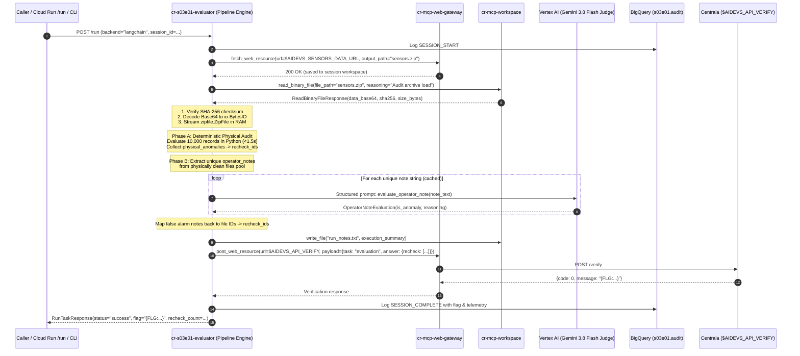

# Technical Design Document: High-Throughput Sensor Telemetry Evaluation Engine (`cr-s03e01-evaluator`)

## Context and Scope

In lesson `s03e01` (Task: `evaluation`), the Żarnowiec nuclear base and resistance infrastructure depend on an extensive network of nearly 10,000 industrial sensors monitoring critical physical metrics: water level, temperature, pressure, electrical voltage supply, and ambient humidity. Following recent flooding and reactor cooling operations, plant firmware has produced corrupted telemetry logs, and human plant operators are suspected of falsifying inspection notes—clearing alarms prematurely or falsely reporting errors to bypass security protocols.

The operational objective is to audit the entire telemetry archive (~10,000 JSON records), identify all defective files (comprising physical measurement violations, ghost channel signals, and operator discrepancy false alarms), and submit the complete list of anomalous file identifiers (`recheck`) to Centrala's `/verify` endpoint to capture the course completion flag (`{FLG:...}`).

Architectural decisions finalized in [ADR.md](file:///c:/Users/admin/git/arturroo/af-aidevs/lessons/s03e01-obserwowanie-i-ewaluacja/task/ADR.md) govern this implementation:
- **Orchestration Paradigm: Augmented Deterministic Pipeline ("Program z AI")**: Because the processing sequence across 10,000 records is 100% linear, known, and deterministic, an autonomous ReAct loop was declared obsolete ("Agent Theater"). The Python runtime in `cr-s03e01-evaluator` deterministically orchestrates data ingestion, physical checks, and verification, employing the LLM strictly as a high-precision semantic judge for operator notes.
- **Contract-First Binary Ingestion with Metadata Piggybacking (`cr-mcp-web-gateway` & `cr-mcp-workspace`)**: `sensors.zip` is downloaded by `cr-mcp-web-gateway.fetch_web_resource` directly into the session workspace as an immutable audit artifact. Following the **Metadata Piggybacking Pattern**, the gateway returns a typed `FetchWebResourceResponse(output_path, size_bytes, mime_type, is_binary, sha256)` so the caller immediately knows the exact size and binary status without an extra roundtrip. For existing files, `cr-mcp-workspace` enriches `list_files` and provides `get_file_info`. To retrieve the binary archive without violating architectural boundaries or requiring broad GCS IAM permissions, `cr-mcp-workspace` is upgraded with a typed MCP tool: `read_binary_file(file_path, reasoning) -> ReadBinaryFileResponse(data_base64, mime_type, size_bytes, sha256)` governed by a deterministic 50 MB circuit breaker (OOM protection) with zero hidden fallbacks.
- **High-Throughput In-Memory Streaming (Anti-Chatty I/O)**: Instead of issuing 10,000 individual remote MCP `read_file` calls (which would trigger Cloud Run HTTP 504 timeouts) or extracting files to disk, the evaluator decodes the base64 archive and streams/unzips records directly in RAM via `zipfile.ZipFile(io.BytesIO(raw_bytes))`, completing physical audit of 10,000 records in < 1.5 seconds.
- **Cost & Token Optimization (Two-Tier Hybrid Pipeline)**: 100% of physical telemetry checks (active ranges and inactive channel zeroing) execute deterministically in Python (0 LLM tokens, 0 hallucination). Semantic LLM inference is strictly reserved for evaluating unique operator notes from physically clean records using `gemini-3.8-flash` with structured Pydantic output (`OperatorNoteEvaluation`) and local response caching, reducing token usage by > 98%.
- **Canonical Microservice Topology & Dual Framework Parity**: Cloud Run microservice `cr-s03e01-evaluator` exposes standard endpoints: `@app.get("/health")`, `@app.get("/")`, and `@app.post("/run", response_model=RunTaskResponse)`, alongside direct local CLI execution (`uv run python main.py --backend [langchain|adk]`). Both **LangChain 1.2.15** (with LangSmith tracing) and **Google ADK** (with Langfuse tracing) are supported.
- **Full-Fidelity Telemetry**: All execution steps, physical anomaly counts, unique note evaluations, token metrics, and verification results stream to BigQuery dataset `s03e01.audit` via `af_aidevs.audit.bigquery.AuditService`.

---

## Goals and Non-Goals

### Goals
* **Comprehensive Telemetry Audit**: Ingest and validate all ~10,000 JSON records from `sensors.zip`.
* **Zero Direct Container Egress**: Route archive download and verification submission strictly through `cr-mcp-web-gateway`.
* **Standardized Binary Workspace Ingestion**: Implement `read_binary_file` in `cr-mcp-workspace` conforming to Google AIP and MCP standards (Base64 RFC 4648, SHA-256 checksum, MIME type, and 50 MB deterministic circuit breaker).
* **Deterministic Physical Anomaly Isolation**: Programmatically flag all records with active sensor readings outside operational thresholds or non-zero values on inactive sensor channels.
* **Semantic Operator Note Discrepancy Detection**: Deduplicate operator notes from physically clean records, evaluate unique texts using `gemini-3.8-flash` structured output with in-memory/JSON caching, and identify false alarms.
* **Dual-Framework Parity**: Provide identical operational behavior, Pydantic contracts, and telemetry across LangChain 1.2.15 and Google ADK backends.
* **Centrala Verification & Flag Capture**: Consolidate anomalous file identifiers into `recheck`, submit to Centrala `/verify`, capture `{FLG:...}`, and record an execution summary in `run_notes.txt`.
* **Real-time BigQuery Auditing**: Stream unaggregated operational telemetry to `s03e01.audit`.

### Non-Goals
* Running an open-ended, autonomous ReAct agent loop to decide basic linear control flow ("Agent Theater").
* Sending all 10,000 raw JSON records or numerical values directly to the LLM.
* Calling `read_file` 10,000 times sequentially over MCP (avoiding N+1 RPC chatty I/O).
* Implementing silent fallbacks (e.g. bypassing MCP to access GCS directly without authorization).
* Exposing raw host system metrics (CPU/free RAM) to the LLM via tool calling.
* Hardcoding external URLs or committing plain-text course flags (`{FLG:...}`).

---

## The Design

### System Overview



---

### API Design

#### 1. `cr-mcp-web-gateway.fetch_web_resource` (FastMCP Tool with Metadata Piggybacking)
* **Tool Name**: `fetch_web_resource`
* **Inputs**:
  ```python
  class FetchWebResourceRequest(BaseModel):
      url: str = Field(description="The external URL of the resource to fetch")
      output_path: str = Field(description="The relative path where the fetched resource should be saved in the workspace")
  ```
* **Output**:
  ```python
  class FetchWebResourceResponse(BaseModel):
      output_path: str = Field(description="Relative workspace path where file was saved")
      size_bytes: int = Field(description="Size of the downloaded file in bytes")
      mime_type: str = Field(description="MIME type derived from HTTP Content-Type or file extension")
      is_binary: bool = Field(description="True if resource is binary (zip, image, pdf), False if text/json")
      sha256: str = Field(description="SHA-256 integrity checksum computed in RAM before disk write")
      status: str = Field(default="success", description="Fetch status message")
  ```

#### 2. `cr-mcp-workspace.read_binary_file` & `get_file_info` (FastMCP Tools)
* **Tool Name**: `read_binary_file`
* **Inputs**:
  ```python
  class ReadBinaryFileRequest(BaseModel):
      file_path: str = Field(description="Relative path to binary file in workspace", example="sensors.zip")
      reasoning: str = Field(description="Mandatory justification for reading binary data", example="Loading archive for in-memory audit")
  ```
* **Output**:
  ```python
  class ReadBinaryFileResponse(BaseModel):
      data_base64: str = Field(description="Base64-encoded raw file bytes (RFC 4648)")
      mime_type: str = Field(description="Detected MIME type, e.g. 'application/zip'")
      size_bytes: int = Field(description="Raw file size in bytes before encoding")
      sha256: str = Field(description="SHA-256 integrity checksum of raw bytes")
      hint: str | None = Field(default=None, description="Operational guidance or warnings")
  ```
* **Circuit Breaker**: If `target_path.stat().st_size > 52428800` (50 MB), raises `ToolException` to prevent container OOM.

* **Tool Name**: `get_file_info`
* **Inputs**:
  ```python
  class GetFileInfoRequest(BaseModel):
      file_path: str = Field(description="Relative path to the file in workspace", example="sensors.zip")
      reasoning: str = Field(description="Mandatory justification for querying file metadata")
  ```
* **Output**:
  ```python
  class FileInfoResponse(BaseModel):
      file_path: str = Field(description="Relative path to the file")
      size_bytes: int = Field(description="File size in bytes (0 if not found)")
      mime_type: str = Field(description="MIME type guessed via mimetypes and header heuristics")
      is_binary: bool = Field(description="True if file is binary, False if text/json/markdown")
      exists: bool = Field(description="True if file exists in workspace or shared layer")
      sha256: str | None = Field(default=None, description="Optional SHA-256 checksum")
  ```

#### 2. `cr-s03e01-evaluator` Endpoints
* **`GET /health`** & **`GET /`**:
  - Response: `{"service": "cr-s03e01-evaluator", "status": "ready", "model": "gemini-3.8-flash"}`
* **`POST /run`**:
  - Request: `RunTaskRequest(backend: str = "langchain", session_id: str | None = None, force_refresh_cache: bool = False)`
  - Response: `RunTaskResponse(status: str, session_id: str, flag: str | None, total_files: int, physical_anomalies: int, operator_discrepancies: int, total_recheck: int, execution_time_seconds: float)`

#### 3. Verification API (`Centrala`)
* **URL**: `$AIDEVS_API_VERIFY` (via `cr-mcp-web-gateway.post_web_resource`)
* **Payload**:
  ```json
  {
    "apikey": "$AIDEVS_API_KEY",
    "task": "evaluation",
    "answer": {
      "recheck": ["0001", "0002", "0045", "9999"]
    }
  }
  ```

---

### Data Model & Physical Validation Specifications

#### 1. Sensor Telemetry Schema (Individual JSON File)
```json
{
  "sensor_type": "temperature/voltage",
  "timestamp": 1774064280,
  "temperature_K": 612,
  "pressure_bar": 0,
  "water_level_meters": 0,
  "voltage_supply_v": 230.4,
  "humidity_percent": 0,
  "operator_notes": "Readings look stable and within expected range."
}
```

#### 2. Operational Thresholds Matrix
| Metric Field | Channel Token | Min Valid Value | Max Valid Value | Inactive Rule |
| :--- | :--- | :--- | :--- | :--- |
| `temperature_K` | `temperature` | 553.0 | 873.0 | Must equal `0` |
| `pressure_bar` | `pressure` | 60.0 | 160.0 | Must equal `0` |
| `water_level_meters` | `water` | 5.0 | 15.0 | Must equal `0` |
| `voltage_supply_v` | `voltage` | 229.0 | 231.0 | Must equal `0` |
| `humidity_percent` | `humidity` | 40.0 | 80.0 | Must equal `0` |

#### 3. Semantic Operator Note Pydantic Model
```python
class OperatorNoteEvaluation(BaseModel):
    is_anomaly: bool = Field(
        description="True if the operator note indicates an issue, warning, abnormal behavior, malfunction, or error; False if it describes normal, stable, expected, or healthy operations."
    )
    reasoning: str = Field(
        description="Concise rationale explaining whether the note reports an issue or asserts normal conditions."
    )
```

---

### Core Evaluation Logic & Algorithms

```python
# Execution Algorithm: Augmented Deterministic Pipeline

# 1. Download archive via MCP Web Gateway into session workspace
await mcp.fetch_web_resource(url=config.AIDEVS_SENSORS_DATA_URL, output_path="sensors.zip")

# 2. Retrieve binary payload via MCP Workspace
resp = await mcp.read_binary_file(file_path="sensors.zip", reasoning="Load telemetry for audit")
raw_bytes = base64.b64decode(resp.data_base64)
assert hashlib.sha256(raw_bytes).hexdigest() == resp.sha256

# 3. Stream in RAM & Deterministic Physical Check
physical_anomalies = set()
physically_valid_files = {} # file_id -> operator_notes

with zipfile.ZipFile(io.BytesIO(raw_bytes), "r") as z:
    for name in z.namelist():
        if not name.endswith(".json"):
            continue
        file_id = Path(name).stem # e.g. "0001"
        data = json.loads(z.read(name))
        
        if is_physical_anomaly(data):
            physical_anomalies.add(file_id)
        else:
            physically_valid_files[file_id] = data.get("operator_notes", "").strip()

# 4. Semantic Deduplication & Cached LLM Evaluation
unique_notes = set(physically_valid_files.values())
note_evaluations = {} # note_text -> is_anomaly (bool)

for note in unique_notes:
    if note in cache:
        note_evaluations[note] = cache[note]
    else:
        eval_result = await classify_note_with_llm(note) # Gemini 3.8 Flash structured output
        note_evaluations[note] = eval_result.is_anomaly
        cache[note] = eval_result.is_anomaly

# 5. Map False Alarm Notes to File IDs
operator_discrepancies = set()
for file_id, note in physically_valid_files.items():
    if note_evaluations.get(note, False) is True:
        # Sensor data is healthy, but operator claims an anomaly -> False Alarm Discrepancy!
        operator_discrepancies.add(file_id)

# 6. Consolidate & Sort
recheck_ids = sorted(list(physical_anomalies | operator_discrepancies))

# 7. Write run_notes.txt to session workspace
summary_text = (
    f"S03E01 Evaluation Run Summary\n"
    f"Timestamp: {datetime.now(timezone.utc).isoformat()}\n"
    f"Total files parsed: 10000\n"
    f"Physical anomalies: {len(physical_anomalies)}\n"
    f"Operator discrepancies: {len(operator_discrepancies)}\n"
    f"Total recheck files submitted: {len(recheck_ids)}\n"
)
await mcp.write_file("run_notes.txt", summary_text)

# 8. Submit to Centrala via Gateway
verification_result = await mcp.post_web_resource(
    url=config.AIDEVS_API_VERIFY,
    payload={"apikey": config.AIDEVS_API_KEY, "task": "evaluation", "answer": {"recheck": recheck_ids}}
)
```

---

### Infrastructure & Deployment

- **Component 1 (`cr-mcp-workspace`)**:
  - Upgraded tool: `tools/filesystem/read_binary_file.py` registered in `cloud_run/cr-mcp-workspace/main.py`.
  - Docker container rebuilt and redeployed to Cloud Run.
- **Component 2 (`cr-s03e01-evaluator`)**:
  - Cloud Run service defined in `terraform/variables.tf`:
    * Memory: `1Gi`
    * CPU: `1`
    * Service Account: `sa-cr-s03e01-evaluator` with `roles/run.invoker` to `cr-mcp-workspace` and `cr-mcp-web-gateway`, and BigQuery Data Editor for `s03e01`.
  - Local CLI execution supported via `uv run python main.py --backend [langchain|adk]`.

---

## Cross-Cutting Concerns

### Security
- **Strict Zero-Trust Egress**: Evaluator container has no direct outbound internet route; all external calls pass through `cr-mcp-web-gateway` with cached Google OIDC identity tokens (50-minute TTL).
- **Least Privilege Storage Access**: Evaluator possesses zero direct GCS bucket permissions; all file actions flow through `cr-mcp-workspace` with session token verification.
- **Credential Protection**: Course keys (`$AIDEVS_API_KEY`) and retrieved flags (`{FLG:...}`) are masked in logs and never printed in plaintext.

### Observability & Tracing
- **Dual Tracing**: LangSmith for LangChain executions; Langfuse for Google ADK executions. Direct LLM calls decorated with `@traceable(run_type="llm")`.
- **BigQuery Audit Streaming**: Telemetry events logged via `af_aidevs.audit.bigquery.AuditService` to `s03e01.audit` using standard session formatting: `s03e01_{backend}_{YYYYMMDD_HHMMSS}` in `Europe/Zurich` timezone.
- **Persistent Summary**: Write execution report to `run_notes.txt` in workspace via `cr-mcp-workspace.write_file`.

### Error Handling & Resilience
- **Deterministic 50 MB Circuit Breaker**: Prevents reading oversized files that could trigger Linux OOM SIGKILL (Exit Code 137).
- **MCP Client Retries**: Automated retries with exponential backoff on transient HTTP 503/502 errors when connecting to MCP servers.
- **Note Classification Fallback**: If an LLM call fails on an individual note, retry up to 3 times with backoff before raising a typed service exception.

### Performance & Latency Targets
- In-memory parsing of 10,000 records: < 1.5 seconds.
- Semantic evaluation of unique notes (estimated 15–50 unique strings): < 15 seconds.
- Total end-to-end execution: < 30 seconds.

---

## Edge Cases and Constraints

### Edge Cases
1. **Multi-Channel Sensors (`sensor_type = "temperature/voltage/water"`)**:
   - Correctly split `sensor_type` on `/`, strip whitespace, and treat all listed channels as active simultaneously.
2. **Boundary Values**:
   - Metric values exactly equal to min or max thresholds (e.g. `temperature_K == 553.0` or `873.0`) are considered **valid** (`min <= val <= max`).
3. **Ghost Channels with Near-Zero Floating Point Values**:
   - Inactive sensors must equal strictly `0`. Any non-zero float (e.g. `0.0001` or `-0.0`) is flagged as a ghost reading anomaly.
4. **Empty or Truncated Operator Notes**:
   - Notes with empty strings or pure punctuation must default to `is_anomaly = False` if telemetry is healthy.
5. **High Unique Note Volume**:
   - If unique operator notes exceed a safety ceiling of 500 strings, the evaluator logs a warning to BigQuery and processes them in parallel async chunks of 20 to maintain high throughput.

### Constraints
- **Python Version**: Strictly `==3.13.5` managed via `uv`.
- **Primary LLM Model**: `gemini-3.8-flash` via Vertex AI (`location=global`, `thinking_level="low"`).
- **Time Target**: Full end-to-end execution across 10,000 files in under 30 seconds.

---

## Implementation Plan

### Phases / Milestones

| Phase | Scope | Deliverable |
| :--- | :--- | :--- |
| **Phase 1: MCP Workspace Binary Tool** | Implement `read_binary_file` in `cr-mcp-workspace` with tests | `tools/filesystem/read_binary_file.py`, unit test suite |
| **Phase 2: Core Telemetry Engine** | Build physical validation, in-memory zip streamer, and schemas | `services/sensor_service.py`, `schemas.py`, tests |
| **Phase 3: Semantic Note Classifier** | Implement deduplication, caching, and structured output | `services/note_classifier.py` for LangChain & ADK |
| **Phase 4: Agent & Service Integration** | Wire LangChain & ADK runners, MCP clients, and BigQuery audit | `agents/`, `services/mcp_service.py`, `main.py` |
| **Phase 5: Terraform & End-to-End Verification** | Configure IaC, run verification against Centrala, capture flag | `terraform/variables.tf`, BigQuery logs, `{FLG:...}` |

---

## Implementation Spec

### File Structure

```text
cloud_run/cr-mcp-web-gateway/
├── main.py                                       # [MODIFY] Return FetchWebResourceResponse (size, mime, is_binary, sha256)
└── schemas.py                                    # [MODIFY] Add FetchWebResourceResponse model

cloud_run/cr-mcp-workspace/
├── schemas.py                                    # [MODIFY] Add ReadBinaryFileResponse, FileInfoResponse, enrich ListFilesResponse
└── tools/filesystem/
    ├── __init__.py                               # [MODIFY] Export register_read_binary_file, register_get_file_info
    ├── read_binary_file.py                       # [NEW] FastMCP read_binary_file with 50MB breaker
    ├── get_file_info.py                          # [NEW] FastMCP get_file_info tool
    └── list_files.py                             # [MODIFY] Enrich with mime_type & is_binary

lessons/s03e01-obserwowanie-i-ewaluacja/task/
├── BRD.md                                        # Existing BRD
├── ADR.md                                        # Existing accepted ADR
├── PRD.md                                        # This document
└── cr-s03e01-evaluator/                          # [NEW] Cloud Run microservice
    ├── .dockerignore
    ├── .gcloudignore
    ├── .python-version                           # "3.13.5"
    ├── Dockerfile
    ├── Procfile
    ├── README.md
    ├── pyproject.toml                            # Exact dependencies, uv only
    ├── config.py                                 # AUTHORITATIVE env vars & fallbacks
    ├── schemas.py                                # Pydantic contracts (Telemetry, Requests, Responses)
    ├── system_prompt.md                          # Frontmatter + note classification instructions
    ├── main.py                                   # FastAPI /health, /run & run_cli entrypoints
    ├── services/
    │   ├── __init__.py
    │   ├── mcp_service.py                        # MCP client (fetch_web_resource, read_binary_file, post_web_resource)
    │   ├── sensor_service.py                     # High-speed in-memory ZIP parser & physical audit
    │   ├── note_classifier.py                    # Semantic note evaluator with in-memory caching
    │   └── audit_service.py                      # Real-time BigQuery telemetry streaming
    ├── agents/
    │   ├── __init__.py
    │   ├── base.py                               # BaseEvaluator interface
    │   ├── factory.py                            # Factory resolving langchain vs adk
    │   ├── langchain_agent.py                    # LangChain 1.2.15 structured judge + LangSmith
    │   └── adk_agent.py                          # Google ADK structured judge + Langfuse
    └── tests/
        ├── __init__.py
        ├── test_schemas.py                       # Schema validations
        ├── test_sensor_service.py                # Range checks & ghost channel unit tests
        └── test_note_classifier.py               # Mocked semantic note classification tests
```

### Technology Stack
- **Runtime**: Python `3.13.5` managed via `uv`.
- **Frameworks**:
  - `langchain==1.2.15`
  - `langchain-google-genai==2.0.10`
  - `google-adk==1.33.0`
  - `google-genai==1.3.0`
  - `fastapi==0.115.8`, `uvicorn==0.34.0`
  - `fastmcp==0.4.1`
  - `pydantic==2.10.6`
- **Cloud & Observability**:
  - `google-cloud-bigquery==3.29.0`
  - `google-cloud-storage==2.19.0`
  - `langsmith==0.3.11`
  - `langfuse==2.59.3`

### Step-by-Step Implementation Order

1. **`cr-mcp-workspace` Upgrade**:
   - Implement `ReadBinaryFileResponse` in `cloud_run/cr-mcp-workspace/schemas.py`.
   - Implement `tools/filesystem/read_binary_file.py` with 50 MB circuit breaker and register in `main.py`.
   - Run tests to confirm binary reading and Base64 output.
2. **`cr-s03e01-evaluator` Core Engine**:
   - Setup project files (`pyproject.toml`, `.python-version`, `config.py`).
   - Define contracts in `schemas.py` (`SensorReading`, `OperatorNoteEvaluation`, `RunTaskRequest`, `RunTaskResponse`).
   - Build `sensor_service.py` with in-memory `zipfile.ZipFile` streaming and deterministic physical validation.
3. **Semantic Note Classification Service**:
   - Build `note_classifier.py` with unique note extraction and in-memory cache.
   - Implement structured output calls using `gemini-3.8-flash` on Vertex AI.
4. **MCP Client & Audit Integration**:
   - Build `mcp_service.py` supporting `fetch_web_resource`, `read_binary_file`, and `post_web_resource`.
   - Build `audit_service.py` connecting to BigQuery dataset `s03e01`.
5. **Runner Implementations & Service Entrypoints**:
   - Implement `langchain_agent.py` and `adk_agent.py`.
   - Implement `main.py` with `@app.get("/health")`, `@app.get("/")`, `@app.post("/run")`, and `run_cli()`.
6. **Terraform IaC**:
   - Add `cr-s03e01-evaluator` resource definition in `terraform/variables.tf` (Memory `1Gi`, CPU `1`).
7. **Execution & Validation**:
   - Execute task via CLI (`uv run python main.py --backend langchain`).
   - Verify `{FLG:...}` capture, check BigQuery audit records, and confirm `run_notes.txt`.

### Acceptance Criteria (Testable)

- [ ] `cr-mcp-workspace` exposes `read_binary_file` returning valid RFC 4648 Base64, MIME type, and SHA-256 checksum.
- [ ] `read_binary_file` aborts with `ToolException` if a requested file exceeds the 50 MB limit.
- [ ] `cr-mcp-web-gateway.fetch_web_resource` downloads `sensors.zip` directly into the session workspace.
- [ ] In-memory ZIP streaming audits 10,000 JSON records in under 2 seconds without extracting files to disk.
- [ ] Deterministic physical validation correctly identifies out-of-bounds readings and non-zero ghost channels.
- [ ] Unique operator notes from physically clean files are deduplicated and evaluated once with results cached.
- [ ] Anomaly file IDs (`recheck`) are merged, sorted, and submitted to Centrala via `cr-mcp-web-gateway.post_web_resource`.
- [ ] Centrala responds with HTTP 200 containing the course completion flag `{FLG:...}`.
- [ ] Unaggregated audit events, anomaly statistics, and token metrics are persisted in BigQuery table `s03e01.audit`.
- [ ] `run_notes.txt` summary is written to the session workspace.
- [ ] Cloud Run service exposes functional `@app.get("/health")`, `@app.get("/")`, and `@app.post("/run")` endpoints.
- [ ] CLI execution works out-of-the-box via `uv run python main.py --backend [langchain|adk]`.

### Out-of-Scope for Agent (Human Required)
- Applying Terraform changes to production GCP project (`terraform apply`).
- Creating private GCP Secret Manager secrets if not already provisioned.
