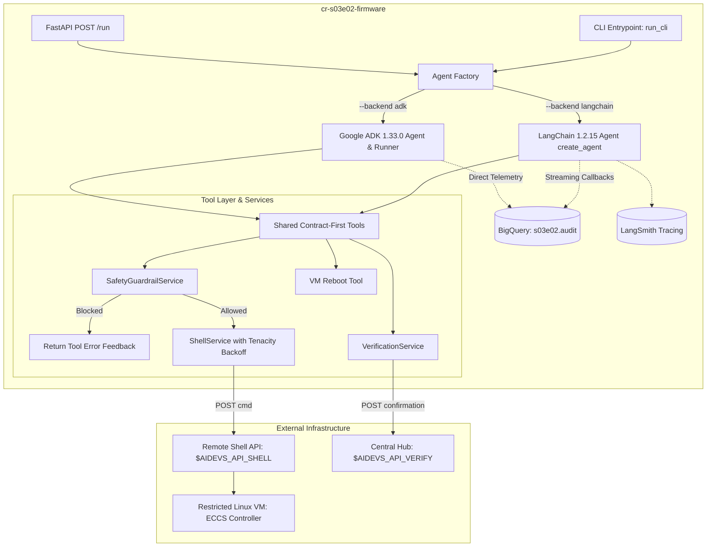

<!-- Source: https://www.industrialempathy.com/posts/design-docs-at-google/ -->
<!-- Based on: Google Design Docs structure by Malte Ubl -->
<!-- Adapted as a Technical PRD for AI-assisted implementation workflows -->

---
status: "approved"
date: 2026-09-13
author: Artur
reviewers: Joi
adr: "ADR.md"
---

# Technical PRD: S03E02 Emergency Core Cooling System Firmware Diagnostics (`cr-s03e02-firmware`)

## Context and Scope

During reactor stabilization at the power plant, diagnostic telemetry confirmed firmware malfunctions within the **Emergency Core Cooling System (ECCS)** controller. Plant specialists dumped the controller memory into a sandboxed virtual machine running a restricted Linux distribution with non-standard command semantics.

The virtual machine is accessible exclusively through a remote HTTP Shell API (`$AIDEVS_API_SHELL`). The environment enforces strict anti-tamper security policies: attempting to inspect `/etc`, `/root`, `/proc/`, or any files matched by local `.gitignore` rules immediately triggers an IP lockout ban (temporary cooldown in seconds) and resets the virtual machine state to its initial snapshot. 

This document specifies the architecture, safety guardrails, execution pipelines, and deployment packaging for an autonomous troubleshooting microservice (`cr-s03e02-firmware`). The system safely diagnoses execution failures of `/opt/firmware/cooler/cooler.bin`, discovers access credentials across permitted directories, reconfigures `settings.ini`, extracts the runtime confirmation token (`ECCS-[a-zA-Z0-9]{40}`), submits it to the central verification server (`$AIDEVS_API_VERIFY`), and receives the lesson verification flag (`{FLG:...}`).

---

## Goals and Non-Goals

### Goals
* **Deterministic Anti-Ban Protection**: Implement a client-side command pre-flight interceptor (`SafetyGuardrailService`) that blocks forbidden paths (`/etc`, `/root`, `/proc/`, relative traversals) and dynamically tracks local `.gitignore` rules before HTTP dispatch, guaranteeing zero firewall bans.
* **Network & Rate-Limit Resilience**: Implement an automated retry and backoff interceptor using `tenacity==9.0.0` to handle HTTP 429, 503, and parse temporary lockout countdowns without crashing the reasoning loop.
* **Dual Framework Parity**: Provide complete feature parity between **LangChain 1.2.15** (`create_agent`) and **Google ADK 1.33.0** (`google.adk.Agent`, `Runner`, `InMemorySessionService`), selectable via `--backend [langchain|adk]`.
* **Standardized Cloud Run Packaging**: Deploy as a production-grade Cloud Run microservice (`cr-s03e02-firmware`) exposing canonical health checks (`GET /health`, `GET /`), task execution endpoint (`POST /run`), and headless local CLI execution (`main.py`).
* **Complete Observability & Auditability**: Stream all agent actions, tool inputs, shell outputs, and reasoning steps in real-time to BigQuery dataset `s03e02` table `audit` via `af_aidevs.audit.bigquery`, supplemented by LangSmith tracing.
* **Closed-Loop Verification**: Submit extracted `ECCS-...` tokens to `$AIDEVS_API_VERIFY` and verify task completion with the course flag `{FLG:...}`.

### Non-Goals
* Direct SSH or raw socket connections into the VM (interaction is strictly bounded to the HTTP Shell API).
* Modifying read-only system partitions on the remote VM.
* Introducing unvetted third-party agent frameworks outside LangChain 1.2.15 and Google ADK 1.33.0.

---

## The Design

### System Overview



### API Design

#### Microservice Endpoints (Cloud Run)
1. `GET /health` and `GET /`:
   - Returns: `{"status": "ok", "service": "cr-s03e02-firmware", "timestamp": "..."}`
2. `POST /run`:
   - Request Body:
     ```json
     {
       "backend": "langchain",
       "session_id": "s03e02_langchain_20260913_233000"
     }
     ```
   - Response Body:
     ```json
     {
       "status": "success",
       "backend": "langchain",
       "session_id": "s03e02_langchain_20260913_233000",
       "confirmation_code": "ECCS-...",
       "flag": "{FLG:...}",
       "steps_executed": 8,
       "details": "Cooler binary successfully configured and executed."
     }
     ```

#### External Shell API (`$AIDEVS_API_SHELL`)
- **Method**: `POST`
- **Request**: `{"apikey": "$AIDEVS_API_KEY", "cmd": "help"}`
- **Response**: `{"output": "...", "error": null, "code": 0}` (or error object indicating rate limit / ban cooldown).

#### External Verification API (`$AIDEVS_API_VERIFY`)
- **Method**: `POST`
- **Request**:
  ```json
  {
    "apikey": "$AIDEVS_API_KEY",
    "task": "firmware",
    "answer": {
      "confirmation": "ECCS-..."
    }
  }
  ```
- **Response**: `{"code": 0, "message": "{FLG:...}"}`

---

### Data Model / Storage

#### Pydantic Schemas (`schemas.py`)
All tool inputs and responses are strictly typed using Pydantic v2 contract-first models:
* `RunTaskRequest`: API request specifying `backend` (`langchain` or `adk`) and optional `session_id`.
* `RunTaskResponse`: Execution summary, confirmation token, flag, and telemetry metadata.
* `ExecuteCommandInput`: Input model with `command` (str) and `reasoning` (str) justifying the action.
* `ExecuteCommandResponse`: Shell stdout/stderr output, return code, and optional progressive disclosure `hint`.
* `RebootVMInput`: Model with `reasoning` explaining why VM reset is necessary.
* `RebootVMResponse`: Status of reboot invocation.
* `VerifySolutionInput`: Model with `confirmation_code` and `reasoning`.
* `VerifySolutionResponse`: Verification result and captured course flag (`{FLG:...}`).

#### BigQuery Audit Storage
* **Dataset**: `s03e02`
* **Table**: `audit`
* **Schema**:
  - `session_id` (STRING)
  - `timestamp` (TIMESTAMP)
  - `step_type` (STRING: `llm_call`, `tool_call`, `system_event`)
  - `reasoning` (STRING)
  - `payload` (JSON)
  - `flag` (STRING, nullable)

---

### Core Logic & Algorithms

#### 1. Client-Side Safety Guardrail (`services/safety_guardrail.py`)
To prevent IP bans and VM resets:
* **Static Blacklist**: Regex patterns rejecting any occurrence of `/etc`, `/root`, `/proc/`, including relative parent traversals (`../etc`, `../../root`, etc.).
* **Dynamic `.gitignore` Cache**:
  - Whenever `execute_shell_command` receives a directory listing or views a `.gitignore` file, its rules (e.g. `*.log`, `secret_config/`, specific ignored binaries) are parsed and added to the session blacklist cache.
  - If a command references any path matching active `.gitignore` rules, the command is intercepted locally.
  - Returns immediate error to the LLM: `"BLOCKED: Target path violates security policy (.gitignore or forbidden path). Command not dispatched to VM."`

#### 2. Tenacity Retry & Ban Cooldown Handler (`services/shell_service.py`)
* Wrapped with `@retry` using:
  - `retry=retry_if_exception_type((httpx.RequestError, httpx.HTTPStatusError))`
  - `wait=wait_exponential(multiplier=1, min=2, max=10)`
  - `stop=stop_after_attempt(5)`
* Custom Ban Detection:
  - If response status is 200/403 with a payload containing `"banned"` or `"wait X seconds"`, extract remaining seconds via regex.
  - Log warning and execute `asyncio.sleep(seconds + 1)`.
  - Automatically retry without failing the agent step.

#### 3. ReAct Agent Diagnostic Workflow
1. **Command Discovery**: Issue `help` to list non-standard available binaries and custom file-manipulation utilities.
2. **Credential Discovery**: Search authorized directories (`/home/`, `/opt/`, etc.) to locate application access credentials.
3. **Execution Probe**: Attempt executing `/opt/firmware/cooler/cooler.bin` and capture diagnostic error output.
4. **Configuration Patch**: Inspect `/opt/firmware/cooler/settings.ini` and apply required parameters (using custom shell editor commands).
5. **Runtime Token Capture**: Run the binary again, capture stdout, extract pattern `ECCS-[a-zA-Z0-9]{40}`.
6. **Task Submission**: Call `submit_confirmation` tool to verify and finalize execution.

---

### Infrastructure & Deployment

* **Target Environment**: Google Cloud Run (Fully Managed Serverless Container).
* **Base Image**: Official `python:3.13.5-slim`.
* **Resource Sizing**: 1 vCPU, 512 MiB RAM, concurrency 80, request timeout 300s.
* **Secret Management**:
  - Local dev: `.env` (gitignored).
  - Cloud Run: Google Secret Manager bindings for `AIDEVS_API_KEY`, `AIDEVS_API_SHELL`, `AIDEVS_API_VERIFY`, and `LANGSMITH_API_KEY`.
* **Build Manifest**: Standardized `cloudbuild.yaml` using GAR authentication token for `af-aidevs` shared package resolution.

---

## Cross-Cutting Concerns

### Security
* **Zero Credential Exposure**: Never hardcode API keys, shell URLs, or verification endpoints.
* **Non-Root Execution**: Container runs with non-privileged user permissions.
* **Flag Redaction**: Course flags `{FLG:...}` are never logged in clear text to public systems or commit messages.

### Observability
* Real-time streaming audit via `af_aidevs.audit.bigquery.AuditService`.
* Distributed execution traces captured in LangSmith via environment configuration.
* Canonical structured JSON logging with request tracing.

### Error Handling & Resilience
* `handle_tool_error=True` configured on all LangChain tools to convert runtime errors into actionable `ToolMessage` feedback.
* Comprehensive fallback reboot command (`reboot_vm`) to reset the remote VM if the configuration state becomes unrecoverable.

---

## Edge Cases and Constraints

| Edge Case | Impact | Mitigation |
|---|---|---|
| Model tries exploring `/etc/passwd` | Remote API lockout ban (cooldown) | Intercepted client-side by `SafetyGuardrailService` before request dispatch. |
| Subdirectory contains `.gitignore` listing critical files | Ban if agent inspects ignored files | Shell client inspects directory contents; parses and caches `.gitignore` rules into active blacklist. |
| Remote VM returns HTTP 503 during shell command | Agent crashes mid-exploration | `tenacity` exponential backoff retries request up to 5 times. |
| Non-standard file editor syntax on VM | Tool failure modifying `settings.ini` | Model inspects `help` command output to discover custom shell modification tools. |

---

## Implementation Plan

### Phases / Milestones

| Phase | Scope | Deliverable |
|---|---|---|
| Phase 1: Environment & Scaffolding | Dependencies (`pyproject.toml`), container manifests, `.env.example` | Clean `uv sync` environment |
| Phase 2: Core Services & Guardrails | `SafetyGuardrailService`, `ShellService` (with Tenacity), `VerificationService` | Unit-tested client library |
| Phase 3: Pydantic Schemas & Tools | Contract-first schemas (`schemas.py`), LangChain & ADK tool definitions | Type-safe tool contracts |
| Phase 4: Dual Agent Implementations | `LangChainFirmwareAgent` & `ADKFirmwareAgent` | Working agent runners |
| Phase 5: FastAPI & CLI Integration | `main.py` (`/health`, `/run`, `run_cli()`) | Fully runnable service |
| Phase 6: E2E Verification & Verification | Test execution, token retrieval, BigQuery audit validation | Passing task submission |

---

## Success Criteria

* [ ] `SafetyGuardrailService` unit tests prove 100% rejection of `/etc`, `/root`, `/proc/`, `../etc`, and simulated `.gitignore` paths.
* [ ] `ShellService` unit tests prove resilient backoff against simulated 429/503 responses and ban cooldown payloads.
* [ ] Agent autonomously discovers credentials and configures `settings.ini` on the remote VM.
* [ ] `/opt/firmware/cooler/cooler.bin` executes cleanly, yielding valid `ECCS-[a-zA-Z0-9]{40}` token.
* [ ] Solution submitted to `$AIDEVS_API_VERIFY` returns status `200` and awards the lesson flag.
* [ ] Audit records stream successfully into BigQuery dataset `s03e02` table `audit`.
* [ ] Zero lint/type errors under Python 3.13.5 with sorted, caret-free dependencies.

---

## Open Questions

None. All architectural decisions were resolved and accepted in [ADR.md](ADR.md).

---

## Implementation Spec

### File Structure
The microservice is implemented strictly under `lessons/s03e02-ograniczenia-modeli-na-etapie-zalozen-projektu/task/cr-s03e02-firmware/`:

```
cr-s03e02-firmware/
├── .dockerignore
├── .gcloudignore
├── .python-version
├── Dockerfile
├── cloudbuild.yaml
├── pyproject.toml
├── system_prompt.md
├── config.py
├── schemas.py
├── main.py
├── services/
│   ├── __init__.py
│   ├── safety_guardrail.py
│   ├── shell_service.py
│   ├── verification_service.py
│   └── audit_service.py
├── agents/
│   ├── __init__.py
│   ├── base.py
│   ├── factory.py
│   ├── langchain_agent.py
│   └── adk_agent.py
└── tests/
    ├── __init__.py
    ├── test_safety_guardrail.py
    └── test_shell_service.py
```

### Technology Stack
* **Python Runtime**: `requires-python = "==3.13.5"`
* **Package Management**: `uv`
* **Dependencies (`pyproject.toml`)**:
  ```toml
  [project]
  name = "cr-s03e02-firmware"
  version = "0.1.0"
  description = "S03E02: ECCS Controller Firmware Troubleshooting Agent"
  requires-python = "==3.13.5"
  dependencies = [
      "af-aidevs==0.2.1",
      "fastapi==0.136.1",
      "fastmcp==3.2.4",
      "google-adk==1.33.0",
      "google-cloud-bigquery==3.41.0",
      "google-genai==1.74.0",
      "httpx==0.28.1",
      "langchain==1.2.15",
      "langchain-google-genai==4.2.2",
      "langchain-mcp-adapters==0.2.2",
      "langsmith==0.12.1",
      "markdownify==0.14.1",
      "pydantic==2.13.4",
      "pytest==8.3.5",
      "pytest-asyncio==0.25.3",
      "python-dotenv==1.2.2",
      "python-frontmatter==1.1.0",
      "tenacity==9.0.0",
      "tzdata==2026.2",
      "uvicorn==0.46.0",
  ]

  [[tool.uv.index]]
  name = "gar"
  url = "https://europe-west6-python.pkg.dev/af-aidevs/python-packages/simple/"
  explicit = true

  [tool.uv.sources]
  af-aidevs = { index = "gar" }

  [build-system]
  requires = ["hatchling"]
  build-backend = "hatchling.build"
  ```

### Coding Standards
* **Pydantic Models**: Contract-first design. All model fields must have explicit `Field(description="...", examples=[...])`. Inputs require a `reasoning` field; tool responses require an optional `hint` field.
* **Path Management**: Strictly use `pathlib.Path` for all local file operations.
* **Environment Variables**: Always use `os.getenv("VAR") or "default"` in `config.py`.
* **Tool Resilience**: All LangChain tools must have `tool.handle_tool_error = True`.
* **Session Formatting**: Session IDs must adhere to `{lesson_id}_{backend}_{YYYYMMDD_HHMMSS}` in `Europe/Zurich` timezone.

### Step-by-Step Implementation Order
1. **Container Scaffolding & Pyproject**: Create `.dockerignore`, `.gcloudignore`, `Dockerfile`, `cloudbuild.yaml`, `.python-version`, and `pyproject.toml`. Run `uv lock`.
2. **Configuration & Prompts**: Implement `config.py` and `system_prompt.md` with YAML frontmatter.
3. **Data Models**: Implement `schemas.py` with all request/response models and tool contracts.
4. **Safety Guardrail Service**: Implement `services/safety_guardrail.py` with path normalization, regex blacklist, and `.gitignore` parsing. Add tests in `tests/test_safety_guardrail.py`.
5. **Shell & Verification Services**: Implement `services/shell_service.py` with `tenacity` retry and ban cooldown handling, and `services/verification_service.py`. Add tests in `tests/test_shell_service.py`.
6. **Agent Implementations**: Implement `agents/base.py`, `agents/langchain_agent.py` (`create_agent`), and `agents/adk_agent.py` (`google-adk==1.33.0` `Agent` & `Runner`), with `agents/factory.py`.
7. **FastAPI & CLI**: Implement `main.py` with `/health`, `/run`, and CLI parser `--backend [langchain|adk]`.
8. **End-to-End Validation**: Run unit tests (`uv run pytest`), execute task via CLI, verify token submission and BigQuery audit logs.

### Acceptance Criteria (Testable)
* [ ] `uv lock` generates a clean lockfile with Python 3.13.5 and exact pinned versions.
* [ ] `uv run pytest tests/` passes with 100% green status on safety interceptor and tenacity backoff.
* [ ] Running `uv run python main.py --backend langchain` executes successfully, retrieves the confirmation code, and verifies task `firmware`.
* [ ] Running `uv run python main.py --backend adk` executes successfully with feature parity.
* [ ] BigQuery dataset `s03e02` contains structured execution traces for each agent step.

### Out-of-Scope for Agent (Human Required)
* Authorizing GCP Service Account secret access bindings in Secret Manager.
* Committing files to git without Artur's explicit command.
