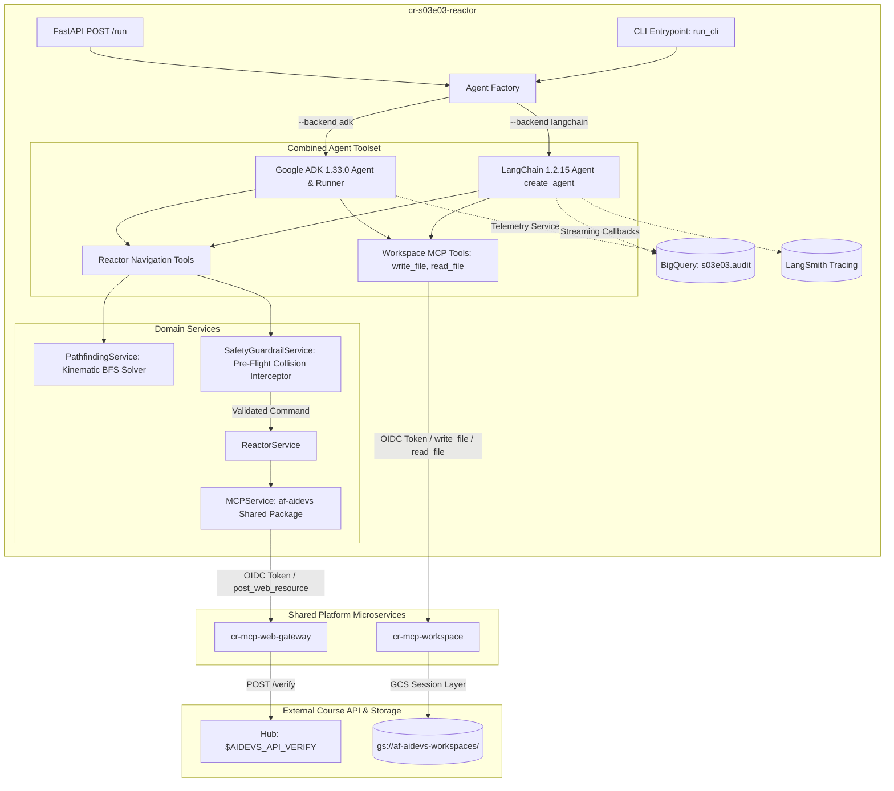

<!-- Source: https://www.industrialempathy.com/posts/design-docs-at-google/ -->
<!-- Based on: Google Design Docs structure by Malte Ubl -->
<!-- Adapted as a Technical PRD for AI-assisted implementation workflows -->

---
status: "approved"
date: 2026-09-14
author: Artur
reviewers: Joi
adr: "ADR.md"
---

# Technical PRD: S03E03 Autonomous Reactor Core Navigation (`cr-s03e03-reactor`)

## Context and Scope

Following the successful diagnostic and deployment verification of the Emergency Core Cooling System (ECCS) firmware in S03E02, the physical cooling controller module must be installed in its target mounting slot (`G`) situated at Column 7, Row 5 inside the reactor core chamber. Due to lethal radiation, human ingress is strictly prohibited.

Navigation is delegated to an automated transport robot operating across a 7x5 discrete grid. The chamber corridor contains vertically oscillating reactor core blocks (`B`) that cycle up and down with each command issued to the robot. The robot must traverse along the chamber floor (Row 5) from starting column 1 (`P`) to column 7 (`G`) without colliding with any reactor blocks.

The environment is controlled via a turn-based HTTP verification API (`$AIDEVS_API_VERIFY`) accepting discrete commands (`start`, `reset`, `right`, `left`, `wait`). In alignment with [ADR.md](ADR.md) and `GEMINI.md` standards, this document specifies the implementation of a Cloud Run microservice (`cr-s03e03-reactor`) employing:
1. **Hybrid Tool-Augmented Agent Architecture**: A deterministic Kinematic Simulator & State-Space Breadth-First Search (BFS) pathfinding tool encapsulated within supervisory agent workflows across **LangChain 1.2.15** and **Google ADK 1.33.0**.
2. **Zero-Trust Network Egress**: Zero direct public internet egress from the task container; 100% of external calls to `$AIDEVS_API_VERIFY` route through `cr-mcp-web-gateway` via the centralized `af-aidevs` package from Artifact Registry.
3. **Multi-Layer Session Workspace**: Staging execution summaries and final flags to `run_notes.txt` via `cr-mcp-workspace`.
4. **Comprehensive Real-Time Auditing**: Streaming full audit telemetry (thoughts, tool calls, block states, guardrail validations, and flags) to BigQuery dataset `s03e03` table `audit` via `af_aidevs.audit.bigquery`.

---

## Goals and Non-Goals

### Goals
* **Zero Direct Container Egress**: Route all external HTTP communications to `$AIDEVS_API_VERIFY` strictly through `cr-mcp-web-gateway.post_web_resource` using the `af-aidevs` Artifact Registry package.
* **Shared Workspace Artifacts**: Persist mission execution logs and retrieved flags to `run_notes.txt` in GCS via `cr-mcp-workspace.write_file`.
* **Mathematical Traversal Guarantee**: Implement a discrete Kinematic Simulator and State-Space BFS solver (`PathfindingService`) calculating optimal, collision-free move sequences across dynamic obstacle cycles `(col, row, time_step)`.
* **Client-Side Kinematic Guardrail**: Intercept and validate every proposed command locally before dispatching to the MCP gateway, preventing robot destruction and wasted budget.
* **Autonomous Self-Healing Loop**: Automatically dispatch `reset` commands and re-evaluate trajectory if state desynchronization or deadlock is detected (capped at 3 recovery attempts).
* **Dual Framework Parity**: Provide 100% functional parity between **LangChain 1.2.15** (`create_agent`) and **Google ADK 1.33.0** (`google.adk.Agent`, `Runner`, `InMemorySessionService`), selectable via `--backend [langchain|adk]`.
* **Standardized Cloud Run Packaging**: Deliver a containerized microservice exposing `GET /health`, `GET /`, `POST /run`, and local headless CLI execution (`main.py`).
* **Real-Time BigQuery Auditing**: Stream step-by-step agent thoughts, tool calls, block telemetry, and execution metrics to BigQuery dataset `s03e03` table `audit` via `af_aidevs.audit.bigquery`.
* **Closed-Loop Verification**: Successfully navigate the robot to Goal `G`, submit installation confirmation, and extract the course verification flag (`{FLG:...}`).

### Non-Goals
* Direct outbound HTTP requests using raw `httpx` or `requests` (strictly prohibited by Zero-Trust policy).
* Continuous real-time physics simulation (the environment is discrete and turn-based; time advances only upon command dispatch).
* Multi-axis 2D grid pathfinding (robot traversal is strictly constrained to Row 5 along the floor).
* Pure unaugmented LLM arithmetic reasoning for spatial obstacle velocities.

---

## The Design

### System Overview



---

### API Design

#### Microservice Endpoints (Cloud Run)
1. `GET /health` and `GET /`:
   - Returns: `{"status": "ok", "service": "cr-s03e03-reactor", "timestamp": "..."}`
2. `POST /run`:
   - **Request Body**:
     ```json
     {
       "backend": "langchain",
       "session_id": "s03e03_langchain_20260914_233000"
     }
     ```
   - **Response Body**:
     ```json
     {
       "status": "success",
       "backend": "langchain",
       "session_id": "s03e03_langchain_20260914_233000",
       "steps_taken": 8,
       "flag": "{FLG:...}",
       "details": "Cooling module installed successfully at reactor slot G."
     }
     ```

#### Course Verification API via `cr-mcp-web-gateway`
- **Method**: Routed via `cr-mcp-web-gateway.post_web_resource`
- **Target URL**: `$AIDEVS_API_VERIFY`
- **Payload**:
  ```json
  {
    "apikey": "$AIDEVS_API_KEY",
    "task": "reactor",
    "answer": {
      "command": "start"
    }
  }
  ```
- **Valid Commands**: `"start"`, `"reset"`, `"right"`, `"left"`, `"wait"`.
- **Response Format**:
  JSON object providing board state (ASCII map representation), robot position, obstacle direction indicators, status text, and the final flag `{FLG:...}`.

---

### BigQuery Audit Telemetry (`s03e03.audit`)

Every action, LLM reasoning turn, tool execution, and environment state transition is streamed in real time to BigQuery dataset `s03e03` table `audit` using `af_aidevs.audit.bigquery.AuditService`:

| Column Name | Data Type | Description |
|---|---|---|
| `timestamp` | `TIMESTAMP` | Event timestamp (UTC) |
| `session_id` | `STRING` | Standardized session ID (`s03e03_{backend}_{YYYYMMDD_HHMMSS}`) |
| `actor` | `STRING` | Actor identity (`agent`, `tool`, `guardrail`, `system`) |
| `step_type` | `STRING` | Lifecycle event (`llm_start`, `tool_call`, `guardrail_check`, `task_complete`) |
| `content` | `STRING` | Human-readable log entry / prompt / model thought preview |
| `reasoning` | `STRING` | Explicit reasoning justification provided by model or algorithm |
| `payload` | `STRING` | Serialized JSON payload of tool inputs, API responses, or board maps |
| `flag` | `STRING` | Redacted/extracted course flag `{FLG:...}` |

---

### Data Model & Contract-First Schemas

Defined in `schemas.py` using Pydantic v2:

```python
from typing import List, Literal, Optional
from pydantic import BaseModel, Field

CommandType = Literal["start", "reset", "right", "left", "wait"]

class BlockState(BaseModel):
    column: int = Field(..., description="Column index (1 to 7) where the block is located", examples=[3])
    top_row: int = Field(..., description="Top row (1 to 4) occupied by the 2-cell block", examples=[2])
    direction: Literal["up", "down"] = Field(..., description="Current vertical movement direction", examples=["down"])

class BoardState(BaseModel):
    step: int = Field(0, description="Elapsed simulation step counter", examples=[3])
    robot_column: int = Field(1, description="Current robot column along Row 5", examples=[1])
    robot_row: int = Field(5, description="Floor row occupied by robot (always 5)", examples=[5])
    blocks: List[BlockState] = Field(default_factory=list, description="States of all active vertical blocks")
    raw_map: Optional[List[str]] = Field(None, description="Raw ASCII representation of the 7x5 chamber")
    message: str = Field("", description="Status message or feedback from the reactor API")

class CalculateTrajectoryInput(BaseModel):
    reasoning: str = Field(..., description="Explanation of why trajectory calculation or recalculation is needed")
    target_column: int = Field(7, description="Target column index to reach", examples=[7])

class CalculateTrajectoryResponse(BaseModel):
    planned_commands: List[CommandType] = Field(..., description="Sequence of commands guaranteed to reach goal without collision")
    estimated_steps: int = Field(..., description="Total steps in the calculated path")
    reasoning: str = Field(..., description="Mathematical explanation of the trajectory")
    hint: Optional[str] = Field("Dispatch the planned commands sequentially using step_robot.", description="Execution hint")

class StepRobotInput(BaseModel):
    reasoning: str = Field(..., description="Justification for selecting this specific command")
    command: CommandType = Field(..., description="Action to execute: right, left, or wait", examples=["right"])

class StepRobotResponse(BaseModel):
    command_executed: CommandType
    current_column: int
    is_goal_reached: bool
    is_collision: bool
    message: str
    flag: Optional[str] = Field(None, description="Course completion flag if goal reached")
    hint: Optional[str] = None
```

---

### Agent Toolset & MCP Workspace Integration

The agent (both in LangChain and Google ADK backends) is equipped with a unified toolset combining domain-specific navigation tools and platform MCP workspace tools:

#### 1. Reactor Navigation Tools (Domain Control)
* **`start_mission(reasoning: str) -> StartMissionResponse`**: Initiates the reactor simulation by sending `{"command": "start"}` to `$AIDEVS_API_VERIFY` via `cr-mcp-web-gateway`. Returns the initial 7x5 chamber map, robot coordinates, and block velocities.
* **`calculate_safe_trajectory(reasoning: str, target_column: int = 7) -> CalculateTrajectoryResponse`**: Executes the discrete Kinematic Simulator and State-Space BFS solver to find the optimal collision-free move sequence (`right`, `wait`, `left`) reaching target column 7.
* **`step_robot(reasoning: str, command: CommandType) -> StepRobotResponse`**: Validates the move locally via `SafetyGuardrailService`, dispatches the single action to `$AIDEVS_API_VERIFY` via `cr-mcp-web-gateway`, and returns updated board telemetry.
* **`reset_simulation(reasoning: str) -> ResetSimulationResponse`**: Sends `{"command": "reset"}` through `cr-mcp-web-gateway` if recovery is required.

#### 2. Platform Workspace Tools (cr-mcp-workspace via `af_aidevs.clients.mcp`)
Connected by default via `af_aidevs.clients.mcp.get_all_mcp_tools` with OIDC authentication:
* **`write_file(file_path: str, content: str, reasoning: str)`**: Used by the agent to record scratch notes during navigation and write the mandatory mission summary to `run_notes.txt` upon completing the run.
* **`read_file(file_path: str, reasoning: str)`**: Reads stored notes or session artifacts from GCS.
* **`list_files(reasoning: str)`**: Lists files present in the current session workspace (`gs://af-aidevs-workspaces/{caller_identity}/{session_id}/`).

#### 3. Mandatory `run_notes.txt` Execution Summary
In `system_prompt.md`, the agent is strictly instructed:
> *"Upon successfully reaching Goal slot G and receiving the course flag `{FLG:...}`, you MUST write a structured execution summary to `run_notes.txt` using `write_file`. The summary must record: Mission Status, Session ID, Backend Used, Step-by-Step Moves Executed, Total Steps, and the Retrieved Flag."*

---

### Core Logic & Kinematic Pathfinding Algorithm

The reactor grid dynamics operate under discrete periodic kinematics:
- Grid size: 7 columns $\times$ 5 rows.
- Floor row = 5. Goal = Column 7, Row 5.
- Each block has height 2. Its valid top-row positions are $\{1, 2, 3, 4\}$.
- When top-row = 4, the block occupies rows 4 and 5 (blocking the robot on the floor).
- In each step $t \to t+1$, a block at top-row $r$ with direction $d$:
  - If $d = \text{down}$: if $r < 4$, next $r = r + 1, d = \text{down}$; if $r = 4$, next $r = 3, d = \text{up}$.
  - If $d = \text{up}$: if $r > 1$, next $r = r - 1, d = \text{up}$; if $r = 1$, next $r = 2, d = \text{down}$.
- Periodicity: The vertical cycle repeats deterministically with period $T = 2 \times (4 - 1) = 6$ steps.
- **State-Space BFS**:
  - State: `(robot_col, time_step)`.
  - Transitions from $(c, t)$:
    - `right`: $(c + 1, t + 1)$ (valid if $c < 7$ and column $c + 1$ does not have a block at row 5 at time $t + 1$).
    - `wait`: $(c, t + 1)$ (valid if column $c$ does not have a block at row 5 at time $t + 1$).
    - `left`: $(c - 1, t + 1)$ (valid if $c > 1$ and column $c - 1$ does not have a block at row 5 at time $t + 1$).
  - Target: $c = 7$.
  - Breadth-First Search returns the optimal command list `[c_1, c_2, ...]` reaching the goal in minimal steps.

---

### Infrastructure & Deployment

- **Hosting**: Google Cloud Run (`cr-s03e03-reactor`).
- **Region**: `europe-west6` (Zurich).
- **Service Account**: `sa-cr-s03e03-reactor`.
- **IAM Bindings**: `roles/run.invoker` on `cr-mcp-web-gateway` and `cr-mcp-workspace`, `roles/bigquery.dataEditor` on dataset `s03e03`.
- **Ingress**: Internal / Private (`public = false`), authorized via OIDC Identity Token.
- **BigQuery Telemetry**: Dataset `s03e03`, table `audit`.
- **Terraform**: Registered in `terraform/variables.tf`.

---

## Cross-Cutting Concerns

### Security & Secrets Management
- Zero hardcoded URLs or keys in code or documentation.
- `AIDEVS_API_KEY` and `AIDEVS_API_VERIFY` loaded from Secret Manager (production) or local `.env` (development).
- Flags (`{FLG:...}`) strictly masked in public logs and documentation.

### Observability & Auditability
- Zero-latency BigQuery streaming via `AuditService` (`s03e03.audit`).
- LangSmith tracing integration enabled via `LANGSMITH_PROJECT` and `LANGSMITH_API_KEY`.
- ASCII board state preview rendered in CLI console logs for transparent visual inspection.
- Mission summary and flag saved to `run_notes.txt` in session workspace.

### Error Handling & Resilience
- Tenacity backoff retry interceptor for HTTP 429/503 errors on MCP gateway calls.
- Client-side collision guardrail rejecting suicidal moves prior to remote transmission.
- Autonomous recovery loop triggered if API returns an unexpected error or collision, executing `reset` up to 3 times.

---

## Edge Cases and Constraints

* **Deadlock at Start**: Block immediately descending on Column 1. Mitigation: The solver evaluates `wait` until Column 1 is safe or forward passage clears.
* **Cycle Desynchronization**: If API block velocity differs from expected cycle. Mitigation: After each step, the actual API board state updates the simulator, allowing dynamic mid-course re-planning.
* **Gateway Interruption during Traversal**: Mitigation: The retry wrapper handles intermittent network drops without resetting the in-memory agent turn.

---

## Implementation Spec

### File Structure
```
lessons/s03e03-kontekstowy-feedback-wspierajacy-skutecznosc-agentow/task/
├── BRD.md
├── ADR.md
├── PRD.md
└── cr-s03e03-reactor/
    ├── .dockerignore
    ├── .gcloudignore
    ├── .python-version
    ├── cloudbuild.yaml
    ├── Dockerfile
    ├── pyproject.toml
    ├── system_prompt.md
    ├── config.py
    ├── schemas.py
    ├── main.py
    ├── services/
    │   ├── __init__.py
    │   ├── audit_service.py
    │   ├── mcp_service.py
    │   ├── reactor_service.py
    │   ├── pathfinding_service.py
    │   └── safety_guardrail.py
    ├── agents/
    │   ├── __init__.py
    │   ├── base.py
    │   ├── factory.py
    │   ├── langchain_agent.py
    │   └── adk_agent.py
    └── tests/
        ├── __init__.py
        ├── test_pathfinding_service.py
        └── test_safety_guardrail.py
```

### Technology Stack & Dependencies (`pyproject.toml`)
- Python `==3.13.5`
- Dependencies (sorted alphabetically):
  - `af-aidevs==0.2.1` (resolved from Artifact Registry `gar`)
  - `fastapi==0.115.11`
  - `fastmcp==3.2.4`
  - `google-adk==1.33.0`
  - `google-cloud-bigquery==3.38.0`
  - `google-cloud-secret-manager==2.23.0`
  - `google-genai==1.63.0`
  - `httpx==0.28.1`
  - `langchain==1.2.15`
  - `langchain-google-genai==2.0.10`
  - `langchain-mcp-adapters==0.2.2`
  - `langsmith==0.1.147`
  - `pydantic==2.10.6`
  - `pytest==8.3.5`
  - `pytest-asyncio==0.25.3`
  - `python-dotenv==1.0.1`
  - `python-frontmatter==1.1.0`
  - `tenacity==9.0.0`
  - `uvicorn==0.34.0`

### Step-by-Step Implementation Order
1. **Scaffold Directory & Config**: Create `cr-s03e03-reactor/` with `.dockerignore`, `.gcloudignore`, `.python-version`, `cloudbuild.yaml`, `Dockerfile`, `pyproject.toml` (with Artifact Registry index for `af-aidevs`), and `config.py`.
2. **Schemas**: Implement contract-first models in `schemas.py` (including reasoning and hint fields).
3. **Core Services**:
   - `services/mcp_service.py`: Uses `af_aidevs.clients.mcp` to connect to `cr-mcp-web-gateway` and `cr-mcp-workspace`.
   - `services/reactor_service.py`: Verification client dispatching commands to `$AIDEVS_API_VERIFY` strictly through `cr-mcp-web-gateway.post_web_resource`.
   - `services/pathfinding_service.py`: Kinematic cycle simulator and State-Space BFS solver.
   - `services/safety_guardrail.py`: Client-side move validator.
   - `services/audit_service.py`: BigQuery streaming integration to dataset `s03e03`.
4. **Unit Tests**:
   - `tests/test_pathfinding_service.py`: Validate BFS finding optimal paths and avoiding simulated obstacles.
   - `tests/test_safety_guardrail.py`: Assert collision prevention on dangerous moves.
5. **Agent Implementations**:
   - `system_prompt.md`: YAML frontmatter with model `gemini-3.8-flash` and mission instructions.
   - `agents/langchain_agent.py`: LangChain 1.2.15 with `create_agent`.
   - `agents/adk_agent.py`: Google ADK 1.33.0 with `google.adk.Agent` and `Runner`.
   - `agents/factory.py`: Agent factory supporting `--backend langchain|adk`.
6. **Main Application**:
   - `main.py`: FastAPI endpoints (`/health`, `/run`) and CLI entrypoint `run_cli()`.
7. **Terraform Registration**:
   - Register dataset `s03e03`, audit table, and service `cr-s03e03-reactor` in `terraform/variables.tf`.

---

### Acceptance Criteria (Testable)
* [ ] Verification requests route strictly through `cr-mcp-web-gateway.post_web_resource` using `af-aidevs`.
* [ ] Execution summary and flag are persisted to `run_notes.txt` in session workspace via `cr-mcp-workspace`.
* [ ] Unit tests for `PathfindingService` pass with 100% success rate, finding collision-free paths.
* [ ] Unit tests for `SafetyGuardrailService` confirm suicidal moves are rejected locally.
* [ ] Microservice exposes `GET /health` returning HTTP 200 and status `ok`.
* [ ] CLI mode runs successfully with `--backend langchain`, safely guiding the robot to slot `G` and extracting `{FLG:...}`.
* [ ] CLI mode runs successfully with `--backend adk` with full feature parity.
* [ ] Step-by-step actions and telemetry are streamed to BigQuery dataset `s03e03.audit`.
* [ ] Zero external API URLs or raw secrets hardcoded in repository code.
