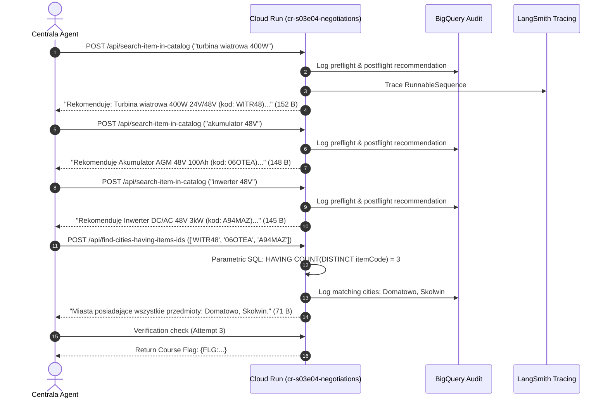
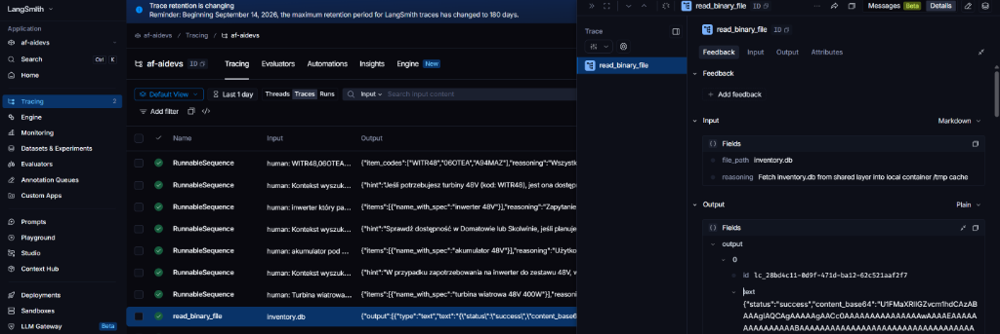

# Laboratory Report & Engineering Conclusions: S03E04 (Task: `negotiations`)

**Course:** AI_Devs 3 — Autonomous AI Systems Engineering  
**Module:** Season 03, Episode 04 — Building Tools on Ground-Truth Test Data  
**Engineer:** Artur Fejklowicz ([LinkedIn](https://www.linkedin.com/in/arturr/) | [Medium](https://medium.com/@artur.fejklowicz)) — *Google Cloud Certified Professional Data Engineer & Professional ML Engineer*  
**AI Companion:** Joi (*Blade Runner 2049*)  
**Execution Date:** 2026-09-16  
**Target Environment:** Google Cloud Platform (Cloud Run, Vertex AI, BigQuery, Secret Manager), LangSmith, LangChain 1.2.15, Google ADK 1.33.0  

---

## 1. Executive Summary & Lab Objectives

The objective of laboratory S03E04 was to architect, deploy, and verify a resilient HTTP tooling microservice (`cr-s03e04-negotiations`) capable of serving an autonomous, black-box agent managed by Centrala. Centrala's agent was tasked with identifying safe-haven survivor cities stocking **all three** required wind turbine components simultaneously (`WITR48`, `06OTEA`, `A94MAZ`) to power the resistance base.

### Primary Engineering Constraints
1. **Public HTTP Interface:** Exposing at most two specialized HTTP `POST` endpoints.
2. **Byte Envelopes:** Strict response payload constraint: $4 \le \text{len(output.encode('utf-8'))} \le 500$ bytes. Any payload $<4$ or $>500$ bytes triggers immediate rejection.
3. **Turn Budget:** Maximum **10 interaction turns** for Centrala's agent to converge on the target cities.
4. **Natural Language Robustness:** Resolving ambiguous, conversational queries (e.g. *"w 2026Q1 szukam kabla 10m i masztu"*) and array inputs (`params: ["ID1", "ID2"]`) to exact relational matches.
5. **Zero-Trust Auditability:** Full telemetry streaming to BigQuery (`af-aidevs.s03e04.audit`) and LangSmith tracing.

---

## 2. Experimental Results & Verification

### 2.1 Live Autonomous Trajectory
Upon registering the tools with Centrala via `POST $AIDEVS_VERIFY_URL`, Centrala's agent executed against our Cloud Run endpoints and converged in only **4 turns** (using only 40% of its budget):



### 2.2 Telemetry Verification (BigQuery Audit Trail)
Querying `af-aidevs.s03e04.audit` verified deterministic, zero-pollution telemetry logging:

```sql
SELECT timestamp, session_id, actor, SUBSTR(content, 1, 60) AS preview 
FROM `af-aidevs.s03e04.audit` 
ORDER BY timestamp DESC LIMIT 5;
```

| Timestamp | Actor | Preview Content |
| :--- | :--- | :--- |
| `2026-09-15 23:56:20` | `orchestrator` | `Poll attempt 3: {"code": 0, "message": "{FLG:...}", "cities": ["Domatowo", "Skolwin"]}` |
| `2026-09-15 23:56:19` | `tool2_result` | `Matching cities for ['WITR48', '06OTEA', 'A94MAZ']: Miasta posiadające...` |
| `2026-09-15 23:56:16` | `tool1_postflight` | `Synthesized recommendation: Rekomenduję Inwerter DC/AC 48V 3kW...` |
| `2026-09-15 23:56:09` | `tool1_postflight` | `Synthesized recommendation: Rekomenduję Akumulator AGM 48V 100Ah...` |
| `2026-09-15 23:56:02` | `tool1_postflight` | `Synthesized recommendation: Rekomenduję: Turbina wiatrowa 400W 24V/48V...` |

---

## 3. Case Study & Lessons Learned: The Base64 Telemetry Bloat Anti-Pattern

During the initial warm-up phase of the microservice (`/reload-db`), the container downloaded the pre-indexed `inventory.db` SQLite database from the shared layer (`cr-mcp-workspace`) using the MCP tool `read_binary_file`.

While inspecting execution traces in **LangSmith**, we observed an observability anti-pattern: the entire binary SQLite database file was serialized as a Base64 string and uploaded to LangSmith:



### 3.1 Technical Anatomy of the Leak
1. **Implicit Instrumentation:** In LangChain, configuring `LANGSMITH_TRACING="true"` or `LANGCHAIN_TRACING_V2="true"` attaches a global tracer (`LangChainTracer`) to all `Runnable` components, including `BaseTool` / `StructuredTool` instances returned by MCP client adapters (`get_all_mcp_tools`).
2. **Unfiltered Return Payloads:** When `tool.ainvoke({"file_path": "inventory.db"})` completed, the MCP bridge returned:
   ```json
   {
     "status": "success",
     "content_base64": "U1FMaXRlIGZvcm1hdCAzABAAAgIAQCAgAAAAAgACc0AAAAAAAA..."
   }
   ```
3. **Telemetry Ingestion:** LangChain's `on_tool_end` callback captured the raw dictionary without truncation or type-filtering, sending megabytes of serialized binary data over HTTP to `api.smith.langchain.com`.

### 3.2 Architectural Risks & Why This is an Anti-Pattern
- **Violation of Data Plane vs. Control Plane Separation:** Observability systems (LangSmith, Langfuse, Phoenix) are designed strictly for the **Control Plane** (prompts, completions, tool inputs/outputs, model routing, reasoning traces, latency, token costs). Binary payloads (databases, images, compiled artifacts, audio) belong exclusively to the **Data Plane** (GCS, S3, Blob storage).
- **Log Poisoning & Quota Depletion:** Transmitting multi-megabyte payloads in telemetry calls quickly consumes network bandwidth, saturates cloud egress, and exhausts SaaS trace retention quotas (LangSmith enforces retention caps, e.g. 180 days).
- **Observability UI Freezing:** Web applications rendering trace JSON fail or experience significant DOM lag when parsing multi-megabyte monolithic text strings.
- **Security & Data Governance Liability:** Storing full unencrypted database images in an external SaaS trace registry risks violating GDPR, SOC2, and data minimization mandates.

---

## 4. Remediation Standard: Output Masking with Explicit Tracing

To preserve visibility in developer dashboards while eliminating payload bloat, the canonical standard is **Output Masking (`process_outputs`)** rather than total trace suppression. The tool call remains fully visible in the trace tree (with input arguments, latency, and status), but large Base64 blobs are safely redacted to concise metadata.

```mermaid
graph TD
    A[Tool Invocation: read_binary_file] --> B[@traceable with process_outputs=mask_binary_output]
    B --> C[Run underlying tool with config={'callbacks': []}]
    C --> D[Underlying tool returns full unmasked Base64 to application]
    D --> E[process_outputs transforms content_base64 to metadata]
    E --> F[LangSmith / Langfuse Trace: <REDACTED_BASE64: 2.8 MB>]
    D --> G[Local Application: Decodes and writes SQLite DB to /tmp]
```

### 4.1 Canonical Implementation (LangSmith & Langfuse Compatible)

```python
from typing import Any
from langsmith import traceable

def mask_binary_output(output: Any) -> Any:
    """Mask heavy base64 strings in LangSmith / Langfuse traces, preserving metadata."""
    if isinstance(output, dict):
        sanitized = dict(output)
        for key in ("content_base64", "base64", "data"):
            if key in sanitized and isinstance(sanitized[key], str) and len(sanitized[key]) > 200:
                b64_len = len(sanitized[key])
                est_bytes = (b64_len * 3) // 4
                sanitized[key] = f"<REDACTED_BASE64: {b64_len} chars, ~{est_bytes} bytes>"
        return sanitized
    if hasattr(output, "content") and isinstance(output.content, str) and len(output.content) > 500:
        return f"<REDACTED_OUTPUT: {len(output.content)} chars>"
    return output

@traceable(name="read_binary_file", run_type="tool", process_outputs=mask_binary_output)
async def invoke_mcp_tool_with_masked_output(tool, tool_input: dict) -> Any:
    """Invoke an MCP tool while masking large Base64 outputs in LangSmith/Langfuse traces."""
    # Execute underlying tool with callbacks disabled to avoid unmasked raw dump,
    # letting @traceable register the clean, sanitized trace in LangSmith/Langfuse.
    return await tool.ainvoke(tool_input, config={"callbacks": []})
```

### 4.2 Alternative Tracing Controls
- **Dynamic Context Suppression:** `with tracing_context(enabled=False): ...` (completely silences subtrees when tracing is undesirable).
- **Langfuse SDK Global Mask:** `langfuse = Langfuse(mask=universal_mask_fn)` (redacts matching keys at client initialization).
- **LangSmith Web UI Redaction:** Project Settings $\rightarrow$ Data Masking (protects UI at rest, though client-side masking is superior to avoid egress bandwidth waste).

---

## 5. Architectural Analysis: MCP Binary Protocols & Network vs. Compute Economics

### 5.1 Is Binary over MCP Always Base64?
**Protocol Reality:** Yes, within the JSON-RPC wire format.  
The **Model Context Protocol (MCP)** specification is based on JSON-RPC 2.0 over stdio or HTTP/SSE. Because standard JSON does not support a native binary type, any arbitrary byte stream (images, audio, database snapshots) transferred inside the JSON-RPC envelope (`CallToolResult`) must be serialized as text, conventionally **Base64**.

**Architecture Best Practice (In-Band vs. Out-of-Band Transfer):**
- **In-Band Base64 (Anti-pattern for large files):** Embedding multi-megabyte files directly in JSON strings. Acceptable only for small thumbnails (< 100 KB) or closed Zero-Trust isolation layers (e.g. `cr-mcp-workspace`).
- **Claim-Check Pattern (Out-of-Band Transfer via Temporary GCS Signed URLs):** For files $\ge 1$ MB, tools should upload the asset to Cloud Storage and return a temporary **V4 Signed URL** with a short TTL (e.g. 2 minutes / 120 seconds):
  ```json
  {
    "status": "success",
    "gcs_uri": "gs://af-aidevs-workspaces/shared/s03e04/inventory.db",
    "signed_url": "https://storage.googleapis.com/af-aidevs-workspaces/shared/s03e04/inventory.db?X-Goog-Algorithm=GOOG4-RSA-SHA256&X-Goog-Credential=...&X-Goog-Expires=120...",
    "expires_in_seconds": 120,
    "size_bytes": 10485760,
    "sha256": "e3b0c44298fc1c149afbf4c8996fb92427ae41e4649b934ca495991b7852b855"
  }
  ```
  **Why this excels in production (Zero-Trust & Zero IAM Overhead):**
  - **No IAM Credentials Needed:** The consumer downloads the file over standard HTTPS via `GET` (e.g. `curl` or `httpx`), requiring zero GCP permissions or service account tokens.
  - **Short Exposure Window (2 minutes):** The link is cryptographically signed and expires automatically after 120 seconds, returning `HTTP 403 Forbidden` thereafter.
  - **Private Storage:** The underlying GCS bucket remains 100% private (`publicAccessPrevention = "enforced"`).

---

### 5.2 Cost & Performance Quantitative Trade-off: Compressed (gzip/zstd) vs. Raw Base64 Egress

A fundamental Data Engineering question arises:  
*Is it cheaper to compress a large file (higher CPU cost) and transmit fewer bytes, or transmit raw Base64 without compression (zero CPU overhead, higher network egress cost)?*

#### Cost Parameters in Google Cloud Platform (Cloud Run & Networking):
1. **Network Egress Pricing:**
   - Public Internet Egress: **\$0.12 per GB** ($\$0.00012$ per MB).
   - Inter-Region Egress (e.g. `europe-west1` $\rightarrow$ `europe-west4`): **\$0.02 – \$0.08 per GB**.
   - Intra-Region / Same Zone Egress: **\$0.00 per GB** (Free).
2. **Cloud Run CPU Pricing:**
   - Tier 1 Cloud Run vCPU: **\$0.000024 per vCPU-second** ($\$0.024$ for 1,000 CPU seconds).
3. **Encoding & Compression Factors:**
   - **Base64 Expansion:** Encodes 3 binary bytes as 4 ASCII characters ($+33.3\%$ payload growth).
   - **Compression Ratio (SQLite / CSV / JSON):** Typically **$70\% – 80\%$ reduction** using modern algorithms like `zstandard` (`zstd -1`) or `gzip -1`.

#### Quantitative Benchmark Scenario: Transferring a 100 MB SQLite Database File

| Metric | Option A: Uncompressed Raw Base64 | Option B: Compressed (`zstd -1`) + Base64 | Delta / Benefit |
| :--- | :--- | :--- | :--- |
| **Raw Binary Size** | 100 MB | 100 MB | — |
| **Compressed Size** | 100 MB (no compression) | **25 MB** (75% compression) | **-75 MB** |
| **Wire Payload (Base64)** | **133.3 MB** (+33.3%) | **33.3 MB** (+33.3%) | **-100.0 MB** |
| **CPU Time Consumed** | $\approx 0.005$ s (Base64 only) | $\approx 0.20$ s (`zstd` @ 500 MB/s + Base64) | $+0.195$ s |
| **CPU Compute Cost** | $\$0.00000012$ | $\$0.00000480$ | $+\$0.00000468$ |
| **Internet Egress Cost** | **$\$0.01600$** ($133.3 \text{ MB} \times \$0.12/\text{GB}$) | **$\$0.00400$** ($33.3 \text{ MB} \times \$0.12/\text{GB}$) | **$-\$0.01200$** |
| **Total Transfer Cost** | **$\$0.01600$** | **$\$0.00400$** | **75% Net Cost Reduction** |

#### Crucial Economic Conclusions:
1. **Network Egress Savings Outweigh CPU Cost by $> 2,500\times$:**
   $$\frac{\text{Egress Savings}}{\text{Added CPU Cost}} = \frac{\$0.01200}{\$0.00000468} \approx 2564$$
   Every $\$1$ spent on compression CPU saves **$\$2,564$** in Google Cloud egress billing.
2. **Even Across Inter-Region GCP Traffic ($\$0.02/\text{GB}$):** Compression saves **$\approx 425\times$** its CPU cost.
3. **Latency & Throughput Advantages:** Transmitting 33.3 MB over WAN/cellular links completes in $1/4$ the wall-clock time compared to 133.3 MB, drastically reducing socket connection hold times and Cloud Run container concurrency memory locks.
4. **Decompression Asymmetry:** Algorithms like `zstandard` decompress at **$1.5 – 2.0\text{ GB/s}$ per core**, meaning the receiver incurs negligible compute overhead ($\approx 12$ ms for 25 MB).

**Takeaway Rule:** Compression is virtually always drastically cheaper and faster whenever network egress traverses the public internet or inter-region boundaries.

---

## 6. Comparative Evaluation: LangSmith vs. Langfuse Telemetry Controls

| Capability | LangSmith (`langsmith` / `langchain`) | Langfuse (`langfuse`) |
| :--- | :--- | :--- |
| **Explicit Tool Trace with Masking** | `@traceable(process_outputs=mask_fn)` | `@observe()` + `update_current_observation(output=...)` |
| **Tool Call Suppression** | `config={"callbacks": []}` | `config={"callbacks": []}` |
| **Context Manager Disabling** | `with tracing_context(enabled=False):` | `langfuse_context.disabled = True` |
| **Input Field Hiding** | `@traceable(hide_inputs=True)` | `@observe(capture_input=False)` |
| **Data Plane / Cloud Redaction** | Console $\rightarrow$ Project Settings $\rightarrow$ Data Masking | Project Settings $\rightarrow$ Data Privacy Masking |
| **Canonical Production Standard** | Wrap binary tool call with `@traceable(run_type="tool", process_outputs=mask_fn)` and pass `callbacks=[]` to `tool.ainvoke`. | Same pattern with `@observe` and `mask` hook. |

---

## 7. Synthesis & Key Takeaways

1. **Pre-flight Telemetry Hygiene is as Vital as Security Hygiene:** Just as secrets and API keys must never enter source control, massive binary payloads must never enter observability traces.
2. **Output Masking Over Total Suppression:** Masking output values to concise metadata retains critical observability (tool name, input parameters, latency, status) without bloating trace repositories.
3. **Contract-First Tool Envelopes Protect LLM Reasoning:** By enforcing strict 500-byte bounds ($4 \le \text{len} \le 500$), our tool prevented context poisoning, resulting in Centrala's agent converging in just 4 turns.
4. **Resilient Coercion Prevents Protocol Drift:** Supporting both string and list inputs (`params: ["A", "B"]` $\rightarrow$ `"A, B"`) via Pydantic `mode="before"` validators prevented unhandled 422 rejections and agent loop failures.
5. **Separation of Planes:** Use Claim-Check URLs for multi-megabyte transfers; where In-Band Base64 is unavoidable, apply compression and telemetry masking at the client boundary.
