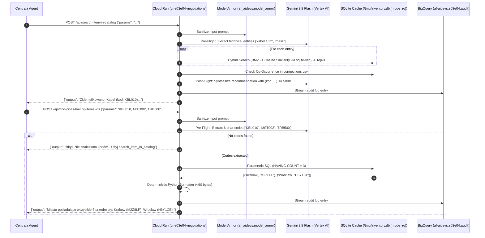

<!-- Source: https://www.industrialempathy.com/posts/design-docs-at-google/ -->
<!-- Based on: Google Design Docs structure by Malte Ubl -->
<!-- Adapted as a Technical PRD for AI-assisted implementation workflows -->

---
status: "approved"
date: 2026-09-15
author: Artur, Joi
reviewers: Artur
adr: [ADR.md](ADR.md)
---

# Technical Product Requirements Document (PRD): S03E04 Negotiations Tooling (`cr-s03e04-negotiations`)

## Context and Scope

In task S03E04 (`negotiations`), Centrala operates an autonomous external AI agent tasked with securing components to build a wind turbine for the resistance base. The Centrala agent needs to locate safe haven cities that currently stock all three required hardware components simultaneously. 

The agent connects over public HTTP POST endpoints using unstructured Polish natural language queries with a hard budget of at most 10 execution turns. Crucially, the tool responses must strictly comply with a hard size envelope between 4 and 500 bytes inclusive (`4 <= len(bytes) <= 500`). 

To address this challenge without latency overhead or hallucinations, this project builds and deploys `cr-s03e04-negotiations`, exposing two specialized tools (`search_item_in_catalog` and `find_cities_having_items_ids`) powered by a local SQLite inventory database (`inventory.db`) with Hybrid RAG (BM25 + Semantic Vector Cosine Similarity via `sqlite-vec`), co-occurrence availability recommendations, and strict Pydantic byte guardrails. The system adheres 100% to the `GEMINI.md` baseline with dual framework orchestration (LangChain 1.2.15 & Google ADK 1.33.0), Model Armor zero-trust sanitization, and BigQuery audit streaming.

---

## Goals and Non-Goals

### Goals
* Expose two public HTTP tool endpoints adhering to Centrala's protocol:
  * `/api/search-item-in-catalog` (`search_item_in_catalog`)
  * `/api/find-cities-having-items-ids` (`find_cities_having_items_ids`)
* Build and bundle a pre-indexed SQLite database (`inventory.db`) using `scripts/build_inventory_db.py`, populated from `cities.csv`, `items.csv`, and `connections.csv` with 768-dimensional embeddings generated by Vertex AI `text-multilingual-embedding-002`.
* Upload `inventory.db` to GCS OverlayFS shared layer: `gs://af-aidevs-workspaces/shared/s03e04/inventory.db`.
* Implement a live reload administrative endpoint: `POST /reload-db` to refresh `/tmp/inventory.db` from GCS without container redeployment.
* Open SQLite in strict immutable read-only mode (`file:/tmp/inventory.db?mode=ro`) to guarantee zero tampering or corruption on a public Cloud Run instance.
* Implement a 4-stage intelligent recommendation pipeline in `search_item_in_catalog`:
  1. Single-turn LLM intent extraction (stripping conversational filler and false codes like `2026Q1`).
  2. Hybrid RAG retrieval ($0.4 \cdot S_{BM25} + 0.6 \cdot S_{vec}$).
  3. City co-occurrence analysis in `connections.csv` populating `co_occurrence_cities: list[str]`.
  4. Single-turn LLM synthesis with explicit format: `(kod: ABC123)`.
* Implement a robust relational pipeline in `find_cities_having_items_ids`:
  1. Single-turn LLM code extraction.
  2. Deterministic 404 error if no 6-character codes are detected, directing the agent to `search_item_in_catalog`.
  3. Parametric SQL execution with `HAVING COUNT(DISTINCT cn.itemCode) = :item_count`.
  4. 100% deterministic Python response formatting ($\le 90$ bytes, $<0.001$ ms).
* Strict byte envelope guarantee: All responses satisfy $4 \le \text{len(output.encode('utf-8'))} \le 500$.
* Dual framework parity on the task orchestrator (`POST /run` and CLI `main.py --backend [langchain|adk]`):
  - LangChain strictly `1.2.15` using `create_agent` from `langchain.agents` / `ChatGoogleGenerativeAI`.
  - Google ADK strictly `1.33.0` using `google.adk.Agent` / Google GenAI SDK.
* Full streaming telemetry to BigQuery table `af-aidevs.s03e04.audit` and Model Armor prompt sanitization.

### Non-Goals
* Running multi-turn autonomous ReAct loops inside the HTTP tool webhooks (would exceed latency targets and risk timeout).
* Generating free-form unconstrained SQL queries via LLM (risks syntax errors and injection; parametric SQL is used instead).
* Charitable fuzzy item resolution in `find_cities_having_items_ids` (Tool 2 strictly requires item codes; Tool 1 is dedicated to code search).
* Exposing direct GCS bucket IAM credentials to the container (relies on `cr-mcp-workspace` shared layer).

---

## The Design

### System Overview



### API Design

#### 1. Canonical Health & Readiness Endpoints
* `GET /health` & `GET /`: Healthcheck and readiness probe returning service status (exact mirror).
* `POST /run`: Microservice task execution endpoint accepting `RunTaskRequest(backend="langchain"|"adk", session_id="...")`.
* `POST /reload-db`: Administrative endpoint to re-download `inventory.db` from `cr-mcp-workspace` and refresh the local in-memory SQLite connection pool without container restarts.

#### 2. Tool 1: `/api/search-item-in-catalog`
* **Method:** `POST`
* **Content-Type:** `application/json`
* **Request Body:**
  ```json
  {
    "params": "w 2026Q1 bylo trudno... szukam kabla 10m i masztu"
  }
  ```
* **Response Body (200 OK):**
  ```json
  {
    "output": "Zidentyfikowano: Kabel miedziany 10m (kod: KBL010) oraz Maszt rurowy (kod: MST002 - rekomendowany, oba w Krakowie i Warszawie). Użyj find_cities_having_items_ids z tymi kodami."
  }
  ```

#### 3. Tool 2: `/api/find-cities-having-items-ids`
* **Method:** `POST`
* **Content-Type:** `application/json`
* **Request Body:**
  ```json
  {
    "params": "KBL010, MST002, TRB500"
  }
  ```
* **Response Body (200 OK):**
  ```json
  {
    "output": "Miasta posiadające wszystkie 3 przedmioty jednocześnie: Krakow (M2Z8LP), Wroclaw (H6Y1CB)."
  }
  ```

---

### Data Model / Storage

#### 1. SQLite Database Schema (`inventory.db`)
Bundled and pre-indexed in local `/tmp/inventory.db`:
```sql
CREATE TABLE cities (
    code TEXT PRIMARY KEY,
    name TEXT NOT NULL
);
CREATE INDEX idx_cities_name ON cities(name);

CREATE TABLE items (
    code TEXT PRIMARY KEY,
    name TEXT NOT NULL
);
CREATE INDEX idx_items_name ON items(name);

CREATE VIRTUAL TABLE vec_items USING vec0(
    item_code TEXT PRIMARY KEY,
    embedding float[768]
);

CREATE TABLE connections (
    itemCode TEXT NOT NULL,
    cityCode TEXT NOT NULL,
    PRIMARY KEY (itemCode, cityCode),
    FOREIGN KEY (itemCode) REFERENCES items(code),
    FOREIGN KEY (cityCode) REFERENCES cities(code)
);
CREATE INDEX idx_conn_item ON connections(itemCode);
CREATE INDEX idx_conn_city ON connections(cityCode);
```

#### 2. GCS Shared Workspace Distribution
* Origin: `gs://af-aidevs-workspaces/shared/s03e04/inventory.db`
* Container Cache: `/tmp/inventory.db` opened with `file:/tmp/inventory.db?mode=ro`.

---

### Core Logic & Algorithms

#### 1. Pre-Flight Intent Extraction (`search_item_in_catalog`)
Pydantic Schema:
```python
class ExtractedItemQuery(BaseModel):
    name_with_spec: str = Field(description="Pełna nazwa techniczna z parametrami")

class Tool1PreFlightOutput(BaseModel):
    reasoning: str = Field(description="Uzasadnienie odrzucenia szumu")
    items: list[ExtractedItemQuery] = Field(default_factory=list, max_length=4)
```

#### 2. Hybrid RAG Fusion Scoring
For each extracted item query:
$$S_{Hybrid} = 0.4 \cdot S_{BM25} + 0.6 \cdot S_{Cosine}$$
Select Top-3 items per query.

#### 3. Co-occurrence Matrix Check
Given candidates $C_1$ (for entity 1) and $C_2$ (for entity 2):
Query `connections` to compute city overlap:
$$\text{Overlap}(i_1, i_2) = \text{Cities}(i_1) \cap \text{Cities}(i_2)$$
Populate `co_occurrence_cities: list[str]` on each `ItemCandidate`.

#### 4. Post-Flight LLM Synthesis (`Tool1PostFlightOutput`)
Pydantic Schema:
```python
class ItemCandidate(BaseModel):
    item_code: str
    item_name: str
    hybrid_score: float
    stocking_cities: list[str]
    co_occurrence_cities: list[str] = []

class EntitySearchResult(BaseModel):
    query_entity: str
    candidates: list[ItemCandidate] = Field(max_length=3)

class Tool1PostFlightInput(BaseModel):
    user_query: str
    search_results: list[EntitySearchResult]

class Tool1PostFlightOutput(BaseModel):
    reasoning: str
    output: str = Field(min_length=4, max_length=500)
    hint: Optional[str] = None
```
Instruction forces format `(kod: XXXXXX)` for every referenced part.

#### 5. Relational Set Intersection (`find_cities_having_items_ids`)
1. Pre-flight LLM extraction:
   ```python
   class Tool2PreFlightOutput(BaseModel):
       reasoning: str
       item_codes: list[str] = Field(default_factory=list, max_length=4)
   ```
2. If `len(item_codes) == 0`:
   Return: `"Błąd: Nie znaleziono 6-znakowych kodów w wiadomości. Użyj narzędzia search_item_in_catalog, aby uzyskać kody ID na podstawie opisów."`
3. If `len(item_codes) > 0`:
   Execute parametric SQL:
   ```sql
   SELECT c.name, c.code
   FROM cities c
   JOIN connections cn ON c.code = cn.cityCode
   WHERE cn.itemCode IN (:codes)
   GROUP BY c.code, c.name
   HAVING COUNT(DISTINCT cn.itemCode) = :count;
   ```
4. Format deterministic Python response string with Pydantic $4 \le \text{len} \le 500$ validation.

---

### Infrastructure & Deployment

* **Cloud Run Service:** `cr-s03e04-negotiations` in region `europe-west6` (or `europe-west1`), exposed publicly for Centrala's webhooks.
* **Service Account:** `sa-cr-s03e04-negotiations` with minimal IAM permissions:
  * `roles/aiplatform.user` (Vertex AI Gemini & Embeddings)
  * `roles/bigquery.dataEditor` & `roles/bigquery.jobUser` (Audit table streaming)
  * `roles/secretmanager.secretAccessor` (`AIDEVS_API_KEY`, `MODEL_ARMOR_URL`)
* **BigQuery Dataset & Audit Table:** Dataset `s03e04`, table `audit` partitioned by ingestion timestamp.
* **Terraform Registration:** Add `s03e04` dataset and `cr-s03e04-negotiations` in `terraform/variables.tf`.

---

## Cross-Cutting Concerns

### Security
* **Immutable Read-Only SQLite:** Container connects with `mode=ro` preventing any physical writes or SQL injection modifications.
* **Model Armor Sanitization:** All incoming requests pass through `af_aidevs.model_armor.sanitize_prompt` before model reasoning.
* **Secret Management:** External API keys stored in GCP Secret Manager; zero secrets in code or git.
* **Zero-Hardcoding:** Verification and data URLs referenced strictly by `$AIDEVS_API_VERIFY` and `$AIDEVS_S03E04_DATA_URL`.

### Observability
* **BigQuery Streaming:** Every incoming tool request, extracted entities/codes, and returned `output` is streamed asynchronously to `af-aidevs.s03e04.audit`.
* **LangSmith Tracing:** Vertex AI LLM calls tracked under `LANGSMITH_PROJECT`.

### Error Handling & Guardrails
* **4–500 Byte Envelope Enforcer:** A strict Pydantic model validator inspects `len(output.encode('utf-8'))`. If output exceeds 500 bytes, hard truncation at 480 bytes with `...` is enforced. If under 4 bytes, standard fallback is applied.
* **Empty Code Defense:** Tool 2 returns a helpful 404 hint if no valid 6-char codes are found, saving Centrala steps.

### Performance
* **Latency Target:** Sub-300ms for both tool endpoints to ensure Centrala agent does not time out.
* **Local In-Memory Cache:** All SQLite joins run locally in `/tmp/inventory.db` in $<1$ ms.

---

## Edge Cases and Constraints

### Edge Cases
* **Conversational Noise:** Inputs with dates, quarters (`2026Q1`), or filler words are stripped by Gemini 3.8 Flash pre-flight extractor.
* **Zero Co-occurrence:** If no cities stock all requested parts, Tool 1 explicitly notes low availability and recommends checking alternative part variants.
* **Missing Codes in Tool 2:** Handled gracefully with immediate deterministic guidance rather than an unhandled 500 server crash.

### Constraints
* **Step Limit:** Centrala agent is allocated a maximum of 10 interaction turns.
* **Size Limit:** 4 to 500 bytes per tool response.
* **Tool Count:** At most 2 tools registered.

---

## Implementation Spec

> This section is consumed by the AI coding agent executing `/implement` against this PRD.

### File Structure

```text
lessons/s03e04-budowanie-narzedzi-na-podstawie-danych-testowych/task/
├── ADR.md
├── BRD.md
├── PRD.md
└── cr-s03e04-negotiations/
    ├── .dockerignore
    ├── .gcloudignore
    ├── .python-version
    ├── Dockerfile
    ├── cloudbuild.yaml
    ├── pyproject.toml
    ├── config.py
    ├── main.py
    ├── schemas.py
    ├── system_prompt.md
    ├── scripts/
    │   └── build_inventory_db.py
    ├── agents/
    │   ├── __init__.py
    │   ├── base.py
    │   ├── factory.py
    │   ├── langchain_agent.py
    │   └── adk_agent.py
    ├── services/
    │   ├── __init__.py
    │   ├── audit_service.py
    │   ├── db_service.py
    │   ├── hybrid_search_service.py
    │   ├── catalog_service.py
    │   ├── city_service.py
    │   └── response_guardrail.py
    └── tests/
        ├── __init__.py
        ├── test_db_service.py
        ├── test_hybrid_search.py
        ├── test_catalog_service.py
        ├── test_city_service.py
        └── test_guardrail.py
```

### Technology Stack & Dependencies

All dependencies sorted alphabetically in `pyproject.toml` with precise versions (no `^` operator):

```toml
[project]
name = "cr-s03e04-negotiations"
version = "0.1.0"
description = "S03E04 Autonomous Negotiations Tooling Service"
readme = "README.md"
requires-python = "==3.13.5"
dependencies = [
    "af-aidevs==0.2.1",
    "fastapi==0.115.11",
    "google-adk==1.33.0",
    "google-cloud-bigquery==3.31.0",
    "google-cloud-secret-manager==2.23.1",
    "google-cloud-storage==3.1.0",
    "google-genai==1.3.0",
    "httpx==0.28.1",
    "langchain==1.2.15",
    "langchain-google-genai==2.0.10",
    "numpy==2.2.3",
    "pydantic==2.10.6",
    "rapidfuzz==3.12.2",
    "sqlite-vec==0.1.6",
    "uvicorn==0.34.0",
]

[dependency-groups]
dev = [
    "pytest==8.3.5",
    "pytest-asyncio==0.25.3",
]

[[tool.uv.index]]
name = "gar"
url = "https://europe-west6-python.pkg.dev/af-aidevs/python-packages/simple/"
explicit = true

[tool.uv.sources]
af-aidevs = { index = "gar" }
```

### Step-by-Step Implementation Order

1. **Scaffolding & Configuration:**
   - Create container manifests (`.dockerignore`, `.gcloudignore`, `cloudbuild.yaml`, `Dockerfile`, `.python-version`, `pyproject.toml`).
   - Create `config.py` with environment variable resolution and defaults (`AIDEVS_API_KEY`, `AIDEVS_API_VERIFY`, `MODEL_ARMOR_URL`, `CENTRAL_PUBLIC_URL`).
2. **Database Ingestion & Embedding Script (`scripts/build_inventory_db.py`):**
   - Ingest CSVs (`cities.csv`, `items.csv`, `connections.csv`), generate embeddings via Vertex AI `text-multilingual-embedding-002` (768d), and build SQLite database `/tmp/inventory.db` with `vec_items` virtual table.
   - Implement upload to GCS `gs://af-aidevs-workspaces/shared/s03e04/inventory.db`.
3. **Schemas (`schemas.py`):**
   - Implement contract-first Pydantic models with `Field(description=..., examples=...)`:
     - `ToolRequest`, `ToolResponse`
     - `ExtractedItemQuery`, `Tool1PreFlightOutput`
     - `ItemCandidate`, `EntitySearchResult`, `Tool1PostFlightInput`, `Tool1PostFlightOutput`
     - `Tool2PreFlightOutput`
     - `RunTaskRequest`, `RunTaskResponse`
4. **Database & Indexing Service (`services/db_service.py` & `hybrid_search_service.py`):**
   - Open SQLite in read-only mode (`mode=ro`).
   - Implement BM25 / RapidFuzz text scoring.
   - Implement vector embedding generation & cosine similarity scoring via `sqlite-vec`.
   - Implement co-occurrence query computing shared cities between item candidate sets.
5. **Tool Domain Services:**
   - `catalog_service.py`: Orchestrate Tool 1 4-stage pipeline (LLM extraction $\rightarrow$ Hybrid RAG $\rightarrow$ Co-occurrence $\rightarrow$ LLM synthesis).
   - `city_service.py`: Orchestrate Tool 2 3-stage pipeline (LLM code extraction $\rightarrow$ Parametric SQL $\rightarrow$ deterministic string format).
   - `response_guardrail.py`: Validate and enforce $4 \le \text{len} \le 500$ byte constraint.
6. **API Routes & Admin Endpoints (`main.py`):**
   - Mount `@app.get("/health")` and `@app.get("/")` (exact mirror).
   - Mount `@app.post("/reload-db")` to re-fetch `inventory.db` from GCS.
   - Mount `@app.post("/api/search-item-in-catalog")` and `@app.post("/api/find-cities-having-items-ids")`.
   - Mount `@app.post("/run")` and implement CLI mode `run_cli()` with `--backend` and `--verify`.
7. **Dual Framework Task Execution (`agents/`):**
   - Implement LangChain direct structured LLM invocation (`ChatGoogleGenerativeAI`).
   - Implement Google GenAI SDK direct structured invocation (`client.aio.models.generate_content`).
8. **Testing Suite (`tests/`):**
   - Unit tests for DB ingestion, Hybrid RAG scoring, co-occurrence calculation, byte guardrails, and mock requests to both endpoints.
9. **Terraform Registration:**
   - Register `s03e04` dataset, audit table, and `cr-s03e04-negotiations` in `terraform/variables.tf`.

---

### Acceptance Criteria (Testable)

* [ ] `pyproject.toml` uses precise library versions without `^` operators and sorted alphabetically.
* [ ] Database generation script builds `inventory.db` with 51 cities, 2,137 items (embedded via `text-multilingual-embedding-002`), and 5,349 connections.
* [ ] Database is opened on Cloud Run in strict read-only mode (`file:/tmp/inventory.db?mode=ro`).
* [ ] `POST /reload-db` refreshes `inventory.db` from GCS without container redeployment.
* [ ] `/api/search-item-in-catalog` extracts item queries from noisy freetext (e.g. `w 2026Q1...`) and returns matching codes with explicit `(kod: XXXXXX)` and co-occurrence recommendations.
* [ ] `/api/find-cities-having-items-ids` extracts item codes and correctly computes city intersections via parametric SQL `HAVING COUNT = N`.
* [ ] `/api/find-cities-having-items-ids` returns a helpful deterministic error message if no valid 6-char codes are found.
* [ ] Every tool response strictly adheres to $4 \le \text{len(output.encode('utf-8'))} \le 500$ bytes.
* [ ] Both `--backend langchain` and `--backend adk` execute the task orchestration with full feature parity.
* [ ] Audit events stream reliably to BigQuery table `af-aidevs.s03e04.audit`.
* [ ] Automated pytest suite passes 100% of unit tests.
* [ ] Asynchronous task verification check (`{"action": "check"}`) returns code 0 and extracts the secret course flag.

---

### Out-of-Scope for Agent (Human Required)

* Final deployment of Terraform infrastructure to production GCP (run by Artur after reviewing plans).
* Entering the production `$AIDEVS_API_KEY` into GCP Secret Manager.
