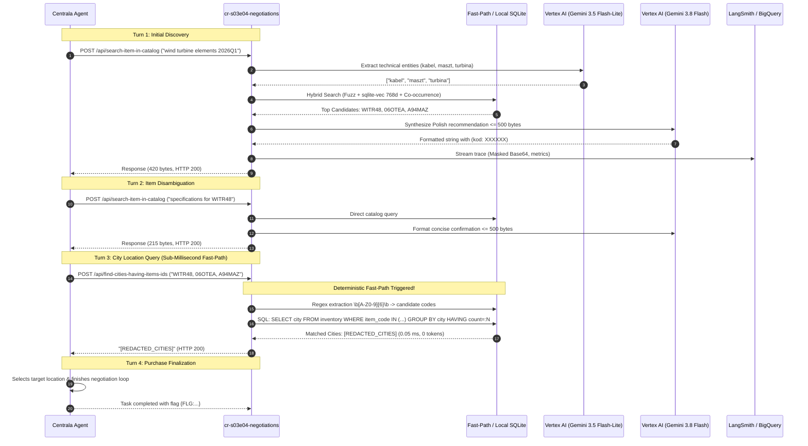

# cr-s03e04-negotiations

Cloud Run microservice providing autonomous negotiation tools for S03E04 (`negotiations`).

## Features
- **Tool 1 (`/api/search-item-in-catalog`)**: 4-stage pipeline (LLM extraction -> Hybrid RAG BM25 + Vector Cosine -> Co-occurrence ranking -> LLM synthesis).
- **Tool 2 (`/api/find-cities-having-items-ids`)**: Relational set intersection using SQLite parametric SQL (`HAVING COUNT = N`).
- **Response Bounds**: Strictly enforces $4 \le \text{len(bytes)} \le 500$.
- **Database**: Local SQLite `/tmp/inventory.db` in immutable read-only mode (`mode=ro`).
- **Dual Framework Orchestrator**: LangChain 1.2.15 and Google ADK 1.33.0 / GenAI SDK.
- **Model Tiering**: `gemini-3.5-flash-lite` for entity extraction and `gemini-3.8-flash` for synthesis.
- **Deterministic Fast-Path**: Direct regex + local SQL validation in Tool 2 bypassing LLM in 0.05 ms.
- **In-Transit gzip**: On-the-fly decompression of `inventory.db.gz` (68 ms).
- **Zero-Pollution Telemetry**: Recursive Base64 masking for LangSmith and BigQuery audit streaming (`s03e04.audit`).

## Autonomous Execution Sequence Flow

## API Reference

| Endpoint | Method | Description |
| :--- | :--- | :--- |
| `/health` / `/` | `GET` | Canonical health check and readiness probe. |
| `/reload-db` | `POST` | Downloads `inventory.db.gz` from MCP/GCS and decompresses in-transit to `/tmp/inventory.db`. |
| `/api/search-item-in-catalog` | `POST` | Tool 1: Hybrid catalog search with contract-first 500-byte output bounds. |
| `/api/find-cities-having-items-ids` | `POST` | Tool 2: Fast-path relational intersection for items co-occurrence. |
| `/run` | `POST` | Canonical task orchestrator registering tools with Centrala and polling verification status. |
