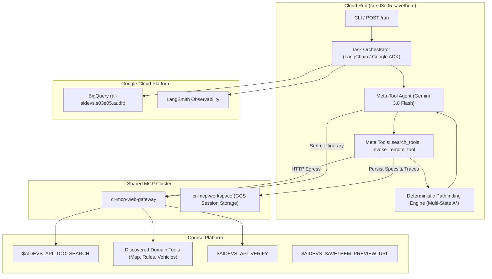
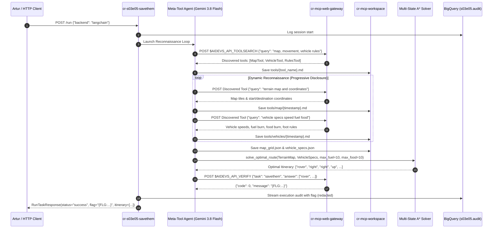

<!-- Source: https://www.industrialempathy.com/posts/design-docs-at-google/ -->
<!-- Based on: Google Design Docs structure by Malte Ubl -->
<!-- Adapted as a Technical PRD for AI-assisted implementation workflows -->

---
status: "approved"
date: 2026-09-17
author: Artur, Joi
reviewers: Artur
adr: [ADR.md](ADR.md)
---

# Technical Product Requirements Document (PRD): S03E05 Savethem Autonomous Routing (`cr-s03e05-savethem`)

## Context and Scope

In lesson S03E05 (`savethem`), radio communication with survivor outposts has been banned following the destruction of the first contact city. A human envoy must physically cross a 10x10 terrain grid to reach the survivor settlement of Skolwin and negotiate for critical wind turbine components.

The mission is governed by strict resource limitations: exactly **10 food rations** and **10 units of fuel**. The resistance base provides several candidate vehicles with distinct speeds and fuel/food consumption rates. In addition, the envoy can dismount at any point and proceed on foot (0 fuel, but higher food consumption due to slower pace).

Unlike previous tasks where operational tools were predefined, the agent is provided solely with an external discovery endpoint (`$AIDEVS_API_TOOLSEARCH`). All discovered tools communicate **strictly in English**, return only the **top 3** matching results per query, and accept identical input formats (`{"apikey": "...", "query": "..."}`).

To accomplish this mission autonomously and reliably:
1. Outbound network traffic is routed strictly through `cr-mcp-web-gateway` complying with the Zero Direct Egress security principle.
2. Discovered tool specifications, terrain maps, and raw query responses are persisted hierarchically in `cr-mcp-workspace`.
3. An autonomous meta-tool agent architecture provides progressive disclosure for discovering domain tools, maps, and vehicle physics.
4. Route planning is delegated to a deterministic Multi-State A* / Dijkstra graph search engine `(x, y, vehicle_mode, fuel, food)` to mathematically guarantee collision avoidance and resource compliance without coordinate hallucinations.
5. The solution is deployed as a production Cloud Run microservice `cr-s03e05-savethem` adhering 100% to the `GEMINI.md` baseline (dual framework LangChain 1.2.15 & Google ADK 1.33.0, Gemini 3.8 Flash, BigQuery audit streaming).

---

## Goals and Non-Goals

### Goals
* Implement an autonomous meta-agent capable of querying `$AIDEVS_API_TOOLSEARCH` and dynamically invoking discovered endpoints using progressive disclosure.
* Persist all reconnaissance data (tool specifications, terrain maps, vehicle physics, query traces) into `cr-mcp-workspace` under `sessions/{session_id}/`.
* Route all external HTTP interactions (`toolsearch`, discovered tools, verification) through `cr-mcp-web-gateway` (`MCP_WEB_GATEWAY_URL`).
* Extract and parse 10x10 terrain features (obstacles: rivers, rocks, trees, start base coordinates, destination Skolwin coordinates) into a typed `TerrainMap` model.
* Extract vehicle specifications (speed, fuel per move, food per move, foot mechanics) into typed `VehicleSpec` models.
* Implement a deterministic Multi-State A* / Dijkstra pathfinding algorithm modeling states as `(x, y, vehicle_mode, fuel, food)` with irreversible transition from vehicle to foot at any tile.
* Format the final route itinerary as `["vehicle_name", "direction_1", "direction_2", ...]` and submit to `$AIDEVS_API_VERIFY` to retrieve the course flag `{FLG:...}`.
* Support real-time route execution debugging via `$AIDEVS_SAVETHEM_PREVIEW_URL`.
* Dual framework parity on the task runner (`POST /run` and CLI `main.py --backend [langchain|adk]`):
  - LangChain strictly `1.2.15` using `create_agent` from `langchain.agents` and `ChatGoogleGenerativeAI`.
  - Google ADK strictly `1.33.0` using `google.adk.Agent` / Google GenAI SDK.
* Real-time telemetry streaming to BigQuery table `af-aidevs.s03e05.audit` and prompt sanitization via Model Armor.
* Complete Cloud Run microservice container scaffolding (`Dockerfile`, `.dockerignore`, `.gcloudignore`, `cloudbuild.yaml`) and Terraform variable registration in `terraform/variables.tf`.

### Non-Goals
* Allowing the LLM to generate the final 10x10 directional path directly via open-ended token generation (which causes coordinate drift and hallucinated moves).
* Performing direct outbound HTTP requests from Cloud Run bypassing `cr-mcp-web-gateway`.
* Persisting unredacted API keys or course flags in public logs or Git commits.

---

## The Design

### System Overview



### Execution Sequence



---

### API Design

#### 1. Canonical Service Endpoints
* `GET /health`: Service health and dependency check.
  - Response: `{"status": "healthy", "service": "cr-s03e05-savethem", "timestamp": "..."}`
* `GET /`: Root service information endpoint.
  - Response: `{"name": "S03E05 Savethem Autonomous Routing", "backend_default": "langchain"}`
* `POST /run`: Canonical execution endpoint.
  - Request: `RunTaskRequest(backend="langchain"|"adk", session_id=Optional[str], force_refresh=Optional[bool])`
  - Response: `RunTaskResponse(status="success"|"error", backend="...", flag="...", route=[...], steps_count=int, fuel_left=float, food_left=float)`

#### 2. Agent Meta-Tools (Contract-First Schemas)
* **`search_tools`**:
  - Purpose: Queries `$AIDEVS_API_TOOLSEARCH` for relevant domain tools.
  - Input Schema:
    ```python
    class SearchToolsInput(BaseModel):
        reasoning: str = Field(description="Explanation of why this search query is needed.")
        query: str = Field(description="Search terms in English (e.g. 'map terrain', 'vehicle specs').")
    ```
  - Output Schema:
    ```python
    class SearchToolsResponse(BaseModel):
        tools: list[DiscoveredTool] = Field(description="List of discovered tools with name, endpoint, and description.")
        hint: Optional[str] = Field(default="Inspect discovered tools using invoke_remote_tool.")
    ```

* **`invoke_remote_tool`**:
  - Purpose: Calls any discovered tool endpoint via `cr-mcp-web-gateway`, saving response markdown in `cr-mcp-workspace`.
  - Input Schema:
    ```python
    class InvokeRemoteToolInput(BaseModel):
        reasoning: str = Field(description="Why this specific tool and query are being called.")
        tool_name: str = Field(description="Name/slug of the tool being called.")
        endpoint_url: str = Field(description="Target endpoint URL returned by toolsearch.")
        query: str = Field(description="Targeted query string in English.")
    ```
  - Output Schema:
    ```python
    class RemoteToolResponse(BaseModel):
        tool_name: str
        records: list[dict[str, Any]] = Field(description="Top-3 results returned by the tool.")
        workspace_file: str = Field(description="Path in cr-mcp-workspace where full output is saved.")
        hint: Optional[str] = Field(default=None)
    ```

* **`plan_and_verify_route`**:
  - Purpose: Triggers deterministic A* graph search over parsed terrain and vehicles, submits the result to `$AIDEVS_API_VERIFY`, and retrieves the flag.
  - Input Schema:
    ```python
    class PlanRouteInput(BaseModel):
        reasoning: str = Field(description="Confirmation that map and vehicle parameters are fully resolved.")
        selected_vehicle: Optional[str] = Field(default=None, description="Optional vehicle preference; if None, solver picks best.")
    ```
  - Output Schema:
    ```python
    class PlanRouteResponse(BaseModel):
        vehicle: str
        itinerary: list[str]
        fuel_remaining: float
        food_remaining: float
        verification_status: str
        flag: Optional[str]
        hint: Optional[str] = Field(default=None)
    ```

---

### Data Model & Storage

#### 1. In-Memory Domain Models (`schemas.py`)
* `Coordinate`: `(x: int, y: int)` where $0 \le x, y < 10$.
* `TileType`: Enum or string: `plain`, `road`, `river`, `rock`, `tree`, `base`, `city`.
* `VehicleSpec`:
  - `name: str` (e.g. `car`, `rover`, `bike`)
  - `speed: float` (tiles per move / cost modifier)
  - `fuel_per_step: float` (units of fuel consumed per move)
  - `food_per_step: float` (units of food consumed per move)
  - `traversable_tiles: list[str]` (tiles allowed for this vehicle)
* `FootSpec`:
  - `fuel_per_step: 0.0`
  - `food_per_step: float` (higher food rate)
  - `traversable_tiles: list[str]` (e.g. can navigate tight paths where large vehicles cannot)
* `TerrainMap`:
  - `width: 10`, `height: 10`
  - `grid: list[list[str]]`
  - `start: Coordinate` (Base)
  - `destination: Coordinate` (Skolwin)
* `PathState`:
  - `x: int`, `y: int`
  - `mode: str` (`vehicle_name` or `foot`)
  - `fuel: float`
  - `food: float`
  - `history: list[str]` (directions taken)

#### 2. Workspace Storage Hierarchy (`cr-mcp-workspace`)
All artifacts are saved under `sessions/{session_id}/`:
* `notes.md`: High-level session progress, current strategy, and extracted entities.
* `tools/{tool_name}.md`: Discovered tool API specification, arguments, and sample responses.
* `tools/{tool_name}/{timestamp}_{query_slug}.md`: Timestamped raw HTTP responses.
* `map_grid.json`: Structured 10x10 matrix and coordinate anchors.
* `vehicle_specs.json`: Extracted vehicle consumption parameters.
* `final_route.json`: Chosen vehicle, step list, and verification response.

---

### Core Logic & Algorithms

#### Multi-State A* / Dijkstra Pathfinding Engine
The solver operates on a state space $(x, y, \text{mode}, \text{fuel}, \text{food})$:
1. **Initial States**:
   For each candidate vehicle $v \in V$:
   $$S_0(v) = (x_{\text{start}}, y_{\text{start}}, v, 10.0, 10.0)$$
   Plus foot travel:
   $$S_0(\text{foot}) = (x_{\text{start}}, y_{\text{start}}, \text{foot}, 10.0, 10.0)$$
2. **State Transitions**:
   From current state $(x, y, m, \text{fuel}, \text{food})$:
   - **Move Action**: For direction $d \in \{\text{up}, \text{down}, \text{left}, \text{right}\}$:
     - New tile $(x', y') = (x + dx, y + dy)$.
     - Validate bounds: $0 \le x', y' < 10$.
     - Validate tile traversability for mode $m$: tile must not be impassable (e.g. deep river, rock).
     - Calculate costs: $\text{fuel}' = \text{fuel} - \text{fuel\_rate}(m)$, $\text{food}' = \text{food} - \text{food\_rate}(m)$.
     - If $\text{fuel}' \ge 0$ and $\text{food}' \ge 0$, add $(x', y', m, \text{fuel}', \text{food}')$ to priority queue.
   - **Dismount Action (Vehicle $\to$ Foot)**:
     - If $m \neq \text{foot}$, transition to $(x, y, \text{foot}, \text{fuel}, \text{food})$.
     - Irreversible (cannot get back into vehicle once abandoned in the field).
3. **Priority Metric**:
   $$f(s) = g(s) + h(s)$$
   where $g(s)$ is the steps taken or resource consumed, and $h(s) = |x - x_{\text{dest}}| + |y - y_{\text{dest}}|$ is the Manhattan distance.
4. **Goal Condition**:
   State $(x_{\text{dest}}, y_{\text{dest}}, m, \text{fuel}, \text{food})$ with $\text{fuel} \ge 0$ and $\text{food} \ge 0$.
5. **Output**:
   The sequence of moves `[initial_vehicle, d_1, d_2, ...]` (or `["foot", d_1, ...]` if pure foot travel).

---

### Infrastructure & Deployment

* **Cloud Run Microservice**: `cr-s03e05-savethem` deployed in `europe-west6` (or project default).
* **Identity**: Service account `sa-cr-s03e05-savethem` granted `roles/aiplatform.user` and `roles/bigquery.dataEditor`.
* **Terraform Registration**:
  Add resource definitions in `terraform/variables.tf`:
  ```hcl
  "s03e05" = {
    dataset_id  = "s03e05"
    description = "Audit and telemetry dataset for S03E05 savethem"
    tables = {
      "audit" = {
        table_id    = "audit"
        description = "Streaming execution audit logs"
        time_partitioning = {
          type  = "DAY"
          field = "timestamp"
        }
      }
    }
  }
  ```
* **Container Scaffolding**:
  - `Dockerfile`: `python:3.13.5-slim`, `uv sync --frozen --no-cache`, entrypoint `uv run uvicorn main:app --host 0.0.0.0 --port ${PORT:-8080}`.
  - `.dockerignore` / `.gcloudignore`: strictly ignoring `.git`, `.venv`, `__pycache__`, `*.pyc`, `.env`.
  - `cloudbuild.yaml`: standard build manifest.

---

## Cross-Cutting Concerns

### Security
* **Zero Direct Egress**: All outgoing HTTP calls to course APIs flow through `cr-mcp-web-gateway`.
* **Secret Management**: `AIDEVS_API_KEY`, `LANGSMITH_API_KEY`, and `MODEL_ARMOR_URL` managed via Secret Manager and `.env` fallbacks.
* **Course Flag Sanitization**: Verification flags (`{FLG:...}`) are redacted in commit logs and BigQuery previews.

### Observability
* **BigQuery Streaming Audit**: Structured event logging (`timestamp`, `session_id`, `actor`, `event_type`, `content`, `metadata`) streamed to `af-aidevs.s03e05.audit`.
* **LangSmith Tracing**: Standard `@traceable` spans tracking prompt latency and token consumption under `LANGSMITH_PROJECT`.
* **Binary Masking**: Large payloads or raw response dumps are masked in log previews to prevent telemetry bloat.

### Error Handling & Resilience
* **Top-3 Truncation Mitigation**: Because discovered tools only return 3 items, the agent conducts systematic iterative queries with specific keywords (e.g. `"fast vehicle"`, `"heavy vehicle"`, `"fuel efficient vehicle"`).
* **Circuit Breaker on Toolsearch**: Max 10 tool invocations per session to avoid infinite reasoning loops.
* **Deterministic Fallback**: If the agent's natural language loop fails to resolve a valid route within 8 steps, the deterministic solver is executed directly using cached map and vehicle definitions.

---

## Implementation Spec

### File Structure

```text
lessons/s03e05-niedeterministyczna-natura-modeli-jako-przewaga/task/
├── BRD.md
├── ADR.md
├── PRD.md
└── cr-s03e05-savethem/
    ├── .dockerignore
    ├── .gcloudignore
    ├── .python-version
    ├── Dockerfile
    ├── cloudbuild.yaml
    ├── pyproject.toml
    ├── README.md
    ├── config.py
    ├── schemas.py
    ├── main.py
    ├── system_prompt.md
    ├── agents/
    │   ├── __init__.py
    │   ├── base.py
    │   ├── factory.py
    │   ├── langchain_agent.py
    │   └── adk_agent.py
    ├── services/
    │   ├── __init__.py
    │   ├── audit_service.py
    │   ├── mcp_service.py
    │   ├── tool_discovery_service.py
    │   ├── solver_service.py
    │   └── verification_service.py
    └── tests/
        ├── __init__.py
        ├── test_schemas.py
        ├── test_solver.py
        └── test_agent_integration.py
```

### Technology Stack & Exact Library Versions

In `pyproject.toml` (sorted alphabetically, `requires-python = "==3.13.5"`):

```toml
[project]
name = "cr-s03e05-savethem"
version = "0.1.0"
description = "S03E05 Savethem Autonomous Routing Microservice"
readme = "README.md"
requires-python = "==3.13.5"
dependencies = [
    "af-aidevs==0.2.2",
    "fastapi==0.115.11",
    "google-adk==1.33.0",
    "google-cloud-bigquery==3.31.0",
    "google-genai==1.5.0",
    "httpx==0.28.1",
    "langchain==1.2.15",
    "langchain-core==1.2.15",
    "langchain-google-genai==2.0.10",
    "langsmith==0.3.45",
    "pydantic==2.10.6",
    "pydantic-settings==2.8.1",
    "python-dotenv==1.0.1",
    "uvicorn==0.34.0",
]

[dependency-groups]
dev = [
    "pytest==8.3.5",
    "pytest-asyncio==0.25.3",
]
```

### Step-by-Step Implementation Order

1. **Scaffold Container & Environment**: Create directory tree, `.python-version`, `.dockerignore`, `.gcloudignore`, `Dockerfile`, `cloudbuild.yaml`, and `pyproject.toml`.
2. **Configuration & Schemas**: Implement `config.py` and contract-first Pydantic models in `schemas.py`.
3. **Core Services**:
   - `services/audit_service.py`: BigQuery telemetry streaming.
   - `services/mcp_service.py`: Wrapper for `cr-mcp-web-gateway` and `cr-mcp-workspace`.
   - `services/tool_discovery_service.py`: Meta-tool logic for `toolsearch` and dynamic tool calling.
   - `services/solver_service.py`: Multi-State A* / Dijkstra pathfinding algorithm.
   - `services/verification_service.py`: Route submission to `$AIDEVS_API_VERIFY`.
4. **Agent Implementations**:
   - `system_prompt.md`: Instructions for meta-tool reasoning and progressive disclosure.
   - `agents/langchain_agent.py`: LangChain 1.2.15 `create_agent` implementation.
   - `agents/adk_agent.py`: Google ADK 1.33.0 `Agent` + `Runner` implementation.
   - `agents/factory.py`: Unified backend selector.
5. **FastAPI Endpoints & CLI**:
   - `main.py`: Implement `@app.get("/health")`, `@app.post("/run")`, and CLI entrypoint.
6. **Testing & Verification**:
   - Unit tests for Multi-State A* solver across obstacle boundaries and fuel/food margins.
   - Integration tests with mocked MCP gateway.
7. **Terraform Registration**: Register dataset `s03e05` and Cloud Run service in `terraform/variables.tf`.

---

### Acceptance Criteria (Testable)

- [ ] `pyproject.toml` specifies `requires-python = "==3.13.5"` and exact pinned dependencies without `^` carets.
- [ ] Multi-State A* solver correctly solves navigation on a 10x10 grid without obstacle collisions and staying within 10 food and 10 fuel.
- [ ] Discovered tools and query responses are persisted as timestamped markdown files in `cr-mcp-workspace`.
- [ ] All external HTTP calls route through `cr-mcp-web-gateway`.
- [ ] Dual framework parity verified: both `--backend langchain` and `--backend adk` run successfully.
- [ ] Route is submitted to `$AIDEVS_API_VERIFY`, returns HTTP 200 with code 0, and captures the course flag `{FLG:...}`.
- [ ] Service endpoints `GET /health` and `POST /run` work as expected.
- [ ] BigQuery telemetry correctly streams session events to `af-aidevs.s03e05.audit`.
- [ ] Terraform definitions registered in `terraform/variables.tf`.

---

### Out-of-Scope for Agent (Human Required)

- Granting production GCP IAM roles (`roles/run.admin`) if not already present in the deployment environment.
- Manually viewing and verifying the route animation on `$AIDEVS_SAVETHEM_PREVIEW_URL`.
