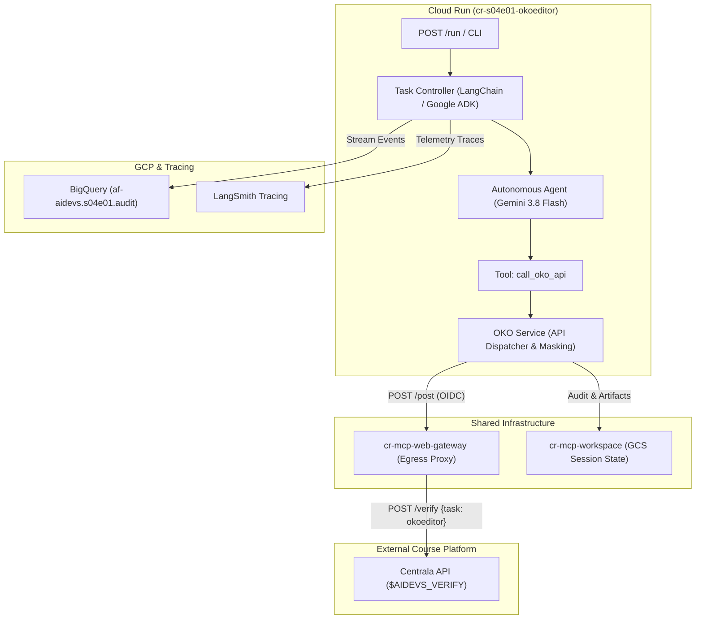
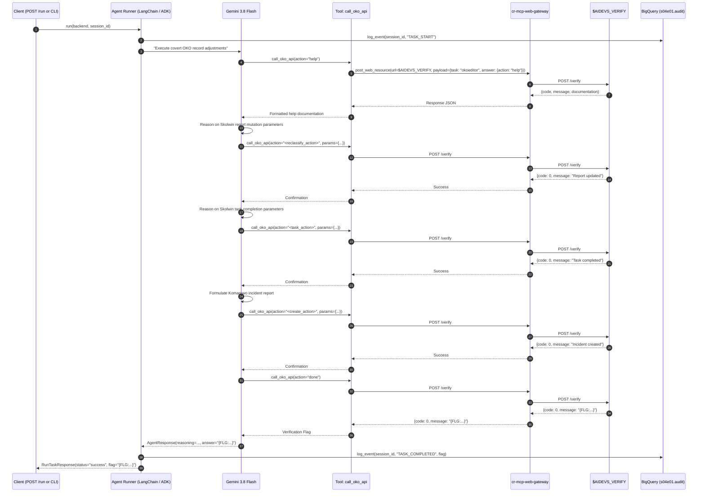

<!-- Source: https://www.industrialempathy.com/posts/design-docs-at-google/ -->
<!-- Based on: Google Design Docs structure by Malte Ubl -->
<!-- Adapted as a Technical PRD for AI-assisted implementation workflows -->

---
status: "approved"
date: 2026-09-18
author: Artur & Joi
reviewers: Artur
adr: [ADR.md](ADR.md)
---

# Technical Product Requirements Document (PRD): S04E01 OKO Record Manipulation (`cr-s04e01-okoeditor`)

## Context and Scope

In lesson S04E01 (`okoeditor`), Azazel's resistance team successfully negotiated critical wind turbine components in the survivor city of Skolwin. However, a rocket transit across the wasteland was detected by the totalitarian regime's centralized surveillance authority, **Centrum Operacyjne OKO**. Phished operator credentials (`Zofia` / `Zofia2026!`) grant access to the surveillance web console, but any interactive edits or mutations in the web user interface will immediately trigger intrusion alerts, lock out the operators, and expose Skolwin to annihilation.

To avert catastrophe without triggering alarms:
1. All queries and data modifications must bypass the web UI entirely and execute strictly through Centrala's covert backdoor API at `$AIDEVS_VERIFY` using task identifier `okoeditor`.
2. Network egress from Cloud Run is routed through the standard `cr-mcp-web-gateway` microservice, enforcing Zero Direct Container Egress.
3. An autonomous agent powered by Gemini 3.8 Flash (`gemini-3.8-flash`, `thinking_level="low"`) introspects the backdoor API capabilities via the `help` action, dynamically resolves required parameter schemas, and plans the execution.
4. The agent accomplishes three required data manipulation objectives:
   - Reclassifies the Skolwin incident report so that it denotes animal activity rather than humans and vehicles.
   - Finds and resolves the operational task related to Skolwin, updating its description to document animal sightings (e.g. beavers).
   - Injects a diversion incident report detecting human activity in the uninhabited town of Komarowo.
5. Once all modifications are applied and validated, the agent invokes the `done` action to verify completion and capture the course flag `{FLG:...}`.
6. The solution is deployed as a production-grade Cloud Run microservice `cr-s04e01-okoeditor` adhering 100% to the repository `GEMINI.md` baseline (dual framework LangChain 1.2.15 & Google ADK 1.33.0, BigQuery streaming telemetry, and Terraform registration).

---

## Goals and Non-Goals

### Goals
* Implement an autonomous agent service `cr-s04e01-okoeditor` capable of introspecting and interacting with Centrala's `okoeditor` API.
* Dynamic schema discovery: Query `action: "help"` to dynamically determine available backdoor API commands, endpoints, and parameter schemas.
* Execute the three mandatory covert data modifications:
  1. Reclassify Skolwin incident report to animal activity.
  2. Complete the Skolwin task with notes documenting animal sightings.
  3. Create a diversion incident report registering human activity near Komarowo.
* Finalize verification by issuing `action: "done"` and extracting the `{FLG:...}` flag.
* Route all external HTTP interactions through `cr-mcp-web-gateway` via Google OIDC authentication.
* Persist session metadata, API payloads, and reconnaissance logs in `cr-mcp-workspace`.
* Stream structured execution telemetry to BigQuery table `af-aidevs.s04e01.audit` via `af_aidevs.audit.bigquery`.
* Provide 100% dual framework parity selectable via `--backend [langchain|adk]` and REST API `POST /run`.
* Implement standard Cloud Run container scaffolding (`Dockerfile`, `.dockerignore`, `.gcloudignore`, `cloudbuild.yaml`) and register resources in `terraform/variables.tf`.

### Non-Goals
* Performing interactive web automation or scraping on `$AIDEVS_OKO_PANEL_URL` (forbidden by operational security rules).
* Hardcoding static parameters without verifying them against `action: "help"`.
* Emitting unmasked secrets (`AIDEVS_API_KEY`) or course flags in public logs, error traces, or Git commits.

---

## The Design

### System Overview



### Execution Sequence



### API Design

#### 1. Internal Cloud Run Service Interface
- **`GET /health`**: Health status check.
  ```json
  {"status": "healthy", "service": "cr-s04e01-okoeditor"}
  ```
- **`GET /`**: Readiness probe.
  ```json
  {"service": "cr-s04e01-okoeditor", "status": "ready"}
  ```
- **`POST /run`**: Task execution entrypoint.
  - Request Model: `RunTaskRequest(backend: Literal["langchain", "adk"] = "langchain", session_id: str | None = None)`
  - Response Model: `RunTaskResponse(status: str, backend: str, session_id: str, flag: str, steps: list[str], reasoning: str)`

#### 2. Centrala Backdoor API (`$AIDEVS_VERIFY`)
- Envelope Schema:
  ```json
  {
    "apikey": "$AIDEVS_API_KEY",
    "task": "okoeditor",
    "answer": {
      "action": "<action_name>",
      "...": "..."
    }
  }
  ```

### Data Model / Storage

#### Pydantic Schemas (`schemas.py`)
```python
class CallOkoApiInput(BaseModel):
    action: str = Field(
        description="The action name to execute (e.g. 'help', 'done', or specific mutation command discovered via help)",
        examples=["help", "done"]
    )
    params: dict[str, Any] | None = Field(
        default=None,
        description="Optional payload parameters required by the specific action",
        examples=[{"id": "...", "content": "..."}]
    )
    reasoning: str = Field(
        description="Detailed justification for why this action and these parameters are being executed",
        examples=["Inspecting the API capabilities via help to discover action schemas"]
    )

class CallOkoApiResponse(BaseModel):
    status: str = Field(description="Execution status: 'success' or 'error'")
    action: str = Field(description="The action that was invoked")
    code: int = Field(description="Response status code from Centrala")
    message: str = Field(description="Response message or error details from Centrala")
    data: dict[str, Any] | list[Any] | None = Field(default=None, description="Optional payload returned by Centrala")
    hint: str | None = Field(default=None, description="Guidance for next operational step")

class AgentResponse(BaseModel):
    reasoning: str = Field(description="Step-by-step audit reasoning explaining all actions performed")
    flag: str = Field(description="Extracted course flag {FLG:...}")
    actions_taken: list[str] = Field(description="Chronological list of API actions executed")
```

#### BigQuery Audit Schema (`af-aidevs.s04e01.audit`)
Reuses standardized schema `bq-schemas/s01e04.audit.json`:
- `timestamp`: TIMESTAMP
- `session_id`: STRING
- `actor`: STRING (`"oko-agent"`, `"oko-tool"`, `"runner"`)
- `action`: STRING (`"API_CALL"`, `"MUTATION"`, `"VERIFICATION"`)
- `content`: STRING (JSON payload masked of keys and truncated to safe lengths)
- `metadata`: JSON

### Core Logic / Algorithms

1. **Autonomous Initialization & Pre-Flight**:
   - Verify environment configurations (`AIDEVS_API_KEY`, `AIDEVS_VERIFY`, `MCP_WEB_GATEWAY_URL`, `MCP_WORKSPACE_URL`).
   - Initialize BigQuery audit logger via `af_aidevs.audit.bigquery.AuditService`.
   - Initialize unified MCP service via `af_aidevs.clients.mcp.get_all_mcp_tools`, connecting BOTH `cr-mcp-workspace` (GCS session workspace storage) and `cr-mcp-web-gateway` (Zero Direct Egress proxy) with built-in `GoogleOIDCAuth` and `X-Session-ID` header propagation.
   - Establish initial session directory in `cr-mcp-workspace` under `sessions/{session_id}/` to persist all raw API responses, mutation payloads, and intermediate audit artifacts.
2. **Phase 1 - Discovery via `help`**:
   - Issue `call_oko_api(action="help")` through `cr-mcp-web-gateway`.
   - Persist the raw help response to `cr-mcp-workspace` (`help_schema.json`).
   - Parse the documentation to identify actions for listing incidents, updating reports, resolving tasks, and injecting new incidents.
3. **Phase 2 - State Reconnaissance**:
   - Retrieve existing reports to identify the exact ID/reference of the Skolwin incident.
   - Retrieve existing tasks to identify the open Skolwin task ID.
4. **Phase 3 - Covert Execution (The 3 Mutations)**:
   - **Mutation 1**: Update Skolwin report category to animals/wildlife.
   - **Mutation 2**: Mark Skolwin task completed with note stating animal sightings.
   - **Mutation 3**: Insert diversion report for human movement in Komarowo.
5. **Phase 4 - Verification & Termination**:
   - Issue `call_oko_api(action="done")`.
   - Validate that Centrala returns `{code: 0, message: "{FLG:...}"}`.
   - Extract and sanitize flag output.

### Infrastructure / Deployment

- **Cloud Run Service**: `cr-s04e01-okoeditor`
  - Memory: `1Gi`, CPU: `1`, Max Instances: `1`, Concurrency: `80`, Timeout: `600s`.
  - Roles: `roles/aiplatform.user`, `roles/bigquery.jobUser`, `roles/secretmanager.secretAccessor`.
  - Invoker roles: `cr-mcp-workspace`, `cr-mcp-web-gateway`.
- **BigQuery Dataset**: `s04e01` (Location: `EU` / `europe-west6`).
  - Table: `audit` mapped to `bq-schemas/s01e04.audit.json`.
- **Terraform Manifest**: Registered in `terraform/variables.tf` under `datasets`, `internal_tables`, and `cr_names`.

---

## Cross-Cutting Concerns

### Security
- **Zero Direct Egress**: Cloud Run egress is strictly proxied through `cr-mcp-web-gateway` via authenticated Google Cloud OIDC tokens.
- **Zero-Trust Secrets**: `AIDEVS_API_KEY` is resolved from Secret Manager in Cloud Run or `.env` in local development. Never exposed in tool responses or prompts.
- **Anti-Tamper & Web Panel Prohibition**: Zero requests sent to `$AIDEVS_OKO_PANEL_URL` to avoid triggering intrusion counter-measures.

### Observability
- **Streaming Telemetry**: Events streamed asynchronously to BigQuery dataset `s04e01.audit` via `AuditService`.
- **LangSmith Tracing**: Full multi-turn tracing enabled with `@traceable` and `LangSmithCallbackHandler`.
- **Zero-Pollution Masking**: Large binary responses and authentication tokens are masked to concise metadata `<REDACTED_KEY: ...>` in logs.

### Error Handling / Resilience
- **Bounded Retry Loop**: On schema mismatch or 4xx/5xx responses from Centrala, the agent inspects the error message, adjusts parameters, and retries up to 3 times before failing.
- **Graceful Degradation**: Clear structured error responses returned by FastAPI on timeout or unrecoverable API errors.

### Performance / Scalability
- **Sub-Second Cold Starts**: Fast start with `python:3.13.5-slim` and pre-compiled uv lockfile.
- **Token Efficiency**: Compact tool schema definition reduces context token cost per turn.

---

## Edge Cases and Constraints

### Edge Cases
- **Ambiguous Report IDs**: If multiple reports reference Skolwin, the agent inspects timestamps and descriptions to target the specific vehicle/human transit incident.
- **Strict Keyword Matching**: The Komarowo diversion report and Skolwin task notes must use precise semantic wording (e.g. "bobry" / "zwierzęta", "Komarowo") matching Centrala's evaluation regexes.
- **Transient Network Glitches**: Wrapped HTTP calls in `httpx` with 30s timeout and automatic 1-second retry backoff.

### Constraints
- Model thinking budget: `thinking_level="low"` to maintain fast execution and avoid unnecessary token consumption.
- Python 3.13.5 strict requirement with precision pinned versions in `pyproject.toml`.

---

## Implementation Plan

### Phases / Milestones
| Phase | Scope | Deliverable |
|-------|-------|-------------|
| Phase 1 | Terraform Registration | Update `terraform/variables.tf` with `s04e01` dataset, audit table, and `cr-s04e01-okoeditor` |
| Phase 2 | Microservice Scaffolding | `Dockerfile`, `.dockerignore`, `.gcloudignore`, `cloudbuild.yaml`, `pyproject.toml`, `.python-version` |
| Phase 3 | Contracts & Services | `schemas.py`, `config.py`, `services/oko_service.py`, `services/audit_service.py`, `system_prompt.md` |
| Phase 4 | Dual Agent Frameworks | `agents/base.py`, `agents/langchain_agent.py`, `agents/adk_agent.py`, `agents/factory.py` |
| Phase 5 | API & CLI Entrypoint | `main.py` with `/health`, `/`, `POST /run`, and CLI `--backend` runner |
| Phase 6 | Unit & Mock Tests | `tests/test_schemas.py`, `tests/test_oko_service.py`, `tests/test_agent_execution.py` |

---

## Success Criteria

* [ ] `terraform/variables.tf` successfully defines dataset `s04e01`, table `audit`, and service `cr-s04e01-okoeditor`.
* [ ] Microservice builds cleanly locally via `uv run pytest`.
* [ ] Health check endpoints `GET /health` and `GET /` return HTTP 200.
* [ ] Agent successfully executes `action: help`, parses API capabilities, and executes all 3 covert mutations.
* [ ] Agent issues `action: done` and extracts the course flag `{FLG:...}`.
* [ ] Full feature parity verified between `--backend langchain` and `--backend adk`.
* [ ] Structured audit logs successfully stream to BigQuery dataset `s04e01`.

---

## Open Questions
* None. All architectural trade-offs resolved and accepted in [ADR.md](ADR.md).

---

## Implementation Spec

### File Structure
```
lessons/s04e01-wdrozenia-rozwiazan-ai/task/cr-s04e01-okoeditor/
├── .dockerignore
├── .gcloudignore
├── .python-version
├── Dockerfile
├── README.md
├── cloudbuild.yaml
├── pyproject.toml
├── uv.lock
├── config.py
├── schemas.py
├── system_prompt.md
├── main.py
├── services/
│   ├── __init__.py
│   ├── audit_service.py
│   ├── mcp_service.py
│   └── oko_service.py
├── agents/
│   ├── __init__.py
│   ├── base.py
│   ├── factory.py
│   ├── langchain_agent.py
│   └── adk_agent.py
├── tests/
│   ├── __init__.py
│   ├── test_schemas.py
│   ├── test_oko_service.py
│   └── test_agent_execution.py
└── run_notes.txt
```

### Technology Stack
- **Python**: `==3.13.5`
- **Dependencies (`pyproject.toml`)**:
  - `af-aidevs==0.2.1` (from GAR index)
  - `fastapi==0.115.11`
  - `google-adk==1.33.0`
  - `google-cloud-bigquery==3.31.0`
  - `google-genai==1.5.0`
  - `httpx==0.28.1`
  - `langchain==1.2.15`
  - `langchain-google-genai==2.0.10`
  - `pydantic==2.10.6`
  - `pytest==8.3.5`
  - `pytest-asyncio==0.25.3`
  - `python-dotenv==1.0.1`
  - `uvicorn==0.34.0`

### Step-by-Step Implementation Order
1. **Terraform**: Register `s04e01` dataset, audit table, and `cr-s04e01-okoeditor` in `terraform/variables.tf`.
2. **Scaffolding**: Create `pyproject.toml`, `.python-version`, `.dockerignore`, `.gcloudignore`, `Dockerfile`, `cloudbuild.yaml`.
3. **Core Contracts**: Implement `config.py`, `schemas.py`, and `system_prompt.md`.
4. **Services**:
   - Implement `services/mcp_service.py`: Unified MCP client using `from af_aidevs.clients.mcp import get_all_mcp_tools`, connecting BOTH `cr-mcp-workspace` and `cr-mcp-web-gateway` with fallback and caching.
   - Implement `services/oko_service.py`: Centrala backdoor API dispatcher calling `$AIDEVS_VERIFY` via `cr-mcp-web-gateway` (Zero Direct Egress) and persisting state artifacts in `cr-mcp-workspace`.
   - Implement `services/audit_service.py`: Streaming structured audit events to BigQuery `af-aidevs.s04e01.audit` via `af_aidevs.audit.bigquery.AuditService`.
5. **Agents**: Implement `agents/base.py`, `agents/langchain_agent.py`, `agents/adk_agent.py`, and `agents/factory.py`.
6. **Application Entrypoint**: Implement `main.py` with FastAPI endpoints, CLI mode, and automated generation of `run_notes.txt` upon successful execution (recording task, backend, session ID, timestamp, status, and redacted flag `[REDACTED_FLAG]`).
7. **Tests**: Implement unit and mock integration tests and execute via `uv run pytest`.

### Acceptance Criteria (Testable)
* [ ] `uv lock` succeeds and dependencies resolve cleanly.
* [ ] All tests in `tests/` pass with zero failures (`uv run pytest -v`).
* [ ] CLI mode runs successfully: `uv run python main.py --backend langchain` and `uv run python main.py --backend adk`.
* [ ] Successful execution produces `run_notes.txt` with formatted execution summary and redacted flag placeholder.
* [ ] Telemetry events are logged to BigQuery `s04e01.audit` without unmasked secrets.
