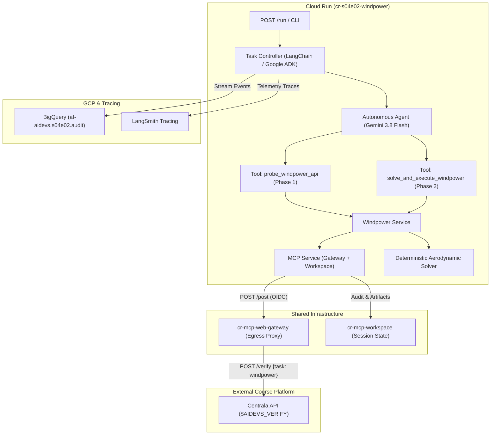
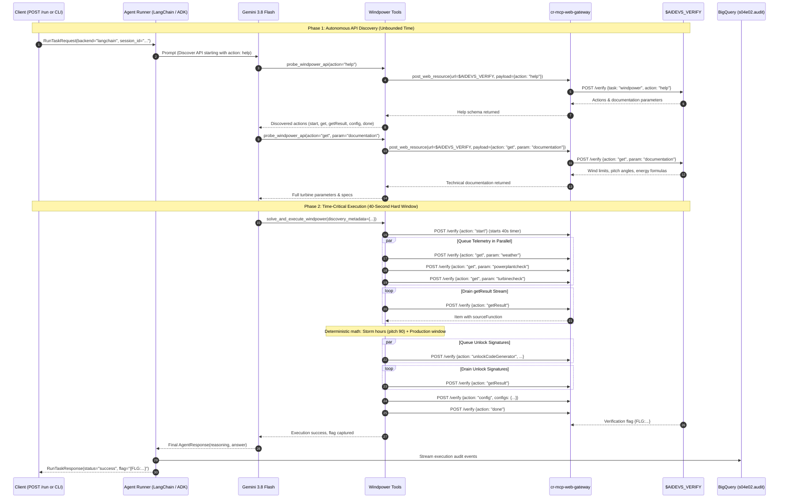

<!-- Source: https://www.industrialempathy.com/posts/design-docs-at-google/ -->
<!-- Based on: Google Design Docs structure by Malte Ubl -->
<!-- Adapted as a Technical PRD for AI-assisted implementation workflows -->

---
status: "approved"
date: 2026-09-20
author: Artur & Joi
reviewers: Artur
adr: [ADR.md](ADR.md)
---

# Technical Product Requirements Document (PRD): S04E02 Wind Turbine Scheduling & Active Collaboration (`cr-s04e02-windpower`)

## Context and Scope

In lesson S04E02 (`windpower`), Azazel's resistance team secured a newly acquired wind turbine to generate the electricity required to start the control computers of a regional power plant. However, the turbine's backup battery is running on critical reserves with no compatible charger available. Consequently, the hardware control system can only remain in an active service/configuration window for at most **40 seconds** before the battery dies.

To program the turbine safely within this hard physical deadline:
1. **Two-Phase Operational Lifecycle**:
   - **Phase 1: Autonomous Discovery (Unbounded Time)**: The agent begins knowing exclusively `action: "help"`. Using the introspective tool `probe_windpower_api`, the agent interacts with Centrala's API (`$AIDEVS_VERIFY`) via `cr-mcp-web-gateway`, discovers available commands (such as `get: documentation`), retrieves aerodynamic formulas, storm wind thresholds, feathering pitch angles, and records this structured knowledge in `cr-mcp-workspace`.
   - **Phase 2: Time-Critical Execution (40-Second Hard Deadline)**: Armed with the discovered rules and technical specifications, the agent invokes the dedicated deterministic solver and execution tool (`solve_and_execute_windpower`). The tool initializes the service window (`start`), concurrently queues asynchronous diagnostic tasks (`weather`, `powerplantcheck`, `turbinecheck`), continuously drains completed reports via an async demultiplexer, calculates storm protection angles and the earliest production window, retrieves batch cryptographic unlock signatures (`unlockCodeGenerator`), verifies the turbine self-test, transmits bulk configurations, and finalizes with `done` to retrieve the course flag `{FLG:...}`.
2. **Zero Direct Container Egress**: All external HTTP calls are routed through `cr-mcp-web-gateway` via Google Cloud IAM / OIDC, with resilient local fallback to direct `httpx.AsyncClient` during local development.
3. **Persistent Session State**: Discovered API schemas, documentation, and schedule artifacts are recorded in `cr-mcp-workspace` (backed by GCS in Cloud Run or local `/tmp/af_aidevs_workspace`).
4. **Production Google Cloud Architecture**: The solution is containerized as Cloud Run microservice `cr-s04e02-windpower`, managed via Terraform in `terraform/variables.tf`, streaming structured JSON audit events to BigQuery dataset `s04e02` with dual framework parity (**LangChain 1.2.15** and **Google ADK 1.33.0**).

---

## Goals and Non-Goals

### Goals
* Implement an autonomous agent microservice `cr-s04e02-windpower` capable of introspecting and scheduling Centrala's wind turbine system.
* **Autonomous Discovery (Phase 1)**: Let the agent discover all API capabilities, endpoints, and documentation starting strictly with `action: "help"`.
* **Zero Direct Egress**: Route all external HTTP interactions through `cr-mcp-web-gateway` with rate limit backoff (handling code `-9999` and HTTP 429).
* **Workspace Persistence**: Persist discovered documentation and configuration audit logs in `cr-mcp-workspace`.
* **Deterministic Execution (Phase 2)**: Implement `solve_and_execute_windpower` tool executing within the 40-second battery ceiling:
  1. Trigger service window (`action: "start"`).
  2. Concurrently queue `weather`, `powerplantcheck`, `turbinecheck`.
  3. Drain asynchronous single-read responses via `getResult` demultiplexer by `sourceFunction`.
  4. Detect every hour where predicted wind speed exceeds the turbine durability threshold; configure safe feathering (`pitchAngle: 90`, `turbineMode: idle`) for every affected hour (accounting for the 1-hour auto-reset guardrail).
  5. Calculate the earliest viable hour satisfying the power plant's real-time energy deficit (`pitchAngle: production`, `turbineMode: production`).
  6. Concurrently queue `unlockCodeGenerator` for all timestamps, drain signatures, and verify `turbinecheck`.
  7. Submit bulk configuration (`action: "config", configs: {...}`).
  8. Submit completion signal (`action: "done"`) and capture the course flag `{FLG:...}`.
* **Dual Framework Standard**: 100% parity between **LangChain** (`1.2.15` via `create_agent`) and **Google ADK** (`1.33.0` via `Agent`/`Runner`), selectable via `--backend [langchain|adk]` and REST API `POST /run`.
* **Observability**: Stream structured telemetry events to BigQuery table `af-aidevs.s04e02.audit` via `af_aidevs.audit.bigquery` and LangSmith tracing.
* **Container Scaffolding & IaC**: Provide `Dockerfile`, `.dockerignore`, `.gcloudignore`, `cloudbuild.yaml`, and register resources in `terraform/variables.tf`.

### Non-Goals
* Attempting linear turn-by-turn LLM reasoning during the 40-second service window (guaranteed timeout failure).
* Relying on LLM arithmetic for complex tabular numerical comparisons or MD5 signature polling.
* Emitting unmasked API keys (`AIDEVS_API_KEY`) or course flags in public logs or Git history.

---

## The Design

### System Overview



### Execution Sequence (Two-Phase Lifecycle)



---

## API Design

### Microservice API Endpoints (`cr-s04e02-windpower`)

1. `GET /health` & `GET /`: Health check and service readiness endpoints.
2. `POST /run`: Canonical execution endpoint.
   - **Request Payload**:
     ```json
     {
       "backend": "langchain",
       "session_id": "test-session-001"
     }
     ```
   - **Response Payload**:
     ```json
     {
       "status": "success",
       "backend": "langchain",
       "session_id": "test-session-001",
       "flag": "{FLG:...}",
       "execution_time_seconds": 8.42,
       "discovered_specs": {
         "max_safe_wind_speed": 15.0,
         "feathering_pitch_angle": 90,
         "production_pitch_angle": 45
       },
       "scheduled_points_count": 5
     }
     ```

### Centrala Windpower API Schema (`$AIDEVS_VERIFY`)

All requests sent to `$AIDEVS_VERIFY` conform to the canonical Centrala envelope:
```json
{
  "apikey": "$AIDEVS_API_KEY",
  "task": "windpower",
  "answer": {
    "action": "<action_name>",
    "...": "..."
  }
}
```

* **`help`**: Introspection returning available actions and parameters.
* **`get`**: Retrieves task data:
  - `param: "documentation"`: Synchronously returns markdown/text documentation.
  - `param: "weather" | "powerplantcheck" | "turbinecheck"`: Queued asynchronously.
* **`start`**: Initializes service window; triggers the 40-second hardware countdown.
* **`getResult`**: Pops one completed async item containing `sourceFunction`.
* **`unlockCodeGenerator`**: Generates cryptographic unlockCode for `(startDate, startHour, windMs, pitchAngle)`.
* **`config`**: Bulk submission with dictionary `configs: {"YYYY-MM-DD HH:00:00": {pitchAngle, turbineMode, unlockCode}}`.
* **`done`**: Validates turbine status and schedule, returning `{FLG:...}`.

---

## Core Logic / Algorithms

### 1. Centralized Asynchronous Stream Demultiplexer
```python
async def drain_queued_results(
    mcp_service: MCPService,
    session_id: str,
    expected_sources: set[str],
    timeout_seconds: float = 15.0,
) -> dict[str, Any]:
    collected: dict[str, Any] = {}
    start_time = asyncio.get_running_loop().time()

    while expected_sources - collected.keys():
        if (asyncio.get_running_loop().time() - start_time) > timeout_seconds:
            raise TimeoutError(f"Timed out waiting for {expected_sources - collected.keys()}")
        
        resp = await mcp_service.post_web_resource(
            session_id=session_id,
            url=config.AIDEVS_VERIFY_URL,
            payload={"apikey": config.AIDEVS_API_KEY, "task": "windpower", "answer": {"action": "getResult"}},
        )
        if resp and "sourceFunction" in resp:
            src = resp["sourceFunction"]
            collected[src] = resp.get("data") or resp
        else:
            await asyncio.sleep(0.15)
    return collected
```

### 2. Storm Feathering & Power Production Mathematical Solver
1. **Storm Feathering Window Detection**:
   - Inspect weather forecast entries `[(date, hour, wind_ms), ...]`.
   - Identify every hour where `wind_ms > max_safe_wind_speed` (e.g. 15.0 m/s).
   - Because the turbine rotor auto-resets to standard pitch after approximately one hour, configure **each consecutive storm hour** with:
     `pitchAngle = feathering_pitch_angle` (e.g. 90) and `turbineMode = "idle"`.
2. **Power Generation Window Identification**:
   - Compare power plant requirements (energy deficit $D$) with power generation formula $P = f(\text{wind\_ms}, \text{pitch\_angle})$.
   - Find the **first chronological hour** outside dangerous storm periods where generated power satisfies or exceeds the deficit without exceeding structural stress.
   - Configure this optimal hour with:
     `pitchAngle = production_pitch_angle` and `turbineMode = "production"`.
3. **Batch Cryptographic Unlock Signing**:
   - Concurrently queue `unlockCodeGenerator` for each configuration timestamp.
   - Drain signatures via `getResult` matching by timestamp.
   - Assemble final bulk `configs` map.

---

## Cross-Cutting Concerns

### Security
* **Zero Direct Container Egress**: External traffic routes strictly through `cr-mcp-web-gateway` with fallback to direct `httpx` for local testing.
* **Secret Management**: `AIDEVS_API_KEY` is loaded from GCP Secret Manager in Cloud Run or `.env` in local development.
* **Zero Secret & Flag Leakage**: Traces and BigQuery audit tables mask credentials and course flags `{FLG:...}`.

### Observability & Telemetry
* **BigQuery Streaming**: Every agent turn, tool call, and lifecycle event streams to BigQuery table `af-aidevs.s04e02.audit`.
* **LangSmith Tracing**: Tracing enabled across both LangChain and Google ADK.
* **Zero-Pollution Logs**: Structured logging truncates raw payloads to prevent large Base64/JSON dumps.

### Error Handling & Resilience
* **Centrala Rate Limiting**: Exponential backoff via `tenacity` on rate limit code `-9999` or HTTP 429.
* **Resilient Local Fallback**: Seamless fallback to local disk and direct `httpx` when MCP microservices are not running locally.

---

## Implementation Spec

### File Structure
```
lessons/s04e02-aktywna-wspolpraca-z-ai/task/cr-s04e02-windpower/
├── .dockerignore
├── .gcloudignore
├── .python-version
├── cloudbuild.yaml
├── Dockerfile
├── pyproject.toml
├── README.md
├── run_notes.txt
├── config.py
├── schemas.py
├── main.py
├── system_prompt.md
├── services/
│   ├── __init__.py
│   ├── audit_service.py
│   ├── mcp_service.py
│   └── windpower_service.py
├── agents/
│   ├── __init__.py
│   ├── base.py
│   ├── factory.py
│   ├── langchain_agent.py
│   └── adk_agent.py
└── tests/
    ├── __init__.py
    ├── test_schemas.py
    ├── test_windpower_service.py
    └── test_agent_execution.py
```

### Technology Stack
* Python: `==3.13.5`
* Frameworks:
  - `langchain==1.2.15`
  - `google-adk==1.33.0`
  - `langchain-google-genai==2.0.10`
  - `google-genai==1.3.0`
* Web & Networking:
  - `fastapi==0.115.8`
  - `uvicorn==0.34.0`
  - `httpx==0.28.1`
  - `pydantic==2.10.6`
  - `tenacity==9.0.0`
* Google Cloud:
  - `google-cloud-bigquery==3.29.0`
  - `google-cloud-secret-manager==2.22.0`

### Step-by-Step Implementation Order
1. **Scaffolding & Config**: Create container manifests (`Dockerfile`, `cloudbuild.yaml`, `.dockerignore`, `.gcloudignore`), `pyproject.toml`, `.python-version`, and `config.py`.
2. **Schemas & Contracts**: Define Pydantic models in `schemas.py` with explicit `description`, `examples`, and `reasoning`/`hint` fields.
3. **Services Layer**:
   - `services/audit_service.py`: BigQuery telemetry streaming.
   - `services/mcp_service.py`: `cr-mcp-web-gateway` and `cr-mcp-workspace` proxy with resilient local fallbacks.
   - `services/windpower_service.py`: API introspection, async stream demultiplexer, aerodynamic solver, and bulk submission.
4. **Agent Implementations**:
   - `system_prompt.md`: System prompt with YAML frontmatter instructing Phase 1 discovery followed by Phase 2 solver execution.
   - `agents/langchain_agent.py`: LangChain 1.2.15 using `create_agent`.
   - `agents/adk_agent.py`: Google ADK 1.33.0 using `Agent` and `Runner`.
   - `agents/factory.py`: Unified backend selector.
5. **FastAPI & CLI**: Implement `main.py` with `@app.get("/health")`, `@app.post("/run")`, and `run_cli()`.
6. **Tests**: Pytest unit tests for schemas, mathematical solver, stream demultiplexer, and agent execution.
7. **Terraform Registration**: Add `cr-s04e02-windpower` and BigQuery dataset `s04e02` in `terraform/variables.tf`.

---

## Acceptance Criteria (Testable)
* [ ] Codebase passes `uvx ruff check . --exclude .venv --fix`.
* [ ] Codebase passes `uvx ruff format . --exclude .venv`.
* [ ] Codebase passes `uvx mypy . --ignore-missing-imports --exclude .venv`.
* [ ] Pytest suite (`uv run pytest -v`) passes with 100% green tests.
* [ ] Phase 1 discovery successfully queries `help` and `documentation` via `cr-mcp-web-gateway`.
* [ ] Phase 2 solver completes within the 40-second battery window ($<15$s elapsed).
* [ ] All consecutive storm hours (> threshold) are feathered (`pitchAngle: 90`, `idle`).
* [ ] Earliest power production window is correctly calculated and scheduled (`pitchAngle: production`, `production`).
* [ ] Cryptographic unlock codes are retrieved and attached to every configuration point.
* [ ] Hardware self-test `turbinecheck` is executed prior to `done`.
* [ ] Final action `done` returns the course flag `{FLG:...}`.
* [ ] Both `--backend langchain` and `--backend adk` achieve 100% functional parity.
* [ ] Terraform variables in `terraform/variables.tf` are registered for Cloud Run and BigQuery dataset.
