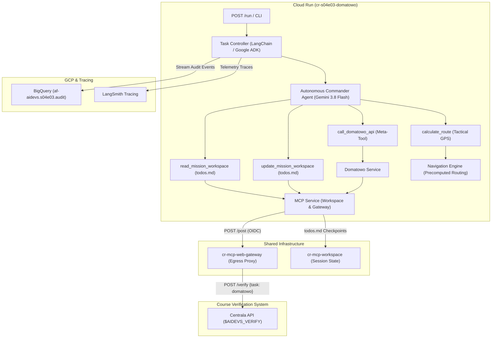
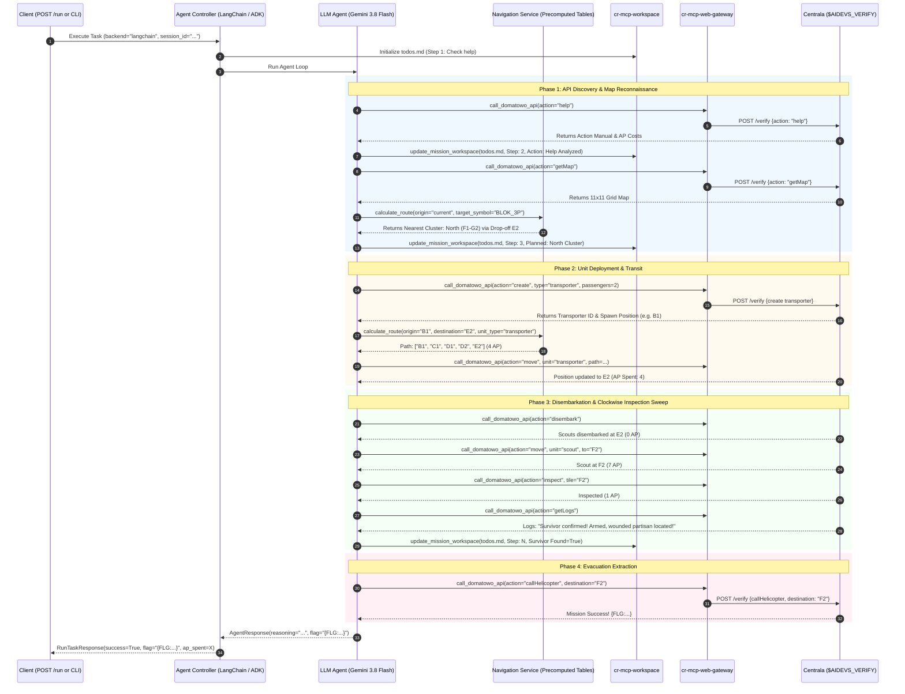

<!-- Source: https://www.industrialempathy.com/posts/design-docs-at-google/ -->
<!-- Based on: Google Design Docs structure by Malte Ubl -->
<!-- Adapted as a Technical PRD for AI-assisted implementation workflows -->

---
status: "approved"
date: 2026-09-21
author: Artur & Joi
reviewers: Artur
adr: [ADR.md](ADR.md)
---

# Technical Product Requirements Document (PRD): S04E03 Tactical Search & Rescue Operation in Domatowo (`cr-s04e03-domatowo`)

## Context and Scope

In lesson S04E03 (`domatowo`), Azazel's resistance intelligence intercepted an unencrypted radio distress signal broadcast from the ruins of Domatowo:
> *"Przeżyłem. Bomby zniszczyły miasto. Żołnierze tu byli, szukali surowców, zabrali ropę. Teraz jest pusto. Mam broń, jestem ranny. Ukryłem się w jednym z najwyższych bloków. Nie mam jedzenia. Pomocy."*

The survivor is confirmed wounded, armed, starving, and sheltering in one of the city's highest residential buildings. Cartographic intelligence reveals an 11x11 grid (121 tiles) where the highest buildings are 3-story residential blocks designated **`BLOK_3P`** (`B3`). Exactly **14 tiles** across **3 distinct clusters** contain `BLOK_3P` structures:
- **Cluster North (F1–G2):** 4 tiles (`F1, G1, F2, G2`), directly adjacent to street tile **`E2`**.
- **Cluster South-West (A10–C11):** 6 tiles (`A10, B10, C10, A11, B11, C11`), directly adjacent to street tiles **`B9, C9`**.
- **Cluster South-East (H10–I11):** 4 tiles (`H10, I10, H11, I11`), directly adjacent to street tiles **`H9, I9`**.

The mission is governed by strict operational rules:
1. **Budget Hard Limit:** Exactly **300 Action Points (AP)** for the entire operation.
2. **Terrain & Movement Constraints:**
   - Transporters cost 1 AP/tile and can **only** drive on streets (`ULICA` / `UL`).
   - Scouts cost 7 AP/tile on foot and can traverse rough terrain and enter buildings.
   - Creating units costs 5 AP (scout) or 5 AP + 5 AP/passenger (transporter).
   - Disembarking scouts costs 0 AP.
   - Inspecting a tile costs 1 AP.
3. **Zero Prior Knowledge Bootstrap:** The agent begins execution knowing exclusively `action: "help"`. It autonomously discovers the Centrala API surface, extracts command schemas, and documents operational parameters in its workspace.
4. **Stateful Planning & Monotonic Checkpointing:** The agent maintains a persistent checklist in `todos.md` via `cr-mcp-workspace`, logging monotonic step counters (`Step: N`), checkpoint slugs (`Checkpoint ID`), timestamps, inspected coordinates, and estimated AP remaining.
5. **Deterministic Navigation & Dual Routing Precalculation:** To eliminate dangerous LLM arithmetic hallucinations and avoid high-risk Python code execution (RCE), the system provides an on-demand GPS calculator tool (`calculate_route`) backed by an in-memory **Precomputed Tactical Routing Table** (precalculating all paths from all 121 tiles to each of the 14 `BLOK_3P` tiles in <10 ms at startup).
6. **Clockwise Perimeter Sweep:** The LLM agent directs scouts inside building clusters in a deterministic clockwise sweep (`F2->G2->G1->F1`, `H10->I10->I11->H11`, `B10->A10->A11->B11->C11->C10`), inspecting each tile until human confirmation is achieved.
7. **Extraction:** Once verified, the agent executes `callHelicopter` targeting the exact tile coordinate to retrieve the course flag `{FLG:...}`.
8. **Production GCP Infrastructure:** Containerized as Cloud Run microservice `cr-s04e03-domatowo`, registered in `terraform/variables.tf`, streaming telemetry to BigQuery dataset `s04e03`, adhering to Zero Direct Egress via `cr-mcp-web-gateway`, with dual framework parity (**LangChain 1.2.15** and **Google ADK 1.33.0**).

---

## Goals and Non-Goals

### Goals
* Implement an autonomous search-and-rescue microservice `cr-s04e03-domatowo` capable of resolving the `domatowo` task within the 300 AP ceiling.
* **Autonomous Discovery**: Agent bootstraps from first principles knowing strictly `action: "help"`, dynamically learning commands (`getMap`, `create`, `move`, `inspect`, `getLogs`, `callHelicopter`).
* **Zero Direct Egress**: Route all external HTTP interactions through `cr-mcp-web-gateway` (`post_web_resource`) with tenacity exponential backoff (handling Centrala code `-9999` and HTTP 429), with local `httpx` fallback for offline testing.
* **Workspace Persistence & Monotonic Checkpoints**: Persist operational goals and search state in `todos.md` via `cr-mcp-workspace`, tracking `Step: N`, `Checkpoint ID`, `Timestamp`, `Visited Clusters`, and `Inspected Tiles`.
* **Precomputed Dual-Table Routing Engine**:
  - `transporter_routing_table`: 33 street tiles $\times$ 14 `BLOK_3P` tiles (462 paths) for vehicle transit (1 AP/tile).
  - `scout_routing_table`: 121 total tiles $\times$ 14 `BLOK_3P` tiles (1,694 paths) for foot patrol (7 AP/tile).
  - Sub-millisecond $O(1)$ memory lookups during execution.
* **Autonomous Drop-off Detection (`recommended_dropoff_tile`)**: When a transporter is ordered toward an off-road building, the navigation tool calculates the optimal street drop-off tile minimizing joint $\text{transporter\_ap} + \text{scout\_ap}$, returning a clean nested JSON response.
* **Clockwise Inspection Sweep**: Direct scouts in a clockwise perimeter patrol inside each cluster, logging inspected tiles to prevent backtracking.
* **Worst-Case Budget Guarantee**: Ensure worst-case ceiling (~167 AP) never breaches the 300 AP limit, preserving >130 AP reserve.
* **Dual Framework Standard**: 100% parity between **LangChain** (`1.2.15` via `create_agent`) and **Google ADK** (`1.33.0` via `Agent`/`Runner`), selectable via `--backend [langchain|adk]` and REST API `POST /run`.
* **Observability & Auditing**: Stream structured audit events to BigQuery table `af-aidevs.s04e03.audit` via `af_aidevs.audit.bigquery` and trace in LangSmith.
* **Container Scaffolding & IaC**: Provide `Dockerfile`, `.dockerignore`, `.gcloudignore`, `cloudbuild.yaml`, and register in `terraform/variables.tf`.

### Non-Goals
* Exposing an arbitrary Python code execution tool / REPL to the LLM (unacceptable RCE security risk).
* Hardcoding API schemas or Centrala actions into the LLM system prompt (violates autonomous discovery).
* Logging binary payloads, raw base64, or unmasked secrets/flags in application logs or Git history.
* Off-road vehicle navigation (strictly blocked by domain validation).

---

## The Design

### System Overview



### Mission Execution Sequence



---

## API Design

### External Cloud Run HTTP Endpoints

| Method | Path | Request Body | Response Body | Description |
| :--- | :--- | :--- | :--- | :--- |
| `GET` | `/health` | None | `{"status": "healthy"}` | Readiness and health probe. |
| `GET` | `/` | None | `{"status": "ready", "service": "cr-s04e03-domatowo"}` | Service status info. |
| `POST` | `/run` | `RunTaskRequest` | `RunTaskResponse` | Executes the autonomous rescue operation. |

### REST Request / Response Schemas (`schemas.py`)

```python
class RunTaskRequest(BaseModel):
    backend: Literal["langchain", "adk"] = Field(
        default="langchain",
        description="Agent backend framework to execute.",
        examples=["langchain", "adk"],
    )
    session_id: str | None = Field(
        default=None,
        description="Optional unique session identifier for tracing and workspace isolation.",
        examples=["session-20260921-120000"],
    )


class RunTaskResponse(BaseModel):
    success: bool = Field(
        description="Whether the mission succeeded and flag was extracted.",
        examples=[True],
    )
    flag: str | None = Field(
        default=None,
        description="Extracted Centrala verification flag {FLG:...}.",
        examples=["{FLG:...}"],
    )
    backend_used: str = Field(
        description="Framework backend executed.", examples=["langchain"]
    )
    ap_spent: int = Field(
        description="Total Action Points consumed during the mission.",
        examples=[48],
    )
    final_location: str | None = Field(
        default=None,
        description="Grid tile where survivor was verified and evacuated.",
        examples=["F2"],
    )
    error: str | None = Field(
        default=None,
        description="Error diagnostic message if mission aborted.",
    )
```

### Agent Tool Contracts

#### 1. Centrala Meta-Tool: `call_domatowo_api`
* **Purpose:** Single entrypoint to Centrala. Injects `apikey` and `task: "domatowo"` server-side, constructs payload, dispatches via `cr-mcp-web-gateway`, tracks AP consumption, and streams audit records.
* **Input Schema:**
  ```python
  class DomatowoApiInput(BaseModel):
      action: str = Field(
          description="Centrala action name (e.g. 'help', 'getMap', 'create', 'move', 'inspect', 'getLogs', 'callHelicopter').",
          examples=["help", "getMap"],
      )
      params: dict[str, Any] = Field(
          default_factory=dict,
          description="Action-specific parameters dictionary (e.g. {'type': 'transporter', 'passengers': 2}).",
          examples=[{"destination": "F2"}],
      )
      reasoning: str = Field(
          description="Tactical rationale explaining why this action is being taken at this operational juncture.",
          examples=[
              "Initiating capability negotiation to inspect available commands."
          ],
      )
```
* **Output Schema:**
  ```python
  class DomatowoApiResponse(BaseModel):
      status: str = Field(description="Execution status ('success' or 'error').")
      response: dict[str, Any] = Field(
          description="Raw JSON response from Centrala."
      )
      ap_spent_estimate: int = Field(
          description="Cumulative estimated AP consumed."
      )
      ap_remaining_estimate: int = Field(
          description="Estimated AP remaining from the 300 AP budget."
      )
      hint: str | None = Field(
          default=None,
          description="Progressive tactical guidance for the next agent turn.",
      )
```

#### 2. Tactical GPS Calculator: `calculate_route`
* **Purpose:** Deterministic pathfinder. Resolves minimal AP routes using precomputed tables. Supports single-tile destinations, multi-target symbol queries (`BLOK_3P`), and off-road drop-off optimization.
* **Input Schema:**
  ```python
  class CalculateRouteInput(BaseModel):
      origin: str = Field(
          description="Starting tile coordinate (e.g. 'B1', 'D6').",
          examples=["B1"],
      )
      destination: str | None = Field(
          default=None,
          description="Target tile coordinate (e.g. 'F2', 'B10'). Either destination or target_symbol must be provided.",
          examples=["F2"],
      )
      target_symbol: str | None = Field(
          default=None,
          description="Optional target terrain type to find nearest candidate (e.g. 'B3' or 'BLOK_3P').",
          examples=["BLOK_3P"],
      )
      unit_type: Literal["transporter", "scout"] = Field(
          description="Type of unit to navigate ('transporter' for road-only, 'scout' for foot terrain).",
          examples=["transporter"],
      )
      reasoning: str = Field(
          description="Tactical rationale for computing this route.",
          examples=[
              "Determining minimum-cost road approach to the North residential cluster."
          ],
      )
```
* **Output Schema:**
  ```python
  class RouteLeg(BaseModel):
      path: list[str] = Field(description="Ordered sequence of tile coordinates.")
      steps: int = Field(description="Number of movement steps.")
      ap_cost: int = Field(description="Total AP cost for this movement.")
      unit_type: str = Field(description="Unit type executing this leg.")


  class AlternativeDropoffRoute(BaseModel):
      dropoff_tile: str = Field(
          description="Recommended street tile to disembark scouts."
      )
      transporter_path: list[str] = Field(
          description="Road path sequence for transporter."
      )
      transporter_ap_cost: int = Field(
          description="AP cost of transporter drive."
      )
      scout_foot_path: list[str] = Field(
          description="Foot path sequence from drop-off to destination."
      )
      scout_ap_cost: int = Field(description="AP cost of scout foot march.")
      total_trip_ap_cost: int = Field(
          description="Combined AP cost of vehicle drive + foot march."
      )


  class CalculateRouteResponse(BaseModel):
      direct_route_possible: bool = Field(
          description="Whether unit can directly reach destination without violating terrain rules."
      )
      route: RouteLeg | None = Field(
          default=None,
          description="Direct route details if direct_route_possible is True.",
      )
      reason: str | None = Field(
          default=None,
          description="Explanation if direct route is impossible.",
      )
      recommended_alternative_route: AlternativeDropoffRoute | None = Field(
          default=None,
          description="Optimal drop-off route if destination is off-road for transporter.",
      )
      tactical_briefing: str = Field(
          description="Human and agent readable summary of the calculated operation."
      )
      hint: str | None = Field(
          default=None, description="Guidance on next operational steps."
      )
```

#### 3. Workspace Memory Tools: `read_mission_workspace` & `update_mission_workspace`
* **Purpose:** Reads and writes `todos.md` in `cr-mcp-workspace` (with local disk fallback).
* **Input / Output:** Method-specific Pydantic schemas enforcing `reasoning` and `hint`.

---

## Data Model & Storage

### Terrain Type Ontology (`TerrainType`)

```python
class TerrainType(StrEnum):
    ULICA = "UL"  # Street (Transporter 1 AP, Scout 7 AP)
    DRZEWA = "DR"  # Trees (Obstacle)
    PUSTA_PRZESTRZEN = " "  # Empty / Ruins (Scout 7 AP)
    BLOK_1P = "B1"  # 1-Story Block
    BLOK_2P = "B2"  # 2-Story Block
    BLOK_3P = "B3"  # 3-Story Block (Highest Residential - Survivor Location!)
    KOSCIOL = "KS"  # Church
    SZKOLA = "SZ"  # School
    PARKING = "PK"  # Parking Lot
    BOISKO = "BS"  # Sports Pitch
```

### Monotonic State Checkpointing Schema

Stored in `todos.md`:
```markdown
# Mission Checklist - Domatowo
- [x] 1. Query and analyze action "help" from Centrala API
- [x] 2. Retrieve tactical map and identify BLOK_3P clusters
- [x] 3. Deploy transporter with scout (create)
- [/] 4. Sweep BLOK_3P clusters clockwise
- [ ] 5. Call helicopter extraction (callHelicopter)

## Tactical Search State
- Checkpoint ID: `cp-04-north-cleared`
- Step: 4
- Timestamp: 2026-09-21 23:27:30
- Last Action: `inspect("F1") -> survivor not found`
- AP Remaining Estimate: 258 / 300
- Visited Clusters: ["North (F1-G2)"]
- Inspected Tiles: ["F2", "G2", "G1", "F1"]
- Current Position: Transporter at "E2", Scout at "F1"
- Next Objective: Drive to South-West Cluster (drop-off "B9")
- Remaining Target Clusters: ["South-West (A10-C11)", "South-East (H10-I11)"]
- Survivor Found: False
```

### BigQuery Audit Table (`s04e03.audit`)
* `timestamp`: TIMESTAMP (Partitioning column)
* `session_id`: STRING
* `actor`: STRING (`"system"`, `"agent_langchain"`, `"agent_adk"`, `"tool_centrala"`, `"tool_gps"`)
* `content`: STRING (Structured JSON metadata, tool arguments, Centrala responses, truncated to safe size; zero raw base64)

---

## Core Logic & Algorithms

### 1. Dual Precomputed Routing Engine (`NavigationService`)
At startup, `NavigationService` initializes two lookup graphs:
1. **$G_{\text{road}}$ (Road Graph):** Composed strictly of tiles with `TerrainType.ULICA` (33 tiles). Edges exist between 4-directional adjacent street tiles (weight: 1 AP).
2. **$G_{\text{walk}}$ (Foot Graph):** Composed of all passable tiles (streets, ruins, parking, building blocks). Edges exist between 4-directional adjacent passable tiles (weight: 7 AP).

**All-Pairs Precalculation Algorithm:**
```python
def precompute_all_routes():
    # 1. Transporter Table: For every road tile R (33 tiles) to every B3 tile T (14 tiles):
    for r in ROAD_TILES:
        for t in B3_TILES:
            # Find candidate drop-offs adjacent to t on G_walk
            dropoffs = [
                adj for adj in get_neighbors(t, G_walk) if adj in ROAD_TILES
            ]
            # Select dropoff d minimizing dist(r, d, G_road)*1 + dist(d, t, G_walk)*7
            best_route = min(
                (compute_joint_route(r, d, t) for d in dropoffs),
                key=lambda x: x.total_ap,
            )
            TRANSPORTER_ROUTES[(r, t)] = best_route

    # 2. Scout Table: For every tile S on map (121 tiles) to every B3 tile T (14 tiles):
    for s in ALL_TILES:
        for t in B3_TILES:
            SCOUT_ROUTES[(s, t)] = compute_foot_path(s, t, G_walk)
```
*Total execution time:* $< 10$ milliseconds at application boot. All subsequent lookups run in $O(1)$ time.

### 2. Clockwise Cluster Perimeter Sweep Logic
* **Cluster North (2x2):** Entry `F2` (from drop-off `E2`) $\rightarrow$ `G2` $\rightarrow$ `G1` $\rightarrow$ `F1`.
* **Cluster South-East (2x2):** Entry `H10` (from drop-off `H9`) $\rightarrow$ `I10` $\rightarrow$ `I11` $\rightarrow$ `H11`.
* **Cluster South-West (3x2):** Entry `B10` (from drop-off `B9`) $\rightarrow$ `A10` $\rightarrow$ `A11` $\rightarrow$ `B11` $\rightarrow$ `C11` $\rightarrow$ `C10`.

---

## Cross-Cutting Concerns

### Security
* **Zero Direct Egress:** In Cloud Run, all requests to `$AIDEVS_VERIFY` route through `cr-mcp-web-gateway` via authenticated IAM/OIDC tokens.
* **Secret Hygiene:** `AIDEVS_API_KEY` is loaded from Secret Manager (Cloud Run) or local `.env`. The key is never exposed to LLM prompt context; the meta-tool injects it server-side.
* **Flag Redaction:** Course flags (`{FLG:...}`) are redacted from public logs and commit messages.

### Observability
* All tool interactions and state transitions stream to BigQuery dataset `s04e03` (`audit` table).
* Full agent thought chains, tool invocations, and latencies are captured in LangSmith (`LANGSMITH_PROJECT`).

### Error Handling & Rate Limiting
* Rate limit response code `-9999` and HTTP 429 triggers `tenacity` retry with exponential jitter backoff (`multiplier=1.0, max=10.0, stop=5`).
* If `cr-mcp-web-gateway` or `cr-mcp-workspace` is unreachable in local development, graceful fallback to direct `httpx` and local `/tmp/af_aidevs_workspace` ensures offline testability.

### Financial / AP Budget Guardrails
* Maximum AP budget: 300 AP.
* In-memory AP ledger continuously decrements spent points.
* Absolute worst-case scenario consumes ~167 AP, strictly guaranteeing a safety buffer > 130 AP.
* If remaining AP drops below 30 AP, an emergency safety trip prevents frivolous calls.

---

## Implementation Spec

### File Structure
The lesson microservice will be scaffolded under:
`lessons/s04e03-kontekstowa-wspolpraca-z-ai/task/cr-s04e03-domatowo/`

```
cr-s04e03-domatowo/
├── .dockerignore
├── .gcloudignore
├── .python-version
├── Dockerfile
├── README.md
├── cloudbuild.yaml
├── config.py
├── main.py
├── pyproject.toml
├── run_notes.txt
├── schemas.py
├── system_prompt.md
├── agents/
│   ├── __init__.py
│   ├── base.py
│   ├── factory.py
│   ├── langchain_agent.py
│   └── adk_agent.py
├── services/
│   ├── __init__.py
│   ├── audit_service.py
│   ├── domatowo_service.py
│   ├── mcp_service.py
│   └── navigation_service.py
└── tests/
    ├── __init__.py
    ├── test_agent_execution.py
    ├── test_domatowo_service.py
    ├── test_navigation_service.py
    └── test_schemas.py
```

### Technology Stack
* **Language & Runtime:** Python `3.13.5` (pinned in `.python-version` and `pyproject.toml`).
* **Agent Frameworks:**
  - **LangChain:** `langchain==1.2.15` (strictly using `create_agent` from `langchain.agents`).
  - **Google ADK:** `google-adk==1.33.0` (using `google.adk.Agent`, `Runner`, `InMemorySessionService`).
* **Core Libraries (Alphabetically sorted in `pyproject.toml`):**
  - `af-aidevs` (private shared package from Artifact Registry)
  - `fastapi==0.115.11`
  - `google-cloud-bigquery==3.31.0`
  - `google-genai==1.3.0`
  - `httpx==0.28.1`
  - `langchain-google-genai==2.0.10`
  - `pydantic==2.10.6`
  - `pydantic-settings==2.8.1`
  - `pytest==8.3.5`
  - `pytest-asyncio==0.25.3`
  - `tenacity==9.0.0`
  - `uvicorn==0.34.0`
* **Linter & Formatter:** Ruff (`uvx ruff check . --fix`, `uvx ruff format .`).
* **Type Checker:** mypy (`uvx mypy . --ignore-missing-imports`).

### Step-by-Step Implementation Order

1. **Scaffolding & Configuration:**
   - Create `.dockerignore`, `.gcloudignore`, `.python-version`, `cloudbuild.yaml`, `Dockerfile`, `README.md`, `pyproject.toml`.
   - Implement `config.py` loading all secrets, environment variables, and fallback settings.
2. **Data Model & Schemas (`schemas.py`):**
   - Implement `TerrainType`, `RunTaskRequest`, `RunTaskResponse`, `DomatowoApiInput`, `DomatowoApiResponse`, `CalculateRouteInput`, `CalculateRouteResponse`, `RouteLeg`, `AlternativeDropoffRoute`.
3. **Core Services:**
   - Implement `AuditService` in `services/audit_service.py` streaming to `s04e03.audit`.
   - Implement `MCPService` in `services/mcp_service.py` for gateway egress and workspace file management.
   - Implement `NavigationService` in `services/navigation_service.py` implementing dual precomputed routing tables and $O(1)$ lookups.
   - Implement `DomatowoService` in `services/domatowo_service.py` wrapping API execution, AP ledger tracking, and tool handlers.
4. **Agent Implementations (`agents/`):**
   - Create `system_prompt.md` instructing autonomous discovery, monotonic state checkpointing, and clockwise sweeps.
   - Implement `LangChainDomatowoAgent` in `agents/langchain_agent.py`.
   - Implement `ADKDomatowoAgent` in `agents/adk_agent.py`.
   - Implement `get_agent()` in `agents/factory.py`.
5. **Application Entrypoint (`main.py`):**
   - FastAPI server with `/health`, `/`, and `/run`.
   - CLI entrypoint (`run_cli()`) supporting `--backend [langchain|adk]`.
6. **Automated Unit & Contract Tests (`tests/`):**
   - Implement tests covering schema validation, precomputed routing correctness, AP ledger deductions, and agent mocking.
7. **Terraform Registration:**
   - Register BigQuery dataset `s04e03`, audit table `s04e03.audit`, and Cloud Run service `cr-s04e03-domatowo` in `terraform/variables.tf`.

---

## Acceptance Criteria (Testable)

- [ ] `pyproject.toml` pins `requires-python = "==3.13.5"` and alphabetically sorted dependencies without `^` operators.
- [ ] `cloudbuild.yaml` strictly uses `$_IMAGE` and `--build-arg UV_INDEX_GAR_PASSWORD=$_TOKEN`.
- [ ] `NavigationService` successfully precomputes all 462 transporter routes and 1,694 scout routes at startup in $< 50$ ms.
- [ ] `calculate_route` returns `direct_route_possible: true` for street moves and `direct_route_possible: false` with optimal `recommended_alternative_route` for off-road buildings.
- [ ] Centrala meta-tool correctly dispatches requests via `cr-mcp-web-gateway` with tenacity retry for code `-9999` / HTTP 429.
- [ ] `todos.md` maintains monotonic step counter (`Step: N`), checkpoint slugs, and inspected tile coordinates.
- [ ] Total mission AP consumption never exceeds 300 AP (nominal ~50–90 AP, worst-case ~167 AP).
- [ ] Dual backend parity: Both `--backend langchain` and `--backend adk` successfully resolve the task and extract the flag.
- [ ] Fast health checks: `GET /health` returns HTTP 200 `{"status": "healthy"}` in $< 50$ ms.
- [ ] All unit tests pass via `uv run pytest -v`.
- [ ] Code passes `uvx ruff check . --fix`, `uvx ruff format .`, and `uvx mypy .`.
- [ ] Course flag `{FLG:...}` is recorded in `run_notes.txt` and verified in BigQuery audit logs.
- [ ] BigQuery dataset `s04e03` and Cloud Run service registered in `terraform/variables.tf`.

### Out-of-Scope for Agent (Human Required)
* Running `terraform apply` in production Google Cloud project.
* Granting production IAM roles or setting Secret Manager secrets in GCP.
