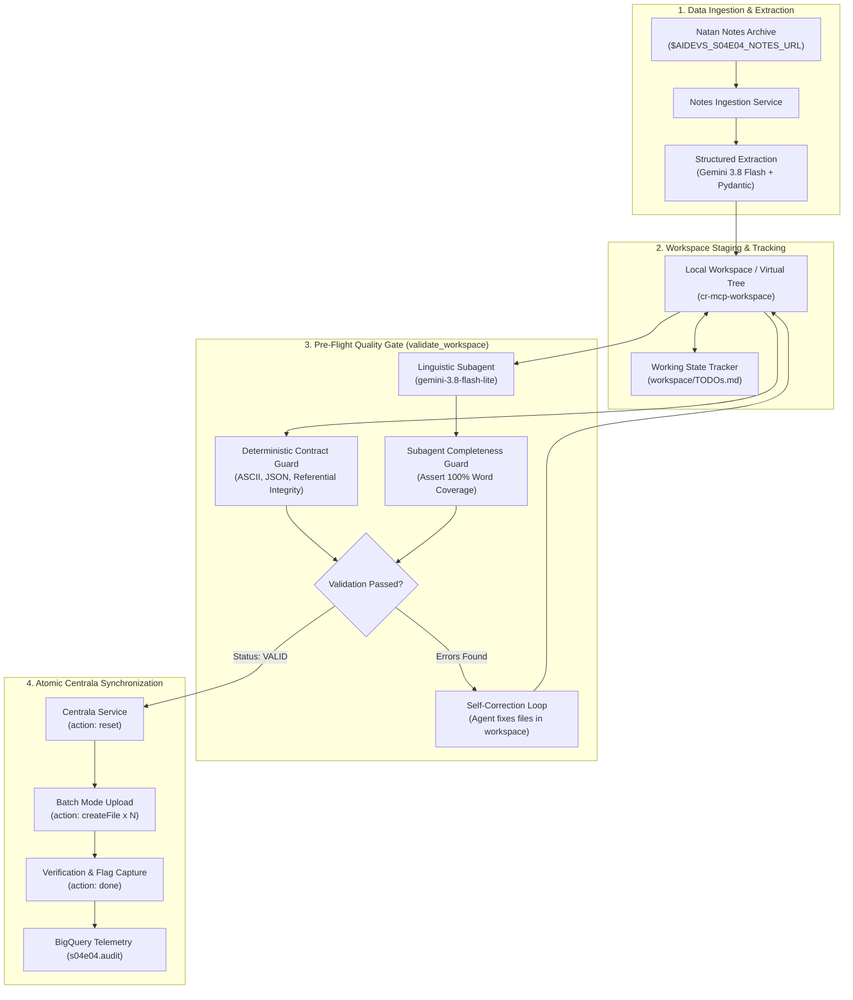

<!-- Source: https://www.industrialempathy.com/posts/design-docs-at-google/ -->
<!-- Based on: Google Design Docs structure by Malte Ubl -->
<!-- Adapted as a Technical PRD for AI-assisted implementation workflows -->

---
status: "approved"
date: 2026-09-23
author: Artur Fejklowicz, Joi
reviewers: Artur Fejklowicz
adr: "[ADR.md](ADR.md)"
---

# Technical PRD: S04E04 - Digital Knowledge Base & Virtual Filesystem (`cr-s04e04-filesystem`)

## Context and Scope

Following the rescue of partisan trade coordinator Natan Rams, Centrala requires the automated reconstruction of a standardized, three-tier virtual knowledge base (`/miasta`, `/osoby`, `/towary`) hosted on Centrala's verification platform (`$AIDEVS_API_VERIFY` under task `"filesystem"`). The intelligence source consists of unstructured Polish notes (`natan_notes.zip`) documenting municipal trade demands, coordinators, and executed barter transactions.

The operational environment enforces strict compliance:
- **ASCII Purity:** Zero Polish diacritics permitted in file paths, file names, or JSON string contents.
- **Unitless Integers:** Municipal demand values in JSON must be integers without units (`kg`, `butelek`, `porcji`, `workow`).
- **Singular Nominative Nouns:** Commodity file names must be Polish nouns in singular nominative form (`mianownik liczby pojedynczej`) transliterated to ASCII (e.g. `wiertarka`, `lopata`, `ziemniak`).
- **Markdown Hyperlinks:** Unambiguous relative link syntax (`[City](/miasta/city)`) pointing to valid settlement paths.

This PRD formalizes the implementation specifications for the Cloud Run microservice `cr-s04e04-filesystem`, translating the 6 decisions accepted in [ADR.md](ADR.md) into concrete code, contract schemas, validation gates, and deployment artifacts.

---

## Goals and Non-Goals

### Goals
* **Automated Data Ingestion & Lemmatization:** Fetch `$AIDEVS_S04E04_NOTES_URL`, unpack the three logs (`ogloszenia.txt`, `rozmowy.txt`, `transakcje.txt`), and extract structured Pydantic models via Gemini 3.8 Flash, stripping measurement units and inflections.
* **Workspace Staging & Working Memory Tracking:** Stage all entities locally in `cr-mcp-workspace` (or virtual in-memory tree) while maintaining an explicit `TODOs.md` checklist to prevent agent memory loss across the 8 cities, 8 coordinators, and multiple commodities.
* **Triple-Anchor Polish Linguistic Framing:** Systematically ground Polish grammar and ASCII transliteration across the global agent system prompt, subagent few-shot instructions, and Pydantic tool field descriptions.
* **Pre-Flight Quality Gate with Completeness Guard:** Execute `validate_workspace` prior to any external API mutation, combining deterministic Python rules (ASCII purity, JSON schema, referential link integrity) with a `gemini-3.8-flash-lite` linguistic subagent verified by a 100% word coverage invariant.
* **Atomic Batch Synchronization:** Clean remote state via `action: "reset"`, push the entire virtual filesystem in a single `batch_mode` array (`answer: [...]`), and trigger evaluation via `action: "done"` to capture `{FLG:...}`.
* **Dual Agent Framework Parity:** Support execution via both **LangChain 1.2.15** (`create_agent`) and **Google ADK 1.33.0** (`google.adk.Agent` and `Runner`), selectable via `--backend [langchain|adk]`.
* **Enterprise GCP Standards:** Package as a FastAPI microservice on Cloud Run, stream telemetry to BigQuery dataset `s04e04.audit`, trace with LangSmith, and register in `terraform/variables.tf`.

### Non-Goals
* Real-time pre-write interception that evaluates incomplete reference graphs before target entities are created.
* Direct mutation of remote Centrala files on a per-file basis without local staging and pre-flight validation.
* Deploying heavy legacy NLP libraries (`spacy`, `nltk`, `morfeusz`) into the container image.

---

## The Design

### System Overview



### API Design

The microservice exposes canonical endpoints adhering to `GEMINI.md`:

1. **`GET /health` & `GET /`**:
   - Status 200 OK: `{"status": "healthy", "service": "cr-s04e04-filesystem", "version": "1.0.0"}`.
2. **`POST /run`**:
   - Request Body (`RunTaskRequest`):
     ```json
     {
       "backend": "langchain",
       "session_id": "test-session-001",
       "reset_remote": true
     }
     ```
   - Response Body (`RunTaskResponse`):
     ```json
     {
       "status": "success",
       "backend": "langchain",
       "flag": "{FLG:...}",
       "stats": {
         "cities_count": 8,
         "persons_count": 8,
         "commodities_count": 13,
         "files_uploaded": 29
       },
       "audit_logged": true
     }
     ```

### Data Model & Entity Specifications

```mermaid
erDiagram
    CITY ||--o{ PERSON : "managed by"
    CITY ||--o{ COMMODITY : "supplies"
    
    CITY {
        string slug PK "/miasta/opalino"
        json demand_json "{\"chleb\": 45, \"woda\": 120, \"mlotek\": 6}"
    }
    
    PERSON {
        string slug PK "/osoby/Iga_Kapecka"
        string markdown_content "Iga Kapecka [Opalino](/miasta/opalino)"
    }
    
    COMMODITY {
        string slug PK "/towary/chleb"
        string markdown_content "[Domatowo](/miasta/domatowo)\n[Celbowo](/miasta/celbowo)"
    }
```

#### Canonical Entity Mapping & Formatting:
1. **Settlements (`/miasta/<city_slug>`):**
   - Filename: Nominative singular, lowercase ASCII (`opalino`, `domatowo`, `brudzewo`, `darzlubie`, `celbowo`, `mechowo`, `puck`, `karlinkowo`).
   - Content: JSON string mapping commodity keys (singular nominative ASCII) to integer quantities (e.g. `{"makaron": 60, "woda": 150, "lopata": 8}`).
2. **Persons (`/osoby/<Person_Name>`):**
   - Filename: Firstname_Lastname with underscore, ASCII (`Iga_Kapecka`, `Natan_Rams`, `Rafal_Kisiel`, `Marta_Frantz`, `Oskar_Radtke`, `Eliza_Redmann`, `Damian_Kroll`, `Lena_Konkel`).
   - Content: Coordinator's full name and Markdown link `[City](/miasta/city)`.
3. **Commodities (`/towary/<commodity_slug>`):**
   - Filename: Nominative singular, lowercase ASCII (e.g. `chleb`, `woda`, `lopata`, `wiertarka`, `ziemniak`, `kilof`, `maka`, `makaron`, `kapusta`, `marchew`, `ryz`, `kurczak`, `wolowina`, `mlotek`).
   - Content: Markdown links to all selling cities separated by newlines (`\n`).

### Core Logic & Triple-Anchor Polish Linguistic Framing

#### 1. Ingestion & Structured Extraction (Gemini 3.8 Flash)
- Download and extract `$AIDEVS_S04E04_NOTES_URL`.
- Invoke Gemini 3.8 Flash with Pydantic structured output model `RawExtractionResult` containing:
  - `cities: list[CityDemandExtract]`
  - `coordinators: list[CoordinatorExtract]`
  - `transactions: list[TransactionExtract]`
- Normalize all string tokens using an ASCII transliteration pipeline (`unicodedata.normalize('NFKD', s)`).

#### 2. Workspace Staging & `TODOs.md` Tracker
- Agent initializes `workspace/TODOs.md`:
  ```markdown
  # Filesystem Staging Checklist
  - [ ] Cities (0/8)
  - [ ] Coordinators (0/8)
  - [ ] Commodities (0/13)
  ```
- As each entity file is written to the staging directory, the agent updates the checklist to maintain working memory across reasoning turns.

#### 3. Triple-Anchor Polish Linguistic Framing
Context is anchored across three explicit layers:
1. **Global Layer (`system_prompt.md`):** Main agent is explicitly informed that intelligence originates from Polish notes. All commodities must be Polish nouns in singular nominative form (`mianownik liczby pojedynczej`) transliterated to ASCII, and municipal demands must strip units (`kg`, `butelek`, `porcji`, `workow`).
2. **Subagent Layer (`linguistic_service.py`):** `gemini-3.8-flash-lite` system prompt defines its role as a Polish linguistic morphology expert, including few-shot pairs (`wiertarka` -> true, `wiertarki` -> false with suggestion `wiertarka`, `ziemniak` -> true, `ziemniaki` -> false with suggestion `ziemniak`).
3. **Tool & Schema Layer (`schemas.py`):** Tool input/output models feature explicit `Field(description=..., examples=...)` denoting Polish singular nominative ASCII rules.

#### 4. Pre-Flight Quality Gate (`validate_workspace`)
The validator executes a three-phase gate:
- **Phase 1 (Python Deterministic):**
  - Asserts path starts with `/miasta/`, `/osoby/`, or `/towary/`.
  - Asserts ASCII purity across all filenames and contents: `re.match(r"^[\x00-\x7F]+$", text)`.
  - Validates JSON format of `/miasta/*` (keys $>0$ length, values integer $>0$).
  - Validates Markdown link syntax: `r"\[([A-Za-z0-9_ -]+)\]\((/miasta/[a-z0-9_]+)\)"`.
  - Asserts referential integrity: Every `/miasta/<slug>` target in `/osoby` and `/towary` exists in `/miasta`.
  - Asserts completeness: exactly 8 cities and 8 coordinators.
- **Phase 2 (Linguistic Subagent Evaluation):**
  - Collects all commodity filenames from `/towary/`.
  - Dispatches batch evaluation to `gemini-3.8-flash-lite` with schema `CommodityValidationBatchResponse`.
- **Phase 3 (Subagent Completeness Guard):**
  - Asserts: `set(res.word for res in subagent_response.evaluations) == set(queried_words)`.
  - Asserts: if `is_singular_nominative is False`, `suggested_singular` must be provided.
  - Returns unified `ValidationReport(valid=bool, errors=list[str], suggestions=dict[str, str])`.

#### 5. Batch Dispatch & Verification
- When `valid is True`, call `$AIDEVS_API_VERIFY` with:
  1. `{"action": "reset"}`
  2. `{"action": [...]}` containing batch of `createFile` operations for all files.
  3. `{"action": "done"}` to evaluate and retrieve `{FLG:...}`.
- Stream telemetry to BigQuery table `af-aidevs.s04e04.audit`.

---

## Cross-Cutting Concerns

### Security & Privacy
- **Zero Hardcoding:** No raw course URLs or keys in code or documentation. All endpoints accessed via `$AIDEVS_API_VERIFY`, `$AIDEVS_S04E04_NOTES_URL`, and `$AIDEVS_API_KEY`.
- **IAM Authentication:** Private Cloud Run service requiring OIDC token (`roles/run.invoker`). Vertex AI authenticated via Google Cloud default credentials (`vertexai=True`).
- **Secret Manager:** Production secrets mounted via environment bindings in Terraform.

### Observability & Telemetry
- **BigQuery Audit:** Schema includes `timestamp` (TIMESTAMP), `session_id` (STRING), `actor` (STRING), `backend` (STRING), `content` (STRING), `metadata` (JSON).
- **LangSmith Tracing:** Automatic tracing via `LANGSMITH_TRACING=true` and `LANGSMITH_PROJECT=af-aidevs`.

### Error Handling & Resilience
- **API Retries:** Exponential backoff with jitter on network requests to Centrala and Vertex AI.
- **Self-Healing Loop:** If `validate_workspace` returns errors, the agent inspects `report.errors` and `report.suggestions`, applies fixes to workspace files, and re-validates before transmission.

---

## Edge Cases and Constraints

* **Plural Nouns & Irregular Inflections:** Words like *"wiertarki"* or *"ziemniaki"* must be normalized to singular nominative forms (`wiertarka`, `ziemniak`). Handled by LLM structured extraction and enforced by the `gemini-3.8-flash-lite` linguistic gate.
* **Transliteration Collision:** Ensure that stripped characters do not produce duplicate filenames or invalid slugs.
* **Subagent Dropped Words:** Guard against subagent partial evaluation by enforcing strict set equality `set(evaluations.words) == set(input_words)`.
* **Zero Missing Cities:** All 8 cities from `ogloszenia.txt` must have corresponding demand profiles.

---

## Implementation Spec

### File Structure

```
lessons/s04e04-projektowanie-wlasnej-bazy-wiedzy-dla-ai/task/cr-s04e04-filesystem/
├── .dockerignore
├── .gcloudignore
├── .python-version               # Pinned: 3.13.5
├── Dockerfile                    # python:3.13.5-slim + uv
├── cloudbuild.yaml               # Standardized substitutions (_IMAGE, UV_INDEX_GAR_PASSWORD)
├── pyproject.toml                # Alphabetical precise versions, requires-python = "==3.13.5"
├── README.md
├── run_notes.txt                 # Local execution notes & audit
├── config.py                     # Typed Pydantic configuration & env fallbacks
├── schemas.py                    # Contract-first schemas & Discrete Literals
├── main.py                       # FastAPI microservice + CLI entrypoint
├── agents/
│   ├── __init__.py
│   ├── base.py                   # Abstract BaseAgent interface
│   ├── factory.py                # Backend selector (langchain vs adk)
│   ├── langchain_agent.py        # LangChain 1.2.15 implementation (create_agent)
│   └── adk_agent.py              # Google ADK 1.33.0 implementation (google.adk.Agent & Runner)
├── services/
│   ├── __init__.py
│   ├── audit_service.py          # BigQuery audit streaming
│   ├── centrala_service.py       # Centrala /verify/ API client (help, reset, batch createFile, done)
│   ├── extraction_service.py     # Ingestion & structured entity extraction (Gemini 3.8 Flash)
│   ├── linguistic_service.py     # Subagent linguistic evaluator (Gemini 3.8 Flash-Lite)
│   ├── mcp_service.py            # Unified client for cr-mcp-workspace via af_aidevs.clients.mcp
│   └── validation_service.py     # Deterministic contract guard & completeness verification
└── tests/
    ├── __init__.py
    ├── test_schemas.py           # Unit tests for Pydantic contract schemas
    ├── test_validation_service.py# Tests for ASCII, JSON, referential, and linguistic guards
    ├── test_extraction_service.py# Tests for structured extraction from Natan notes
    └── test_centrala_service.py  # Tests for batch payload construction and mock API calls
```

### Technology Stack & Dependencies

- **Language / Runtime:** Python `==3.13.5`
- **Package Manager:** `uv`
- **Internal Shared Package:**
  - `af-aidevs==0.2.1` (hosted on Google Artifact Registry: `https://europe-west6-python.pkg.dev/af-aidevs/python-packages/simple/`) for `af_aidevs.clients.mcp` (`cr-mcp-workspace`), prompt loaders, and telemetry utilities.
- **Web Framework:** `fastapi==0.115.8`, `uvicorn==0.34.0`
- **Agent Frameworks:**
  - `langchain==1.2.15` (strictly using `create_agent` from `langchain.agents`)
  - `langchain-google-genai==2.0.10`
  - `langchain-mcp-adapters==0.2.2`
  - `google-adk==1.33.0`
  - `google-genai==1.3.0`
- **Data Validation & Schemas:** `pydantic==2.10.6`, `pydantic-settings==2.8.1`
- **Cloud & Telemetry:**
  - `google-cloud-bigquery==3.29.0`
  - `google-cloud-secret-manager==2.23.1`
  - `langsmith==0.3.14`
  - `httpx==0.28.1`
- **Testing & Quality:**
  - `pytest==8.3.4`, `pytest-asyncio==0.25.3`
  - `ruff==0.9.9`, `mypy==1.15.0`

### Step-by-Step Implementation Order

1. **Scaffolding & Packaging:** Create `.python-version`, `.dockerignore`, `.gcloudignore`, `cloudbuild.yaml`, `Dockerfile`, and `pyproject.toml`.
2. **Configuration & Contract Schemas (`config.py`, `schemas.py`):** Define environment settings and Pydantic models with explicit descriptions, examples, and validation rules.
3. **Core Domain Services (`services/`):**
   - `extraction_service.py`: Ingests and parses notes into structured domain entities.
   - `linguistic_service.py`: Dispatches commodity names to `gemini-3.8-flash-lite` for singular nominative validation.
   - `validation_service.py`: Enforces deterministic ASCII, JSON, and referential link integrity checks, verifying subagent response completeness.
   - `centrala_service.py`: Communicates with Centrala via `help`, `reset`, batch `createFile`, and `done`.
   - `audit_service.py`: Streams execution telemetry to BigQuery dataset `s04e04`.
4. **Agent Implementations (`agents/`):**
   - Implement `langchain_agent.py` using `create_agent` from `langchain.agents`.
   - Implement `adk_agent.py` using `google.adk.Agent` and `Runner`.
   - Implement `factory.py` enabling dynamic selection via `--backend`.
5. **FastAPI Application & CLI (`main.py`):** Implement endpoints `/health`, `/`, `/run`, and CLI argument parser.
6. **Automated Test Suite (`tests/`):** Write unit and contract tests verifying extraction, linguistic evaluation, validation logic, and API batch formatting.
7. **Terraform Registration:** Register BigQuery dataset `s04e04`, audit table `audit`, and Cloud Run service `cr-s04e04-filesystem` in `terraform/variables.tf`.
8. **Pre-Flight Quality Gate:** Execute `ruff check --fix`, `ruff format`, `mypy`, and `pytest`.

---

## Acceptance Criteria (Testable)

- [ ] All 8 settlements from `ogloszenia.txt` exist under `/miasta/` as valid ASCII JSON mapping demanded goods to integer quantities without units.
- [ ] All 8 trade coordinators from `rozmowy.txt` exist under `/osoby/` with their full name and a valid Markdown link to their city.
- [ ] All commodities from `transakcje.txt` exist under `/towary/` in singular nominative ASCII form, containing Markdown links to all offering cities.
- [ ] Pre-flight `validate_workspace` successfully verifies ASCII purity, JSON syntax, link referential integrity, and subagent evaluation completeness.
- [ ] Subagent completeness invariant asserts 100% word coverage, preventing dropped or hallucinated items.
- [ ] Triple-Anchor Polish Linguistic Framing is explicitly embedded in `system_prompt.md`, `linguistic_service.py`, and `schemas.py`.
- [ ] Dual backend parity: Both `--backend langchain` and `--backend adk` run and verify the filesystem successfully.
- [ ] Automated tests in `pytest` pass with 100% success rate.
- [ ] Zero linting errors via `ruff check` and `ruff format`; static typing passes via `mypy`.
- [ ] Terraform definitions registered in `terraform/variables.tf`.
- [ ] Verification flag `{FLG:...}` captured upon `action: "done"` dispatch and telemetry recorded in BigQuery `s04e04.audit`.

---

## Out-of-Scope for Agent (Human Required)

- Provisioning GCP IAM role bindings (`roles/run.invoker`, `roles/bigquery.dataEditor`) if not already present.
- Manually creating Secret Manager secrets in production (`gcloud secrets create`).
