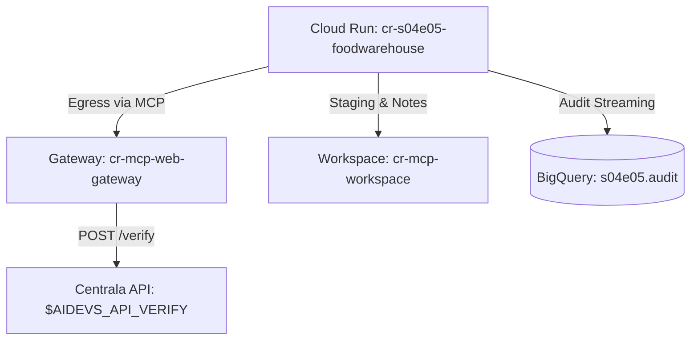

# Lesson S04E05: Projektowanie rozwiązań wewnątrzfirmowych (Foodwarehouse)

Autonomous multi-settlement food and tool supply logistics orchestrator for Centrala's API (`$AIDEVS_API_VERIFY`).

## Documentation
- [BRD.md](task/BRD.md) - Business Requirements Document
- [ADR.md](task/ADR.md) - Architecture Decision Record
- [PRD.md](task/PRD.md) - Product Requirements Document
- [Microservice README](task/cr-s04e05-foodwarehouse/README.md) - Service deployment, endpoints, and CLI usage

## Architecture Summary
The mission requires inspecting Centrala's logistics interface via progressive disclosure, discovering the underlying SQLite database schema (`users`, `roles`, `places`, `orders`, `order_items`), generating cryptographic destination signatures for the transport coordinator (`tgajewski`, role ID `2`), staging orders in `cr-mcp-workspace`, validating the batch against municipal demands in `$AIDEVS_FOOD4CITIES_URL`, and atomically dispatching the batch without triggering the "OKO" alarm.



## Cloud Run Execution (POST /run)

The deployed private microservice `cr-s04e05-foodwarehouse` can be invoked via `POST /run` with Google Cloud identity authentication:

```powershell
$token = $(gcloud auth print-identity-token)
curl.exe -s -X POST "https://cr-s04e05-foodwarehouse-qsvqxjqyrq-oa.a.run.app/run" `
  -H "Authorization: Bearer $token" `
  -H "Content-Type: application/json" `
  -d '{\"backend\": \"langchain\", \"model\": \"gemini-3.5-flash-lite\", \"max_iterations\": 80, \"thinking_level\": \"medium\"}'
```

### Request Parameters
- `backend`: `"langchain"` (or `"adk"`)
- `model`: `"gemini-3.5-flash-lite"` (Vertex AI model override)
- `max_iterations`: `80` (recursion limit allowing full 4-phase execution)
- `thinking_level`: `"medium"` (reasoning depth)
- `session_id`: (optional custom correlation identifier)

### Telemetry & Audit
Verify execution progress and results via BigQuery:
```powershell
bq query --use_legacy_sql=false --project_id=af-aidevs 'SELECT timestamp, session_id, actor, SUBSTR(content, 1, 100) AS preview FROM `af-aidevs.s04e05.audit` ORDER BY timestamp DESC LIMIT 20'
```
