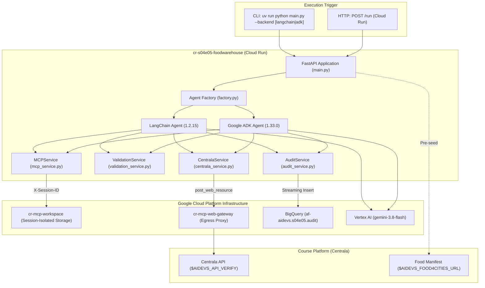
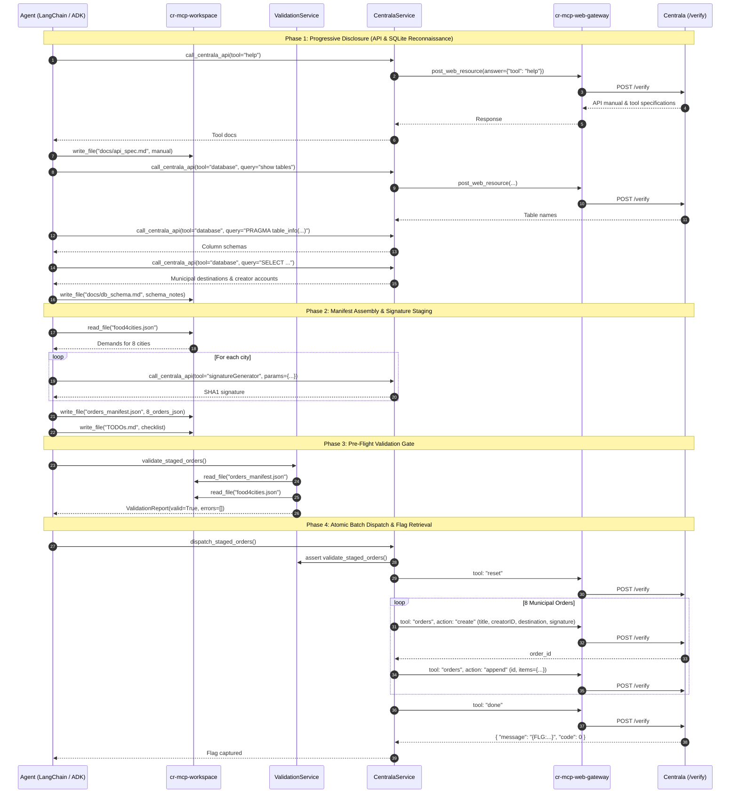

# S04E05: Central Food Warehouse Autonomous Distribution Service (`cr-s04e05-foodwarehouse`)

## Context and Scope

The `foodwarehouse` mission requires reprogramming the central automated distribution logistics of Siegfried's food, water, and tool storehouses via Centrala's verification API (`$AIDEVS_API_VERIFY`) to fulfill the urgent resource requirements of eight starving regional settlements (Opalino, Domatowo, Brudzewo, Darzlubie, Celbowo, Mechowo, Puck, Karlinkowo). Siegfried's autonomous logistics transporters are excluded from the "OKO" surveillance grid, allowing supplies to be delivered undetected if valid warehouse orders are injected.

This document specifies the technical design, contracts, and implementation plan for the Cloud Run microservice `cr-s04e05-foodwarehouse`. As determined in [ADR.md](ADR.md), the system employs a **Four-Phase Progressive Disclosure & Staging Architecture** powered by Vertex AI Gemini 3.8 Flash. The agent interacts with Centrala via a universal meta-tool (`call_centrala_api`) routed through `cr-mcp-web-gateway`, stages its order manifest into session-isolated `cr-mcp-workspace`, validates the manifest against `$AIDEVS_FOOD4CITIES_URL` with a dedicated Pre-Flight Quality Gate (`validate_staged_orders`), and executes an atomic batch dispatch (`dispatch_staged_orders`) to secure the verification flag `{FLG:...}`. Feature parity is implemented across both **LangChain 1.2.15** and **Google ADK 1.33.0** backends.

---

## Goals and Non-Goals

### Goals
* **Progressive Disclosure API Discovery**: Allow the autonomous agent to start knowing exclusively `tool: "help"` and dynamically discover warehouse commands, SQLite schemas, destination codes, and user authorization credentials without brittle hardcoded schemas.
* **Hermetic Workspace Staging & Quality Gate**: Stage all intermediate discoveries, `orders_manifest.json`, and tracking checklists (`TODOs.md`) in `cr-mcp-workspace`, completely preventing container disk poisoning.
* **Deterministic Pre-Flight Validation**: Provide an agent-invokable Quality Gate tool (`validate_staged_orders`) that cross-checks all 8 orders against `food4cities.json` requirements co co sztuki (`Bez braków i bez nadmiarów`), catching discrepancies before network dispatch.
* **Atomic Batch Dispatch**: Implement `dispatch_staged_orders` to reset warehouse state, inject 8 orders, append all items in batch mode, and call `done` in <2 seconds, eliminating 16 redundant turn-by-turn LLM hops.
* **Zero Direct Container Egress**: Route all external traffic through `cr-mcp-web-gateway` with Tenacity retry and exponential backoff for rate limits (`-9999` and HTTP 429), with graceful local fallback.
* **Dual Framework Parity**: Complete feature parity across LangChain `1.2.15` and Google ADK `1.33.0`, with BigQuery telemetry logging into dataset `s04e05`.

### Non-Goals
* Direct container disk storage (`workspace/` or `/tmp` staging) — all files must reside in `cr-mcp-workspace`.
* Turn-by-turn interactive LLM loops for order item appending — batch dispatch handles creation deterministically after validation.
* Database write operations — the SQLite database is strictly read-only; attempts to issue `INSERT`/`UPDATE`/`DROP` are forbidden.
* Manual hardcoded SQL schema assumptions — schemas must be inspected dynamically at runtime.

---

## The Design

### System Overview



---

### API Design

#### Microservice Public API
* `GET /health` & `GET /`: Health check and readiness probes.
  * Response: `{"status": "ok", "service": "cr-s04e05-foodwarehouse", "timestamp": "..."}`
* `POST /run`: Execute warehouse order fulfillment mission.
  * Request Body (`RunTaskRequest`):
    ```json
    {
      "backend": "langchain",
      "session_id": "optional-uuid"
    }
    ```
  * Response Body (`RunTaskResponse`):
    ```json
    {
      "status": "success",
      "flag": "{FLG:...}",
      "session_id": "session-uuid",
      "backend": "langchain",
      "orders_count": 8,
      "stats": {
        "discovery_queries": 3,
        "signatures_generated": 8,
        "orders_created": 8,
        "items_appended": 24,
        "duration_seconds": 8.42
      }
    }
    ```

#### Centrala RPC Envelope Protocol
All calls dispatched to `$AIDEVS_API_VERIFY` conform to:
```json
{
  "apikey": "$AIDEVS_API_KEY",
  "task": "foodwarehouse",
  "answer": {
    "tool": "<tool_name>",
    "<param_key>": "<param_value>"
  }
}
```

---

### Data Model / Storage

#### Agent Tool Contracts (`schemas.py`)

1. **Universal Centrala Meta-Tool Schema**:
   ```python
   class CentralaApiInput(BaseModel):
       tool: str = Field(
           description=(
               "Centrala tool name ('help', 'database', 'signatureGenerator', 'orders', 'reset'). "
               "NOTE: Permitted for discovery and read operations ('help', 'database', 'signatureGenerator', "
               "'orders' with action='get', and 'reset'). Mutative actions ('orders' with action='create' or 'append', "
               "and 'done') are intercepted by Circuit Breaker to enforce batch staging in workspace."
           ),
           examples=["help", "database", "signatureGenerator"],
       )
       params: dict[str, Any] = Field(
           default_factory=dict,
           description="Arbitrary parameters passed directly into Centrala answer object.",
           examples=[{"query": "show tables"}, {"action": "get"}],
       )
       reasoning: str = Field(
           default="",
           description="Strategic objective behind invoking this tool.",
       )
   ```
           default="",
           description="Strategic objective behind invoking this tool.",
       )
   ```

2. **Workspace Tool Schemas**:
   ```python
   class ReadFileInput(BaseModel):
       file_path: str = Field(
           description="Path to file in cr-mcp-workspace (e.g. 'food4cities.json', 'orders_manifest.json', 'TODOs.md').",
           examples=["food4cities.json", "orders_manifest.json"],
       )
       reasoning: str = Field(default="", description="Reason for reading file.")


   class WriteFileInput(BaseModel):
       file_path: str = Field(
           description="Path to file in cr-mcp-workspace.",
           examples=["orders_manifest.json", "TODOs.md", "docs/api_spec.md"],
       )
       content: str = Field(
           description="File content string.",
       )
       reasoning: str = Field(default="", description="Reason for writing file.")


   class ListFilesInput(BaseModel):
       path: str = Field(
           default=".",
           description="Directory path to inspect in cr-mcp-workspace.",
       )
   ```

3. **Staged Order & Manifest Model**:
   ```python
   class StagedOrderItem(BaseModel):
       city: str = Field(description="Normalized lowercase ASCII city name.")
       title: str = Field(description="Order description title.")
       creatorID: int = Field(description="Authorized creator user ID from SQLite.")
       destination: str = Field(
           description="Target city destination code from SQLite."
       )
       signature: str = Field(
           description="Cryptographic SHA1 signature generated by signatureGenerator."
       )
       items: dict[str, int] = Field(
           description="Dictionary mapping commodity name to exact integer quantity."
       )


   class OrdersManifest(BaseModel):
       orders: list[StagedOrderItem] = Field(
           description="List of exactly 8 municipal warehouse orders."
       )
   ```

4. **Validation Report Model**:
   ```python
   class ValidationReport(BaseModel):
       valid: bool = Field(description="True if manifest passes all assertions.")
       orders_count: int = Field(
           description="Number of parsed orders in manifest."
       )
       errors: list[str] = Field(
           default_factory=list, description="List of discrete validation errors."
       )
       warnings: list[str] = Field(
           default_factory=list, description="Non-fatal warnings or observations."
       )
       hint: str = Field(
           default="",
           description="Actionable repair instructions for the agent.",
       )
   ```

#### Workspace Session Directory Topology
```
cr-mcp-workspace/<session_id>/
├── food4cities.json           # Seeded demands from $AIDEVS_FOOD4CITIES_URL
├── docs/
│   ├── api_spec.md            # Documented tool commands discovered from 'help'
│   └── db_schema.md           # Introspected SQLite table structures & destination map
├── orders_manifest.json       # Assembled 8 orders with signatures & items
└── TODOs.md                   # Real-time task progress tracking checklist
```

#### BigQuery Telemetry Table (`af-aidevs.s04e05.audit`)
* `timestamp`: TIMESTAMP (UTC event time)
* `session_id`: STRING (UUID)
* `actor`: STRING (`tool:call_centrala_api`, `tool:validate_staged_orders`, `tool:dispatch_staged_orders`, `agent:llm`)
* `content`: STRING (Masked, bounded event summary, truncated to safe size)
* `flag`: STRING (Captured verification flag if present)
* `metadata`: JSON (Latency, tool parameters, error codes)

---

### Core Logic / Algorithms



---

### Infrastructure / Deployment

* **Cloud Run Microservice**: `cr-s04e05-foodwarehouse`
  * Region: `europe-west1` (or default project region).
  * Ingress: Internal / Private (`public = false`), authenticated via Google Cloud OIDC tokens.
  * Resources: 1 vCPU, 1 GiB RAM, `min_instances = 0`, `max_instances = 3`.
* **Terraform Registration**:
  * Registered in `terraform/variables.tf` under `cr_names.cr-s04e05-foodwarehouse` with secrets: `AIDEVS_API_KEY`, `AIDEVS_API_VERIFY`, `AIDEVS_FOOD4CITIES_URL`, `LANGSMITH_API_KEY`, `LANGSMITH_PROJECT`, `MCP_WORKSPACE_URL`, `MCP_WEB_GATEWAY_URL`.
  * BigQuery dataset `s04e05` with streaming audit table.
* **Hermetic Container Scaffolding**:
  * Official `python:3.13.5-slim` image.
  * Standard `cloudbuild.yaml` with `$_IMAGE` and `--build-arg UV_INDEX_GAR_PASSWORD=$_TOKEN`.
  * `.dockerignore` and `.gcloudignore` strictly excluding `.venv`, `workspace`, `run_notes.txt`, and local test artifacts.

---

## Cross-Cutting Concerns

### Security
* **Zero Hardcoded Secrets**: All API endpoints and tokens (`$AIDEVS_API_VERIFY`, `$AIDEVS_API_KEY`, `$AIDEVS_FOOD4CITIES_URL`) are read via `config.py` from environment variables / Secret Manager.
* **Server-Side Credential Injection**: Centrala credentials and task envelopes are injected by `CentralaService`. The LLM prompt context never sees or handles raw API keys.
* **Zero Direct Container Egress**: External traffic routes strictly through `cr-mcp-web-gateway` via authenticated Google Cloud IAM / OIDC tokens.

### Observability
* **BigQuery Audit Streaming**: All tool calls, SQL discovery queries, validation outcomes, and captured flags are streamed into BigQuery dataset `s04e05` via `af_aidevs.audit.bigquery`.
* **LangSmith Tracing**: Full multi-turn tracing under `LANGSMITH_PROJECT`.
* **Zero-Pollution Logging**: Binary data and large payloads are masked to metadata summaries before emitting to logs or traces.

### Error Handling / Resilience
* **Centrala Rate-Limit Backoff**: `CentralaService` wraps all requests with Tenacity exponential jitter backoff, specifically capturing rate-limit response code `-9999` and HTTP 429.
* **Mutative Interception Circuit Breaker (`call_centrala_api`)**:
  - Read/Discovery operations (`help`, `database`, `signatureGenerator`, `orders` with `action="get"`, `reset`) execute normally.
  - Single-order mutative operations (`orders: create`, `orders: append`) and direct verification (`done`) are intercepted and blocked by the tool, returning an explicit guidance message directing the agent to stage all 8 orders in `orders_manifest.json`, validate with `validate_staged_orders`, and dispatch atomically with `dispatch_staged_orders`.
* **Three-Layer Defense-in-Depth for Validation**:
  - **Layer 1 (Procedural SOP)**: `system_prompt.md` mandates Step 3 (Pre-Flight Validation Gate) before dispatch.
  - **Layer 2 (Semantic Tool Steering)**: Docstrings on `validate_staged_orders` and `dispatch_staged_orders` reinforce prerequisite assertions.
  - **Layer 3 (Deterministic Code Assertion)**: The first line of `dispatch_staged_orders` unconditionally executes `ValidationService.validate_manifest()`. If `valid == False`, dispatch fails immediately with actionable repair hints without mutating Centrala.
* **Pre-emptive Reset**: `dispatch_staged_orders` begins with `tool: "reset"` to guarantee a pristine zero-order state before order creation.

### Performance / Scalability
* **Asynchronous Batching**: The 8 orders and their item payloads are submitted sequentially in Python async loop within <2 seconds, avoiding roundtrip LLM token latency.
* **Thinking Level Optimization**: Vertex AI Gemini 3.8 Flash uses `thinking_level="low"` to maintain fast turn latency (<1.5s per turn).

---

## Edge Cases and Constraints

1. **Polish Diacritics Mismatch**: Commodities in `food4cities.json` use ASCII names (e.g. `mlotek`, `ryz`, `lopata`, `wolowina`). Validation enforces exact string matching.
2. **Missing Destination Code**: If the agent's SQL query fails to resolve a city destination, `validate_staged_orders` flags the missing field before dispatch.
3. **Additive Append Semantics**: Appending to an existing commodity increments its count. Pre-emptive reset guarantees zero quantity inflation.
4. **Read-Only SQLite Constraints**: Queries must remain strictly read-only (`SELECT`, `PRAGMA`). Any mutative SQL is rejected by Centrala.
5. **Gateway Unavailability in Local Dev**: `CentralaService` and `MCPService` provide graceful local fallbacks (direct `httpx` and local workspace folder) for offline unit testing.

---

## Implementation Plan

### Phases / Milestones

| Phase | Scope | Deliverable |
|---|---|---|
| Phase 1: Scaffolding & Config | Setup `cr-s04e05-foodwarehouse` structure, `pyproject.toml`, Dockerfile, `config.py`, `schemas.py`. | Validated package and schemas. |
| Phase 2: Domain Services | Implement `CentralaService`, `ValidationService`, `MCPService`, `AuditService`. | Unit-tested services with mocked Centrala. |
| Phase 3: Agent Implementations | Build `LangChainWarehouseAgent` and `ADKWarehouseAgent` with prompt engineering. | Dual framework feature parity. |
| Phase 4: Application Entrypoints | FastAPI endpoints (`/run`, `/health`), CLI mode, Terraform registration. | Functional API and CLI. |
| Phase 5: Verification & Quality Gate | Run Ruff, Mypy, Pytest, Terraform plan, and end-to-end execution. | Verification flag captured. |

### Dependencies
* Remote microservices: `cr-mcp-workspace`, `cr-mcp-web-gateway`.
* GCP APIs: Vertex AI (`gemini-3.8-flash`), BigQuery (`s04e05`), Secret Manager.

### Risks and Mitigations
* **Risk**: SQLite table or column names differ from expectations.
  * **Mitigation**: Agent dynamically interrogates `show tables` and `PRAGMA table_info` before querying rows.
* **Risk**: Centrala rate-limits requests during order creation.
  * **Mitigation**: Tenacity retry handles `-9999` and HTTP 429 with random exponential backoff.
* **Risk**: Mismatched commodity quantities.
  * **Mitigation**: Pre-flight validation gate enforces 1:1 match with `food4cities.json`.

---

## Success Criteria

* [ ] 100% compliance with `GEMINI.md` baseline (Cloud Run, BigQuery, Terraform, Python 3.13.5 with `uv`).
* [ ] Agent discovers API manual and database schema dynamically, saving markdown notes in `cr-mcp-workspace`.
* [ ] Exactly 8 orders are assembled in `orders_manifest.json` and pass `validate_staged_orders`.
* [ ] `dispatch_staged_orders` resets state, creates 8 orders, appends items in batch mode, and triggers `done`.
* [ ] Verification flag `{FLG:...}` is captured and logged to BigQuery dataset `s04e05`.
* [ ] Both LangChain and Google ADK backends achieve complete feature parity.
* [ ] Quality Gate passes with zero errors: `ruff check`, `ruff format`, `mypy`, `pytest`.

---

## Open Questions
None. All architectural decisions have been accepted in [ADR.md](ADR.md).

---

## Implementation Spec

### File Structure
```
lessons/s04e05-projektowanie-rozwiazan-wewnatrzfirmowych/task/cr-s04e05-foodwarehouse/
├── .dockerignore
├── .gcloudignore
├── .python-version
├── Dockerfile
├── cloudbuild.yaml
├── pyproject.toml
├── README.md
├── config.py
├── main.py
├── schemas.py
├── system_prompt.md
├── agents/
│   ├── __init__.py
│   ├── base.py
│   ├── factory.py
│   ├── langchain_agent.py
│   └── adk_agent.py
├── services/
│   ├── __init__.py
│   ├── audit_service.py
│   ├── centrala_service.py
│   ├── mcp_service.py
│   └── validation_service.py
└── tests/
    ├── __init__.py
    ├── test_schemas.py
    ├── test_validation_service.py
    └── test_centrala_service.py
```

### Technology Stack
* **Language & Runtime**: Python `==3.13.5` managed via `uv`.
* **Frameworks**: FastAPI `==0.136.1`, Uvicorn `==0.46.0`.
* **LLM & Agents**:
  * LangChain: `langchain==1.2.15`, `langchain-google-genai==4.2.2`, `langchain-mcp-adapters==0.2.2`.
  * Google ADK: `google-adk==1.33.0`.
  * Model Driver: `google-genai==1.74.0` (Vertex AI mode).
* **GCP SDKs**: `google-cloud-bigquery==3.41.0`, `google-cloud-secret-manager==2.23.1`, `google-cloud-storage==3.1.0`.
* **Utilities**: `af-aidevs==0.2.1`, `httpx==0.28.1`, `pydantic==2.13.4`, `python-dotenv==1.2.2`, `python-frontmatter==1.1.0`, `tenacity==9.0.0`, `tzdata==2026.2`.
* **Testing & Quality**: `pytest==8.3.5`, `pytest-asyncio==0.25.3`, `ruff`, `mypy`.

### Coding Standards
* Strictly adhere to `os.getenv("VAR") or "default"` in `config.py`.
* All models in `schemas.py` must feature explicit `Field(description=..., examples=...)`.
* All file paths must use `pathlib.Path`.
* All markdown links in repository files must remain strictly relative (e.g. `[ADR.md](ADR.md)`).
* Zero raw URLs or plaintext flags in code or commit messages.

### Step-by-Step Implementation Order
1. Scaffold directory tree, container files (`.dockerignore`, `.gcloudignore`, `Dockerfile`, `cloudbuild.yaml`), and `pyproject.toml`.
2. Define configuration loading and fallbacks in `config.py`.
3. Construct data contracts and Pydantic schemas in `schemas.py`.
4. Build `ValidationService` with contract assertions and comprehensive unit tests.
5. Build `CentralaService` with rate-limit retry, gateway egress, and batch dispatch methods.
6. Build `MCPService` wrapping `cr-mcp-workspace` and `cr-mcp-web-gateway`.
7. Author `system_prompt.md` encoding the 4-phase Progressive Disclosure workflow.
8. Implement `LangChainWarehouseAgent` and `ADKWarehouseAgent` with tool definitions.
9. Implement `main.py` supporting CLI execution and FastAPI endpoints.
10. Register `cr-s04e05-foodwarehouse` and dataset `s04e05` in `terraform/variables.tf`.
11. Run Pre-Flight Quality Gate (`ruff`, `mypy`, `pytest`) and execute the mission.

### Acceptance Criteria (Testable)
* [ ] Container scaffolding matches `python:3.13.5-slim`, `$_IMAGE`, and `--build-arg UV_INDEX_GAR_PASSWORD=$_TOKEN`.
* [ ] `pyproject.toml` contains precise, alphabetically sorted dependencies with `requires-python = "==3.13.5"`.
* [ ] `ValidationService` correctly asserts valid 8-city manifests and flags quantity discrepancies.
* [ ] `CentralaService` retries on Centrala `-9999` throttle and HTTP 429.
* [ ] `call_centrala_api` allows agent to introspect `help`, SQLite database, and generate signatures.
* [ ] `dispatch_staged_orders` executes reset, creates 8 orders, appends items in batch mode, and triggers `done`.
* [ ] Telemetry events stream to BigQuery dataset `s04e05`.
* [ ] Both `--backend langchain` and `--backend adk` run cleanly.
* [ ] All tests pass via `uv run pytest -v`.

### Out-of-Scope for Agent (Human Required)
* Applying Terraform changes in GCP (`terraform apply`).
* Creating new course secrets in Secret Manager if not already provisioned.
